<!--yml
category: 未分类
date: 2022-04-26 14:39:28
-->

# BUUCTF RSA题目全解2_宁嘉的博客-CSDN博客

> 来源：[https://blog.csdn.net/MikeCoke/article/details/107206707](https://blog.csdn.net/MikeCoke/article/details/107206707)

## 1.[NCTF2019]childRSA

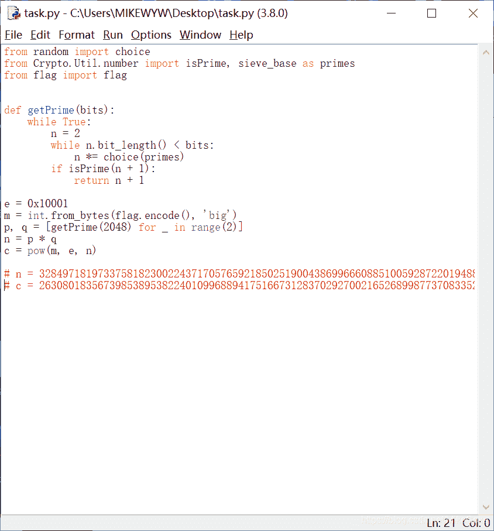

1.  [别人的解法，利用Crypto.Util.number 中的sieve_base](https://blog.csdn.net/weixin_44017838/article/details/104907559)

2.  我的解法：

解题思路：
1.**py文件给了，n , c , e。为了求m 由算法pow(c,d,n)，可知要先求出d来**

2.  **由算法
    gmpy2.invert(e,N) # N = (q-1)*(p-1)
    可知我们要先求出p，q来，即分解n**

用yafu进行素数分解，先把模n新建一个txt文件，文件末尾要进行换行

进入cmd，命令 `cd Desktop` 进入桌面

命令
`yafu-x64 "factor(@)" -batchfile 1.txt` 进行10进制大整数分解

当数比较小时 用命令 `yafu-x64 factor(n)`
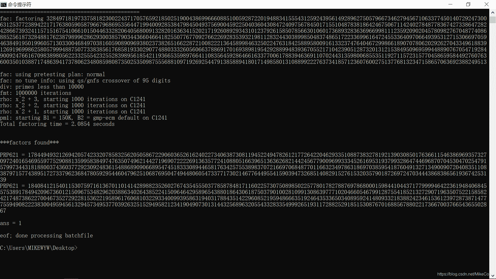
得到

```
import gmpy2 as gp
import libnum

n=32849718197337581823002243717057659218502519004386996660885100592872201948834155543125924395614928962750579667346279456710633774501407292473006312537723894221717638059058796679686953564471994009285384798450493756900459225040360430847240975678450171551048783818642467506711424027848778367427338647282428667393241157151675410661015044633282064056800913282016363415202171926089293431012379261585078566301060173689328363696699811123592090204578098276704877408688525618732848817623879899628629300385790344366046641825507767709276622692835393219811283244303899850483748651722336996164724553364097066493953127153066970594638491950199605713033004684970381605908909693802373826516622872100822213645899846325022476318425889580091613323747640467299866189070780620292627043349618839126919699862580579994887507733838561768581933029077488033326056066378869170169389819542928899483936705521710423905128732013121538495096959944889076705471928490092476616709838980562233255542325528398956185421193665359897664110835645928646616337700617883946369110702443135980068553511927115723157704586595844927607636003501038871748639417378062348085980873502535098755568810971926925447913858894180171498580131088992227637341857123607600275137768132347158657063692388249513
c = 26308018356739853895382240109968894175166731283702927002165268998773708335216338997058314157717147131083296551313334042509806229853341488461087009955203854253313827608275460592785607739091992591431080342664081962030557042784864074533380701014585315663218783130162376176094773010478159362434331787279303302718098735574605469803801873109982473258207444342330633191849040553550708886593340770753064322410889048135425025715982196600650740987076486540674090923181664281515197679745907830107684777248532278645343716263686014941081417914622724906314960249945105011301731247324601620886782967217339340393853616450077105125391982689986178342417223392217085276465471102737594719932347242482670320801063191869471318313514407997326350065187904154229557706351355052446027159972546737213451422978211055778164578782156428466626894026103053360431281644645515155471301826844754338802352846095293421718249819728205538534652212984831283642472071669494851823123552827380737798609829706225744376667082534026874483482483127491533474306552210039386256062116345785870668331513725792053302188276682550672663353937781055621860101624242216671635824311412793495965628876036344731733142759495348248970313655381407241457118743532311394697763283681852908564387282605279108

p=178449493212694205742332078583256205058672290603652616240227340638730811945224947826121772642204629335108873832781921390308501763661154638696935732709724016546955977529088135995838497476350749621442719690722226913635772410880516639651363626821442456779009699333452616953193799328647446968707045304702547915799734431818800374360377292309248361548868909066895474518333089446581763425755389837072166970684877011663234978631869703859541876049132713490090720408351108387971577438951727337962368478059295446047962510687695047494480605473377173021467764495541590394732685140829152761532035790187269724703444386838656193674253139

q = 184084121540115307597161367011014142898823526027674354555037785878481711602257307508985022577801782788769786800015984410443717799994642236194840684557538917849420967360121509675348296203886340264385224150964642958965438801864306187503790100281099130863977710204660546799128755418521327290719635075221585824217487386227004673527292281536221958961760681032293340099395863194031788435142296085219594866635192464353365034089592414809332183882423461536123972873871477755949082223830049594561329457349537703926325152949582123419049073013144325689632055433283354999265193117288252918515308767016885678802217366700376654365502867

N=(p-1)*(q-1)

e = 65537

d = gp.invert(e,N)

m = pow(c,d,n)

print(libnum.n2s(m)) 
```

**flag{Th3r3_ar3_1ns3cure_RSA_m0duli_7hat_at_f1rst_gl4nce_appe4r_t0_be_s3cur3}**

## 2.[HDCTF2019]bbbbbbrsa

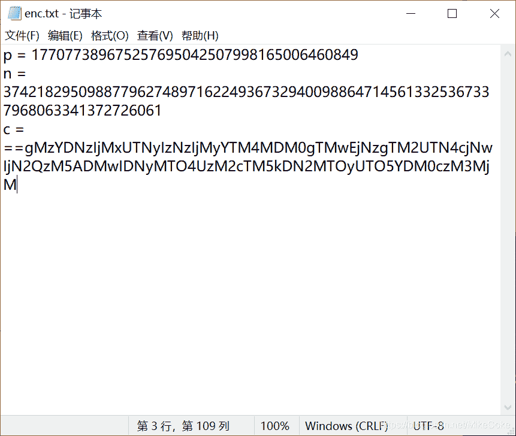
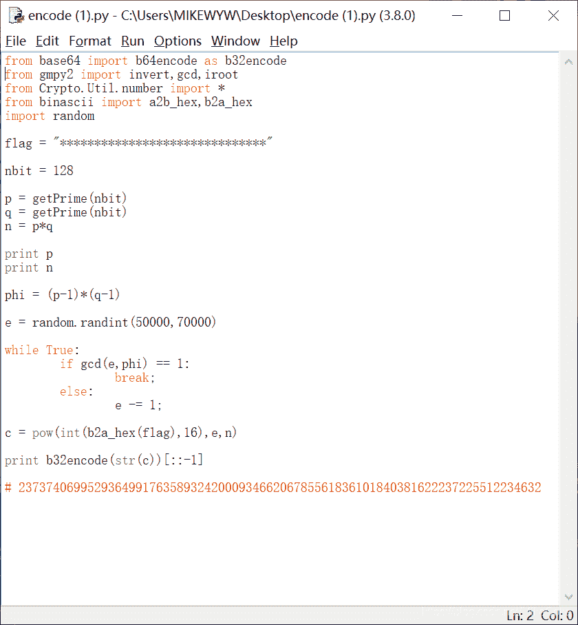
**解题思路：**

1.第一张图给了 **p，n，c，所以我们能够求出q**

2.**为了求出明文m ,我们先要求出d来**

3.第二种图告诉我们 **e 的范围在(50000,70000)**，我们可以对e进行遍历，爆破求出d
4\. **对于每个符合条件的 e，都会得到一个与之对应的 m，我们知道 一般的 m中都会含有flag字符，所以用search()进行查找**

```
import gmpy2 as gy
import re
import libnum

p = 177077389675257695042507998165006460849
n = 37421829509887796274897162249367329400988647145613325367337968063341372726061
c =2373740699529364991763589324200093466206785561836101840381622237225512234632

q = n // p

N = (p-1)*(q-1)

for e in range(50000,70000):
    try:
        d = gy.invert(e,N)
        flag = libnum.n2s(pow(c,d,n))
        if re.search('flag',flag):         
            print(flag)
    except:
        pass 
```

**`flag{rs4_1s_s1mpl3!#}`**

## 3.SameMod

共模攻击，不多讲了，[数学原理](https://blog.csdn.net/MikeCoke/article/details/106065200)
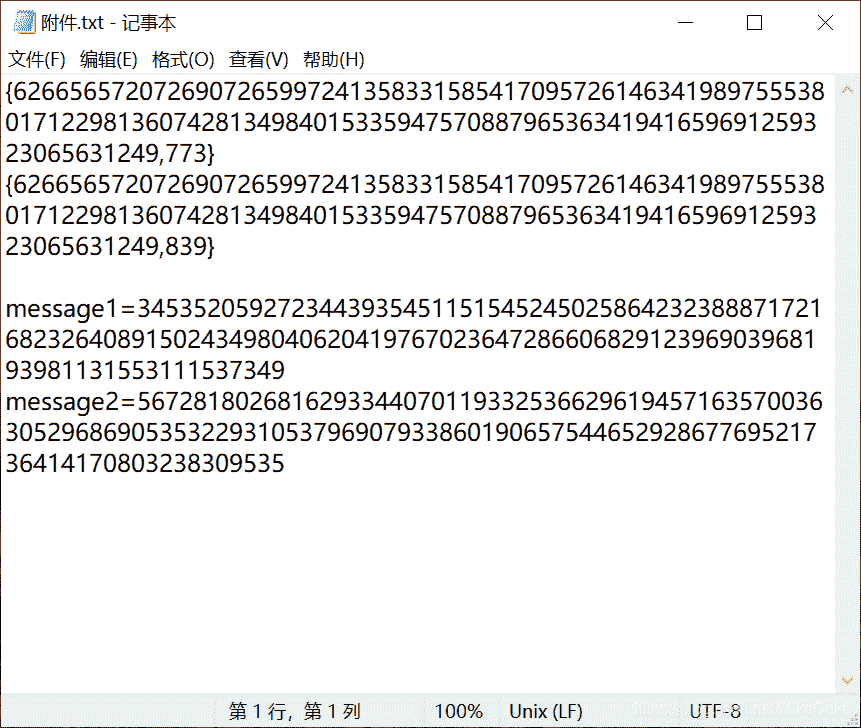

```
import gmpy2 as gp

def exgcd(a, b):
    if b==0:
        return 1, 0, a
    x2, y2, r = exgcd(b, a%b)
    x1 = y2
    y1 = x2-(a//b)*y2
    return x1, y1, r

def get_flag(string):
    flag=''
    i=0
    j=1
    while i < len(string):
        if int(string[i:i+j]) >= 33 and int(string[i:i+j]) <=126:
            flag+=chr(int(string[i:i+j]))
            i=i+j
            j=1
        else:
            j+=1
    print(flag)

if __name__ == '__main__':

    e1=773
    e2=839
    n=6266565720726907265997241358331585417095726146341989755538017122981360742813498401533594757088796536341941659691259323065631249
    message1=3453520592723443935451151545245025864232388871721682326408915024349804062041976702364728660682912396903968193981131553111537349
    message2=5672818026816293344070119332536629619457163570036305296869053532293105379690793386019065754465292867769521736414170803238309535
    r1, r2, t = exgcd(e1, e2)
    m = gp.powmod(message1, r1, n) * gp.powmod(message2, r2, n) % n
    get_flag(str(m)) 
```

**`flag{whenwethinkitispossible}`**

## 4.[BJDCTF2020]RSA

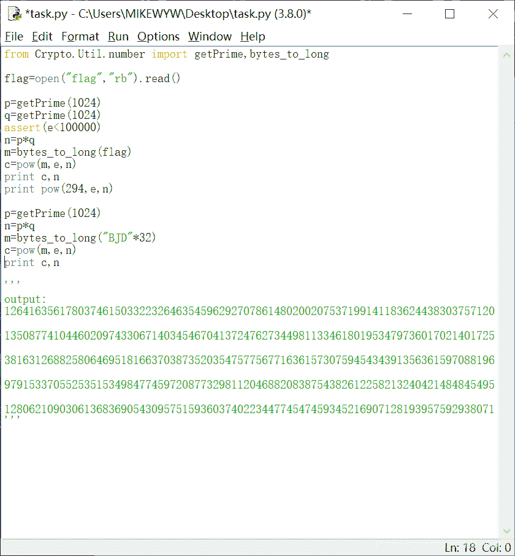

**解题思路：**
1.题目告知输出了两种不同的密文 **c** 和 **n** 值，但值 **n1** 和 **n2** 共用相同的 **p** ，所以用gcd()算法求最大公约数可以得到 **p值**，进而求出 **q**。

2.对 e 进行遍历，爆破得到其值。

```
from gmpy2 import*
import libnum

n1 =13508774104460209743306714034546704137247627344981133461801953479736017021401725818808462898375994767375627749494839671944543822403059978073813122441407612530658168942987820256786583006947001711749230193542370570950705530167921702835627122401475251039000775017381633900222474727396823708695063136246115652622259769634591309421761269548260984426148824641285010730983215377509255011298737827621611158032976420011662547854515610597955628898073569684158225678333474543920326532893446849808112837476684390030976472053905069855522297850688026960701186543428139843783907624317274796926248829543413464754127208843070331063037
c1 =12641635617803746150332232646354596292707861480200207537199141183624438303757120570096741248020236666965755798009656547738616399025300123043766255518596149348930444599820675230046423373053051631932557230849083426859490183732303751744004874183062594856870318614289991675980063548316499486908923209627563871554875612702079100567018698992935818206109087568166097392314105717555482926141030505639571708876213167112187962584484065321545727594135175369233925922507794999607323536976824183162923385005669930403448853465141405846835919842908469787547341752365471892495204307644586161393228776042015534147913888338316244169120

n2 =12806210903061368369054309575159360374022344774547459345216907128193957592938071815865954073287532545947370671838372144806539753829484356064919357285623305209600680570975224639214396805124350862772159272362778768036844634760917612708721787320159318432456050806227784435091161119982613987303255995543165395426658059462110056431392517548717447898084915167661172362984251201688639469652283452307712821398857016487590794996544468826705600332208535201443322267298747117528882985955375246424812616478327182399461709978893464093245135530135430007842223389360212803439850867615121148050034887767584693608776323252233254261047
c2 = 979153370552535153498477459720877329811204688208387543826122582132404214848454954722487086658061408795223805022202997613522014736983452121073860054851302343517756732701026667062765906277626879215457936330799698812755973057557620930172778859116538571207100424990838508255127616637334499680058645411786925302368790414768248611809358160197554369255458675450109457987698749584630551177577492043403656419968285163536823819817573531356497236154342689914525321673807925458651854768512396355389740863270148775362744448115581639629326362342160548500035000156097215446881251055505465713854173913142040976382500435185442521721

pzm = 381631268825806469518166370387352035475775677163615730759454343913563615970881967332407709901235637718936184198930226303761876517101208677107311006065728014220477966000620964056616058676999878976943319063836649085085377577273214792371548775204594097887078898598463892440141577974544939268247818937936607013100808169758675042264568547764031628431414727922168580998494695800403043312406643527637667466318473669542326169218665366423043579003388486634167642663495896607282155808331902351188500197960905672207046579647052764579411814305689137519860880916467272056778641442758940135016400808740387144508156358067955215018

p = gcd(n1,n2)

q =n1//p

for i in range(100000):            
    res = pow(294,i,n1)
    if(res == pzm):
        e = i
        break

phi = (q-1)*(p-1)
d = invert(e,phi)
m = pow(c1,d,n1)
print(libnum.n2s(m)) 
```

**`BJD{p_is_common_divisor}`**

## 5.[GKCTF2020]babycrypto

```
# n:0xb119849bc4523e49c6c038a509a74cda628d4ca0e4d0f28e677d57f3c3c7d0d876ef07d7581fe05a060546fedd7d061d3bc70d679b6c5dd9bc66c5bdad8f2ef898b1e785496c4989daf716a1c89d5c174da494eee7061bcb6d52cafa337fc2a7bba42c918bbd3104dff62ecc9d3704a455a6ce282de0d8129e26c840734ffd302bec5f0a66e0e6d00b5c50fa57c546cff9d7e6a978db77997082b4cb927df9847dfffef55138cb946c62c9f09b968033745b5b6868338c64819a8e92a827265f9abd409359a9471d8c3a2631b80e5b462ba42336717700998ff38536c2436e24ac19228cd2d7a909ead1a8494ff6c3a7151e888e115b68cc6a7a8c6cf8a6c005L
# e:65537
# enc:1422566584480199878714663051468143513667934216213366733442059106529451931078271460363335887054199577950679102659270179475911101747625120544429262334214483688332111552004535828182425152965223599160129610990036911146029170033592055768983427904835395850414634659565092191460875900237711597421272312032796440948509724492027247376113218678183443222364531669985128032971256792532015051829041230203814090194611041172775368357197854451201260927117792277559690205342515437625417792867692280849139537687763919269337822899746924269847694138899165820004160319118749298031065800530869562704671435709578921901495688124042302500361
# p>>128<<128:0xe4e4b390c1d201dae2c00a4669c0865cc5767bc444f5d310f3cfc75872d96feb89e556972c99ae20753e3314240a52df5dccd076a47c6b5d11b531b92d901b2b512aeb0b263bbfd624fe3d52e5e238beeb581ebe012b2f176a4ffd1e0d2aa8c4d3a2656573b727d4d3136513a931428b00000000000000000000000000000000L 
```

**Coppersmith 算法**

```
P高位已知，低位未知 
```

用Sagemath，攻击脚本[Zui-Qing-Feng/RSA](https://github.com/Zui-Qing-Feng/RSA/blob/master/03.Factoring%20with%20high%20bits%20known%20Attack)。
[关于Sagemath](https://www.jianshu.com/p/ddf9376334cd)

编译sagemath脚本，用[sage-online](https://sagecell.sagemath.org/)解决

```
n = 0xb119849bc4523e49c6c038a509a74cda628d4ca0e4d0f28e677d57f3c3c7d0d876ef07d7581fe05a060546fedd7d061d3bc70d679b6c5dd9bc66c5bdad8f2ef898b1e785496c4989daf716a1c89d5c174da494eee7061bcb6d52cafa337fc2a7bba42c918bbd3104dff62ecc9d3704a455a6ce282de0d8129e26c840734ffd302bec5f0a66e0e6d00b5c50fa57c546cff9d7e6a978db77997082b4cb927df9847dfffef55138cb946c62c9f09b968033745b5b6868338c64819a8e92a827265f9abd409359a9471d8c3a2631b80e5b462ba42336717700998ff38536c2436e24ac19228cd2d7a909ead1a8494ff6c3a7151e888e115b68cc6a7a8c6cf8a6c005L
p_fake = 0xe4e4b390c1d201dae2c00a4669c0865cc5767bc444f5d310f3cfc75872d96feb89e556972c99ae20753e3314240a52df5dccd076a47c6b5d11b531b92d901b2b512aeb0b263bbfd624fe3d52e5e238beeb581ebe012b2f176a4ffd1e0d2aa8c4d3a2656573b727d4d3136513a931428b00000000000000000000000000000000L  

pbits = 1024  
kbits = 128  
pbar = p_fake & (2^pbits-2^kbits)  
print ("upper %d bits (of %d bits) is given" % (pbits-kbits, pbits)  )

PR.<x> = PolynomialRing(Zmod(n))  
f = x + pbar  

x0 = f.small_roots(X=2^kbits, beta=0.4)[0]  
print (int(x0 + pbar)) 
```

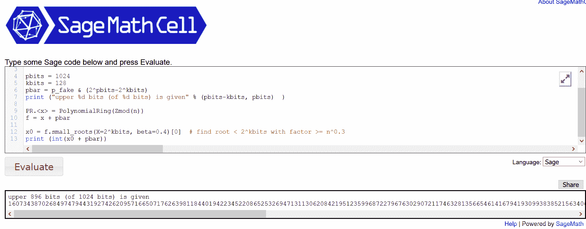

得到`p=160734387026849747944319274262095716650717626398118440194223452208652532694713113062084219512359968722796763029072117463281356654614167941930993838521563406258263299846297499190884495560744873319814150988520868951045961906000066805136724505347218275230562125457122462589771119429631727404626489634314291445667`

由q=n//p得到q

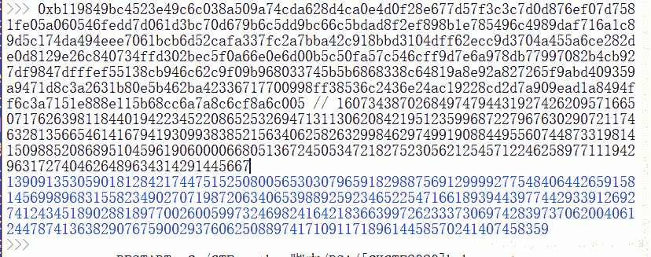

接下来就是RSA常规操作了

```
from gmpy2 import*
import libnum
n=22356763374676421464625378500213339933332772809897207920729779273423674391734609826525432054721219700275907299132471518921609327317193522567659631757746842030241874692914098354564311806192080734895649520789778880115460999713973202684541940857690744940359412410680906226760273075221532248260114209496048785258860756023841150910290983974843412361701517438220974722832625030127395031631696995777436058406987465592189873785392136925593708921923255186282515777996509326779993612528103615281644689464568237409082282767318227236298791238683706176542426759149262625349498709445342710799386836175120162674849965878446213480453
c=1422566584480199878714663051468143513667934216213366733442059106529451931078271460363335887054199577950679102659270179475911101747625120544429262334214483688332111552004535828182425152965223599160129610990036911146029170033592055768983427904835395850414634659565092191460875900237711597421272312032796440948509724492027247376113218678183443222364531669985128032971256792532015051829041230203814090194611041172775368357197854451201260927117792277559690205342515437625417792867692280849139537687763919269337822899746924269847694138899165820004160319118749298031065800530869562704671435709578921901495688124042302500361
p=160734387026849747944319274262095716650717626398118440194223452208652532694713113062084219512359968722796763029072117463281356654614167941930993838521563406258263299846297499190884495560744873319814150988520868951045961906000066805136724505347218275230562125457122462589771119429631727404626489634314291445667
e=65537

q=n//p
N=(q-1)*(p-1)
d=invert(e,N)
m=pow(c,d,n)

print(libnum.n2s(m)) 
```

```
flag{3d0914a1-1e97-4822-a745-c7e20c5179b9} 
```

## 6.[GWCTF 2019]BabyRSA

题目

```
import hashlib
import sympy
from Crypto.Util.number import *

flag = 'GWHT{******}'
secret = '******'

0assert(len(flag) == 38)

half = len(flag) / 2

flag1 = flag[:half]
flag2 = flag[half:]

secret_num = getPrime(1024) * bytes_to_long(secret)

p = sympy.nextprime(secret_num)
q = sympy.nextprime(p)

N = p * q

e = 0x10001

F1 = bytes_to_long(flag1)
F2 = bytes_to_long(flag2)

c1 = F1 + F2
c2 = pow(F1, 3) + pow(F2, 3)
assert(c2 < N)

m1 = pow(c1, e, N)
m2 = pow(c2, e, N)

output = open('secret', 'w')
output.write('N=' + str(N) + '\n')
output.write('m1=' + str(m1) + '\n')
output.write('m2=' + str(m2) + '\n')
output.close() 
```

先分析一下题目
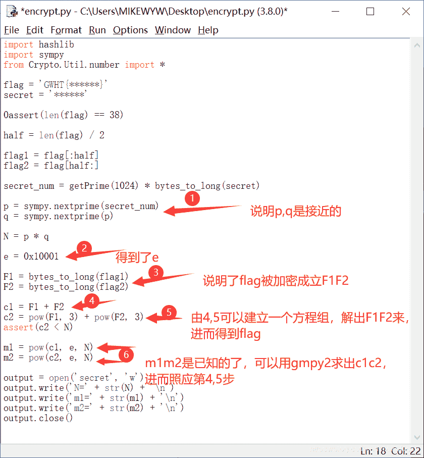
由 secret文件给的N值，我们能够通过yafu分解出，p,q,的值来

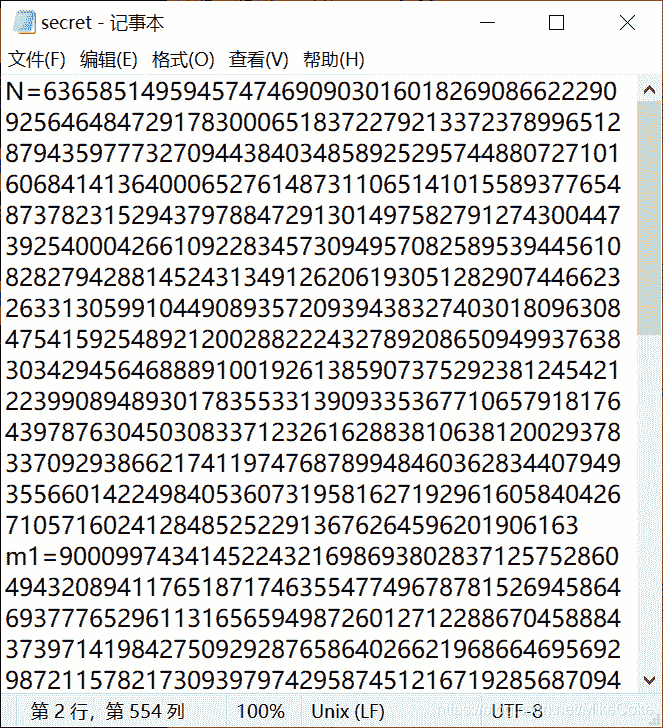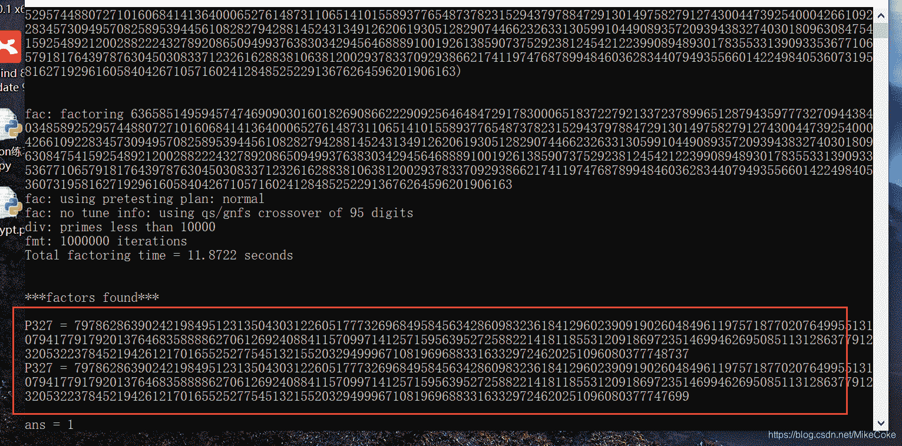

**`上代码`**

在使用符号之前，先要利用 SymPy 的 abc 子模块导入所需要的变量
[Python科学计算利器——SymPy库](https://www.jianshu.com/p/339c91ae9f41)

```
 from sympy.abc import x, y 
```

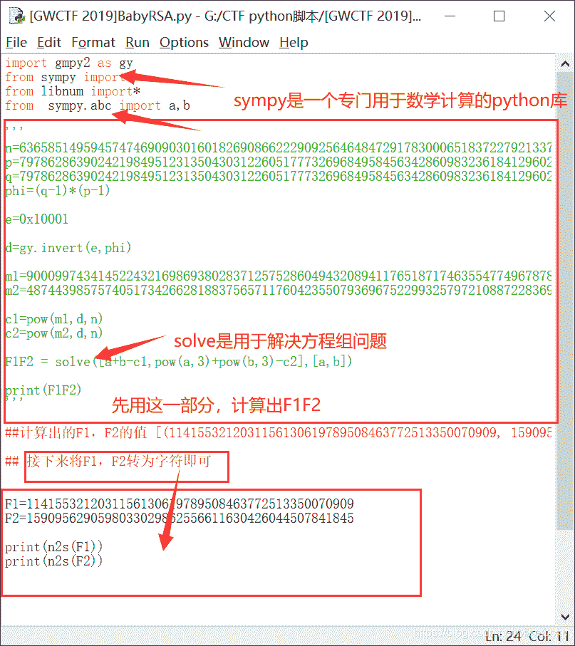

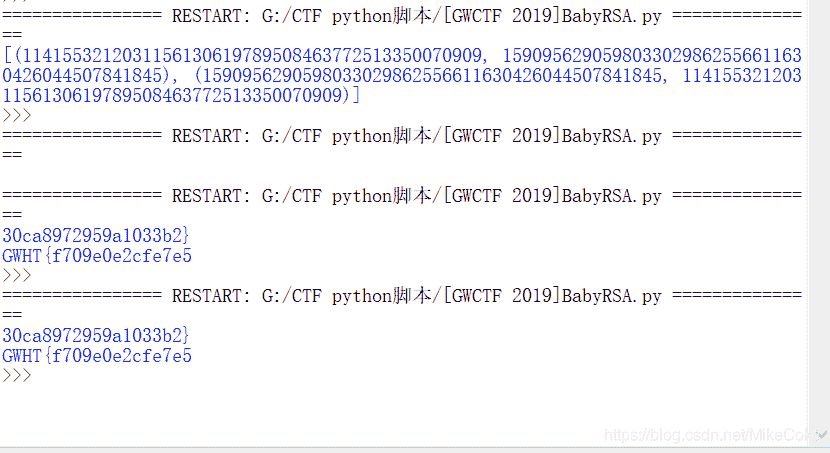

**`flag{f709e0e2cfe7e530ca8972959a1033b2}`**

## 7.[BJDCTF2020]rsa_output

**`共模攻击`**

```
import libnum 
from gmpy2 import invert

def egcd(a, b):
  if a == 0:
    return (b, 0, 1)
  else:
    g, y, x = egcd(b % a, a)
    return (g, x - (b // a) * y, y)

def main():
  n = 21058339337354287847534107544613605305015441090508924094198816691219103399526800112802416383088995253908857460266726925615826895303377801614829364034624475195859997943146305588315939130777450485196290766249612340054354622516207681542973756257677388091926549655162490873849955783768663029138647079874278240867932127196686258800146911620730706734103611833179733264096475286491988063990431085380499075005629807702406676707841324660971173253100956362528346684752959937473852630145893796056675793646430793578265418255919376323796044588559726703858429311784705245069845938316802681575653653770883615525735690306674635167111
  c1 = 20152490165522401747723193966902181151098731763998057421967155300933719378216342043730801302534978403741086887969040721959533190058342762057359432663717825826365444996915469039056428416166173920958243044831404924113442512617599426876141184212121677500371236937127571802891321706587610393639446868836987170301813018218408886968263882123084155607494076330256934285171370758586535415136162861138898728910585138378884530819857478609791126971308624318454905992919405355751492789110009313138417265126117273710813843923143381276204802515910527468883224274829962479636527422350190210717694762908096944600267033351813929448599
  c2 = 11298697323140988812057735324285908480504721454145796535014418738959035245600679947297874517818928181509081545027056523790022598233918011261011973196386395689371526774785582326121959186195586069851592467637819366624044133661016373360885158956955263645614345881350494012328275215821306955212788282617812686548883151066866149060363482958708364726982908798340182288702101023393839781427386537230459436512613047311585875068008210818996941460156589314135010438362447522428206884944952639826677247819066812706835773107059567082822312300721049827013660418610265189288840247186598145741724084351633508492707755206886202876227
  e1 = 2767
  e2 = 3659
  s = egcd(e1, e2)
  s1 = s[1]
  s2 = s[2]

  if s1<0:
    s1 = - s1
    c1 = invert(c1, n)
  elif s2<0:
    s2 = - s2
    c2 = invert(c2, n)

  m = pow(c1,s1,n)*pow(c2,s2,n) % n
  print (libnum.n2s(m))

if __name__ == '__main__':
  main()
'''

import libnum
m=1021089710312311910410111011910111610410511010710511610511511211111511510598108101125

print(libnum.n2s(m))
''' 
```

```
flag{r3a_C0mmoN_moD@_4ttack} 
```

## 8.[ACTF新生赛2020]crypto-rsa0

打开下载的文件，解压后得到 challenge.zip和hint.txt两个文件

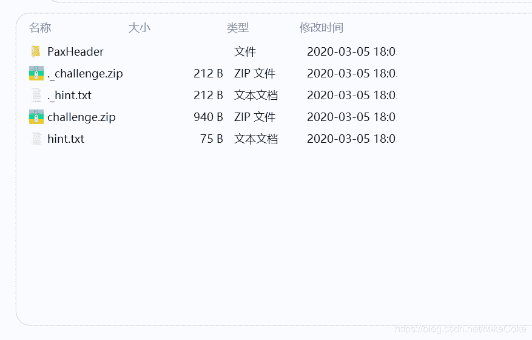
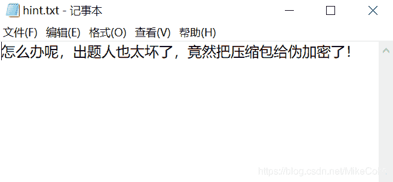
通过hint文件可知，zip文件被伪加密了

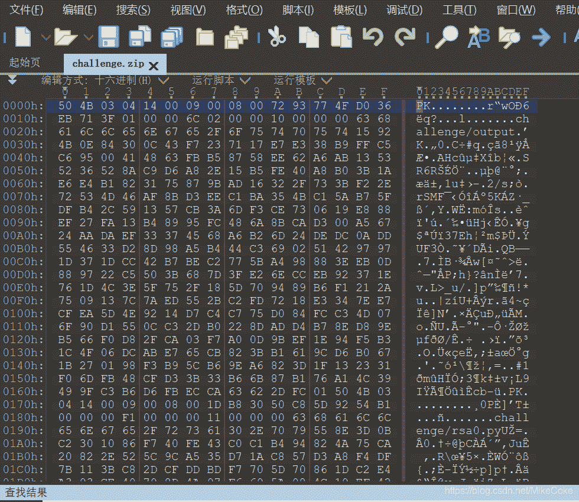
将14 00 后面的全部改为偶数就可以了，不懂伪加密原理的自己去Google(我懒得找具体是哪里伪加密了，所以把全部的伪加密点都改了)

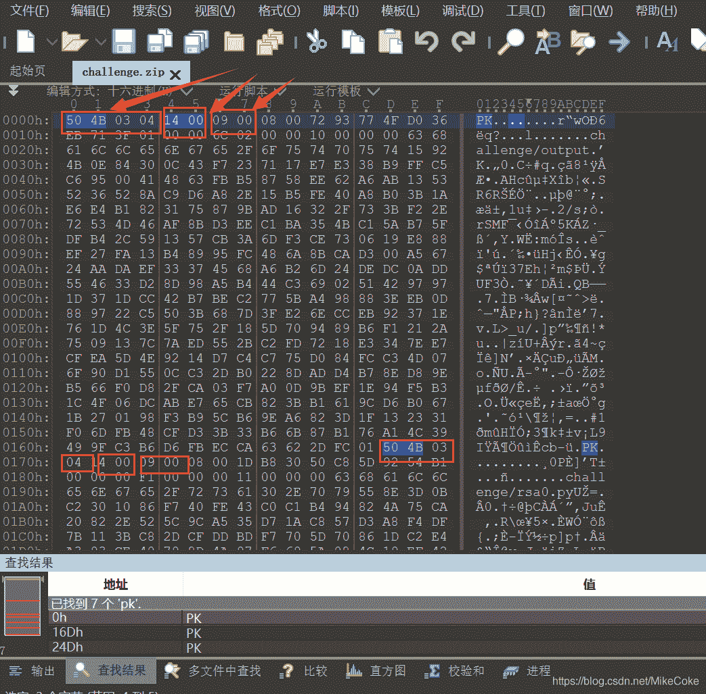

简单的RSA题目

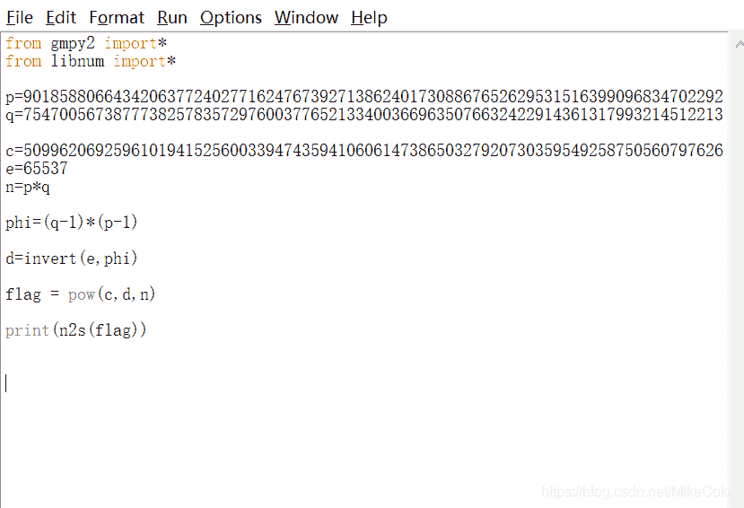

**`actf{n0w_y0u_see_RSA}`**

## 9.[BJDCTF2020]easyrsa

题目，其中
Fraction(a,b) 相当于 a/b
Derivative(f(x),x) : 当x='x’时,求f(x)的导数值
[arth(q)反双曲线正切函数](https://baike.baidu.com/item/%E5%8F%8D%E5%8F%8C%E6%9B%B2%E5%87%BD%E6%95%B0/7924014?fr=aladdin)

```
from Crypto.Util.number import getPrime,bytes_to_long
from sympy import Derivative
from fractions import Fraction
from secret import flag

p=getPrime(1024)
q=getPrime(1024)
e=65537
n=p*q
z=Fraction(1,Derivative(arctan(p),p))-Fraction(1,Derivative(arth(q),q))
m=bytes_to_long(flag)
c=pow(m,e,n)
print(c,z,n)
'''
output:
7922547866857761459807491502654216283012776177789511549350672958101810281348402284098310147796549430689253803510994877420135537268549410652654479620858691324110367182025648788407041599943091386227543182157746202947099572389676084392706406084307657000104665696654409155006313203957292885743791715198781974205578654792123191584957665293208390453748369182333152809882312453359706147808198922916762773721726681588977103877454119043744889164529383188077499194932909643918696646876907327364751380953182517883134591810800848971719184808713694342985458103006676013451912221080252735948993692674899399826084848622145815461035
32115748677623209667471622872185275070257924766015020072805267359839059393284316595882933372289732127274076434587519333300142473010344694803885168557548801202495933226215437763329280242113556524498457559562872900811602056944423967403777623306961880757613246328729616643032628964072931272085866928045973799374711846825157781056965164178505232524245809179235607571567174228822561697888645968559343608375331988097157145264357626738141646556353500994924115875748198318036296898604097000938272195903056733565880150540275369239637793975923329598716003350308259321436752579291000355560431542229699759955141152914708362494482
15310745161336895413406690009324766200789179248896951942047235448901612351128459309145825547569298479821101249094161867207686537607047447968708758990950136380924747359052570549594098569970632854351825950729752563502284849263730127586382522703959893392329333760927637353052250274195821469023401443841395096410231843592101426591882573405934188675124326997277775238287928403743324297705151732524641213516306585297722190780088180705070359469719869343939106529204798285957516860774384001892777525916167743272419958572055332232056095979448155082465977781482598371994798871917514767508394730447974770329967681767625495394441

''' 
```

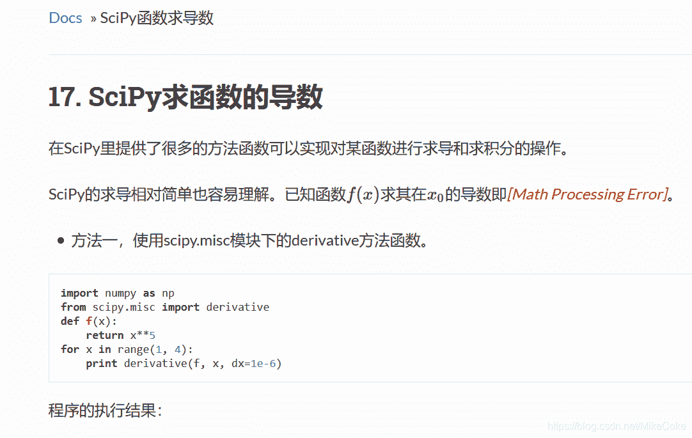

```
解题思路： 
```

解题py3代码

```
from sympy import*
from fractions import*
from sympy.abc import p,q
from gmpy2 import*
from libnum import*

e = 65537
c = 7922547866857761459807491502654216283012776177789511549350672958101810281348402284098310147796549430689253803510994877420135537268549410652654479620858691324110367182025648788407041599943091386227543182157746202947099572389676084392706406084307657000104665696654409155006313203957292885743791715198781974205578654792123191584957665293208390453748369182333152809882312453359706147808198922916762773721726681588977103877454119043744889164529383188077499194932909643918696646876907327364751380953182517883134591810800848971719184808713694342985458103006676013451912221080252735948993692674899399826084848622145815461035
z = 32115748677623209667471622872185275070257924766015020072805267359839059393284316595882933372289732127274076434587519333300142473010344694803885168557548801202495933226215437763329280242113556524498457559562872900811602056944423967403777623306961880757613246328729616643032628964072931272085866928045973799374711846825157781056965164178505232524245809179235607571567174228822561697888645968559343608375331988097157145264357626738141646556353500994924115875748198318036296898604097000938272195903056733565880150540275369239637793975923329598716003350308259321436752579291000355560431542229699759955141152914708362494482
n = 15310745161336895413406690009324766200789179248896951942047235448901612351128459309145825547569298479821101249094161867207686537607047447968708758990950136380924747359052570549594098569970632854351825950729752563502284849263730127586382522703959893392329333760927637353052250274195821469023401443841395096410231843592101426591882573405934188675124326997277775238287928403743324297705151732524641213516306585297722190780088180705070359469719869343939106529204798285957516860774384001892777525916167743272419958572055332232056095979448155082465977781482598371994798871917514767508394730447974770329967681767625495394441
'''
PQ=solve([pow(p,2)+pow(q,2)-z,p*q-n],[p,q])

print(PQ)
'''
p = 105909195259921349656664570904199242969110902804477734660927330311460997899731622163728968380757294196277263615386525795293086103142131020215128282050307177125962302515483190468569376643751587606016315185736245896434947691528567696271911398179288329609207435393579332931583829355558784305002360873458907029141
q = 144564833334456076455156647979862690498796694770100520405218930055633597500009574663803955456004439398699669751249623406199542605271188909145969364476344963078599240058180033000440459281558347909876143313940657252737586803051935392596519226965519859474501391969755712097119163926672753588797180811711004203301

n=p*q
phi = (p-1)*(q-1)
d = invert(e,phi)

m = pow(c,d,n)
print(n2s(m)) 
```

**BJD{Advanced_mathematics_is_too_hard!!!}**

## 10.[NCTF2019]babyRSA

题目

```
from Crypto.Util.number import *
from flag import flag

def nextPrime(n):
    n += 2 if n & 1 else 1
    while not isPrime(n):
        n += 2
    return n

p = getPrime(1024)
q = nextPrime(p)
n = p * q
e = 0x10001
d = inverse(e, (p-1) * (q-1))
c = pow(bytes_to_long(flag.encode()), e, n) 
```

解题思路：
1.题目给了 e,d,c三个值，所以由公式 e*d=1 mod (q-1)*(p-1) 得到 (e*d-1)=k * (q-1)*(p-1) (设k为整数)
2.
**分析题目可知p,q接近，p*q为2048位，**
**所以(p-1)*(q-1)<=2048**计算可知 **e*d-1** 是 **2064** 位的，所以K的取值范围为（pow(2,15),pow(2,16)）

3.通过爆破K的值，可以得到(p-1)*(q-1) 的值，对phi 开平方，进而求得p,q。这里涉及的算法我通过举例来论证。

```
 假设 p=7,q=11,,则(p-1)*(q-1)=60,
iroot(60,2)[0]  = 7  （iroot()表示开根号，[0]表示取整数部分）
所以用sympy.next(7),就可以求得7后面的一个素数11

假设 p=3,q=5， 则(p-1)*(q-1)=8,
iroot(8,2)[0]  = 2  （iroot()表示开根号，[0]表示取整数部分）
所以用sympy.next(2),就可以求得2后面的一个素数3 
```

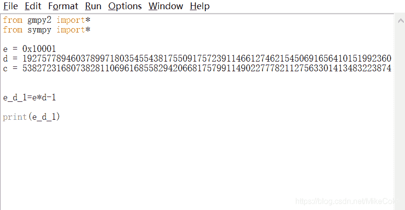

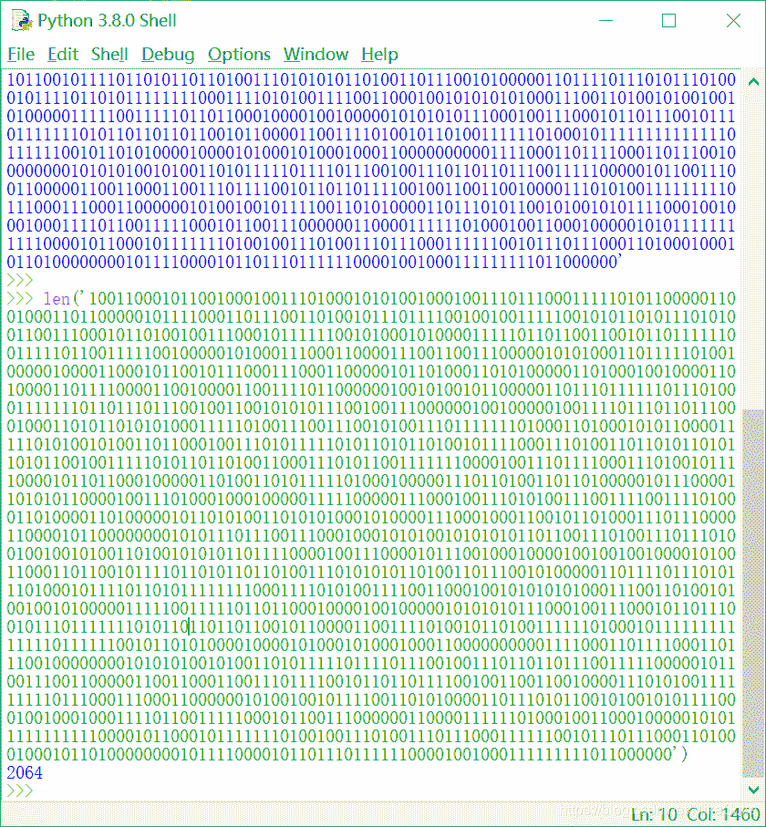

爆破代码

```
from gmpy2 import*
from sympy import* 
from libnum import*

e = 0x10001
d = 19275778946037899718035455438175509175723911466127462154506916564101519923603308900331427601983476886255849200332374081996442976307058597390881168155862238533018621944733299208108185814179466844504468163200369996564265921022888670062554504758512453217434777820468049494313818291727050400752551716550403647148197148884408264686846693842118387217753516963449753809860354047619256787869400297858568139700396567519469825398575103885487624463424429913017729585620877168171603444111464692841379661112075123399343270610272287865200880398193573260848268633461983435015031227070217852728240847398084414687146397303110709214913
c = 5382723168073828110696168558294206681757991149022777821127563301413483223874527233300721180839298617076705685041174247415826157096583055069337393987892262764211225227035880754417457056723909135525244957935906902665679777101130111392780237502928656225705262431431953003520093932924375902111280077255205118217436744112064069429678632923259898627997145803892753989255615273140300021040654505901442787810653626524305706316663169341797205752938755590056568986738227803487467274114398257187962140796551136220532809687606867385639367743705527511680719955380746377631156468689844150878381460560990755652899449340045313521804

for k in range(pow(2,15),pow(2,16)):
    if (e*d-1)%k == 0:
        phi = (e*d-1)//k

        P1 = iroot(phi,2)[0]    

        p = nextprime(P1)     

        q_1 = phi//(p-1)      

        q = q_1+1
        if(isprime(q)):       
                   break
'''                
print(p,q)

p=143193611591752210918770476402384783351740028841763223236102885221839966637073188462808195974548579833368313904083095786906479416347681923731100260359652426441593107755892485944809419189348311956308456459523437459969713060653432909873986596042482699670451716296743727525586437248462432327423361080811225076497
q=143193611591752210918770476402384783351740028841763223236102885221839966637073188462808195974548579833368313904083095786906479416347681923731100260359652426441593107755892485944809419189348311956308456459523437459969713060653432909873986596042482699670451716296743727525586437248462432327423361080811225075839
'''
n=p*q
m = pow(c,d,n)
print(n2s(m)) 
```

**NCTF{70u2_nn47h_14_v3ry_gOO0000000d}**