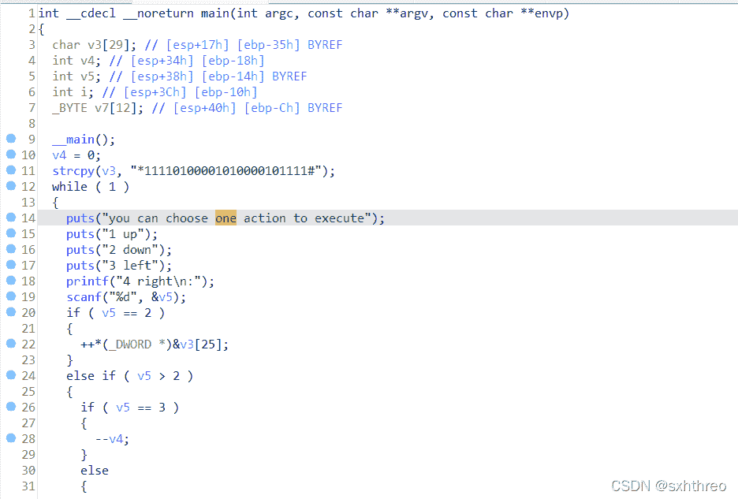

<!--yml
category: 未分类
date: 2022-04-26 14:42:26
-->

# BUUCTF Reverse解题记录（三）_sxhthreo的博客-CSDN博客

> 来源：[https://blog.csdn.net/sxH3O/article/details/123262906](https://blog.csdn.net/sxH3O/article/details/123262906)

# 第九题：不一样的flag

这道题说实话我是看了题解才恍然大悟的。



1、2、3、4分别代表往上下左右四个方向走，由下语句：

```
if ( v7[5 * *(_DWORD *)&v3[25] - 41 + v4] == 49 )
      exit(1);
if ( v7[5 * *(_DWORD *)&v3[25] - 41 + v4] == 35 )
{
    puts("\nok, the order you enter is the flag!");
    exit(0);
}
```

ASCII码为35的对应的是#，49对应的是1，所以可以看出来题目是在5*5迷宫中（即此段字符串 "*11110100001010000101111#"）

**1111
01000
01010
00010
1111#*

从*走到#的路径即为程序的flag。答案为flag{222441144222}。

# 第十题：SimpleRev

先看main函数：

```
unsigned __int64 Decry()
{
  char v1; // [rsp+Fh] [rbp-51h]
  int v2; // [rsp+10h] [rbp-50h]
  int v3; // [rsp+14h] [rbp-4Ch]
  int i; // [rsp+18h] [rbp-48h]
  int v5; // [rsp+1Ch] [rbp-44h]
  char src[8]; // [rsp+20h] [rbp-40h] BYREF
  __int64 v7; // [rsp+28h] [rbp-38h]
  int v8; // [rsp+30h] [rbp-30h]
  __int64 v9[2]; // [rsp+40h] [rbp-20h] BYREF
  int v10; // [rsp+50h] [rbp-10h]
  unsigned __int64 v11; // [rsp+58h] [rbp-8h]

  v11 = __readfsqword(0x28u);
  *(_QWORD *)src = 0x534C43444ELL;
  v7 = 0LL;
  v8 = 0;
  v9[0] = 0x776F646168LL;
  v9[1] = 0LL;
  v10 = 0;
  text = join(key3, (const char *)v9);
  strcpy(key, key1);
  strcat(key, src);
  v2 = 0;
  v3 = 0;
  getchar();
  v5 = strlen(key);
  for ( i = 0; i < v5; ++i )
  {
    if ( key[v3 % v5] > 64 && key[v3 % v5] <= 90 )
      key[i] = key[v3 % v5] + 32;
    ++v3;
  }
  printf("Please input your flag:");
  while ( 1 )
  {
    v1 = getchar();
    if ( v1 == 10 )
      break;
    if ( v1 == 32 )
    {
      ++v2;
    }
    else
    {
      if ( v1 <= 96 || v1 > 122 )
      {
        if ( v1 > 64 && v1 <= 90 )
        {
          str2[v2] = (v1 - 39 - key[v3 % v5] + 97) % 26 + 97;
          ++v3;
        }
      }
      else
      {
        str2[v2] = (v1 - 39 - key[v3 % v5] + 97) % 26 + 97;
        ++v3;
      }
      if ( !(v3 % v5) )
        putchar(32);
      ++v2;
    }
  }
  if ( !strcmp(text, str2) )
    puts("Congratulation!\n");
  else
    puts("Try again!\n");
  return __readfsqword(0x28u) ^ v11;
}
```

首先我们先把key和text两个字符串表示出来（即strcat拼接那一步）。注意，strcat拼接时，是以小端序方式拼接的，0x……LL中的LL指的是long long类型，从右到左读字符。所以得到key和text分别为：

```
key='ADSFKNDCLS'
text='killshadow'
```

我们看main函数，它将key从大写变为了小写，即'adsfkndcls'。然后程序逻辑是将输入的字符经过key和加减操作等处理与text比较，如果成功则输出“Congratulation!”。故我们只要把所有大小写字母依次遍历，即可获取flag。编写Python脚本如下：

```
key='adsfkndcls'
text='killshadow'
dict='ABCDEFGHIJKLMNOPQRSTUVWXYZabcdefghijklmnopqrstuvwxyz'
flag=''
for i in range(len(text)):
    for ch in dict:
        if (ord(ch) - 39 - ord(key[i % 10]) + ord('a')) % 26 + ord('a') == ord(text[i]):
            flag += ch
            break
print(flag) 
```

最后解得flag为KLDQCUDFZO。

# 第十一题：Java逆向解密

本题比较容易，拿到的是class文件，打开后是一个很简单的加密，按照程序的思路解密即可。

```
import java.util.ArrayList;

public class aa {
    public static void main(String[] args) {
        String flag="";
        int[] KEY = new int[]{180, 136, 137, 147, 191, 137, 147, 191, 148, 136, 133, 191, 134, 140, 129, 135, 191, 65};
        for(int i = 0; i < KEY.length; ++i) {
            char result = (char)(KEY[i] - 64 ^ 32);
            flag+=result;
        }
        System.out.println(flag);
    }
} 
```

答案为This_is_the_flag_!

2022.3.3 22：52