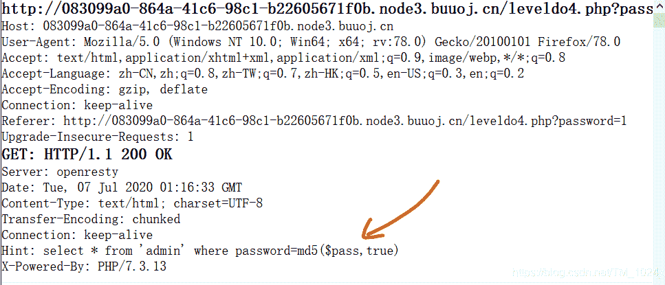

<!--yml
category: 未分类
date: 2022-04-26 14:19:46
-->

# BUUCTF__[BJDCTF2020]Easy MD5_题解_鼹鼠yanshu的博客-CSDN博客

> 来源：[https://blog.csdn.net/weixin_45887311/article/details/107193219](https://blog.csdn.net/weixin_45887311/article/details/107193219)

转载自https://blog.csdn.net/TM_1024/article/details/107174988

## 读题

*   打开一个查询窗口。看url有一个get传入的password变量，f12也没有什么提示。

*   盲猜sql注入，尝试一般方法，没有一点反应。

*   抓包发现在响应头里有提示。hint还能放这。。。
    

*   看到sql查询语句。

    ```
     select * from 'admin' where password=md5($pass,true) 

    ```

*   md5后的pass变量，咋知道密码是什么？？？

*   这里的思路是如何让sql语句返回为真，而不是知道密码。所以这是一个知识点。

*   找到如下。

> md5(string, raw) raw 可选，默认为false
> true:返回16字符2进制格式
> false:返回32字符16进制格式
> 简单来说就是 true将16进制的md5转化为字符了,如果某一字符串的md5恰好能够产生如’or ’之类的注入语句，就可以进行注入了.
> 提供一个字符串：ffifdyop
> md5后，276f722736c95d99e921722cf9ed621c
> 转成字符串后： 'or’6

*   输入特定的字符串，`ffifdyop` 在经过执行`md5(ffifdyop,true)` 后会返回 `'or'6`

*   再因为数据类型为字符串，所以在sql语句中必然有单引号后双引号包含。这里为单引号包含。凑巧还是故意？？？？

*   所以构成返回为真的sql语句。

    ```
    select * from 'admin' where password=' 'or '6' 

    ```

*   这里其实就，不知道就做不出来。。。还可以这样。。。

*   后面就很简单了

*   输入`ffifdyop`查询后，跳转到了另一个PHP页面。f12发现源码。

```
<!--
$a = $GET['a'];
$b = $_GET['b']; 
```