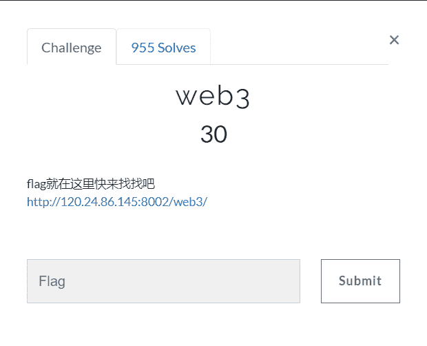
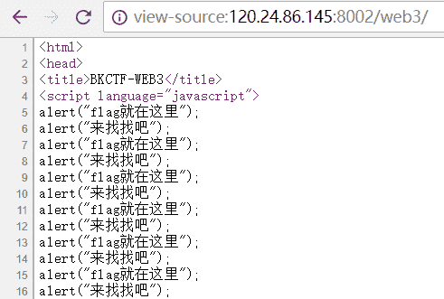
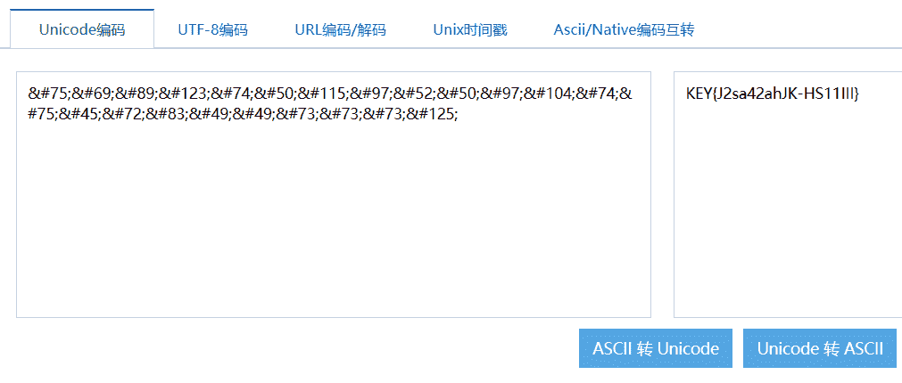

<!--yml
category: 未分类
date: 2022-04-26 14:21:26
-->

# BugkuCTF web3_weixin_30262255的博客-CSDN博客

> 来源：[https://blog.csdn.net/weixin_30262255/article/details/94883380](https://blog.csdn.net/weixin_30262255/article/details/94883380)

**前言**

写了这么久的web题，算是把它基础部分都刷完了一遍，以下的几天将持续更新BugkuCTF WEB部分的题解，为了不影响阅读，所以每道题的题解都以单独一篇文章的形式发表，感谢大家一直以来的支持和理解，共勉~~~



点开链接以后发现一直弹出下面这两个框


我在Chrome找了半天，尝试着禁止弹窗却毫无办法，于是，我直接view-source查看页面源码

 

若干条语句，emmmm，鼠标拖到文章的最后，我们发现了一串这个东西


```
&#75;&#69;&#89;&#123;&#74;&#50;&#115;&#97;&#52;&#50;&#97;&#104;&#74;&#75;&#45;&#72;&#83;&#49;&#49;&#73;&#73;&#73;&#125;
```

如果对编码有所了解的人一定知道，这是个Unicode编码，具体的参考这篇[文章](http://www.cnblogs.com/ECJTUACM-873284962/p/8986289.html)

我们这时候利用[站长工具](http://tool.chinaz.com/tools/unicode.aspx)，将Unicode转码成ASCII，好像直接爆出了KEY，这应该就是我们需要的flag

