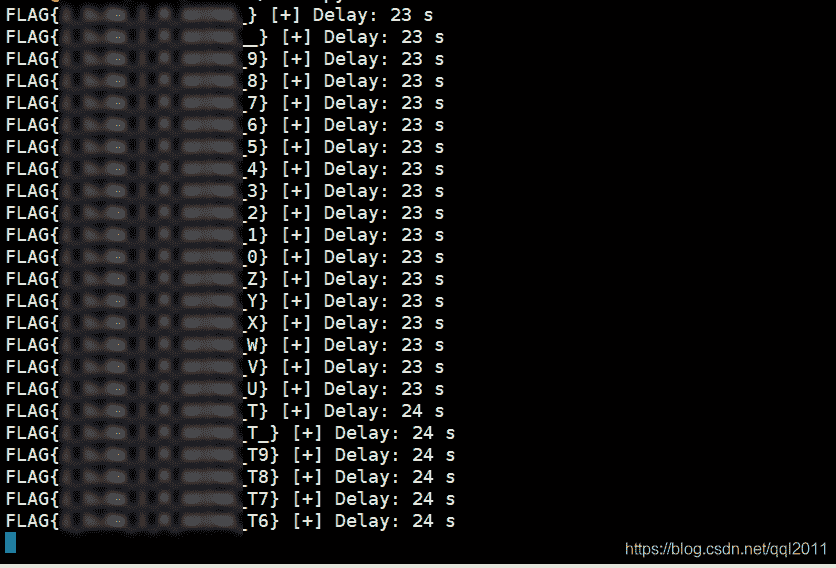

<!--yml
category: 未分类
date: 2022-04-26 14:48:20
-->

# CTF-hackme-Misc-slow-解题记录_qql2011的博客-CSDN博客

> 来源：[https://blog.csdn.net/qql2011/article/details/109261906](https://blog.csdn.net/qql2011/article/details/109261906)

#### 题目：

```
nc hackme.inndy.tw 7708
OMG, It's slow. 
```

### 解题步骤

本题采用的是时序攻击，第一次见这种题目，也是参靠了别人的代码做出来的
具体原理就是用你输入的flag和数据库中的从第一位开始比对，比对到错误的那一位直接退出。

1.  假设每比对一位的耗时是1s，正确的flag前五位一定是`FLAG{`
2.  当输入`FLAG{_}`时，如果耗时6s，说明第六位`_`是错的，因为比对到`_`就退出了，如果耗时7s，则说明`_`是对的，因为比对到第7位`}`才退出
3.  利用这种原理，可以一位位的破解出flag
4.  此题及其耗时程序大概有执行1-2个小时

```
 import socket
import time

def remote(s,a) :
    berror = True 
    while berror == True :
        try :
            client = socket.socket(socket.AF_INET,socket.SOCK_STREAM)
            client.connect((s,a))
            berror = False
            return client
        except socket.error : 
            print '---socket.error'
            client.close()
            berror = True

string = '_9876543210ZYXWVUTSRQPONMLKJIHGFEDCBA'
flag1 = ['F','L','A','G','{']
flag2 = '}'
start_delay = 6
break_flag = 0
while True :
    for i in string:
        p = remote('hackme.inndy.tw', 7708)
        time.sleep(0.2) 
        temp = p.recv(1024)

        a = time.time()
        payload = ''.join(flag1)+i+flag2

        p.send(payload)
        s = p.recv(1024)

        b = time.time()
        print '%s [+] Delay: %d s' % (payload,int(b-a))
        p.close()

        if int(b-a) == start_delay + 1: 
            flag1.append(i)
            start_delay += 1
            break
        if i == 'A': 
            print 'flag is %s' %(''.join(flag1)+flag2)
            print 'over___'
            break_flag = 1
            break
    if break_flag == 1 :
            break 
```

