<!--yml
category: 未分类
date: 2022-04-26 14:35:53
-->

# CTF做题笔记（二）+ 第一次团队内比赛_m0re的博客-CSDN博客_新约佛论禅解密

> 来源：[https://blog.csdn.net/qq_45836474/article/details/104879401](https://blog.csdn.net/qq_45836474/article/details/104879401)

### 前言：

把之前做过的几个题总结了下，这篇博客在草稿箱里待了好久了，也该放出来了。
本文目录
[明文](#1)
[Jefferson‘gun（杰弗逊的枪）](#2)
[精美壁纸](#3)
[Ook!](#4)
[rot13加密解密](#5)
[MD5加密解密](#6)
[种族歧视](#7)
[备份文件](#8)
[cookie](#9)
[simple_js](#10)
[baby_web](#11)
[N种解决方法](#12)
[小姐姐—y1ng](#13)

# 一次团队比赛

[看图片属性](#14)
[SL藏在字节中](#15)
[修改图片宽或高](#16)
[补充头部](#17)
[LSB](#18)
[使用outguess工具](#19)
[使用F5-steganography工具](#20)
[签到题](#21)
[文件分离](#22)
[画图](#23)
[使用steghide工具](#24)
[双图](#25)
[拼图](#26)
[流量包签到](#26)

### 明文

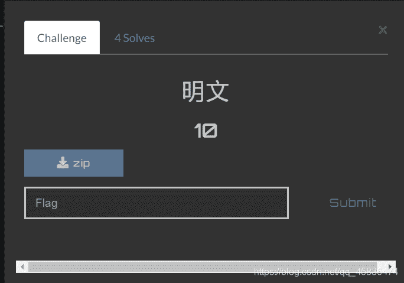
下载好就是这样一个文件：

把它改成压缩包`.zip`再打开，果然是有东西的


打开提示文本

打开压缩包发现了加密的Word文档

用ARCHPR暴力破解zip密码
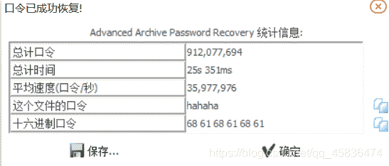
密码拿到，`hahaha`，然后就可以打开那个文档了。
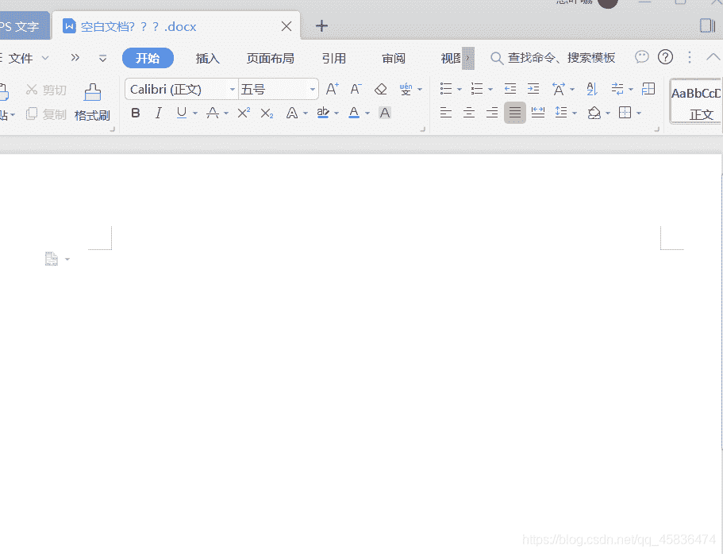
一片空白，，接下来让空白的地方显示出来文字
找到搜索框，搜索`选项`两个字，
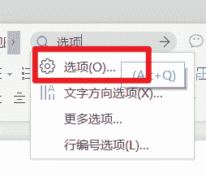
然后找到视图（office的Word文档是显示）
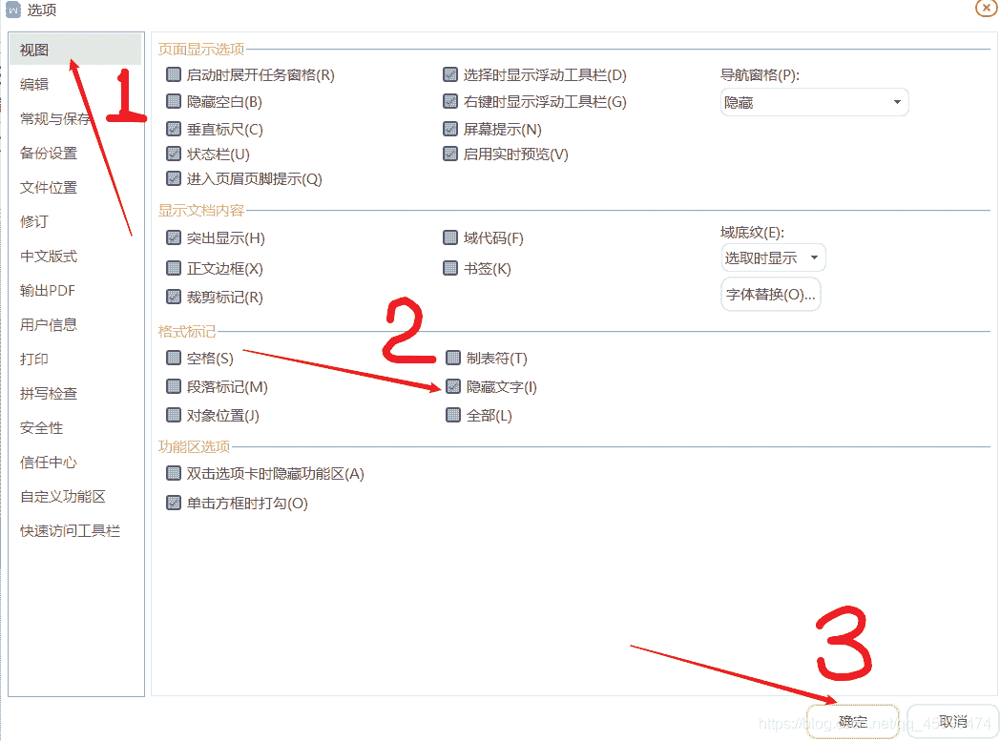
然后成功拿到flag
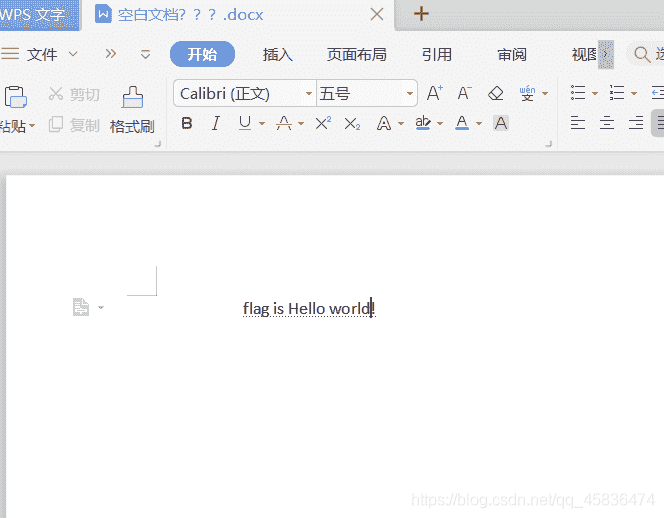

### Jefferson‘gun（杰弗逊的枪）

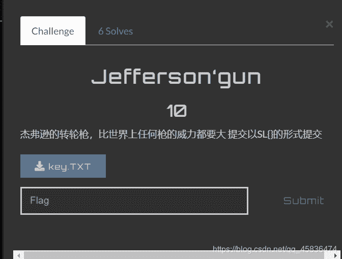
打开TXT后是这样的，
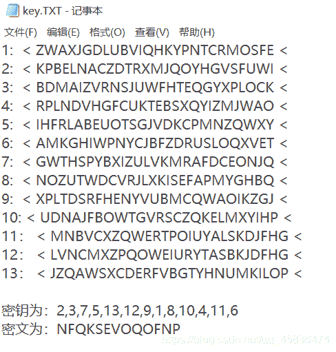
这个转轮密码就是根据密钥和密文将上面的13行字符串重新排序。按照密钥的顺序，现在的第二行重新排列后在第一行，其他同样如此，排好之后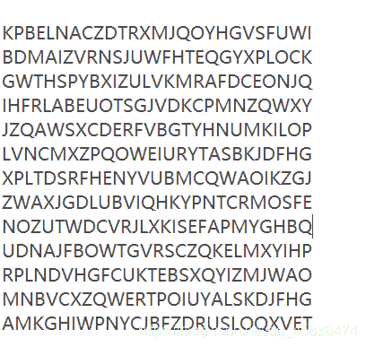
然后再根据密文来修改，密文的意思就是，拿第一行做个例子，在第一行找到N，把它前面的字母全都移到本行的最末尾，组成新的字符串。全部移动之后就是找到倒数第九列（至于为什么，百度我没找到，希望知道这个的大佬能指点一下，十分感谢！）。
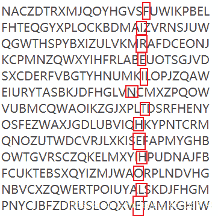
flag就是这个啦。

### 精美壁纸

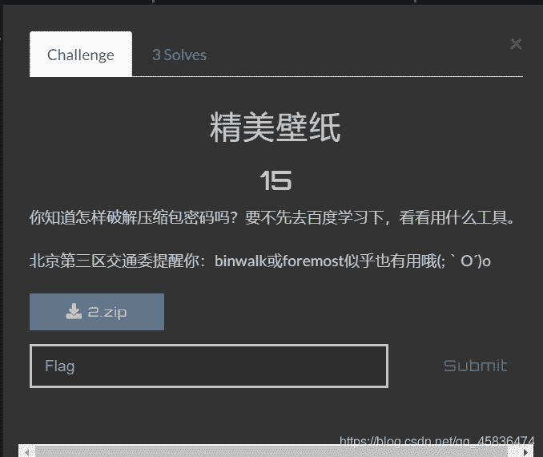
`Pixiv@純白可憐.jpg`是张图片，打开看看

挺好看的，精美壁纸。
然后把它拖进winhex里
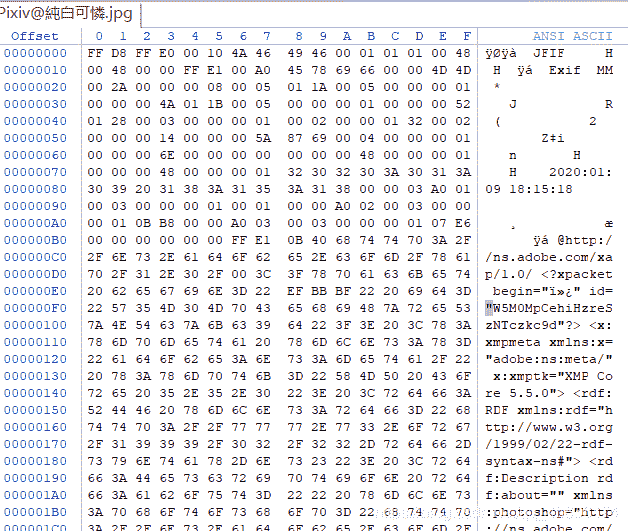
好好检查下，然后在最后发现了信息。
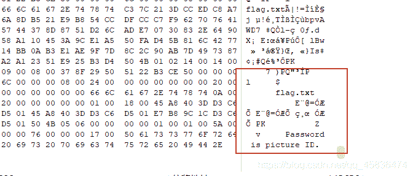
题里说了压缩包密码，就找压缩包。
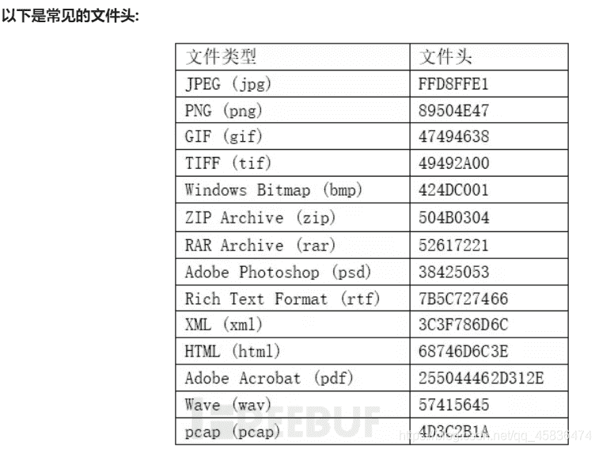
然后查找`504B0304`,
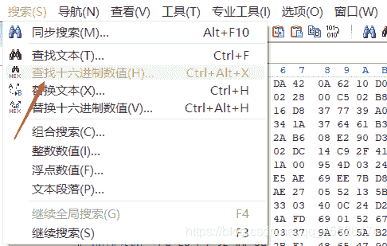
找到了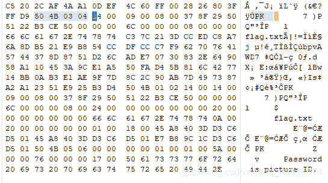
再找文件尾，zip的文件结尾一般都是`504B0506``开头，在意同样的办法找到文件尾就行。
然后提取压缩包
选中文件头到文件尾的部分右键单击，选择编辑，然后复制选块
，至新文件。

然后打开保存的压缩包，

flag文本加密了，password is picture ID.
密码是图片的ID，复制一下 图片的名字，百度一下。

进入网页之后找到那张图片，看下它的ID，就是压缩包的密码了

打开文本

还有密码。这个密码，我做的时候可是好一顿查啊。
Unicode转码:
hgame{Do_y0u_KnOW_uNiC0d3?}

### Ook!

bugku的一道题，第一眼看见着实吓到我了，自己看看就明白了。
不过真的是🐶🐶🐶，弄那么长，吓唬谁呢，纸老虎，在线网址
[直接破解](https://tool.bugku.com/brainfuck/)。没啥说的，啥也不是。

### rot13加密解密


做的第一道考察rot13的题目，就是偏移13位的凯撒密码。

拿到key。

### MD5加密解密


直接搜在线解密MD5工具[直达链接](https://www.cmd5.com/)

key：bighp

### 种族歧视


f12点击控制台，查看一下。
发现没法操作。那就抓包，

将这里改成：`en-US,en;q=0.9`然后go

拿到key。

### 备份文件


开启在线环境，进入之后看到

正确姿势：在这里加上`/index.php.bak`
然后会自动下载一个文件，在本地用记事本打开

得到flag。
常见的文件备份扩展名
`.rar`,`.zip`,`.7z`,`.tar.gz`,`.bak`,`.swp`,`.txt`,`.html`

### cookie


进去后看到“你知道什么是cookie吗？”

明显让查看cookie，最简单的办法，f12，到Console（控制台）输入`document.cookie`，就可以直接看到cookie了，也不用到处找，

cookie.php信息提示。然后就把原来的url后面加上`cookie.php`回车。
然后就根据提示查看http的response呗。
`f12`–`Network`–`Ctrl+R`–`cookie.php`–`左键单击`然后就能看到flag了


### simple_js


打开后弹了一个窗口，前段时间学过xss 然后就想到了Javascript的弹窗代码
先随便输个密码，

再看代码，f12

果然是个弹窗的JavaScript代码，一眼就看到了那个很长的一串数字。仔细看就会发现它是十六进制数，先转换，，，

将解出来的十进制数对照ascii码表，可以在Excel表格中转换，比较快


### baby_web


这个提示初始页面，然后看了进入场景看看，

然后呢，，，对于这种，直接f12看源码，然而扫荡一波，什么都没找到。
然后再想想提示，初始页面，就是知道是啥，但说不上来那种感觉，然后我就去百度初始页面，刚开始进入浏览器显示的页面，还看到有个大哥在问怎么把百度设置为初始页面呢，这么一看，突然想到刚刚那个url好像有点不对劲，然后对比了一下题目给的url和进入那个链接浏览器显示的url，发现不一样了，多了个`/1.php`一定是中间跳转了，我之前拿我的物理机当靶机玩xss的时候玩过这个，让用户点击一个链接或者其他的图片之类的东西后直接跳转另一个页面，是反射型xss。
这里跳转就burp抓包。

右键单击然后转到Repeater里面

这多好，嘿嘿。

### N种解决方法

打开文件是个不能运行的一个应用程序，我就先把它重命名为文本文件了，然后就可以打开了

看到了base64然后我就把base64 后面的内容全都放在在线解密网站去解密了。解出来一堆乱码，，，我看到这些乱码，好像是在winhex里打开的样子，所以我就又打开winhex（看的方便点）但是找半天，发现，没有隐藏压缩包、图片什么的，烦，，，，这个到底考的什么？？？有一句话说的真没错，把人逼急了，什么都做的出来，我就全选复制，整个扔浏览器里跑了。结果wc了，整出来个二维码，激动，，差点鼠标都给扔了。
颤抖的手掏出我的诺基亚一扫，哎，美滋滋。


### 小姐姐—y1ng


这是之前比赛的题，然而我根本就没看，（我菜我有理╭(╯^╰)╮）

这个看着有点别扭，但是我做的时候没想到什么思路，就还是分离一下看看能不能找到其他的信息，但是并没有，然后就放winhex里找信息了。找半天也没找到，我懵了，，，，找wp，结果发现，直接搜就行了。但是我的问题又来了，（wp上说的是直接搜BJD）

为什么没有？我当时可迷！！！
然后我尝试搜了十六进制的424A44(BJD)就找到了。但是我又在下图的位置再次尝试了搜BJD，但是，但是`******`还是没有。奇怪。


### 看图片属性

右键找到属性，看详细信息，备注就是信息

### SL藏在字节中

winhex打开图片搜文本SL，flag就在中间的位置。（多搜几次）

### 修改图片宽或高

拖进winhex中，在改高度的地方将高度改高一点


### 补充头部

还是将图片在winhex打开，提示的这么明显了，是png格式，在头部位置右键单击，然后选编辑，粘贴0字节

粘贴4个，然后png格式添加`89504E47`

其他格式

解题姿势是不变的

### LSB

stegsolve打开进行转换看到在0的有效位跟其他的有点不同的是多了最上面的一串乱七八糟的东西，其他（green,blue）的都有（而且提示也是最低有效位）

然后提取出来就行


### 使用outguess工具

之前见了一个这样的题，那个题目特别注重了“猜”这个字。那个就是outguess。
看这个，一张图片

首先想到，outguess是要有密码的，不能盲目的一顿乱操作。
就一张图片，分离不出任何信息，然后想到了备注

新佛曰。新与佛论禅在线网站可解[新约佛论禅](http://hi.pcmoe.net/buddha.html)解出来是`lemon`
kali解题
payload
`outguess -k '密钥' -r 图片 flag.txt`解密的
`outguess -k "secret key" -d flag.txt 0.jpg 1.jpg`加密的
加密之后，0.jpg会覆盖1.jpg,
flag.txt中的内容是要隐藏的文本

在outguess的文件夹里找到`flag.txt`


### 使用F5-steganography工具


F5隐写同样是需要一个密钥，就一张图片，那就在这里下功夫。先分离，发现没东西，再看备注（虽然知道是无用还是试试）。最后才发现它就在最显眼的地方。
payload
`java Extract picture.jpg -p key`

在f5的文件目录中找到output.txt就是flag。

### 签到题


winhex打开图片，没给其他信息的话，一般不难找，头部没有，到最尾部看。
是HTML编码，在线网站解码就行了。

### 文件分离


foremost分离

flag拿到（个人感觉windows上使用foremost比binwalk方便多了。）

### 画图


下载好gnuplot后，然后开始看图片。还是第一步分离了一下。没想到还真有东西，然后看压缩包，解压出来一个txt文本。特别长。

没头绪，不过应该没有加密了。就去看看gnuplot怎么用的吧。看学长提示的那个博客看过去，看过后，还阔以，明白了。
先下载个Notepad++再说，

转换后

保存，打开gnuplot程序

回车画图

微信扫吧，别用QQ，害，明明是一个“妈”生的，差距怎么就这么大

### 使用steghide工具


因为steghide解题也是要密钥的，所以先找图片的信息。分离，没有。下一个，看备注。这个找到了

先在题中给的链接中学习一下怎么使用，[使用方法](http://www.safe6.cn/article/102)，然后就可以解题了。

看着明显不是flag，像是栅栏密码，在线网站解一下

get

### 双图


一顿操作猛如虎，一看码子扫不出来，

保存这个二维码，（其实我还去搜了彩色的二维码能不能识别，sha子行为），然后再用stegsolve打开这张码子，

我把三张图一块截了，第一张是DES
第二张是6XaMMbM7
第三张是长字符串。搜一下了解到有DES加密这个密码。而且有在线解密网站，直接搜就好了，第二个是密钥。第三个是密文
在线解密可得出flag

### 拼图


有两种方法，一种比较暴力，一种比较正规。
用到题中提示的工具，真是不得不说，下载安装真的烦，到现在我仍然是报错。烦死了，不装了，其实我已经装这个工具两天了，一个接一个的，浪费我时间艹。
可以直接拼出来，就直接拼吧，不会也就没办法了，工具用不了都是白搭，烦，快照都用了，还要重新下载以前下载的工具，真是烦，工具没捡到还丢了原本的工具，重装烦，。郁闷。
就这吧，以后不随便往kali安装第三方工具了，

### 流量包签到


打开这个工具，在工具中打开下载的文件，
然后随便点条数据，找到Source，右键单击选择追踪流，再选择TCP。就能看到flag了。

还有一个得到flag的办法，我第一次得到flag是用这个办法的，不过可能就这道题可以用吧。
歪门邪道：
直接将文件拖进winhex，搜索文本SL 或者flag（挨个试试呗)，结果还真找到了。就这样，没了。对了，要是想不到搜flag还是什么关键字的话，直接搜`{`英文输出的大括号。也可以，多向下搜几次（试过了，可以）。

就这吧，最后几道题写的而过于简单，两天卡在一个地方，没心情写了，就这样吧。真累。

### 盲水印

补充一道题
最后做出来的，同样是需要工具


这道题工具给出，但是同样是在前两天没有get到工具，为什么是补充的呢？就是原本不打算继续这道题了，就没有再进行下去了。现在最后几个小时了，觉得还是有些不服气，为什么我做不出来，就又接着看，继续搞那个工具了。还是跟昨天一样的报错。（为了写博客，我又将我改好的设置改回原来在github上下载的原脚本。）


想到之前请教学长那个rsa的脚本的问题，就是关于python2和python3 中的除法的问题。跟这里很相似。
我就尝试了下自己改下脚本，原来的脚本是这样的

```
 import cv2
import numpy as np
import random
import os
from argparse import ArgumentParser
ALPHA = 5

def build_parser():
    parser = ArgumentParser()
    parser.add_argument('--original', dest='ori', required=True)
    parser.add_argument('--image', dest='img', required=True)
    parser.add_argument('--result', dest='res', required=True)
    parser.add_argument('--alpha', dest='alpha', default=ALPHA)
    return parser

def main():
    parser = build_parser()
    options = parser.parse_args()
    ori = options.ori
    img = options.img
    res = options.res
    alpha = float(options.alpha)
    if not os.path.isfile(ori):
        parser.error("original image %s does not exist." % ori)
    if not os.path.isfile(img):
        parser.error("image %s does not exist." % img)
    decode(ori, img, res, alpha)

def decode(ori_path, img_path, res_path, alpha):
    ori = cv2.imread(ori_path)
    img = cv2.imread(img_path)
    ori_f = np.fft.fft2(ori)
    img_f = np.fft.fft2(img)
    height, width = ori.shape[0], ori.shape[1]
    watermark = (ori_f - img_f) / alpha
    watermark = np.real(watermark)
    res = np.zeros(watermark.shape)
    random.seed(height + width)
    x = range(height / 2)
    y = range(width)
    random.shuffle(x)
    random.shuffle(y)
    for i in range(height / 2):
        for j in range(width):
            res[x[i]][y[j]] = watermark[i][j]
    cv2.imwrite(res_path, res, [int(cv2.IMWRITE_JPEG_QUALITY), 100])

if __name__ == '__main__':
    main() 
```

这是原封不动的从github上下载下来的。

这两处的`/`改成`//`，然后保存，继续运行命令跑起来

可以看到还是报错了，但是刚做的改动可不是无用功，可以看出来比起上面的报错，没有了那个关于`/`的报错了，所以这一步是有用的。
再接着看错误。这个错误不懂，有道翻译一下（英语不好）
有点难懂，直接百度搜报错吧，挑挑选选找到了原因。
**原因：是python3中range不返回数组对象，而是返回range对象
加个声明为list的语句就行**
找到range的对象加上list让它返回列表

将这里改成图中的样子就行。保存一下再跑

已经没有报错了，这就是全部解决了。心情舒畅了许多。
最后再附上完整的正确脚本。

```
 import cv2
import numpy as np
import random
import os
from argparse import ArgumentParser
ALPHA = 5

def build_parser():
    parser = ArgumentParser()
    parser.add_argument('--original', dest='ori', required=True)
    parser.add_argument('--image', dest='img', required=True)
    parser.add_argument('--result', dest='res', required=True)
    parser.add_argument('--alpha', dest='alpha', default=ALPHA)
    return parser

def main():
    parser = build_parser()
    options = parser.parse_args()
    ori = options.ori
    img = options.img
    res = options.res
    alpha = float(options.alpha)
    if not os.path.isfile(ori):
        parser.error("original image %s does not exist." % ori)
    if not os.path.isfile(img):
        parser.error("image %s does not exist." % img)
    decode(ori, img, res, alpha)

def decode(ori_path, img_path, res_path, alpha):
    ori = cv2.imread(ori_path)
    img = cv2.imread(img_path)
    ori_f = np.fft.fft2(ori)
    img_f = np.fft.fft2(img)
    height, width = ori.shape[0], ori.shape[1]
    watermark = (ori_f - img_f) / alpha
    watermark = np.real(watermark)
    res = np.zeros(watermark.shape)
    random.seed(height + width)
    x = list(range(height // 2))
    y = list(range(width))
    random.shuffle(x)
    random.shuffle(y)
    for i in range(height // 2):
        for j in range(width):
            res[x[i]][y[j]] = watermark[i][j]
    cv2.imwrite(res_path, res, [int(cv2.IMWRITE_JPEG_QUALITY), 100])

if __name__ == '__main__':
    main() 
```

这次也是收获好多，就这个盲水印让我明白自己看报错信息的重要性。解决了问题是真的爽。