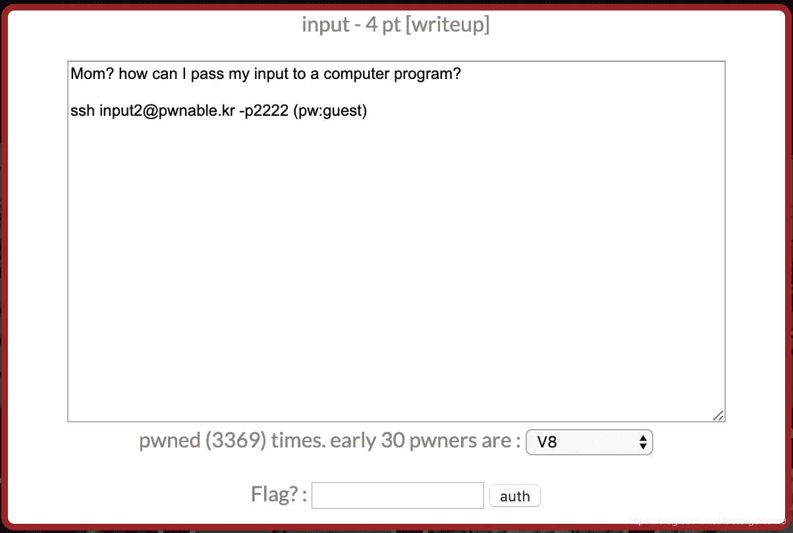

<!--yml
category: 未分类
date: 2022-04-26 14:31:20
-->

# PWN input [pwnable.kr]CTF writeup题解系列7_3riC5r的博客-CSDN博客

> 来源：[https://blog.csdn.net/fastergohome/article/details/103797757](https://blog.csdn.net/fastergohome/article/details/103797757)

**目录**

[0x01题目](#0x01%E9%A2%98%E7%9B%AE)

[0x02解题思路](#0x02%E8%A7%A3%E9%A2%98%E6%80%9D%E8%B7%AF)

[0x03题解](#0x03%E9%A2%98%E8%A7%A3)

* * *

# 0x01题目




# 0x02解题思路

先连接到服务器看下情况

```
root@mypwn:/ctf/work/pwnable.kr# ssh input2@pwnable.kr -p2222 
input2@pwnable.kr's password: 
 ____  __    __  ____    ____  ____   _        ___      __  _  ____  
|    \|  |__|  ||    \  /    ||    \ | |      /  _]    |  |/ ]|    \ 
|  o  )  |  |  ||  _  ||  o  ||  o  )| |     /  [_     |  ' / |  D  )
|   _/|  |  |  ||  |  ||     ||     || |___ |    _]    |    \ |    / 
|  |  |  `  '  ||  |  ||  _  ||  O  ||     ||   [_  __ |     \|    \ 
|  |   \      / |  |  ||  |  ||     ||     ||     ||  ||  .  ||  .  \
|__|    \_/\_/  |__|__||__|__||_____||_____||_____||__||__|\_||__|\_|

- Site admin : daehee87@gatech.edu
- IRC : irc.netgarage.org:6667 / #pwnable.kr
- Simply type "irssi" command to join IRC now
- files under /tmp can be erased anytime. make your directory under /tmp
- to use peda, issue `source /usr/share/peda/peda.py` in gdb terminal
Last login: Wed Jan  1 08:34:53 2020 from 175.195.1.15
input2@prowl:~$ ls -la
total 44
drwxr-x---   5 root       input2  4096 Oct 23  2016 .
drwxr-xr-x 116 root       root    4096 Nov 12 21:34 ..
d---------   2 root       root    4096 Jun 30  2014 .bash_history
-r--r-----   1 input2_pwn root      55 Jun 30  2014 flag
-r-sr-x---   1 input2_pwn input2 13250 Jun 30  2014 input
-rw-r--r--   1 root       root    1754 Jun 30  2014 input.c
dr-xr-xr-x   2 root       root    4096 Aug 20  2014 .irssi
drwxr-xr-x   2 root       root    4096 Oct 23  2016 .pwntools-cache
```

input.c代码如下：

```
#include <stdio.h>
#include <stdlib.h>
#include <string.h>
#include <sys/socket.h>
#include <arpa/inet.h>

int main(int argc, char* argv[], char* envp[]){
	printf("Welcome to pwnable.kr\n");
	printf("Let's see if you know how to give input to program\n");
	printf("Just give me correct inputs then you will get the flag :)\n");

	// argv
	if(argc != 100) return 0;
	if(strcmp(argv['A'],"\x00")) return 0;
	if(strcmp(argv['B'],"\x20\x0a\x0d")) return 0;
	printf("Stage 1 clear!\n");	

	// stdio
	char buf[4];
	read(0, buf, 4);
	if(memcmp(buf, "\x00\x0a\x00\xff", 4)) return 0;
	read(2, buf, 4);
        if(memcmp(buf, "\x00\x0a\x02\xff", 4)) return 0;
	printf("Stage 2 clear!\n");

	// env
	if(strcmp("\xca\xfe\xba\xbe", getenv("\xde\xad\xbe\xef"))) return 0;
	printf("Stage 3 clear!\n");

	// file
	FILE* fp = fopen("\x0a", "r");
	if(!fp) return 0;
	if( fread(buf, 4, 1, fp)!=1 ) return 0;
	if( memcmp(buf, "\x00\x00\x00\x00", 4) ) return 0;
	fclose(fp);
	printf("Stage 4 clear!\n");	

	// network
	int sd, cd;
	struct sockaddr_in saddr, caddr;
	sd = socket(AF_INET, SOCK_STREAM, 0);
	if(sd == -1){
		printf("socket error, tell admin\n");
		return 0;
	}
	saddr.sin_family = AF_INET;
	saddr.sin_addr.s_addr = INADDR_ANY;
	saddr.sin_port = htons( atoi(argv['C']) );
	if(bind(sd, (struct sockaddr*)&saddr, sizeof(saddr)) < 0){
		printf("bind error, use another port\n");
    		return 1;
	}
	listen(sd, 1);
	int c = sizeof(struct sockaddr_in);
	cd = accept(sd, (struct sockaddr *)&caddr, (socklen_t*)&c);
	if(cd < 0){
		printf("accept error, tell admin\n");
		return 0;
	}
	if( recv(cd, buf, 4, 0) != 4 ) return 0;
	if(memcmp(buf, "\xde\xad\xbe\xef", 4)) return 0;
	printf("Stage 5 clear!\n");

	// here's your flag
	system("/bin/cat flag");	
	return 0;
} 
```

然后按照5个部分，逐个配置好相应的参数，涉及到pwntools的一些用法，可以参考下面的链接：

[http://docs.pwntools.com/en/stable/tubes/processes.html](http://docs.pwntools.com/en/stable/tubes/processes.html)

这里已经说的非常清楚了，只要按照这个说明来配置，可以自行逐一进行测试。

# 0x03题解

首先需要在服务器上建立目录和软链接

```
root@mypwn:/ctf/work/pwnable.kr# ssh input2@pwnable.kr -p2222 
input2@pwnable.kr's password: 
 ____  __    __  ____    ____  ____   _        ___      __  _  ____  
|    \|  |__|  ||    \  /    ||    \ | |      /  _]    |  |/ ]|    \ 
|  o  )  |  |  ||  _  ||  o  ||  o  )| |     /  [_     |  ' / |  D  )
|   _/|  |  |  ||  |  ||     ||     || |___ |    _]    |    \ |    / 
|  |  |  `  '  ||  |  ||  _  ||  O  ||     ||   [_  __ |     \|    \ 
|  |   \      / |  |  ||  |  ||     ||     ||     ||  ||  .  ||  .  \
|__|    \_/\_/  |__|__||__|__||_____||_____||_____||__||__|\_||__|\_|

- Site admin : daehee87@gatech.edu
- IRC : irc.netgarage.org:6667 / #pwnable.kr
- Simply type "irssi" command to join IRC now
- files under /tmp can be erased anytime. make your directory under /tmp
- to use peda, issue `source /usr/share/peda/peda.py` in gdb terminal
Last login: Wed Jan  1 11:01:55 2020 from 120.84.12.64
input2@prowl:~$ cd /tmp
input2@prowl:/tmp$ mkdir input_3rik5r
input2@prowl:/tmp$ cd input_3rik5r
input2@prowl:/tmp/input_3rik5r$ ls
input2@prowl:/tmp/input_3rik5r$ ln -s /home/input2/flag ./flag
input2@prowl:/tmp/input_3rik5r$ ls -l
total 0
lrwxrwxrwx 1 input2 input2 17 Jan  1 11:08 flag -> /home/input2/flag
```

必须要自己建立/tmp下面的目录，因为/tmp目录下面没有权限读。

编写脚本python如下：

```
# #coding:utf8
# #!/usr/bin/env python

from pwn import *

s =  ssh(host='pwnable.kr',user='input2',password='guest',port=2222)

context.log_level='debug'
process_name = './input2'

args = [process_name]
for x in range(1, 100):
	if x == ord('A'):
		args.append(str('\x00'))
	else:
		if x == ord('B'):
			args.append(str('\x20\x0a\x0d'))
		else:
			if x == ord('C'):
				args.append(str('23222'))
			else:
				args.append('C'+str(x));
# p = process(argv=args, env={'\xde\xad\xbe\xef':'\xca\xfe\xba\xbe'})
# elf = ELF(process_name)
s.write('/tmp/input_3rik5r/2.txt',"\x00\x0a\x02\xff")
s.write('/tmp/input_3rik5r/\x0a',"\x00"*4)
p = s.process(argv=args,cwd="/tmp/input_3rik5r/",env={'\xde\xad\xbe\xef':'\xca\xfe\xba\xbe'},executable='/home/input2/input',stderr='/tmp/input_3rik5r/2.txt')

# p.recv()
p.send('\x00\x0a\x00\xff')

print p.recv()
r = s.remote('pwnable.kr', 23222)
r.send('\xde\xad\xbe\xef')
r.close()
print s.recv()
print p.recv()
# p.interactive() 
```

执行之后情况如下：

```
root@mypwn:/ctf/work/pwnable.kr# python input.py 
[+] Connecting to pwnable.kr on port 2222: Done
[*] input2@pwnable.kr:
    Distro    Ubuntu 16.04
    OS:       linux
    Arch:     amd64
    Version:  4.4.179
    ASLR:     Enabled
[+] Opening new channel: 'stty raw -ctlecho -echo; cd . >/dev/null 2>&1;pwd': Done
[+] Receiving all data: Done (13B)
[DEBUG] Received 0xd bytes:
    '/home/input2\n'
[*] Closed SSH channel with pwnable.kr
/home/input2
[DEBUG] Created execve script:
    #!/usr/bin/env python2
    import os, sys, ctypes, resource, platform, stat
    from collections import OrderedDict
    exe   = '/home/input2/input'
    argv  = ['./input2', 'C1', 'C2', 'C3', 'C4', 'C5', 'C6', 'C7', 'C8', 'C9', 'C10', 'C11', 'C12', 'C13', 'C14', 'C15', 'C16', 'C17', 'C18', 'C19', 'C20', 'C21', 'C22', 'C23', 'C24', 'C25', 'C26', 'C27', 'C28', 'C29', 'C30', 'C31', 'C32', 'C33', 'C34', 'C35', 'C36', 'C37', 'C38', 'C39', 'C40', 'C41', 'C42', 'C43', 'C44', 'C45', 'C46', 'C47', 'C48', 'C49', 'C50', 'C51', 'C52', 'C53', 'C54', 'C55', 'C56', 'C57', 'C58', 'C59', 'C60', 'C61', 'C62', 'C63', 'C64', '', ' \n\r', '23222', 'C68', 'C69', 'C70', 'C71', 'C72', 'C73', 'C74', 'C75', 'C76', 'C77', 'C78', 'C79', 'C80', 'C81', 'C82', 'C83', 'C84', 'C85', 'C86', 'C87', 'C88', 'C89', 'C90', 'C91', 'C92', 'C93', 'C94', 'C95', 'C96', 'C97', 'C98', 'C99']
    env   = {'\xde\xad\xbe\xef': '\xca\xfe\xba\xbe'}

    os.chdir('/tmp/input_3rik5r/')

    if env is not None:
        os.environ.clear()
        os.environ.update(env)
    else:
        env = os.environ

    def is_exe(path):
        return os.path.isfile(path) and os.access(path, os.X_OK)

    PATH = os.environ.get('PATH','').split(os.pathsep)

    if os.path.sep not in exe and not is_exe(exe):
        for path in PATH:
            test_path = os.path.join(path, exe)
            if is_exe(test_path):
                exe = test_path
                break

    if not is_exe(exe):
        sys.stderr.write('3\n')
        sys.stderr.write("{} is not executable or does not exist in $PATH: {}".format(exe,PATH))
        sys.exit(-1)

    if not True:
        PR_SET_NO_NEW_PRIVS = 38
        result = ctypes.CDLL('libc.so.6').prctl(PR_SET_NO_NEW_PRIVS, 1, 0, 0, 0)

        if result != 0:
            sys.stdout.write('3\n')
            sys.stdout.write("Could not disable setuid: prctl(PR_SET_NO_NEW_PRIVS) failed")
            sys.exit(-1)

    try:
        PR_SET_PTRACER = 0x59616d61
        PR_SET_PTRACER_ANY = -1
        ctypes.CDLL('libc.so.6').prctl(PR_SET_PTRACER, PR_SET_PTRACER_ANY, 0, 0, 0)
    except Exception:
        pass

    # Determine what UID the process will execute as
    # This is used for locating apport core dumps
    suid = os.getuid()
    sgid = os.getgid()
    st = os.stat(exe)
    if True:
        if (st.st_mode & stat.S_ISUID):
            suid = st.st_uid
        if (st.st_mode & stat.S_ISGID):
            sgid = st.st_gid

    if sys.argv[-1] == 'check':
        sys.stdout.write("1\n")
        sys.stdout.write(str(os.getpid()) + "\n")
        sys.stdout.write(str(os.getuid()) + "\n")
        sys.stdout.write(str(os.getgid()) + "\n")
        sys.stdout.write(str(suid) + "\n")
        sys.stdout.write(str(sgid) + "\n")
        sys.stdout.write(os.path.realpath(exe) + '\x00')
        sys.stdout.flush()

    for fd, newfd in {0: 0, 1: 1, 2:'/tmp/input_3rik5r/2.txt'}.items():
        if newfd is None:
            close(fd)
        elif isinstance(newfd, str):
            os.close(fd)
            os.open(newfd, os.O_RDONLY if fd == 0 else (os.O_RDWR|os.O_CREAT))
        elif isinstance(newfd, int) and newfd != fd:
            os.dup2(fd, newfd)

    if not True:
        if platform.system().lower() == 'linux' and True is not True:
            ADDR_NO_RANDOMIZE = 0x0040000
            ctypes.CDLL('libc.so.6').personality(ADDR_NO_RANDOMIZE)

        resource.setrlimit(resource.RLIMIT_STACK, (-1, -1))

    # Attempt to dump ALL core file regions
    try:
        with open('/proc/self/coredump_filter', 'w') as core_filter:
            core_filter.write('0x3f\n')
    except Exception:
        pass

    # Assume that the user would prefer to have core dumps.
    try:
        resource.setrlimit(resource.RLIMIT_CORE, (-1, -1))
    except Exception:
        pass

    def func(): pass
    apply(func, [])

    os.execve(exe, argv, env)
[+] Starting remote process execve('/home/input2/input', ['./input2', 'C1', 'C2', 'C3', 'C4', 'C5', 'C6', 'C7', 'C8', 'C9', 'C10', 'C11', 'C12', 'C13', 'C14', 'C15', 'C16', 'C17', 'C18', 'C19', 'C20', 'C21', 'C22', 'C23', 'C24', 'C25', 'C26', 'C27', 'C28', 'C29', 'C30', 'C31', 'C32', 'C33', 'C34', 'C35', 'C36', 'C37', 'C38', 'C39', 'C40', 'C41', 'C42', 'C43', 'C44', 'C45', 'C46', 'C47', 'C48', 'C49', 'C50', 'C51', 'C52', 'C53', 'C54', 'C55', 'C56', 'C57', 'C58', 'C59', 'C60', 'C61', 'C62', 'C63', 'C64', '', ' \n\r', '23222', 'C68', 'C... on pwnable.kr: pid 38194
[DEBUG] Received 0x2f bytes:
    00000000  31 0a 33 38  31 39 34 0a  31 30 31 34  0a 31 30 31  │1·38│194·│1014│·101│
    00000010  34 0a 31 30  31 35 0a 31  30 31 34 0a  2f 68 6f 6d  │4·10│15·1│014·│/hom│
    00000020  65 2f 69 6e  70 75 74 32  2f 69 6e 70  75 74 00     │e/in│put2│/inp│ut·│
    0000002f
[DEBUG] Sent 0x4 bytes:
    00000000  00 0a 00 ff                                         │····││
    00000004
[DEBUG] Received 0x92 bytes:
    'Welcome to pwnable.kr\n'
    "Let's see if you know how to give input to program\n"
    'Just give me correct inputs then you will get the flag :)\n'
    'Stage 1 clear!\n'
Welcome to pwnable.kr
Let's see if you know how to give input to program
Just give me correct inputs then you will get the flag :)
Stage 1 clear!

[+] Connecting to pwnable.kr:23222 via SSH to pwnable.kr: Done
[DEBUG] Sent 0x4 bytes:
    00000000  de ad be ef                                         │····││
    00000004
[*] Closed remote connection to pwnable.kr:23222 via SSH connection to pwnable.kr
[+] Opening new channel: 'stty raw -ctlecho -echo; cd . >/dev/null 2>&1;recv': Done
[+] Receiving all data: Done (30B)
[DEBUG] Received 0x1e bytes:
    'bash: recv: command not found\n'
[*] Closed SSH channel with pwnable.kr
bash: recv: command not found
[DEBUG] Received 0x73 bytes:
    'Stage 2 clear!\n'
    'Stage 3 clear!\n'
    'Stage 4 clear!\n'
    'Stage 5 clear!\n'
    'Mommy! I learned how to pass various input in Linux :)\n'
Stage 2 clear!
Stage 3 clear!
Stage 4 clear!
Stage 5 clear!
Mommy! I learned how to pass various input in Linux :)
```