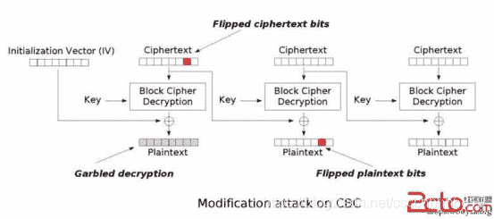
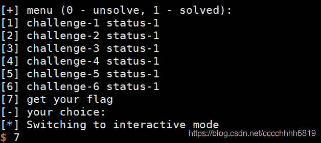
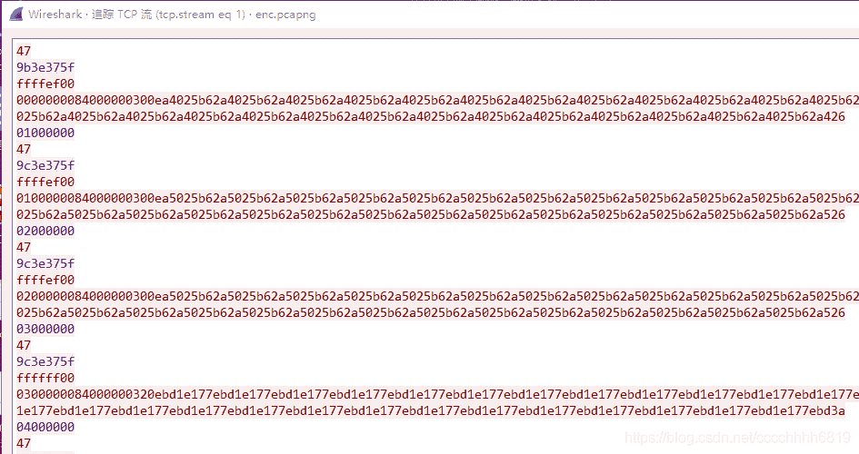
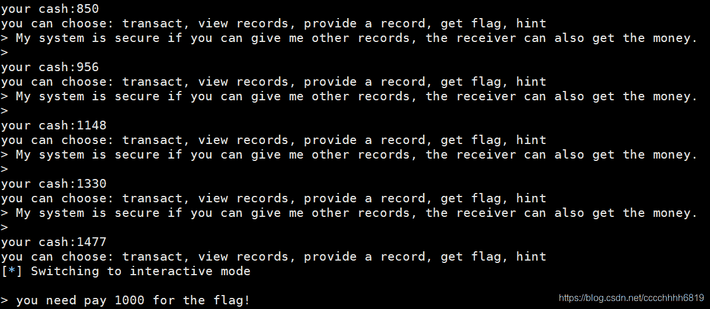

<!--yml
category: 未分类
date: 2022-04-26 14:32:02
-->

# 【CTF WriteUp】2020第四届强网杯部分Crypto题解_零食商人的博客-CSDN博客

> 来源：[https://blog.csdn.net/cccchhhh6819/article/details/108192372](https://blog.csdn.net/cccchhhh6819/article/details/108192372)

## 写在前边

强网杯还是难。。去年正赛赛题一道都不会，只能靠临时补充的强网先锋题目拿分的情景历历在目。今年也没好哪去，只能写一点是一点吧。

## modestudy

这道题是一道六合一块密码大杂烩，考察基础知识与变换，六道小的题目全做完以后拿到flag。其中4、5、6三道题需要大量交互，因此答案不变，可以单次做完后保留答案一起提交。1、2、3三道题当场变换即可。

<mark>Stage 1</mark>

```
[$] challenge 1
[+] cookie:session=6b1f33a78c5b9c17;admin=0;checksum=552ebbeb9276a8cd9f741b7d29f8c9e1eb455757207ac420659e7eab56ddee25
[+] checksum=aes128cbc.encrypt(session=6b1f33a78c5b9c17;admin=0)
[+] only admin can see flag
[-] cookie:（待输入） 
```

本题采用CBC模式加密。我们还是借用红黑联盟那个CBC解密的图说事
如图所示，需要将admin=0改为admin=1，只要把上一段密文的对应位异或’0’再异或’1’即可。这样虽然会破坏上一段明文，但是无所谓，admin=1构造出来了

```
session=6b1f33a7          552ebbeb9276a8cd9f741b7d29f8c9e1
8c5b9c17;admin=0          eb455757207ac420659e7eab56ddee25 
```

把第一行最后一位异或1即可过关

```
[$] challenge 1
[+] cookie:session=6043fb92858e4080;admin=0;checksum=e1b54fe73c59fc5d07542002d90b7ef53e730401cc8736d4312e6ca55f4758a6
[+] checksum=aes128cbc.encrypt(session=6043fb92858e4080;admin=0)
[+] only admin can see flag
[-] cookie:session=6043fb92858e4080;admin=0;checksum=e1b54fe73c59fc5d07542002d90b7ef43e730401cc8736d4312e6ca55f4758a6
[+] decrypt(checksum):竴痬€萠窰賦?CH?58e4080;admin=1
[+] passed 
```

<mark>Stage 2</mark>

```
[$] challenge 2
[+] sha256(iv)=11f595abc9d7b986d24fce986d1f9ddfb0d83f2f978db20b862ea730e570bff0
[+] 1\. server's job: print aes_cbc_dec(key,iv,your_input_c).encode('hex')
[+] 2\. your job: guess iv
[-] your choice:（待输入） 
```

标准的CBC选择密文攻击。还用上边那张图。设我们输入为c0 c1，得到输出为m0 m1，则

```
dec(c0) = m0 ^ iv
dec(c1) = m1 ^ c0 
```

我们让c1 = c0，可以看到

```
dec(c0) = m0 ^ iv
dec(c1) = dec(c0) = m1 ^ c0 = m0 ^ iv
iv = m0 ^ m1 ^ c0 
```

所以输入两段一样的16字符内容，拿这段内容和两段解密出来的明文异或即为iv

```
[$] challenge 2
[+] sha256(iv)=11f595abc9d7b986d24fce986d1f9ddfb0d83f2f978db20b862ea730e570bff0
[+] 1\. server's job: print aes_cbc_dec(key,iv,your_input_c).encode('hex')
[+] 2\. your job: guess iv
[-] your choice:1
[-] c:80808080808080808080808080808080
[+] fee1313801108cd3dc7dfb547a3126d82893f3d8e1541cc11799a1546e4fef0e
[+] 1\. server's job: print aes_cbc_dec(key,iv,your_input_c).encode('hex')
[+] 2\. your job: guess iv
[-] your choice:2
[-] iv(encode hex):ee42fad0d874a822f3d462302c4ef1e6
[+] passed 
```

<mark>Stage 3</mark>

```
[$] challenge 3
[+] cookie=session:0884ce7c;timedl=1;admin=0;guess_cookie_ma=1;guess_mp_ab=1;guess_cookie_mb=0;hell_pad=233
[+] 128bit_ecb_encrypt(cookie):0632b3e7adb2f6d5ae4a92f553f2f4a4c9f95b099cfd8e3408137d134eb51d147045f278246a831fabdbdccde099b4b694b07e699ffae6a82c6cfbc4454816b1c78e5d1be8b67e235fbbfd2a75e73f32bac806808bc2e102db8f2c159b250415
[+] only admin can see the flag
[-] input your encrypted cookie(encode hex):（待输入） 
```

ECB模式的加密每块之间相互独立，加密的六个明文段依次为：

```
session:0884ce7c
;timedl=1;admin=
0;guess_cookie_m
a=1;guess_mp_ab=
1;guess_cookie_m
b=0;hell_pad=233 
```

我们只需要把原始的第五段密文覆盖掉原始的第三段密文，即可做出admin=1，通过

```
[$] challenge 3
[+] cookie=session:31e820c8;timedl=1;admin=0;guess_cookie_ma=1;guess_mp_ab=1;guess_cookie_mb=0;hell_pad=233
[+] 128bit_ecb_encrypt(cookie):1ab7386c76b1c8749b05c6fc3b9ef740ef5a0fc8370638514069f522736af63aefa2c39ca7bc127d2b02d5481a01562da88bf83f7efc639d8fcd953572936ef92397f151ae10e4e8180a0a576ba8327df98eb4a8787959889cb63476eca247a8
[+] only admin can see the flag
[-] input your encrypted cookie(encode hex):1ab7386c76b1c8749b05c6fc3b9ef740ef5a0fc8370638514069f522736af63a2397f151ae10e4e8180a0a576ba8327da88bf83f7efc639d8fcd953572936ef92397f151ae10e4e8180a0a576ba8327df98eb4a8787959889cb63476eca247a8
[+] decrypted:session:31e820c8;timedl=1;admin=1;guess_cookie_ma=1;guess_mp_ab=1;guess_cookie_mb=0;hell_pad=233
[+] passed 
```

<mark>Stage 4</mark>

```
[$] challenge 4
[+] sha256(secret)=d014cbddd2cbb0fa2404c519c166bc85c03ee3445d643f451a5f5d6244e7e34d
[+] assert len(secret)==16
[+] 1\. server's job: print aes_ecb(key,input+secret+'\x00'*((16-(len(input+secret) % 16)) % 16))
[+] 2\. your job: guess secret
[-] your choice:（待输入） 
```

从这里开始就不是拿到题直接能够解决的了，需要计算出结果保存，

由于ECB模式加密每个块互不相关，所以这里可以按位爆破，如：
(1)首先记录’a’ * 15 + 任一字符加密后的的256个值
(2)输入’a’ * 15，看’a’ * 15+secret首位是上述哪个
(3)用’a’ * 14 + secret首位代替’a’ * 15，重复以上步骤，直到secret全部爆出

（代码最后一起给）

<mark>Stage 5</mark>

```
[$] challenge 5
[+] sha256(secret)=4c766c8749526dd1a14fdf37619d2fbebbbc2478e25e27e63e591ae0aafb305d
[+] assert len(secret)==16
[+] myblockencrypt_ecb(secret).encode("hex")=4c21cc2bc7941b224ed45bd02ee11b60
[+] In this challenge, you need to try something.
[+] 1\. server's job: print myblockencrypt_ecb(your_input)
[+] 2\. your job: guess secret
[-] your choice:（待输入） 
```

这里果然是 need try something。我们尝试加密几个看看

```
[+] In this challenge, you need to try something.
[+] 1\. server's job: print myblockencrypt_ecb(your_input)
[+] 2\. your job: guess secret
[-] your choice:1
[-] input(encode hex):80808080808080808080808080808080
[+] myblockencrypt_ecb(your_input).encode("hex"):35093509350935093509350935093509
[+] 1\. server's job: print myblockencrypt_ecb(your_input)
[+] 2\. your job: guess secret
[-] your choice:1
[-] input(encode hex):66666666666666666666666666666666
[+] myblockencrypt_ecb(your_input).encode("hex"):022c022c022c022c022c022c022c022c 
```

可以看出，这个自定义的myblockencrypt_ecb实际上就是每16位一段进行加密且互不影响。鉴于数次访问的加密结果完全相同，我们姑且认为这个加密是个固定的映射，因此尝试从0000到ffff的所有输入，然后去对密文就可以了。由于交互时间限制，一次连接中爆不完全部65536个值，所以需要边爆边记录，最后拿密文去对就好，这题参数不会变。

<mark>Stage 6</mark>

```
[$] challenge 6
[+] padding(m):m+chr(16-(len(m)%16))*(16-(len(m)%16))
[+] unpadding(m):m[:-ord(m[-1])]
[+] len(secret):16
[+] iv+aes128_cbc(key,iv,padding(secret)):31313131313131313131313131313131891f3925b171f363bfc1ab0f4c03c9172cdfbd56dbd225d2accaf2b6fcbd0780
[+] 1\. server's job: decrypt and unpadding
[+] 2\. your job: guess secret
[-] your choice:（待输入） 
```

本题解密并不返回结果，只返回能不能成功解密，因此要利用本题的填充模式。我们已知如下信息：

```
dec(c0) = iv ^ m0
dec(c1) = c0 ^ m1
iv = 1111111111111111
c0、c1告知
m1 = '\x10'*16 
```

要求m0，就必须使用唯一与其相关的c0；利用填充规则，就必须将c0置于最后一段。考察这样的解密输入：

```
第一段：'\x00' * 15 + ?
第二段：c0 
```

对于?取值0~255依次进行测试。根据CBC解密流程，如果当?=a时能够解密成功，说明此时解密的第二段明文末位为\x01，即m0（secret）的末位为 a ^ iv ^ 0x01

接着用a ^ 0x01 ^ 0x02来代替a作为固定末位，此时解密的最后一位固定为\x02。继续调整输入第一段的倒数第二位，使得解密结果末尾为\x02\x02，此时解密成功，可求出m0的倒数第二位。以此类推可以求出m0

（这玩意儿是叫 padding-oracle 来着？忘了）

<mark>完整代码</mark>

```
#!/usr/bin/env python
# -*- coding: utf-8 -*-
from pwn import *
import hashlib
from Crypto.Util.number import bytes_to_long, long_to_bytes

team_token = "队伍token"
p = remote("106.14.66.172", 7777)

def strxor(a, b):
    return ''.join(chr(ord(a[i])^ord(b[i%len(b)])) for i in range(len(a)))

def mysha256(text):
    mysha = hashlib.sha256()
    mysha.update(text)
    hashresult = mysha.digest()
    bits=''.join(bin(ord(j))[2:].zfill(8) for j in hashresult)
    return bits

def passPoW(text):
    print text
    count = 0
    while True:
        bits = mysha256(text + "a" + str(count))
        if(bits.startswith("00000")):
            break
        count += 1
    return "a" + str(count)

def solve_step_4(level, known):
    print "Level %s" % str(level)
    if(level == 16):
        return known
    records = []
    for i in range(256):
        p.recvuntil("[-] your choice:")
        p.sendline("1")
        p.recvuntil("[-] input(encode hex):")
        tmpstr = ('a'*(15-level) + known + chr(i)).encode('hex')
        p.sendline(tmpstr)
        text = p.recvuntil("[+] 2\. your job: guess secret")
        s = text.split("[+] ")[2].strip()
        s = s[15:47]
        print "Process: %s/256 %s %s" % (str(i), tmpstr, s)
        records.append(s)
    p.recvuntil("[-] your choice:")
    p.sendline("1")
    p.recvuntil("[-] input(encode hex):")
    tmpstr = ('a'*(15-level)).encode('hex')
    p.sendline(tmpstr)
    text = p.recvuntil("[+] 2\. your job: guess secret")
    s = text.split("[+] ")[2].strip()
    s = s[15:47]
    newknown = known + chr(records.index(s))
    print "==========================="
    print newknown.encode('hex')
    print "==========================="
    return solve_step_4(level+1, newknown)

def pad4(text):
    return '0'*(4-len(text))+text

def solve_step_5(cipher):
    f = open("step5.txt",'w+')
    for i in range(0, 65536, 8):
        print "Processing: %s/65536" % str(i)
        tmpstr = ""
        for j in range(8):
            tmpstr += pad4(long_to_bytes(i+j).encode('hex'))
        p.recvuntil("[-] your choice:")
        p.sendline("1")
        p.recvuntil("[-] input(encode hex):")
        p.sendline(tmpstr)
        text = p.recvuntil("[+] 2\. your job: guess secret")
        cipher = text.split("[+] ")[1]
        cipher = cipher[45:]
        for j in range(8):
            f.write("'"+tmpstr[4*j:4*j+4]+"' ")
        f.write("=== ")
        for j in range(8):
            f.write("\""+cipher[4*j:4*j+4]+"\" ")
        f.write("\r\n")
    return ""

def solve_step_6(c0, level, known):
    tmpknown = strxor(known, chr(level))
    newknown = ""
    if(level>=17):
        return known
    for i in range(256):
        print "Process: %s/256" % str(i)
        tmpcipher = '1'*16+'\x00'*(16-level)+chr(i)+tmpknown+c0
        p.recvuntil("[-] your choice:")
        p.sendline("1")
        p.recvuntil("[-] input your iv+c (encode hex):")
        p.sendline(tmpcipher.encode('hex'))
        text = p.recvuntil("[+] 2\. your job: guess secret")
        if text.find("[+] unpadding success") >= 0:
            newknown = chr(i^level) + known
            print "==============================="
            print newknown.encode('hex')
            print "==============================="
            break
    return solve_step_6(c0, level+1, newknown)

print p.recvline().strip()
# pass the PoW
tmpline = p.recvline()
print tmpline.strip()
powtext = passPoW(tmpline[11:19])
print p.recvuntil("[-] ?=")
print "SEND: %s" % powtext
p.sendline(powtext)
print p.recvuntil("[+] teamtoken=")
print "SEND: %s" % team_token
p.sendline(team_token)
print p.recvuntil("[-] your choice:")

# Step 1
print "SEND: 1"
p.sendline("1")
text = p.recvuntil("[-] cookie:")
print text
s = text.split("[+] ")[1].strip()
result = s[:79]+chr(ord(s[79:81].decode('hex'))^0x1).encode('hex')+s[81:]
print "SEND: %s" % result[7:]
p.sendline(result[7:])
print p.recvuntil("[-] your choice:")

# Step 2
print "SEND: 2"
p.sendline("2")
print p.recvuntil("[-] your choice:")
print "SEND: 1"
p.sendline("1")
print p.recvuntil("[-] c:")
print "SEND: 80808080808080808080808080808080"
p.sendline("80808080808080808080808080808080")
text = p.recvuntil("[-] your choice:")
print text
s = text.split("[+] ")[1].strip()
c0 = "8080808080808080"
s1, s2 = s[:32].decode('hex'), s[32:].decode('hex')
result = strxor(strxor(c0, s2), s1).encode('hex')
print "SEND: 2"
p.sendline("2")
print p.recvuntil("[-] iv(encode hex):")
print "SEND: %s" % result
p.sendline(result)
print p.recvuntil("[-] your choice:")

# Step 3
print "SEND: 3"
p.sendline("3")
text = p.recvuntil("[-] input your encrypted cookie(encode hex):")
print text
s = text.split("[+] ")[2].strip()
s = s[27:]
result = s[:64]+s[128:160]+s[96:]
print "SEND: %s" % result
p.sendline(result)
print p.recvuntil("[-] your choice:")

# # Step 4
# print "SEND: 4"
# p.sendline("4")
# text = p.recvuntil("[+] 2\. your job: guess secret")
# print text
# result = solve_step_4(0, "")
# print p.recvuntil("[-] your choice:")
# print "SEND: 2"
# p.sendline("2")
# print p.recvuntil("[-] secret(encode hex):")
# print "SEND: %s" % result
# p.sendline(result)
# print p.recvuntil("[-] your choice:")

# Step 4(finished)
result = "98c2ae1ef3ff5aee4999172ec6bd32f3"
print "SEND: 4"
p.sendline("4")
print p.recvuntil("[-] your choice:")
print "SEND: 2"
p.sendline("2")
print p.recvuntil("[-] secret(encode hex):")
print "SEND: %s" % result
p.sendline(result)
print p.recvuntil("[-] your choice:")

# # Step 5
# print "SEND: 5"
# p.sendline("5")
# text = p.recvuntil("[+] 2\. your job: guess secret")
# print text
# ciphertext = text.split("[+] ")[3].strip()
# ciphertext = ciphertext[41:]
# result = solve_step_5(ciphertext)
# print "SEND: %s" % result
# p.sendline(result)
# print p.recvuntil("[-] your choice:")

# Step 5(finished)
result = "6122db344a73a14e8247fb2856fbbf94"
print "SEND: 5"
p.sendline("5")
print p.recvuntil("[-] your choice:")
print "SEND: 2"
p.sendline("2")
print p.recvuntil("[-] secret(encode hex):")
print "SEND: %s" % result
p.sendline(result)
print p.recvuntil("[-] your choice:")

# # Step 6
# print "SEND: 6"
# p.sendline("6")
# text = p.recvuntil("[+] 2\. your job: guess secret")
# s = text.split("[+] ")[4].strip()
# s = s[70:]
# result = solve_step_6(s[:32].decode('hex'), 1, "")
# print result.encode('hex')
# result = strxor(result, '1')
# print result.encode('hex')

# Step 6(finished)
result = "0a1c9e1464925d23d4a3068313b407ee".decode('hex')
result = strxor(result, '1')
print "SEND: 6"
p.sendline("6")
print p.recvuntil("[-] your choice:")
print "SEND: 2"
p.sendline("2")
print p.recvuntil("[-] secret(encode hex):")
print "SEND: %s" % result.encode('hex')
p.sendline(result.encode('hex'))
print p.recvuntil("[-] your choice:")

p.interactive() 
```



## 强网先锋-baby_crt

（好久没见过这类纯数学变换的题目了，里边部分变换步骤可能有些跳步，熟悉数论的应该能看懂，不熟悉的请先去补充一下基础知识，或尝试自行证明）

首先我们知道

```
S = (Cp * Sp + Cq * Sq) % (n * t1 * t2) 
```

所以

```
S % t1 = (Cp * Sp + Cq * Sq) % t1
S % t1 = (q * t2 * inv(q * t2, p * t1)) * pow(m + k, dp, p * t1) + 一个t1的倍数 % t1
S % t1 = (a * p * t1 + 1) * pow(m + k, dp, p * t1) % t1
S % t1 = pow(m + k, dp, p * t1) % t1
S & t1 = pow(m + k, dp, t1) 
```

于是

```
c1 = (m - pow(S, et1, t1) + 1) % t1
c1 = (m - pow(m + k, dp*et1, t1) + 1) % t1 
```

我们知道

```
et1 = inv(d, t1-1)
d * et1 = x * (t1-1) + 1

dp = d % ((p-1)*(t1-1))
d = dp + y * (p-1) * (t1-1)

所以 (dp + y * (p-1) * (t1-1)) * et1 = x * (t1-1) + 1
dp * et1 = 1  (mod t1-1) 
```

t1是质数，m+k大概率与t1互质，根据费马小定理

```
c1 = (m - pow(m + k, dp*et1, t1) + 1) % t1
c1 = (m - (m + k) + 1) % t1
c1 = (1-k) % t1 
```

同理可以推出

```
c2 = 1 % t2 = 1 
```

于是

```
sig = pow(S, c1 * c2, n)
变成了
sig = pow(S, c1, n) 
```

这个c1是(1-k) % t1，而k是65536以内随机的质数，因此不能直接求。接下来我们想办法处理这个sig。处理sig的关键点在S。回到S的式子

```
S = (Cp * Sp + Cq * Sq) % (p * q * t1 * t2)
S % p = (Cp * Sp + Cq * Sq) % p
S % p = (q * t2 * inv(q * t2, p * t1)) * pow(m + k, dp, p * t1) + 一个p的倍数
S % p = (a * p * t1 + 1) * pow(m + k, dp, p * t1) % p
S % p = pow(m + k, dp, p) 
```

同理推出

```
S % q = pow(m, dq, q) 
```

根据中国剩余定理，可以求出S % n的通解：

```
S % n = pow(m+k,dp,p)*q*inv(q,p)+pow(m,dq,q)*p*inv(p,q) 
```

于是有

```
sig = pow(S, c1, n)
sig = (pow(m+k,dp,p)*q*inv(q,p) + pow(m,dq,q)*p*inv(p,q)) ^ c1 % n 
```

这里是形如(a+b) ^ n的形式，用二项式定理展开，注意到前者能被q整除，后者能被p整除，所以展开后只剩下一头一尾不能被n整除，其余全部消掉。即：

```
sig = (pow(m+k,dp,p)*q*inv(q,p))^c1 + (pow(m,dq,q)*p*inv(p,q))^c1 % n
sig % q = (pow(m,dq,q)*p*inv(p,q))^c1 % q
sig % q = pow(m,dq*c1,q)
sig^e % q = pow(m,dq*c1*e,q)
sig^e % q = pow(m,c1,q) 
```

此处最后一步是因为

```
dq = d % ((q-1)*(t2-1))
d = dq + a*(q-1)*(t2-1)
e*d = e*dq + e**(q-1)*(t2-1)
b*(p-1)*(q-1)+1 = e*dq + e**(q-1)*(t2-1)
1 = e*dq  (mod q-1)
pow(m, e*dq, q) = m 
```

于是我们可以通过爆破c1，计算sig ^ e - m ^ c1与n的最大公约数得到q。完整代码如下：

```
#!/usr/bin/env python
# -*- coding: utf-8 -*-
import gmpy2
n = 26318358382258215770827770763384603359524444566146134039272065206657135513496897321983920652242182112479484135343436206815722605756557098241887233837248519031879444740922789351356138322947108346833956405647578838873425658405513192437479359531790697924285889505666769580176431360506227506064132034621123828090480606055877425480739950809109048177976884825589023444901953529913585288143291544181183810227553891973915960951526154469344587083295640034876874318610991153058462811369615555470571469517472865469502025030548451296909857667669963720366290084062470583318590585472209798523021029182199921435625983186101089395997
m = 26275493320706026144196966398886196833815170413807705805287763413013100962831703774640332765503838087434904835657988276064660304427802961609185997964665440867416900711128517859267504657627160598700248689738045243142111489179673375819308779535247214660694211698799461044354352200950309392321861021920968200334344131893259850468214901266208090469265809729514249143938043521579678234754670097056281556861805568096657415974805578299196440362791907408888958917063668867208257370099324084840742435785960681801625180611324948953657666742195051492610613830629731633827861546693629268844700581558851830936504144170791124745540
sig = 20152941369122888414130075002845764046912727471716839854671280255845798928738103824595339885345405419943354215456598381228519131902698373225795339649300359363119754605698321052334731477127433796964107633109608706030111197156701607379086766944096066649323367976786383015106681896479446835419143225832320978530554399851074180762308322092339721839566642144908864530466017614731679525392259796511789624080228587080621454084957169193343724515867468178242402356741884890739873250658960438450287159439457730127074563991513030091456771906853781028159857466498315359846665211412644316716082898396009119848634426989676119219246
e = 65537
tmpsig = pow(sig, e, n)
for c1 in range(65536):
    tmpq = (pow(m, c1, n)-tmpsig)%n
    if(gmpy2.gcd(tmpq, n)>1):
        q = gmpy2.gcd(tmpq, n)
        p = n // q
        print "p = " + str(p)

# p = 149580444233086025790179573414856711556292635219028492250676309233306926698347672114881938858364663009604584293251087505211665595084567645013671843742930965283973691725982783226085450276850737892819830479107029360437303876681309102929919702367620122904659518881851295355796994990602745486313662851309278333637 
```

## 强网先锋-红方辅助

查看TCP流量原始数据可得
根据代码，每5行实际上是一次交互。交互内容与格式为：

```
1\. Client发送字母G(\x47)表示开始；
2\. Server返回btime；
3\. Client发送boffset；
4\. Client发送数据，数据格式为：
    0~3  数据包编号
    4~7  数据包长度
    8    当前的sn（\x30 or \x31 or \x32）
    9    当前的salt值
5\. Server返回下一个数据包编号值 
```

利用btime和offset可以算出t，根据t和salt就可以算出原始明文。最后是一个点阵图，竖着读出flag，最后加上QWB{}提交。代码略
（一定要代码嘛。。好吧）

```
#!/usr/bin/env python
# -*- coding: utf-8 -*-
import struct

lines = open("tcp.txt",'r').readlines()

for i in range(0, len(lines), 5):
    btime = lines[i+1].strip().decode('hex')
    boffset = struct.unpack("<i", lines[i+2].strip().decode('hex'))[0]
    fn = chr(int(lines[i+3][16:18], 16))
    salt = int(lines[i+3][18:20], 16)

    t = struct.unpack("<i", btime)[0]
    t -= boffset
    t = struct.pack("<i", t)

    m = ""
    count = 0
    c = lines[i+3][20:].strip().decode('hex')
    for j in range(len(c)):
        if(fn == '0'):
            m += chr(((ord(c[j]) + salt) & 0xff) ^ ord(t[count]))
        elif(fn == '1'):
            m += chr(((ord(c[j]) - salt) & 0xff) ^ ord(t[count]))
        elif(fn == '2'):
            m += chr(((ord(c[j]) ^ salt) & 0xff) ^ ord(t[count]))
        count = (count + 1) % 4
    print m.strip() 
```

## 强网先锋-bank

一个模拟区块链交易的题目，题目核心内容是要伪造交易记录。根据提示，每一条交易记录都是

```
enc(发送方) + enc(接收方) + enc(金额) 
```

虽然我们不知道key，但是明显我们不需要知道，从view records的交易记录里直接搬运就可以了。解题所需要的三个要素如下获取：

1.  enc(我)：请给Alice转1块钱，得到的交易记录前32位就是；
2.  enc(别人)：同上，交易记录第32~64位就是；
3.  enc(金额)：把交易记录里边的大额都读一遍就够了。

由于本题不允许使用重复记录，所以或者构造Alice给我转不同金额的记录，或者构造不同的人给我转相同金额的记录，不影响解题。解题代码如下：

```
#!/usr/bin/env python
# -*- coding: utf-8 -*-
from pwn import *
import hashlib
import string

def mysha256(text):
    mysha = hashlib.sha256()
    mysha.update(text)
    return mysha.hexdigest()

def passPoW(suffix, target):
    for a in string.printable:
        for b in string.printable:
            for c in string.printable:
                tmp = a+b+c+suffix
                if mysha256(tmp)==target:
                    return a+b+c

teamtoken = "队伍token"
p = remote("39.101.134.52", 8005)
text = p.recvuntil("Give me XXX:")
print text
suffix = text.split("+")[1][:17]
target = text.split(" == ")[1][:64]
result = passPoW(suffix, target)
p.sendline(result)
print p.recvuntil("teamtoken:").strip()
p.sendline(teamtoken)
print p.recvuntil("give me your name:").strip()
p.sendline("chainer")
print p.recvuntil("you can choose: transact, view records, provide a record, get flag, hint").strip()
p.sendline("transact")
print p.recvuntil("please give me the trader and the amount(for example:Alice 1)").strip()
p.sendline("Alice 1")
text = p.recvuntil("you can choose: transact, view records, provide a record, get flag, hint")
print text.strip()
s = text.split('\n')[1]
nameme = s[2:34]
nameAlice = s[34:66]

p.sendline("view records")
text = p.recvuntil("you can choose: transact, view records, provide a record, get flag, hint")
print text.strip()
newtrans = []
for i in range(2,12):
    s = text.split('\n')[i]
    newtrans.append(nameAlice + nameme + s[64:96])
print newtrans

for i in range(10):
    p.sendline("provide a record")
    print p.recvuntil("My system is secure if you can give me other records, the receiver can also get the money.").strip()
    p.sendline(newtrans[i])
    print p.recvuntil("you can choose: transact, view records, provide a record, get flag, hint").strip()

p.sendline("get flag")
p.interactive() 
```



## 最后说两句

国密那个题看着就不想做怎么破。。一点动力都没有